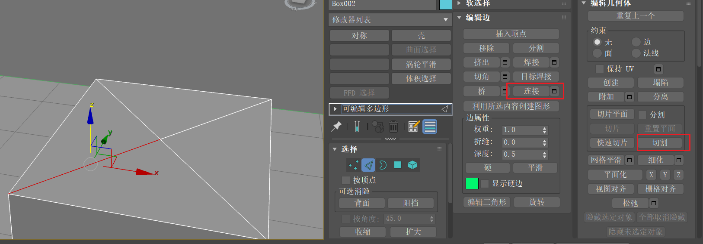

# 参考资料

[(34 封私信 / 80 条消息) 3dsmax2026 软件下载及超详细安装教程（附安装包） - 知乎](https://zhuanlan.zhihu.com/p/1909399467574138282)

# Visual c++ 问题

安装过程中可能会提示

需要卸载干净visual c++系列的所有软件然后重新安装

卸载使用微软的疑难解答工具：https://download.microsoft.com/download/7/E/9/7E9188C0-2511-4B01-8B4E-0A641EC2F600/MicrosoftProgram_Install_and_Uninstall.meta.diagcab

卸载某个长时间没反应时需要等待，卸载半个小时也是有可能的

安装使用官方安装程序或者360的工具

https://download.visualstudio.microsoft.com/download/pr/7ebf5fdb-36dc-4145-b0a0-90d3d5990a61/CC0FF0EB1DC3F5188AE6300FAEF32BF5BEEBA4BDD6E8E445A9184072096B713B/VC_redist.x64.exe

[新版软件详情页 - 微软VC++运行库合集](http://soft.360.cn/static/baoku/info_7_0/softinfo_104698064.html)

# 安装

1. 运行setup
2. 替换启动exe

# 拖动视角

按住鼠标中键移动

# 旋转视角

按住alt，拖动鼠标中键

# 变换

## 移动

快捷键 W

## 旋转

E

**角度捕捉**

打开A角度捕捉，旋转步进固定角度

右键可设置步进

## 缩放

R 等比缩放

整体，单轴

再按一次R会有其他缩放模式

# 专注

## 孤立

右键选择孤立当前选择可以孤立一个object

## 隐藏

右键对象可进行隐藏选定/未选定对象/全部取消隐藏

## 冻结

冻结对象避免移动

# 捕捉/吸附

用于对齐操作：

长按设置为2.5/3个人习惯用3

右键打开设置面板，勾选如下内容（个人习惯用顶点吸附）

## 轴约束

打开后只吸附单个轴

# 测量

可使用辅助工具里的卷尺测量长度

配合捕捉功能，选中第一个点，拖动到第二个点，右侧属性中有长度

# 封口

常用于删除集合体的某个面后，里面变成空心，此时选中边界后点击封口

# 视口切换

可使用快捷键P切换到透视图

Z键将场景回归视口中心

# 显示模式

F3线模

F4实体+线模（高亮效果）

shift+f3 高质量

# 创建对象

自动栅格：可在物体表面进行创建

# 名称和颜色

# 选择

Q 切换选择框类型

ctrl 多选+

alt 多选 -

取消选择ctrl +d

全选 ctrl+a

反选ctrl+i

# 栅格

隐藏/显示 g

# 调整轴

可只调整对象的轴

# 复制

wer对象的时候按住shift，或者ctrl cv

## 对象

单独

## 实例

参数一起动

## 参考

复制出来的不能编辑

## 镜像

依据轴进行镜像，同样有对象/实例/参考三种结果

# 挤出

选中一个面后按住shift进行移动

按局部法线挤出：可多个面内缩

# 对齐

按住这里可以滚动工具栏

# 分离

可将一个对象上的点线面分离出一个新对象

# 组/附加/选择集

## 组

方便移动但是不能对单个物体进行编辑

## 附加

点击编辑时会变成全部编辑，整体变成了一个操作对象

## 选择集

可以编辑单个物体

# 样条线

新建样条线，在修改点击在视口中启用

变换大小时会变成圆管（径向）或者多面体（矩形）

创建闭合样条线后，右键点击转换可编辑多边形，会变成一个面片

选中多边形（对象)上的某段线，右键左侧创建图形，就会得到一条样条线，此时可以进行在视口中启用使其变成一个对象

样条线不要进行单轴缩放，否则会改变不同轴的半径

样条线选中其中拐点可进行断开操作

创建样条线时，退格键可以回退一个点

圆角功能可以针对样条线的某个拐点使其变成圆角

# 子层级

点线面互相转换：

选中对应的，按住ctrl点另一个层级，可转换选中的元素

## 点

切角：可以切掉顶点所在的角

目标焊接：ctrl shift w,可以把两个点焊在一起：按住一个点拖拽到另一个点：焊接的两个点之间需要有连线

切割：当要新创建一条线需要经过已有的线时，无法直接连接，需要使用切割工具

## 线

删除：

​	ctrl+退格可删除一条线，同时删除两端的点

​	delete：删除线以及两端的面

​	移除：删除线但不删除点

环形选择：alt+r

竖向选择：alt+l

快速循环：在功能区中，编辑中有快速循环，可进行边之间的快速连接

快速切片：同样在功能区中，编辑中有快速切片

约束到边：shift+X比如圆锥体上边的移动可约束到边

切角：在一根线的基础上平行出两个线

## 面

插入：可以在面上插入面

## 边界

封口：可将边界封口

# 重复上一条命令

使用；分号可进行上一步命令

# 修改器

右键某个命令可以常驻显示

## 壳

可进行加壳

# 功能区

# 自动栅格

可以将物体在已有的对象表面创建