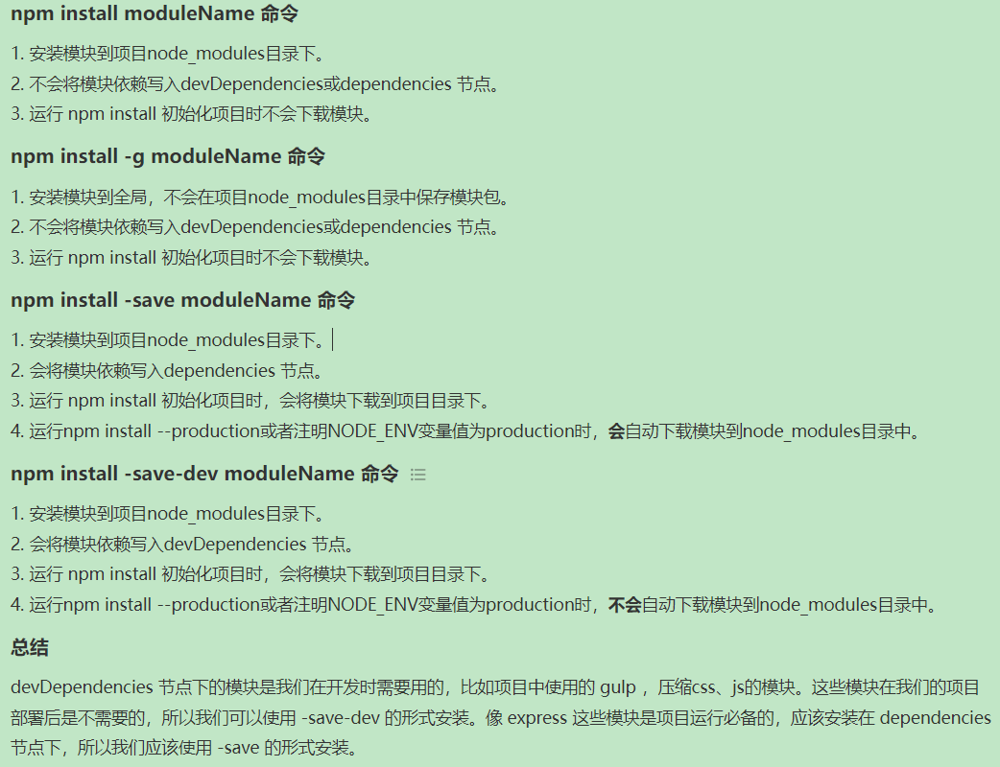

# npm install

```bash
npm install moduleName # 安装模块到项目目录下
 
npm install -g moduleName # -g 的意思是将模块安装到全局，具体安装到磁盘哪个位置，要看 npm config prefix 的位置。
 
npm install -save moduleName # -save 的意思是将模块安装到项目目录下，并在package文件的dependencies节点写入依赖。
 
npm install -save-dev moduleName # -save-dev 的意思是将模块安装到项目目录下，并在package文件的devDependencies节点写入依赖。

```



# npm 文件夹权限

右键属性，安全页面给所有用户完全访问权限

[【Node.js】Node.js安装及环境配置 - 腾讯云开发者社区-腾讯云 (tencent.com)](https://cloud.tencent.com/developer/article/1572591)

# 安装electron

`npm install electron --save-dev`

# 简单构建

## 初始化脚手架

```bash
# 新建项目文件夹
npm init
```

这里注意入口需要设为main.js而不是默认的index

参数类似于

```json
{
  "name": "my-electron-app",
  "version": "1.0.0",
  "description": "Hello World",
  "main": "main.js",
  "scripts": {
    "test": "echo \"Error: no test specified\" && exit 1"
  },
  "author": "Boranget",
  "license": "MIT",
  "devDependencies": {
    "electron": "^21.2.2"
  }
}

```

修改package.json,在scripts字段下新增:

```json
{
  "scripts": {
    "start": "electron ."
  }
}
```

## 运行主进程

在根目录下创建main.js,并运行npm start

## 最后文件结构

**index.html**

```html
<!DOCTYPE html>
<html>
  <head>
    <meta charset="UTF-8">
    <!-- https://developer.mozilla.org/en-US/docs/Web/HTTP/CSP -->
    <meta http-equiv="Content-Security-Policy" content="default-src 'self'; script-src 'self'">
    <title>Hello World!</title>
  </head>
  <body>
    <h1>Hello World!</h1>
    We are using Node.js <span id="node-version"></span>,
    Chromium <span id="chrome-version"></span>,
    and Electron <span id="electron-version"></span>.
    <script src="./render.js"></script>
  </body>
</html>
```

**main.js**

```js
// 引入依赖
const {app, BrowserWindow} = require('electron')
const path = require('path')


const createWinddow = ()=>{
    // 创建一个新的浏览器窗口
    const win = new BrowserWindow({
        width: 800,
        height:600,
        webPreferences:{
            // 预加载js
            // Node.js概念：
        	//  _dirname 指向当前执行脚本所在的目录
        	//  path.join 用于拼接路径
        	//  以上相对路径在开发模式和打包模式中都将有效
            preload: path.join(__dirname, 'preload.js')
        }
        
    })
    // 加载index.html
    win.loadFile('index.html')
}
// 在Electron结束初始化和创建浏览器窗口时调用
app.whenReady().then(
    ()=>{
        createWinddow()
        // 在mac系统上, 需要在用户点击图标后(若无已创建窗口)新建一个窗口
        app.on('activate',()=>{
            if(BrowserWindow.getAllWindows().length === 0){
                createWinddow()
            }
        })
    }
) 
// 除mac外,在所有窗口被关闭后,退出程序
app.on('window-all-closed', ()=>{
    if(process.platform !== 'darwin'){
        app.quit()
    }
})
```

**preload.js**

```js
window.addEventListener('DOMContentLoaded', ()=>{
    const replaceText = (selector,text)=>{
        const element = document.getElementById(selector)
        if(element){
            element.innerText = text
        }
    }
    for(const dependency of ['chrome', 'node', 'electron']){
        replaceText(`${dependency}-version`,process.versions[dependency])
    }
})
```

注意这里为何要用预加载:

> 在网页中我们需要获取node 版本号,这些信息在Node的全局变量process中,只能在主进程访问,但我们在主进程中无法直接编辑DOM,所以我们需要通过预加载脚本来控制DOM，预加载脚本在渲染器进程加载之前加载，并有权访问两个渲染器全局 (例如 window 和 document) 和 Node.js 环境。
>

一些node.js中的概念

>- **__dirname**字符串指向当前正在执行脚本的路径 (在本例中，它指向你的项目的根文件夹)。
>
>- **path.joinAPI** 将多个路径联结在一起，创建一个跨平台的路径字符串。

**总结**

- 我们启动了一个Node.js程序，并将Electron添加为依赖。
- 我们创建了一个 `main.js` 脚本来运行我们的主要进程，它控制我们的应用程序 并且在 Node.js 环境中运行。 在此脚本中， 我们使用 Electron 的 `app` 和 `BrowserWindow` 模块来创建一个浏览器窗口，在一个单独的进程(渲染器)中显示网页内容。
- 为了访问渲染器中的Node.js的某些功能，我们在 `BrowserWindow` 的构造函数上附加了一个预加载脚本。

## 打包

使用 electron forge来进行打包

注意打包的时候必须保证`package.json`中的作者和描述字段不是空的

**安装**

```bash
npm install --save-dev @electron-forge/cli
npx electron-forge import
```

转换脚本完成后，Forge 会将一些脚本添加到 `package.json` 文件中。

**打包**

```bash
npm run make
```

# 日志打印

主进程打在vscode控制台，渲染进程打在浏览器的console

# whenReady

通常使用触发器的 `.on` 函数来监听 Node.js 事件。

```diff
+ app.on('ready', () => {
- app.whenReady().then(() => {
  createWindow()
})
```

但是 Electron 暴露了 `app.whenReady()` 方法，作为其 `ready` 事件的专用监听器，这样可以避免直接监听 .on 事件带来的一些问题。 参见 [electron/electron#21972](https://github.com/electron/electron/pull/21972) 。

# 预加载脚本

预加载脚本在渲染器加载网页之前注入。

在 BrowserWindow 构造器中使用 `webPreferences.preload` 传入脚本的路径。

在预加载脚本中使用内容桥可以设置在渲染进程中的全局变量

```js
const { contextBridge } = require('electron/renderer')

contextBridge.exposeInMainWorld('versions', {
  node: () => process.versions.node,
  chrome: () => process.versions.chrome,
  electron: () => process.versions.electron
})
```

renderer.js

```js
const information = document.getElementById('info')
information.innerText = `This app is using Chrome (v${window.versions.chrome()}), Node.js (v${window.versions.node()}), and Electron (v${window.versions.electron()})`
```

index.html中

```js
<script src="./renderer.js"></script>
```

Electron 应用通常使用预加载脚本来设置进程间通信 (IPC) 接口以在两种进程之间传输任意信息。

# 进程间通信

让渲染进程和主进程互相通信

可使用 Electron 的 `ipcMain` 模块和 `ipcRenderer` 模块来进行进程间通信。 从网页向主进程发送消息，可以使用 `ipcMain.handle` 设置一个主进程处理程序（handler），然后在**预处理脚本**中暴露一个被称为 `ipcRenderer.invoke` 的函数来触发该处理程序（handler）。

```js
const { contextBridge, ipcRenderer } = require('electron')

contextBridge.exposeInMainWorld('versions', {
  node: () => process.versions.node,
  chrome: () => process.versions.chrome,
  electron: () => process.versions.electron,
  ping: () => ipcRenderer.invoke('ping')
  // 除函数之外，我们也可以暴露变量，但注意安全问题
})
```

不建议直接通过 context bridge 暴露 `ipcRenderer` 模块，这将使得渲染器能够直接向主进程发送任意的 IPC 信息，会使得其成为恶意代码最强有力的攻击媒介。

如上的代码相当于提前构造好了一个函数`ping`并发布到了渲染进程的全局变量中，该函数的行为为从ipcRenderer中触发了`ping`这个事件，接下来需要在主进程中接受这个事件。

```js
const { app, BrowserWindow, ipcMain } = require('electron/main')
const path = require('node:path')

const createWindow = () => {
  const win = new BrowserWindow({
    width: 800,
    height: 600,
    webPreferences: {
      preload: path.join(__dirname, 'preload.js')
    }
  })
  win.loadFile('index.html')
}
app.whenReady().then(() => {
  // 注意handle的第二个参数必须是一个函数对象
  ipcMain.handle('ping', () => 'pong')
  createWindow()
})
```

渲染进程（页面js）调用

```js
const information = document.getElementById('info')
information.innerText = `This app is using Chrome (v${window.versions.chrome()}), Node.js (v${window.versions.node()}), and Electron (v${window.versions.electron()})`
const func = async () => {
    const response = await window.versions.ping()
    console.log(response)
}
func()
```


# DEVTools

在BrowserWindow对象实例win上执行`win.webContents.openDevTools()`即可打开开发者工具

