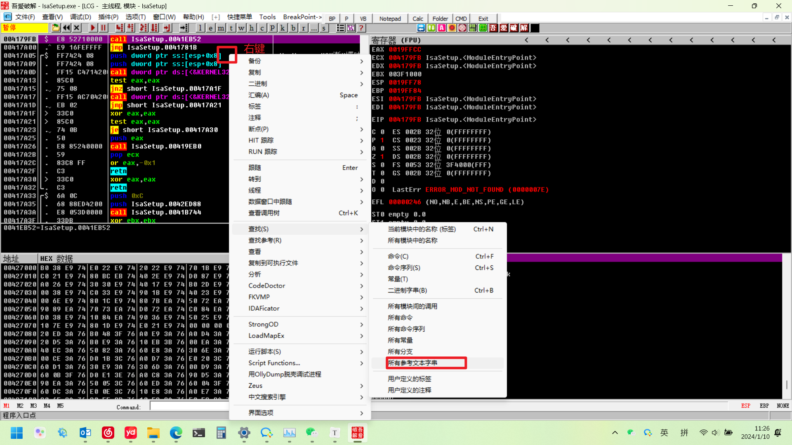

# 参考资料

[ASM入网小助手卸载_51CTO博客_asm入网小助手完全卸载](https://blog.51cto.com/u_15127619/4027973)

# 工具下载

[原版](https://ollydbg.de/odbg110.zip)

[七周年礼物第五弹之一：吾爱破解专用版Ollydbg【2016年1月21日更新】 - 『逆向资源区』 - 吾爱破解 - LCG - LSG |安卓破解|病毒分析|www.52pojie.cn](https://www.52pojie.cn/thread-350397-1-1.html)

# 文件位置

C:\Windows\SysWOW64\IsAgent

# 卸载步骤

使用吾爱破解版ollydbg打开文件位置中的IsaSetup，带参数 -remove

在主窗口右键点击查找

找到如下文本后，双击进入主窗口

上方代码为 jnz...，双击修改为 jz ...（点击汇编按钮后窗口不会自动消失，点击取消按钮）

F9执行程序

确定之后会开始执行卸载程序，等待一会，会要求重启，重启即可