# 参考资料

https://blog.csdn.net/lyd135364/article/details/121449969

# 指定VM

MemoryAnalyzer.ini添加-vm

```
-startup
plugins/org.eclipse.equinox.launcher_1.6.900.v20240613-2009.jar
--launcher.library
plugins/org.eclipse.equinox.launcher.win32.win32.x86_64_1.2.1100.v20240722-2106
-vm
E:\tools\jdk\17\jdk-17.0.8\bin
-vmargs
--add-exports=java.base/jdk.internal.org.objectweb.asm=ALL-UNNAMED
-Xmx1024m

```


# 生成hprof文件

选项"-XX：+HeapDumpOnOutOfMemoryError"或"-XX：+HeapDumpBeforeFullGC"选项"-XX：HeapDumpPath"所代表的含义就是当程序出现OutofMemory时，将会在相应的目录下生成一份dump文件。如果不指定选项“-XX：HeapDumpPath”则在当前目录下生成dump文件。

# 打开hprof文件

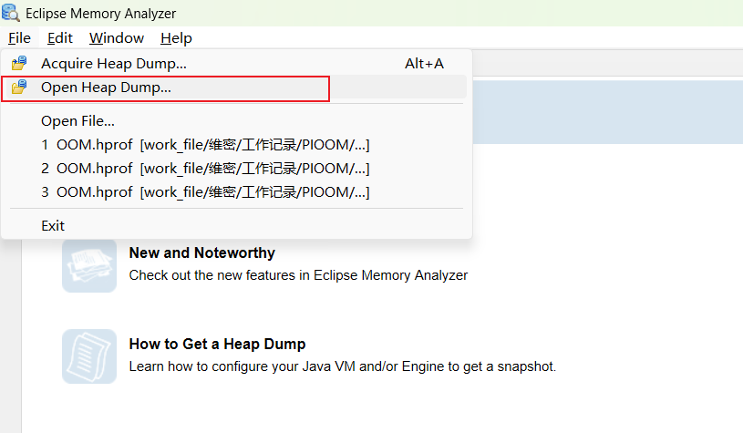

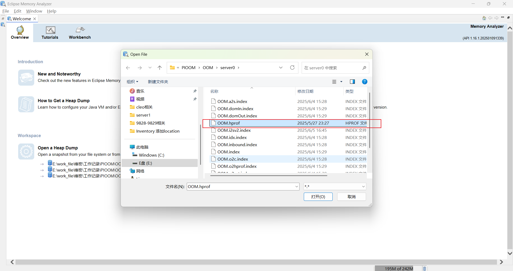

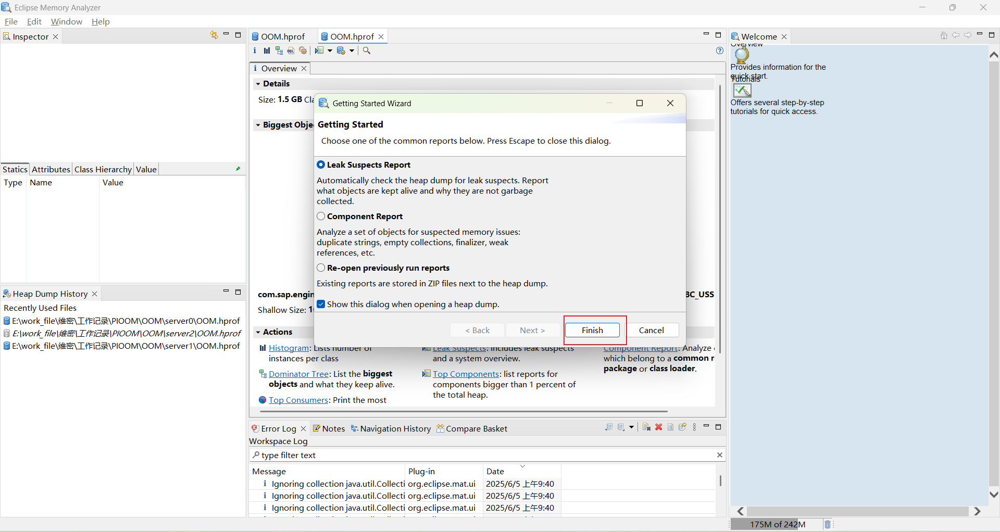

# 视图

## 内存泄漏报告

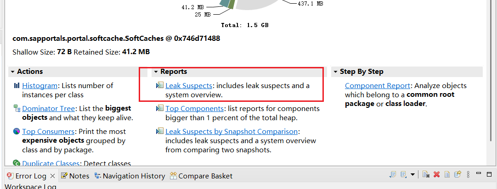

大致推算是哪个对象导致的内存溢出

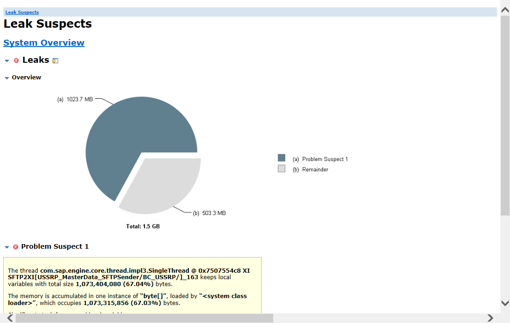

## 对象数目

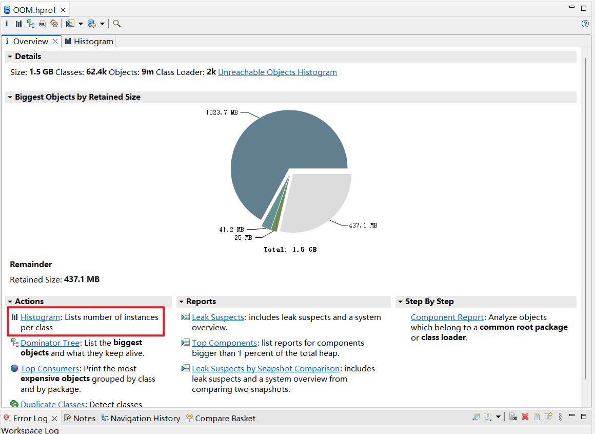

列出各类实例数

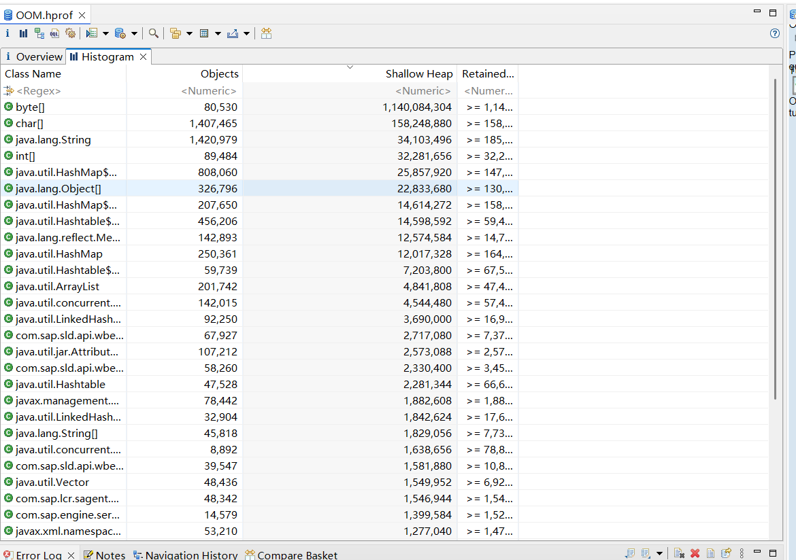

## 大对象列表树形结构

按大小列出对象，包含其属性，左侧可看到属性值，适合判断该时段对象状态

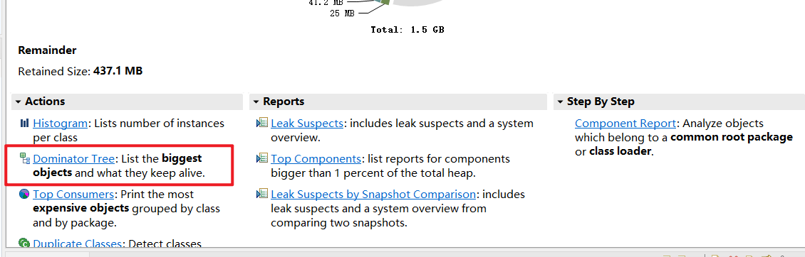

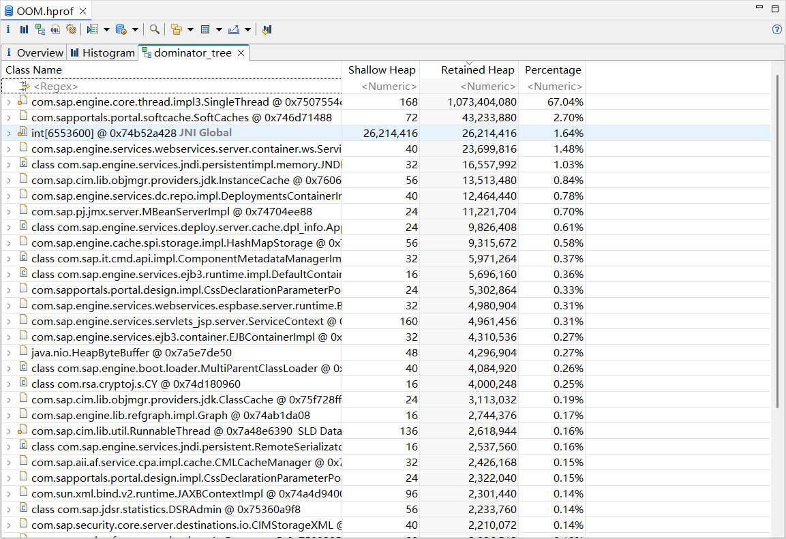

可进行对象值的查看与复制或者保存到文件

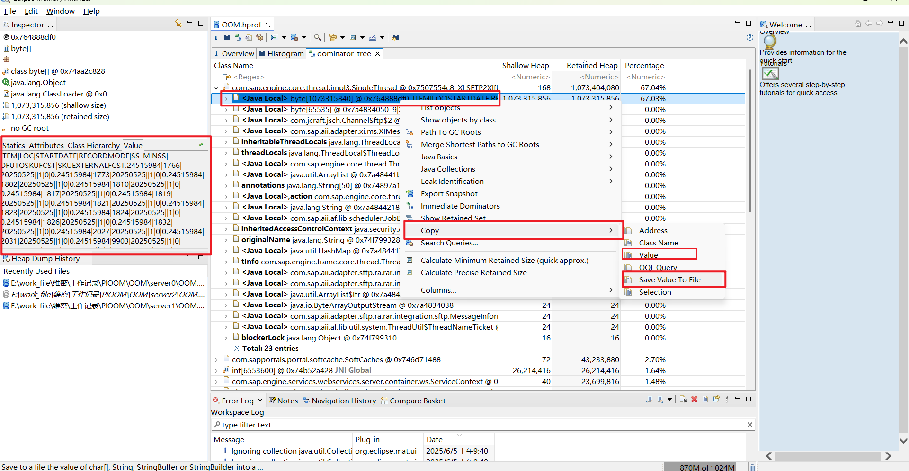

也可查看某个对象的属性，展示toString内容应该是

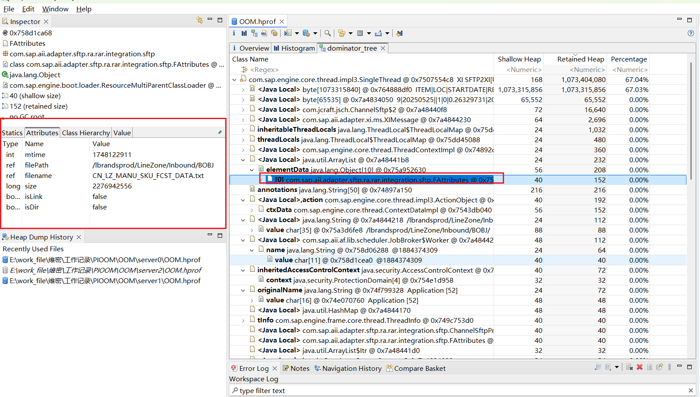

