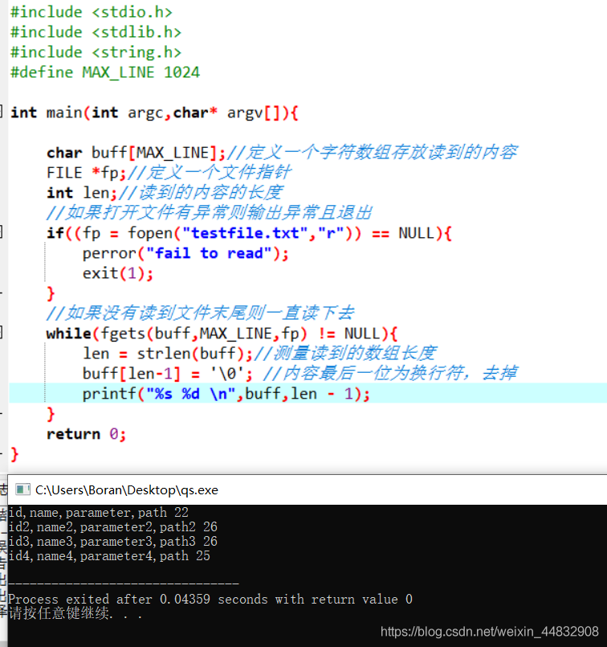

# 原因

本意是想通过cmd窗口更快的启动一些软件或者文件夹，之前使用dos命令编写一个一个的bat文件放入一个文件夹中，然后将整个文件夹放入path环境变量中，但这样每次想要添加一个新的快速启动的内容都比较麻烦，于是就想写一个小工具来实现更便捷的使用。
# C实现
## 语言选择
选择了c语言，一是用java的话不太符合快速启动的初衷（我只学过这俩），二是顺便可以复习一下已经差不多还给老师的c。
## 工具选择
之前跟随老师使用的vc++6.0，但前几天刚卸载，同时也想尝试一下新的工具，最后选择了Devcpp，使用下来感觉还行，主题选择挺好玩。
## 需求分析
```c
/*
* 需求分析
*	在一个文件中添加文件名与路径还有自定义启动参数 
*	此程序带参数 s 启动后会输出一个列表：
*		-------------QuickStart-------------
*		ID	name	parameter	path	 
*		1   test    test     E/test/test.exe 
*		2   test1    test1     E/test/test.exe1 
*		3   test2    test2     E/test/test.exe2
*		..   ..    .....     .............. 
*	输入序号即可快速启动
*	若带别的参数如test ，则直接启动test 
*/
```
## 学习
### c语言命令行参数的了解学习
 c语言main函数有两个参数 int argc,char *argc[]，第一个参数为命令行参数的个数+1（因为包含程序本身），不需要用户传递，第二个参数为一个字符串数组,存储传进来的参数，argv[0]为程序名。
```c
		void main(int argc,char** argv)
		{
		        printf("%d\n",argc);
		        printf("%s\n",argv[0]);
		        printf("%s\n",argv[1]);
		        printf("%s\n",argv[2]);
		}
```
### c语言读取文件的学习
 使用fopen函数来打开文件，该函数的返回值是一个FILE类型的指针，使用如：
 ```c
		FILE *fp = NULL;
			fp = fopen("testfile.txt", "r");
 ```
的方式来读取文件，其中r代表只读


使用fgets函数来读取每一行的内容，使用如：
```c
		char buff[255];
		FILE *fp = NULL;
		fp = fopen("testfile.txt", "r");
		gets(buff,255,fp);
```
的方式来从文件fp中读取内容，
该操作会将255-1个字符存入字符数组buff中（减一的原因是第255个字符为自动补全的 '\0'），然后指向该文件的指针fp会定位于下一个字符。如果在读到255-1个字符之前碰到了换行符或者文件结尾，则会停止，其余位置补 '\0'。读到文件末尾该函数会返回NULL。

**一个完整的读入一个文件并且按行输出的程序：**

其中去掉换行符是因为我的测试文件有多行，默认每一行结尾都有一个换行符，在这里需要注意最后一行可能会没有换行符，开发时曾在这里出错。

### 字符串切割的学习
个人感觉这是整个开发过程最难的一步之一了（另一个是三维数组），不得不说Java中很方便的字符串切割后保存到数组的方法真好用。

在这里参考了一位大哥的代码：

> [https://blog.csdn.net/lell3538/article/details/48011135](https://blog.csdn.net/lell3538/article/details/48011135)
```c
#include <stdio.h>
#include <stdlib.h>
#include <string.h>
#define MAX_LINE 1024

typedef struct{
        char **str;
        size_t num;
}IString;
        
int Split(char *src, char *delim, IString* istr)
{
        //src 要拆分的字符串
        //delim 分隔符
        //istr 返回拆分后的字符串数组与字符串的个数 
         
        int i;
        char *str = NULL, *p = NULL;
        
        (*istr).num = 1;
        str = (char*)calloc(strlen(src)+1,sizeof(char));
        if(str == NULL){
                return 0;
        }
        (*istr).str = (char**)calloc(1,sizeof(char *));
        if((*istr).str == NULL){
                return 0;
        }
        strcpy(str,src);
        
        p = strtok(str,delim);
        (*istr).str[0] = (char*)calloc(strlen(p)+1,sizeof(char));
        if((*istr).str[0] == NULL){
                return 0;
        }
        strcpy((*istr).str[0],p);
        for(i = 1; p = strtok(NULL,delim); i++){
                (*istr).num ++;
                (*istr).str = (char**)realloc(
                        (*istr).str,
                        (i+1)*sizeof(char*)
                );//首先扩充了字符串数组
                if((*istr).str == NULL){
                        return 0;
                }
                (*istr).str[i] = (char*)calloc(strlen(p)+1,sizeof(char));
                if((*istr).str[i] == NULL){//这个地方将作者的0改为了i 
                        return 0; 
                }
                strcpy((*istr).str[i],p);
        }
        free(str);
        str = p = NULL;
        return 1;
  
}
		        
```
***这里是我的一些学习笔记***

 - strlen(NULL)
 得不出结果，且结果不能参与运算 
 - calloc(num,size)
   在内存的动态存储区中分配num个长度为size的连续空间，函数返回一个指向分配起始地址的指针，如果分配不成功，返回NULL  
- size_t 
long long unsinged int型 
- strtok(s, delim) 
   从s开头开始的一个个被分割的串。当s中的字符查找到末尾时，返回NULL。
   strtok(）用来将字符串分割成一个个片段。参数s指向欲分割的字符串，参数delim则为分割字符串中包含的所有字符。当strtok()在参数s的字符串中发现参数delim中包含的分割字符时,则会将该字符改为'\0'字符。在第一次调用时，strtok()必需给予参数s字符串，往后的调用则将参数s设置成NULL。每次调用成功则返回指向被分割出片段的指针。
- realloc(要改变内存大小的指针名，新的大小)，
	先判断当前的指针是否有足够的连续空间，如果有，扩大mem_address指向的地址，并且将mem_address返回，如果空间不够，先按照newsize指定的大小分配空间，将原有数据从头到尾拷贝到新分配的内存区域，而后释放原来mem_address所指内存区域（注意：原来指针是自动释放，不需要使用free），同时返回新分配的内存区域的首地址。即重新分配存储器块的地址。分配失败返回NULL。
- NULL在C++中指向0

### c语言中执行dos命令
直接在代码中使用
```c
system("dos 命令");
```
即可
### 字符串的连接
字符串的连接使用strcat方法如：
```c
char pathf[MAX_LINE];
strcpy(pathf,(char*)"\nstart \" \" ");//使用strcpy方法为pathf初始化
//printf(pathf);//测试
strcat(pathf,path);
printf(pathf);
system(pathf);
//其中MAX_LINE为设置的常量
```
由于strcat方法会将连接后的字符串保存到第一个参数中，所以第一个参数的字符串需要足够空间来容纳连接好的字符串
## 整合
### 大概设计
```c
/*
*	定义一个三维的字符数组***char，
*	这个三维数组的长度应是动态可变的 
*	将文件按行读入，每读入一行便进行字符串的切割，
*	切割符号为",";
*	将切割完成的字符串数组保存在三维数组中，
*	动态增加三维数组的长度 
*	调用时输入的数字为三维数组的下标 
*/
```
### 整合代码

```c
#include <stdio.h>
#include <stdlib.h>
#include <string.h>
#define MAX_LINE 1024
#define QSF "E://QuickStart//qsConfig.txt"

typedef struct{
	char **str;
	size_t num;
}IString;

typedef struct{
	char ***reslist; 
	int size;
}ResList;
	 
	 
ResList r;

int Split(char *src, char *delim, IString* istr)
{
//	printf("Split invoking.........\n");
	//src 要拆分的字符串
	//delim 分隔符
	//istr 返回拆分后的字符串数组与字符串的个数 
	 
	int i;
	char *str = NULL, *p = NULL;
	
	(*istr).num = 1;
	str = (char*)calloc(strlen(src)+1,sizeof(char));
	if(str == NULL){
		return 0;
	}
	(*istr).str = (char**)calloc(1,sizeof(char *));
	if((*istr).str == NULL){
		return 0;
	}
	strcpy(str,src);
	
	p = strtok(str,delim);
	(*istr).str[0] = (char*)calloc(strlen(p)+1,sizeof(char));
	if((*istr).str[0] == NULL){
		return 0;
	}
	strcpy((*istr).str[0],p);
	for(i = 1; p = strtok(NULL,delim); i++){
		(*istr).num ++;
		(*istr).str = (char**)realloc(
			(*istr).str,
			(i+1)*sizeof(char*)
		);
		if((*istr).str == NULL){
			return 0;
		}
		(*istr).str[i] = (char*)calloc(strlen(p)+1,sizeof(char));
		if((*istr).str[i] == NULL){//这个地方将作者的0改为了i 
			return 0; 
		}
		strcpy((*istr).str[i],p);
	}
	str = p = NULL;
	return 1;
	
}

int init(ResList* r){
	
//	printf("init invoking.........\n");
	(*r).size = 0;
	
	IString splres;//修改1 将 IString* splres;改为直接声明 
	char buff[MAX_LINE];
	FILE* fp = NULL;
	int len,i,j,k;

	if(NULL == (fp = fopen(QSF,"r"))){
		perror("fail to read");
		exit(1);
	}

	for(i = 1; fgets(buff,MAX_LINE,fp) != NULL; i++){
	//	puts(buff);
		len = strlen(buff);
		if(buff[len-1] == '\n'){//考虑到可能文件的最后一行并没有换行，所以需要做一个判断 
			buff[len-1] = '\0';//去掉换行 
		}
		
		Split(buff,(char*)",",&splres);//修改2 传入的时候取地址 
		
		
		(*r).reslist = (char***)realloc((*r).reslist,(i+1)*sizeof(char**));//增加一个抽屉 
		
		(*r).reslist[i] = (char**)calloc(3,sizeof(char*)); //每个抽屉申请三个格子 
		

		for(j = 0; j < 3; j ++){//给每个格子赋值
//			printf((*splres).str[j]);
//			printf("\n"); 
			(*r).reslist[i][j] = splres.str[j];//修改3 直接取属性 
//			printf((*r).reslist[i][j]);
//			printf("\n") ;
		} 
		(*r).size ++;
	} 
	 
	return 0;
}

int executeQs(char* path){
	char pathf[MAX_LINE];
	strcpy(pathf,(char*)"\nstart \" \" ");
	//printf(pathf);
	strcat(pathf,path);
	printf(pathf);
	system(pathf);
	
	return 0;
}


//参数为空的情况下
//输入id，
//通过id获得path，然后执行
int parameterIsNull(){
	
	
	char* path; 
	
	printf("%-10s%-15s%-15s%-50s\n\n","ID","Name","Parameter","Path");
	
	for(int i = 1; i < r.size+1; i ++){
		
		printf("%-10d%-15s%-15s%-50s",i,r.reslist[i][0],r.reslist[i][1],r.reslist[i][2]);
		printf("\n");
	} 
	
	
	int id;
	printf("%s","\nPlease enter the ID number : ");
	scanf("%d",&id);
	
	if(id < 1 || id > r.size){
		perror("\nId number is not exist");
		return 0;
	}
	printf("%s","\nPlease wait a moment ...... \n");
	
	path = r.reslist[id][2];
		
	executeQs(path);	
	
	return 1;
}

//参数不为空的情况下
//传入参数，通过参数查找id，
//通过id获得path，然后执行 
int parameterIsNotNull(char* parameter){
	char* path = (char*)"IsNotPath"; 
	
	for(int i = 1; i < r.size+1; i++){
		
		if(!strcmp(r.reslist[i][1],parameter)){
			path = r.reslist[i][2];
			break;
		}
		
	}
	if(!strcmp("IsNotPath",path)){
		perror("Parameter is not exist");
		return 0;
	}
	printf("%s","\nPlease wait a moment ...... \n");
	executeQs(path);
	
	
	return 1;
}


int main(int argc,char* argv[]){
	
	init(&r);
	
	if(argc == 2){
		
		char* parameter = argv[1];
		parameterIsNotNull(parameter);
		
	}else if(argc == 1){
		parameterIsNull();
	}else{
		perror("Parameter is Error");
	}
	
	

	return 0;
} 


```
### 配置文件示例

### 部署
将配置文件取名为qsConfig.txt放入e盘的QuickStart目录下（或者直接修改代码中常量放到别的地方），将最后编译得到的程序所在目录加入path环境变量。
在修改代码中常量时，有个问题就是不能采用相对路径，因为在使用cmd启动时，会默认将cmd的当前目录当作当前路径，从而会让程序找不到文件。
## 放上最终效果

## 一些问题
- 刚开始打算使用计算的方式在最后得到三维数组的长度，也就是得到配置文件中的行数，但一直行不通，计算结果有问题，于是后来改用结构体来记录：读入文件循环的时候动态增加。
- 在代码中定义字符串时会将'\'视为转义字符，如果是从文件中读取则不会将'\'视为转义字符。
- 字符串转换为字符指针 (char*)"testString"，直接将字符串赋值给字符指针会有警告。
- 指针是第一次接触学习，所以犯了挺多错误。

# 重构

上班之后抽空学习了下c++，决定重构一下， 这次选择vector来存放配置，重构时间：2022/12/1

## 代码

```c++
#include <iostream>
#include <cstring>
#include <fstream>
#include <vector>
#include <Windows.h>
using namespace std;

/**
 * 切割一个字符串
 * 传入原字符串,切割字符,用于接收的字符串数组
 */
void split(string src, string delim, string *res)
{
	// 由于strtok会更改字符串本身,但传入的参数是只读的,所以这里拷贝一份
	int len = src.length();
	char cache[len];
	strcpy(cache, src.c_str());
	char *node;
	res[0] = strtok(cache, delim.c_str());
	for (int i = 1; node = strtok(NULL, delim.c_str()); i++)
	{
		res[i] = (string)node;
	}
	return;
}
/**
 * 初始化
 *
 */
vector<string *> init()
{
	// 获取环境变量中QS_HOME的值
	char buffer[MAX_PATH];
	GetEnvironmentVariableA("QS_HOME", buffer, MAX_PATH);
	// 组合为文件名
	string fileName = (string)buffer+"\\"+"qsConfig";
	vector<string *> res;
	// 读文件准备
	// 文件读取对象
	ifstream readFile;
	// 打开文件
	readFile.open(fileName, ios::in);
	string currentLine;
	while (!readFile.eof())
	{
		readFile >> currentLine;
		// 若每一行结尾为换行符,去掉
		if (currentLine[currentLine.length() - 1] == '\n')
		{
			currentLine[currentLine.length() - 1] == '\0';
		}
		// 切割该行字符串,获得切割结果
		string *currentLineArry = new string[3];
		split(currentLine, ",", currentLineArry);
		res.push_back(currentLineArry);
	}
	return res;
}
/**
 * 执行路径
 */
int executeQs(string path)
{
	string pathf = "\nstart \" \" ";
	// 连接
	string commondStr = pathf + path;
	// 输出命令
	cout << commondStr << endl;
	// 执行命令,c_str()将字符串转为字符数组
	system(commondStr.c_str());
	return 0;
}

//参数为空的情况下
//输入id，
//通过id获得path，然后执行
int showConfigList(vector<string *> form)
{

	string path;
	// 输出表格头
	printf("%-10s%-15s%-15s%-50s\n\n", "ID", "Name", "Parameter", "Path");
	// 遍历表格并输出
	for (int i = 0; i < form.size(); i++)
	{
		printf("%-10d%-15s%-15s%-50s", i + 1, form[i][0].c_str(), form[i][1].c_str(), form[i][2].c_str());
		cout << endl;
	}

	// 用户输入启动命令编号
	int id;
	cout << "Please enter the ID number : ";
	cin >> id;
	cout << endl;

	if (id < 1 || id > form.size())
	{
		cerr << "Id number is not exist" << endl;
		return 0;
	}
	cout << "Please wait a moment ...... " << endl;
	path = form[id - 1][2];
	executeQs(path);

	return 1;
}

//参数不为空的情况下
//传入参数，通过参数查找id，
//通过id获得path，然后执行
int serchByQuickName(string parameter, vector<string *> form)
{
	string path;
	int i = 0;
	for (i = 0; i < form.size(); i++)
	{
		if (!parameter.compare(form[i][1]))
		{
			path = form[i][2];
			break;
		}
	}
	if (i == form.size())
	{
		cerr << "Parameter is not exist" << endl;
		return 0;
	}

	cout << "Please wait a moment ...... " << endl;
	executeQs(path);

	return 1;
}

int main(int argc, char *argv[])
{
	// 初始化
	vector<string *> form = init();
	if (argc == 2)
	{
		// 如果命令行参数长度为2,说明带上了启动命令
		// 获取启动命令参数
		char *parameter = argv[1];
		// 根据命令查找
		serchByQuickName(parameter, form);
	}
	else if (argc == 1)
	{
		// 如果长度为1, 说明没有带参数,展示列表
		showConfigList(form);
	}
	else
	{
		// 否则报错
		cerr << "Parameter is Error" << endl;
	}
	return 0;
}

```

## 使用方法

>环境变量配置：
>	需要将当前目录配置到系统环境变量的“QS_HOME”中，并将本目录配置到系统环境变量的Path中
>配置文件格式：
>	文件名 qsConfig 无后缀
>	一行一个配置：
>		启动名,简称(启动命令),文件路径
>		启动名,简称(启动命令),文件路径
>		................
>	如:
>		qsConfig,conf,C:\tools\base\qs\qsConfig
>		Typora,typ,C:\tools\work\md\Typora\Typora.exe
>使用方法:
>	第一种: 打开命令行, 输入qs, 展示配置列表, 输入对应的编号,启动
>	第二种: 打开命令行, 输入 qs 简称(启动命令) 直接启动
>	

