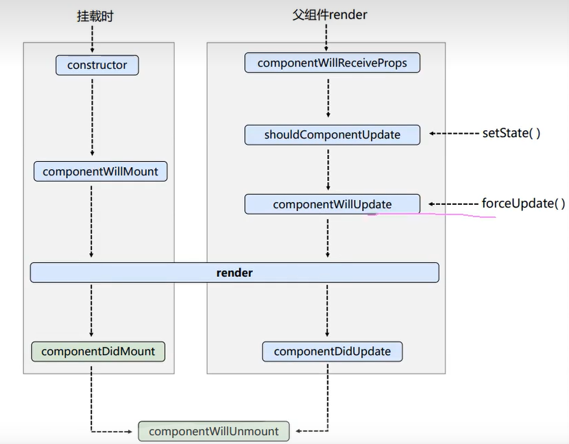
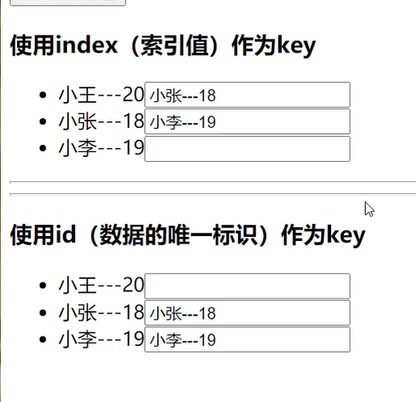

# 虚拟DOM

- 本质是object类型的一般对象
- 虚拟DOM属性较少（相对于真实DOM），因为虚拟DOM是React的内部使用，无需真实DOM的那么多属性
- 虚拟DOM最终会被React转换为真实DOM呈现在页面上

```html
<!DOCTYPE html>
<html>
    <head>
        <script src="https://cdnjs.cloudflare.com/ajax/libs/react/15.4.2/react.js"></script>
        <script src="https://cdnjs.cloudflare.com/ajax/libs/react/15.4.2/react-dom.js"></script>
        <script src="https://cdnjs.cloudflare.com/ajax/libs/babel-standalone/6.26.0/babel.js"></script>
        <script type="text/babel">
            const VDOM = (
                <div>
                    <h1>Hello World</h1>
                    <p>This is a paragraph</p>
                </div>
            );
            ReactDOM.render(VDOM, document.getElementById("root"));
        </script>
    </head>
    <body>
        <div id="root"></div>
    </body>
</html>
```


# jsx语法

- 定义虚拟DOM时不写引号

- 标签中混入js表达式用{}包裹

- 虚拟DOM中样式的类名指定不要用class属性，会与es6中class冲突，需要使用className

- 虚拟DOM中给属性设置样式需要使用{}包裹，且其中定义需要以对象形式

  ```jsx
  const VDOM = (
      <h1 style={{ color: "red", fontSize: "50px" }}>Hello World</h1>
  );
  ```

- 虚拟DOM中只能有一个根标签

- 虚拟DOM中所有标签必须闭合

- 标签首字母
  - 小写字母开头react会理解为html元素，若html元素中不存在该标签则报错。
  - 大写字母开头，react会理解为对应的组件，若组件没有定义则报错

- 循环渲染示例

  ```jsx
  const data = [
      { id: 1, name: "John" },
      { id: 2, name: "Jane" },
      { id: 3, name: "Jim" },
  ];
  const VDOM = (
      <div>
          {data.map((item) => (
              <li key={item.id}>{item.name}</li>
          ))}
      </div>
  );
  ReactDOM.render(VDOM, document.getElementById("root")); 
  ```

  

# 函数式组件

- 首字母必须大写
- 引用需要加尖括号作为一个标签
- 严格模式禁止自定义函数中的this指向window，babel默认翻译为严格模式

```jsx
const MyComponent = () => {
    return (
        <div>
            <h1>Hello World</h1>
        </div>
    );
};

ReactDOM.render(<MyComponent />, document.getElementById("root"));
```

React解析组件标签，找到组件，发现组件是函数式组件，调用该函数，获取虚拟DOM，将其转换为真实DOM，呈现在页面中。

函数式组件适合构建没有状态的简单组件

# 类组件

## ES6中的类

1. 类中的构造器不是必须要写的，除非要对实例进行一些初始化
2. 若A类继承B类，且A类中写了构造器，则A类构造器中必须调用super的构造器
3. 类中所定义的方法，都是放在了类的原型对象上，供实例去使用。

## this

- 不开启严格模式，函数中的this指向为window
- 开启严格模式，函数中的this指向为undefined
- 通过组件实例去调用组件实例内部的函数，组件实例函数中的this指向组件实例
- 类中方法this的指向
  -  类中所有方法在局部都开起了严格模式
  -  类中方法作为回调函数时，不是通过实例调用,而是直接调用，这时this为undefined
  -  在构造器和render中的this为当前实例，可在构造器中使用bind方法，获取一个绑定了当前实例对象的方法，然后将方法赋予当前实例对象中的同名函数
- 箭头函数与直接function的区别
  - a = ()=>{} 与 a = function(){}
  - 箭头函数没有自己的this,当在其中调用this时,会寻找其外部函数的this

## 类组件

```jsx
class HelloMessage extends React.Component {
    render() {
        return <h1>Hello {this.props.name}</h1>;
    }
}

ReactDOM.render(
    <HelloMessage name="John" />,
    document.getElementById('root')
);
```

- 需要继承父类React.Component
- 需要用render返回渲染的组件

- render放在类对象的原型对象上，供实例使用
- render中的this是组件类对象的实例对象

React解析组件标签，找到了组件，发现组件是类组件，new出了该类的实例，调用该实例的render函数，获取虚拟DOM，将其转换为真实DOM，呈现在页面中

类组件适合构建有状态的复杂组件

## state

用于保存组件状态，渲染时使用，注意的是，state属性中的值不可以通过state属性名直接更改，直接更改会导致react无法监控到对象的变化，应该通过调用set方法去进行更改，set方法应该是通过object操作更新的，所以不会影响state中的其他属性

```jsx
class Weather extends React.Component {
    constructor(props) {
        super(props);
        this.state = {
            isHot: false,
        };
    }
    render() {
        return <div>今天天气{this.state.isHot ? "很热" : "很冷"}<button onClick={() => this.setState({ isHot: !this.state.isHot })}>切换</button></div>;
    }
}
ReactDOM.render(<Weather />, document.getElementById("root"));
```

注意这里在绑定事件时，使用的并不是原生的属性，onclick变为了onClick

```jsx
class Weather extends React.Component {
    constructor(props) {
        super(props);
        this.state = {
            isHot: false,
        };
    }
    change(){
        this.setState({ isHot: !this.state.isHot })
    }
    render() {
        return <div>今天天气{this.state.isHot ? "很热" : "很冷"}<button onClick={this.change.bind(this)}>切换</button></div>;
    }
}
ReactDOM.render(<Weather />, document.getElementById("root"));
```

主要看这里的onClick回调函数需要通过bind绑定一下this，这是因为如果不绑定，直接将this.change交给onClick的话（这里只是将this，change这个对象赋值给了onClick这个属性，调用的时候并不是这里的this调用），在调用这个方法的时候是直接调用，然而类中的方法默认开启了局部严格模式，this在严格模式下会指向undefind，故会出错

或者在构造器中将change方法改绑为bind操作包装后的change方法（事实上，bind的效果为，将调用者实例方法复制一份，挂在bind的参数中，最后bind会返回一个新函数。这里就是将本来在原型链上的change方法复制了一份，直接挂在了Weather的实例上【实例方法默认是挂在实例的原型链上而不是直接挂在实例上】）

```jsx
class Weather extends React.Component {
    constructor(props) {
        super(props);
        this.state = {
            isHot: false,
        };
        this.change = this.change.bind(this);
    }
    change(){
        this.setState({ isHot: !this.state.isHot })
    }
    render() {
        return <div>今天天气{this.state.isHot ? "很热" : "很冷"}<button onClick={this.change}>切换</button></div>;
    }
}
```

render为每次修改状态，每次渲染都需要调用的

### state相关简写

- 初始化状态可以直接在类中定义
- 状态更改方法及其this绑定可借助箭头函数特性

```jsx
class Weather extends React.Component {
  state = {
      isHot: false,
    };
  
  change = ()=> {
    this.setState({ isHot: !this.state.isHot });
  }
  render() {
    return (
      <div>
        今天天气{this.state.isHot ? "很热" : "很冷"}
        <button onClick={this.change}>切换</button>
      </div>
    );
  }
}
ReactDOM.render(<Weather />, document.getElementById("root"));
```

## props

react会将组件标签中的属性作为参数传到组件中，并将其赋给组件中props属性上做为一个对象，另外，组件标签中若有内容，则会以“children”作为key放入props中，注意props是只读的

```jsx
class Hello extends React.Component {
  render() {
    return (
      <div>
        <h1>Hello, {this.props.name}</h1>
        <p>{this.props.children}</p>
      </div>
    );
  }
}
ReactDOM.render(
  <Hello name="World">
    This is a child element.
  </Hello>,
  document.getElementById('root')
);
```

在jsx和react中可以使用展开运算符进行标签props传参

```jsx
// 使用展开运算符进行标签传参
class Weather extends React.Component{
  state={temp:0}
  changeTemp=()=>{
    this.setState({temp:this.state.temp+1})
  }
  render(){
    return(
      <div>
        <button onClick={this.changeTemp}>+</button>
        {this.state.temp}
        {this.props.weather}
        {this.props.temp}
        {this.props.wind}
      </div>
    )
  }
}
const tempValue = {
  weather: "晴天",
  temp: "20度",
  wind: "微风"
}
ReactDOM.render(<Weather {...tempValue} />,document.getElementById('root'))
```

另外在标签属性传参时，如果是要接受非字符串类型

```jsx
// 使用展开运算符进行标签传参
class Weather extends React.Component {
  render() {
    return <div>{this.props.value + 1}</div>;
  }
}
ReactDOM.render(
  // 这样传过去的值是字符串，会变成字符串拼接
  // <Weather value="1" />,
  // 非字符串类型的属性需要这样传递
  <Weather value={1} />,
  document.getElementById("root")
);
```

可对props进行接受的参数中：必传的限制，类型的限制以及默认值的设置，需要引入新依赖propTypes，使用方法：在类（不是设实例对象）上添加一个静态属性，该属性必须名为propTypes，使用键值对的方式在该对象中定义规则，预定义规则从PropTypes中获取，使用defaultProps设置默认值。

```jsx
<script src="https://cdnjs.cloudflare.com/ajax/libs/prop-types/15.6.1/prop-types.js"></script>
<script type="text/babel">
  // 使用展开运算符进行标签传参
  class Person extends React.Component {
    render() {
      return (
        <div>
          <h1>Hello {this.props.name}!</h1>
          <p>你好，{this.props.name}！</p>
          <p>你今年{this.props.age}岁了，{this.props.sex}。</p>
          <button onClick={this.props.speak}>说一句话</button>
        </div>
      );
    }
  }
  Person.propTypes = {
    name:PropTypes.string.isRequired,
    sex:PropTypes.string.isRequired,
    age:PropTypes.number.isRequired,
    speak:PropTypes.func.isRequired,
  };
  Person.defaultProps = {
   sex: '男',
  };
  ReactDOM.render(
    <Person name="张三" age={25} speak={() => console.log('hello')} />,
    document.getElementById("root")
  );
</script>
```

当然可以通过static关键字直接放到类中

```jsx
class Person extends React.Component {
        render() {
          return (
            <div>
              <h1>Hello {this.props.name}!</h1>
              <p>你好，{this.props.name}！</p>
              <p>
                你今年{this.props.age}岁了，{this.props.sex}。
              </p>
              <button onClick={this.props.speak}>说一句话</button>
            </div>
          );
        }
        static propTypes = {
          name: PropTypes.string.isRequired,
          sex: PropTypes.string.isRequired,
          age: PropTypes.number.isRequired,
          speak: PropTypes.func.isRequired,
        };
        static defaultProps = {
          sex: "男",
        };
      }
```

函数值组件可通过参数接受来使用props，并且可以进行限制

```jsx
const Person = (props) => {
  return (
    <div>
      <h1>Hello {props.name}!</h1>
      <p>你好，{props.name}！</p>
      <p>
        你今年{props.age}岁了，{props.sex}。
      </p>
      <button onClick={props.speak}>说一句话</button>
    </div>
  );
};
Person.propTypes = {
  name: PropTypes.string.isRequired,
  sex: PropTypes.string.isRequired,
  age: PropTypes.number.isRequired,
  speak: PropTypes.func.isRequired,
};
Person.defaultProps = {
  sex: "男",
};
```

## refs

### 字符串ref（不推荐）

使用ref标识标签可获得标签的对象，类似于id但无需通过getElementById获取对象，在组件内可通过refs属性获取定义的ref属性

```jsx
class Person extends React.Component {
  paste = () => {
    alert(this.refs.firstname.value + " " + this.refs.lastname.value);
  };
  render() {
    return (
      <div>
        <input ref="firstname" type="text" placeholder="First Name" />
        <input ref="lastname" type="text" placeholder="Last Name" />
        <button onClick={this.paste} >Paste</button>
      </div>
    );
  }
}
ReactDOM.render(<Person />, document.getElementById("root"));
```

### 回调形式ref

将一个回调函数赋给ref属性，可以通过内联函数和外置函数两种方式定义。

```jsx
class Person extends React.Component {
  paste = () => {
    alert(this.firstname.value + " " + this.lastname.value);
  };
  getLastName = node => {
    this.lastname = node;
  };
  render() {
    return (
      <div>
        <input ref= {node => this.firstname = node} type="text" placeholder="First Name" />
        <input ref= {this.getLastName} type="text" placeholder="Last Name" />
        <button onClick={this.paste} >Paste</button>
      </div>
    );
  }
}
ReactDOM.render(<Person />, document.getElementById("root"));
```

### creatRef 形式（最推荐但是麻烦）

一个create出来的ref容器只能存一个节点

# 收集表单数据

- 非受控组件：指在进行某个操作时开始收集输入组件上的信息

- 受控组件：在输入组件上通过onChange属性调用方法，将更新后的值维护到state中，可以减少ref的使用

  ```jsx
  class UserForm extends React.Component {
    state = {
      username: "",
      password: "",
    };
    render() {
      return (
        <div>
          <form onSubmit={e => {e.preventDefault(); console.log(this.state)}}>
            username: <input onChange = {e=>this.setState({username:e.target.value})}/>
            password: <input onChange = {e=>this.setState({password:e.target.value})}/>
            <button type="submit">Submit</button>
            </form>
        </div>
      );
    }
  }
  ReactDOM.render(<UserForm />, document.getElementById("root"));
  ```

可以将监听函数封装

```jsx
class UserForm extends React.Component {
  state = {
    username: "",
    password: "",
  };
  listenFormChange = () => {
    return (e)=>{
      this.setState({[e.target.name]: e.target.value});
    }
  }
  render() {
    return (
      <div>
        <form onSubmit={e => {e.preventDefault(); console.log(this.state)}}>
          username: <input onChange = {this.listenFormChange()} name="username" />
          password: <input onChange = {this.listenFormChange()} name="password" />
          <button type="submit">Submit</button>
          </form>
      </div>
    );
  }
}
ReactDOM.render(<UserForm />, document.getElementById("root"));
```


# 生命周期

生命周期函数都是由组件实例所调用，注意其中this指向

- componentDidMount 组件已挂载
- componentWillUnmount 组件将要卸载

旧生命周期



​    

新生命周期


# key

key不能使用index的原因（单纯的展示，不进行修改倒也可以）：

1. 渲染效率
2. 数据错乱

  

# react脚手架

使用 create-react-app 进行react项目的初始化

# 数据存放

划分区域，哪几个区域会共享数据，就将共享的数据放到他们共同的父组件中

# 组件间的数据传递

父传子使用标签属性结合子组件中的props接收，祖孙关系则一层层传下去

子传父需要父组件传一个回调以标签属性的方式给子，子带上参数去调用这个回调

当父组件通过props将state中的数据传给子组件，当这个数据更新时，会使得子组件的props也变化，触发子组件的重新渲染

# window的api

window的api需要通过window调用，比如window.confirm

# 一些属性

checkBox的属性：checked如果与某个值绑定，则必要添加onChange属性，或者使用defaultChecked，但defaultChecked属性只在页面第一次渲染有效

# 脚手架代理

## 单个代理

proxy可以转发浏览器发给前端服务器的请求到别的地方，策略默认是前端服务器上没有的资源则转发，前端服务器上有则直接返回前端服务器上的资源

package.json:

```json
{
    // ......
    "proxy":"http://localhost:5000"
}
```

## 多个代理

在脚手架项目的src目录下，新建文件`setupProxy.js`，

```js
const proxy = require("http-proxy-middleware");

module.exports = function (app) {
  app.use(
    proxy("/api1",{
      target: "http://localhost:3000",
      changeOrigin: true,
      pathRewrite: {
        "^/api1": "",
      },
    }),
    proxy("/api2",{
      target: "http://localhost:3001",
      changeOrigin: true,
      pathRewrite: {
        "^/api2": "",
      },
    })
  );
};

```

# 消息订阅与发布

PubSubJS

发布：

使用publish接口，第一个参数为要发布的消息，第二个参数为携带的数据

```js
import PubSub from "pubsub-js";
PubSub.publish("addTodo", text);
```

订阅：

使用subscribe接口，第一个参数是要订阅的消息名称，第二个参数是收到消息后的处理方法，该方法有两个参数，第一个参数为消息名，第二个参数为发布该消息时携带的数据

```js
import PubSub from "pubsub-js";
componentDidMount() {
  PubSub.subscribe("addTodo", (MsgName, data) => {
    const items = [
      ...this.state.items,
      { id: Date.now(), checked: false, data },
    ];
    this.setState({ items });
  });
};
```

# 路由

## SPA

单页面应用，整个页面只有一个应用，点击链接不会刷新页面，只会做页面的局部更新，数据通过ajax请求获取

## history

前端路由通过浏览器的history实现，浏览器的地址栏会显示历史栈最顶层的记录，可以通过调用history的监听器注册方法将监听器注册到history中，当history变化时会通知监听器。可对history进行push/replace等操作

- bowserHistory

  以地址的形式表现的history，利用h5的接口，早期浏览器没有

- hashHistory

  以锚点的形式表现的history，兼容性好

## 相关组件

Router：

在react中，Router分为BowserRouter和HashRouter，用于包裹路由相关组件，包括Link和Route

相关的Link和Route在同一个Router下，Link才能控制Route

Route：

route用于包裹替换组件

Link：

用于设置跳转链接

NavLink:

可以自定义激活时类名的Link

```jsx
<NavLink activeClassName="i-am-active" className="menu-item" to="/a">About</NavLink>
```

## demo

```js
// index.js

import React from'react';
import ReactDOM from'react-dom';
import App from './App';
import './index.css';
import { BrowserRouter } from 'react-router-dom';

ReactDOM.render(<BrowserRouter><App /></BrowserRouter>, document.getElementById('root'));

// App.js

import React, { Component } from "react";
import Header from "./component/Header";
import Menu from "./component/Menu";
import A from "./component/A";
import B from "./component/B";
import { Route } from "react-router-dom";

export default class App extends Component {
  render() {
    return (
        <div className="app">
          <div className="top">
            <Header />
          </div>
          <div className="center">
            <Menu />
            <Route className="content" path="/a" component={A} />
            <Route className="content" path="/b" component={B} />
          </div>
          <div className="bottom">
            <p>Footer</p>
          </div>
        </div>
    );
  }
}

// Header.js
import React, { Component } from 'react'

export default class Header extends Component {
  render() {
    return (
      <div className="header" >
        Header
      </div>
    )
  }
}

// Menu.js

import React, { Component } from 'react'
import { Link } from 'react-router-dom'
export default class Menu extends Component {
  render() {
    return (
      <div  className="menu" >
        <Link className="menu-item" to="/a">A</Link>
        <Link className="menu-item" to="/b">B</Link>
      </div>
    )
  }
}

// A|B.js

import React, { Component } from 'react'

export default class A extends Component {
  render() {
    return (
      <div>
        A
      </div>
    )
  }
}

// index.css

.app {
    display: flex;
    flex-direction: column;
    height: 100vh;
  }
  .header {
    background-color: #333;
    color: #fff;
    height: 50px;
    display: flex;
    align-items: center;
    justify-content: space-between;
    padding: 0 20px;
  }
  .center {
    display: flex;
    flex: 1;
  }
  .menu {
    width: 200px;
    background-color: #f2f2f2;
    flex: left;
  }
  .menu-item {
    display: block;
    background-color: #adadad;
    padding: 10px;
    border: 1px solid #ccc;
  }
  .content {
    padding: 20px;
  }
  .bottom {
    background-color: aqua;
  }
  body{
      margin: 0;
  }
```

## 路由组件与一般组件

一般组件指以标签形式放置的组件，路由组件是以Route的参数形式定义的组件

规范项目结构中，一般组件放置于components目录中，路由组件放置于page目录

此外。一般组件默认不会带有props除非手动传，而路由组件会有三个默认props属性：history、location、match

## 自己封装路由组件

```jsx
import React, { Component } from 'react'
import { NavLink } from 'react-router-dom/cjs/react-router-dom.min'

export default class MyNavLink extends Component {
  render() {
    return (
        <NavLink activeClassName="i-am-active" className="menu-item" to={this.props.to}>{this.props.children}</NavLink>
        // or
        <NavLink activeClassName="i-am-active" className="menu-item" {...this.props}></NavLink>
    )
  }
}
```

```jsx
<MyNavLink to="/a">About</MyNavLink>
```

## switch

一般情况下，Route会一直向下匹配，下面的例子中，如果不加外层的switch，B和Header两个组件都会在当前路由为/b的时候显示，但如果加上Switch组件包装，则从上往下匹配到后就不会继续向下匹配了

```jsx
 <Switch>
    <Route className="content" path="/a" component={A} />
    <Route className="content" path="/b" component={B} />
    <Route className="content" path="/b" component={Header} />
</Switch>
```

## 多级路由刷新相对路径影响样式问题

- public/index.html中使用`%PUBLIC_URL%`开头的绝对路径（仅适用于脚手架）
- public/index.html中使用`/`开头的绝对路径
- 使用HashRouter

## 路由精准匹配

默认情况下，请求路径为`/home/a/v`的请求也可以被Route`/home`所接受，称作模糊匹配，若要精准匹配，开启方式为添加一个exact属性：

```jsx
<Route exact className="content" path="/a" component={A} />
```

## 重定向

在以上所有route都没匹配到的时候，会有一个default组件称作Redirect

```jsx
<Switch>
    <Route exact className="content" path="/a" component={A} />
    <Route className="content" path="/b" component={B} />
    <Redirect to="/a" />
</Switch>
```

## 嵌套路由

子路由需要在路由组件已经加载出来时才生效，且不能开启严格模式，

子路由必须以当前页面所在路由开头，否则会加载到别的路由上去，接着当前组件也会消失，从而导致当前组件上的路由无法匹配

```jsx
export default class B extends Component {
  render() {
    return (
      <div className="content">
        <MyNavLink to="/b/a">Go to A</MyNavLink>
        <Switch>
          <Route path="/b/a" component={Ba}></Route>
        </Switch>
      </div>
    );
  }
}
```

## 路由传参

- params

  ```jsx
  <MyNavLink to={`/b/a/${a}`}>Go to A</MyNavLink>
  <Switch>
      <Route path="/b/a/:id" component={Ba}></Route>
  </Switch>
  ```

  ```jsx
  export default class Ba extends Component {
    render() {
      return (
        <div>
          {this.props.match.params.id}
        </div>
      )
    }
  }
  ```

- search

  会传递到`props.location.search`中，并且需要自己切割，可以使用react脚手架自带的`querystring`库

  ```JSX
  <MyNavLink to={`/b/a/?id=${a}`}>Go to A</MyNavLink>
  <Switch>
      <Route path="/b/a/" component={Ba}></Route>
  </Switch>
  ```

  ```jsx
  let search = this.props.location.search;
  ```

- state

  传递到`props.location.state`中，Hash路由刷新会丢失state

  ```jsx
  <MyNavLink to={{pathname: '/b/a/', state: {id:1}}}>Go to A</MyNavLink>
  <Switch>
      <Route path="/b/a/" component={Ba}></Route>
  </Switch>
  ```

  ```jsx
  {this.props.location.state.id
  ```

## 路由替换

路由替换会将栈顶路由弹出后再压入，替换栈顶路由，方法为再Link上添加replace元素

```jsx
<MyNavLink replace to={{pathname: '/b/a/', state: {id:1}}}>Go to A</MyNavLink>
```

## 编程式路由

**注意只有路由组件才有history**

操作当前props的history

```jsx
this.props.history.push('/b/a/')
```

可携带state参数

```jsx
this.props.history.push('/b/a/',state)
```

可使用goBack、goForward、go实现前进后退

## withRouter

可以将普通组件包装为路由组件

```jsx
import React, { Component } from 'react'
import { withRouter } from 'react-router-dom'
class Header extends Component {
  render() {
    return (
      <div className="header" >
        Header
        <button onClick={()=>this.props.history.goBack()}>Click me</button>
      </div>
    )
  }
}

export default withRouter(Header)
```

