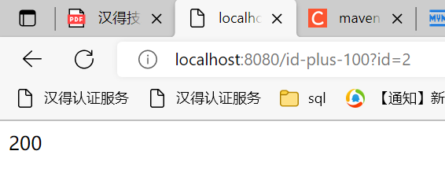
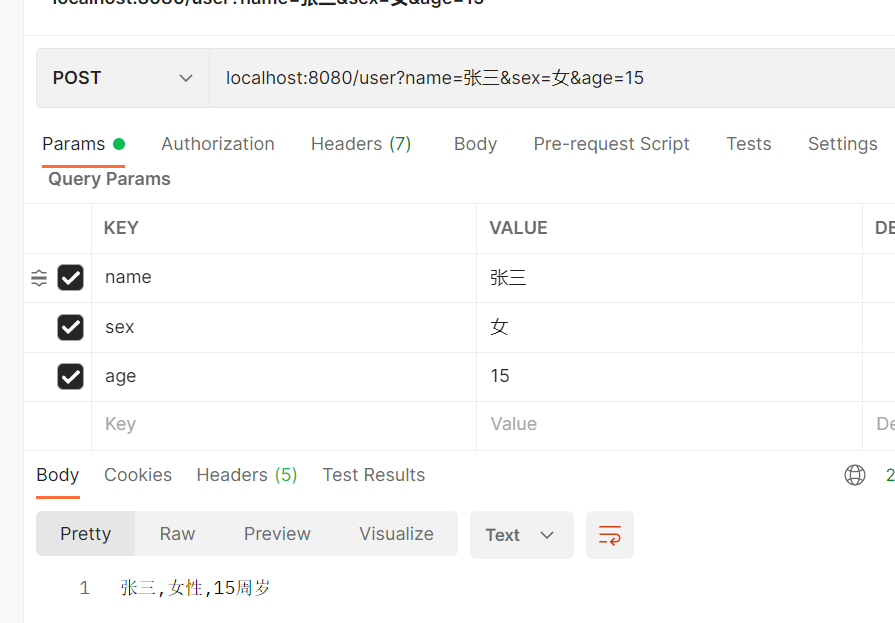
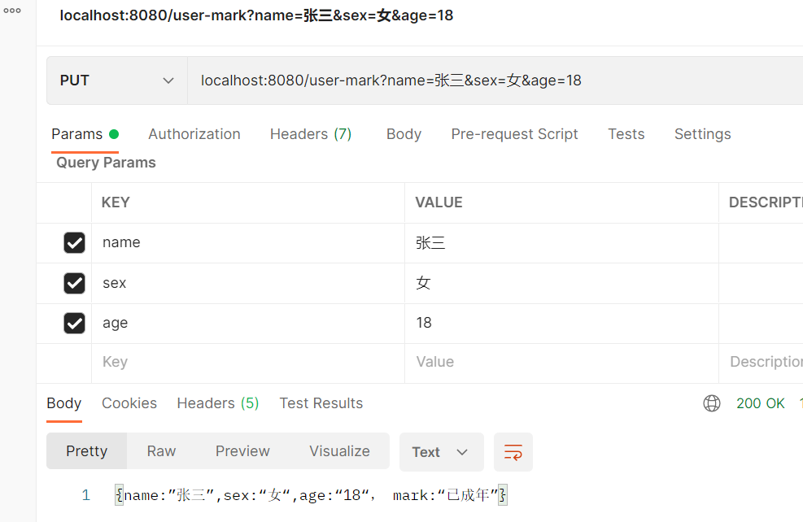
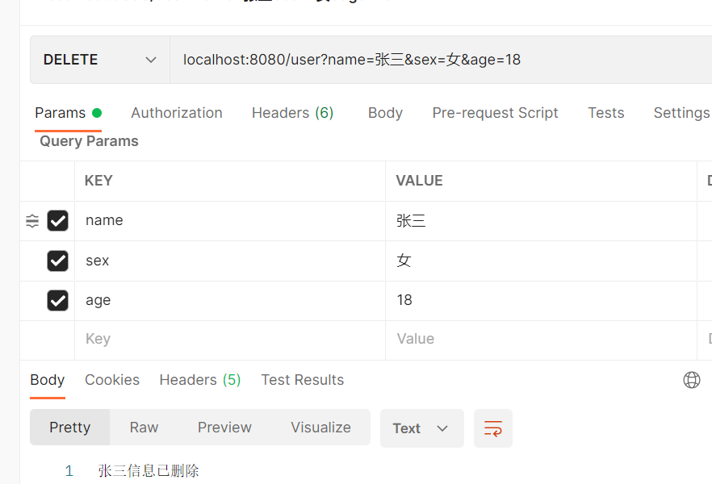
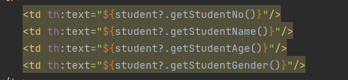

# 配置相关

## 配置注入实体类

1. 编写实体类

   ```java
   public class AppConfig {
      	String appId;
       String apigwPublicKey;
       String priKey;
       String baseUrl;
   }
   ```

2. 参数注入需要set方法，所以加上@Data注解

3. 交由Spring管理当前对象，添加@Component注解

   或在启动类添加@EnableConfigurationProperties（{实体类class}）

4. 设置前缀，添加@ConfigurationProperties(prefix = "app")注解

5. 在配置文件进行配置

   ```yml
   app:
     appId: 123
     apigwPublicKey: 456
     priKey: 789
     baseUrl: 0
   ```

6. 使用，在需要用到的类@Autowired AppConfig即可

## 配置提示

引入依赖

```xml
<!--自定义配置处理器-->
<dependency>
    <groupId>org.springframework.boot</groupId>
    <artifactId>spring-boot-configuration-processor</artifactId>
    <optional>true</optional>
</dependency>
```

如果无效果，检查maven插件版本是否吻合，尝试install查看是否会报错

## 多配置切换

可同时定义多个配置文件，命名方式为“application-*.yml”，如


- 切换方法一：手动修改springboot配置文件

  在application.yml中配置

  ```properties
  spring.profiles.active=dev
  # spring.profiles.active=local
  # spring.profiles.active=prod
  ```

- 切换方法二：maven配置（maven变量注入）

  maven在编译时可以动态决定当前编译环境

  application.yml中配置为：

  ```properties
  # @@中变量名可自定义，但要与下面的配置中标签相同
  spring.profiles.active=@profiles.active@
  ```

  maven中配置profiles内容

  ```xml
   <profiles>
      <!-- 本地 -->
      <profile>
        <id>local</id>
        <properties>
          <!--profile.active对应application.yml中的@profile.active@-->
          <profile.active>local</profile.active>
        </properties>
        <activation>
          <!-- 默认选择的配置 -->
          <activeByDefault>true</activeByDefault>
        </activation>
      </profile>
      <!-- 测试 -->
      <profile>
        <id>dev</id>
        <properties>
          <!--profile.active对应application.yml中的@profile.active@-->
          <profile.active>dev</profile.active>
        </properties>
      </profile>
      <!-- 正式 -->
      <profile>
        <id>prod</id>
        <properties>
          <!--profile.active对应application.yml中的@profile.active@-->
          <profile.active>prod</profile.active>
        </properties>
      </profile>
    </profiles>
  ```

  该配置会在maven工具中生成profile菜单，可进行勾选

  

  如果想要在编译时排除其他环境的配置，可以在pom中配置

  ```xml
  <build>
      <resources>
        <!--排除配置文件-->
        <resource>
          <directory>src/main/resources</directory>
          <!--先排除所有的配置文件-->
          <excludes>
            <!--使用通配符，当然可以定义多个exclude标签进行排除-->
            <exclude>application*.yml</exclude>
          </excludes>
        </resource>
   
        <!--根据激活条件引入打包所需的配置和文件-->
        <resource>
          <directory>src/main/resources</directory>
          <!--引入所需环境的配置文件-->
          <filtering>true</filtering>
          <includes>
            <include>application.yml</include>
            <!--根据maven选择环境导入配置文件-->
            <include>application-${profile.active}.yml</include>
          </includes>
        </resource>
      </resources>
    </build>
  ```


## 配置文件优先级

### 覆盖

  对于key不同，则直接生效；

  对于key相同的同名配置项，后加载会覆盖掉前加载，故而最终为后加载的配置项生效

### 本地配置

- 同文件名配置 *.yaml **加载先于** *.properties
- bootstrap配置 **加载先于** application配置
- 不带profile的配置 **加载先于** 带profile的配置

**故**

1. bootstrap.yaml
2. bootstrap.properties
3. bootstrap-{profile}.yaml
4. bootstrap-{profile}.properties
5. application.yaml
6. application.properties
7. application-{profile}.yaml
8. application-{profile}.properties

### nacos配置

- 本地配置 **加载先于** nacos配置中心
-  nacos配置中心上共享配置(见下说明) **加载先于** nacos配置中心该服务配置（见下说明）
- 不带profile的配置 **加载先于** 带profile的配置
- nacos配置中心因需要通过data ID指定（或者通过spring.cloud.nacos.config.file-extension指定后缀），所以对于Nacos配置中心上的某个Data ID而言，不会存在既加载其*.yaml又加载其*.properties的情形。

**故**

1. 本地配置
2. nacos配置中心共享配置（通过spring.cloud.nacos.config.shared-configs指定）
3. Nacos配置中心该服务配置（通过spring.cloud.nacos.config.prefix和spring.cloud.nacos.config.file-extension指定）
4. Nacos配置中心该服务-{profile}配置（通过spring.cloud.nacos.config.prefix和spring.cloud.nacos.config.file-extension、以及spring.profiles.active指定）

# controller 请求参数注入命名转换

**参考资料** [springboot项目配置参数请求及返回均为下划线方式_springboot responsebody 指定返回的格式 为下划线分割_偶系渣渣灰的博客-CSDN博客](https://blog.csdn.net/breakaway_01/article/details/119033959)

在配置文件中添加配置

```yaml
spring:
  jackson:
    property-naming-strategy: SNAKE_CASE #下划线参数
```

CamelCase策略，Java对象属性：personId，序列化后属性：persionId

PascalCase策略，Java对象属性：personId，序列化后属性：PersonId

SnakeCase策略，Java对象属性：personId，序列化后属性：person_id

KebabCase策略，Java对象属性：personId，序列化后属性：person-id

# SpringBoot与Spring的关系

Spring Boot 为Spring的扩展封装，免去了很多配置，使得使用spring更加便捷

# SpringAOP

AOP 要达到的效果是，保证开发者不修改源代码的前提下，去为系统中的业务组件添加某种通用功能。比如添加日志等。AOP 的本质是由 AOP 框架修改业务组件的多个方法的源代码，AOP是代理模式的典型应用。

# SpringIOC

Spring来控制对象的生命周期
DI：依赖注入，spring依赖注入，不用关心具体的实现，比如日志有多个框架，我们只需要知道spring会给我们提供，不需要了解底层用的哪个框架

# SpringBoot自动装配原理

- @SpringBootApplication注解中引入了@EnableAutoConfiguration注解
- @EnableAutoConfiguration注解中引入了@Import注解
- @Import注解引入了一个deferredImportSelector对象，其功能为在springboot启动完成之后再引入，方便覆盖时判断如conditionOnBean
- 找到META-INF/spring.factories配置文件
- 过滤出所有的AutoConfiguration类
- 通过@Condition排除无效自动配置类

这些自动配置类都是以AutoConfiguration结尾来命名的，它实际上就是一个JavaConfig形式的Spring容器配置类，通过@Bean导入到Spring容器中，以Properties结尾命名的类是和配置文件进行绑定的。它能通过这些以Properties结尾命名的类中取得在全局配置文件中配置的属性，我们可以通过修改配置文件对应的属性来修改自动配置的默认值，来完成自定义配置

# SpringBoot版本

- 版本号

Spring Boot 的版本号由 3 位组成，这里还是以上边两个版本为例，如下图：


- 主版本：有可能进行大的架构调整，各大版本之间并不一定兼容

- 次版本：在主版本架构不变的前提下，增加了一些新的特性或变化

- 增量版本：bug 修复，细节的完善，用来描增量版本的，不一定是数字，例如：3.0.0-SNAPSHOT

- 发布状态

发布状态也有很多同行人称为发布计划，常见的有以下几个：

- GA：General Availability，正式发布的版本，官方推荐使用该版本，国外很多项目都是使用GA来表示正式发布版本的

- PRE：预览版，主要是用来内部开发人员和测试人员测试使用，因此不建议使用

- SNAPSHOT：快照版，可以稳定使用，且该版本会一直进行小量的优化和改进

- RC：Release，该版本已经相当成熟了，基本上不存在导致错误的BUG，与即将发行的正式版相差无几。

# RestFul接口规范

RESTful的特点： a. 每个互联网资源都有一个唯一的URI地址； b. 通过操作资源的表现形式来操作资源； c. 一般情况下使用JSON格式来表示具体的数据； c. 使用HTTP协议进行客户端与服务端之间的交互，从客户端到服务端的每个请求都必须包含理解请求所必需的信息； d. 客户端使用GET、POST、PUT（patch）、DELETE 4个表示操作方式的动词对服务端资源进行“状态”操作。

- 命名必须全部`小写`
- 资源（resource）的命名必须是`名词`，并且必须是`复数形式`
- 如果要使用连字符，建议使用‘ - ’而不是‘ _ ’，‘ _ ’字符可能会在某些浏览器或屏幕中被部分遮挡或完全隐藏
- 易读

# 常用注解

## 启动注解

- @SpringBootApplication
  - 启动类注解
  - 包含@SpringBootConfiguration，@EnableAutoConfiguration，@ComponentScan
- @SpringBootConfiguration
  - 继承@Configuration，标注当前类为配置类，会将当前类中声明的一个或多个以@Bean注解标记的方法纳入spring容器中，且实例名就是方法名
- @EnableAutoConfiguration
  - 将当前所有符合条件的配置都加载到当前SpringBoot创建并使用IOC容器。
- @ComponentScan
  - 自动扫描并加载符合条件的组件或bean定义，最终将改些bean加载到容器中
  - 可以通过basePackages等属性指定@ComponentScan自动扫描的范围，如果不指定，则默认Spring框架实现从声明@ComponentScan所在类的package进行扫描，默认情况下是不指定的，所以SpringBoot的启动类最好放在root package下。

## Controller相关注解

- @Controller
  - 控制器，处理HTTP请求
- @RestController
  - 将方法返回的对象直接在浏览器上展示成json格式
- @RequestBody
  - 通过HttpMessageConverter读取Request Body并反序列化为Object（泛指）对象
- @RequestMapping
  - 会将 HTTP 请求映射到 MVC 和 REST 控制器的处理方法上
- @GetMapping / @PostMapping
  - 将HTTP get / post请求映射到特定处理

## 取请求参数值

- PathVariable

```
@Controller
@RequestMapping("/User")
public class HelloWorldController {

    @RequestMapping("/getUser/{uid}")
    public String getUser(@PathVariable("uid")Integer id, Model model) {
        System.out.println("id:"+id);
        return "user";
    }
}
```

- RequestParam

```
@RequestMapping("/getUser")
public String getUser(@RequestParam("uid")Integer id, Model model) {
    System.out.println("id:"+id);
    return "user";
}
```

- @RequestHeader 把Request请求header部分的值绑定到方法的参数上
- @CookieValue 把Request header中关于cookie的值绑定到方法的参数上

# SpringBoot 核心功能

- 独立运行spring项目，springboot 可以以jar包的形式独立运行
  - 打包:https://blog.csdn.net/jin_tk/article/details/88226287

```text
java -jar xx.jar
```

- 使用嵌入式的Servlet容器,应用无需打成war包
- 大量自动配置,简化开发,可修改默认配置
- 提供starter简化Maven配置。Springboot提供了一系列的start pom用来简化maven依赖。如：常用的spring-boot-starter-web、spring-boot-starter-tomcat、spring-boot-starter-actuator

- 准生产环境的运行时应用监控
- 自动配置spring,Springboot会根据我们项目中类路径的jar包，为jar包的类进行自动装配bean。

- 应用监控。springboot提供了基于HTTP、ssh、telnet对运行时的项目进行监控。springboot提供了actuator组 件，只需要在配置中加入spring-boot-starter-actuator依赖，通过继承AbstractHealthIndicator这个抽象类， 然后在doHealthCheck()方法中检测服务健康的方法，就可以实现一个简单的监控。


# idea构建spring boot 项目

- 脚手架使用阿里的,速度会快一点
- 记得配置maven的镜像,不然下载很慢
  - 如无配置,可新建一个settings.xml

## pom文件

管理依赖

## 启动类

一个普通的Java程序需要有一个入口，一般是某个类中的main方法。我们启动程序，就是运行这个 main方法。SpringBoot的主程序也就是整个项目的入口，同样会有一个main方法。SpringBoot项目就是从主程 序开始运行的。下图是一个实际项目中的主程序，对于SpringBoot程序来说，必须要用@SpringBootApplication 来标识启动类。其他的注解都是实际项目中为了实现其他的功能而添加的。

## 配置文件

- application.properties

- application.yml

**配置文件的作用**

- 修改SpringBoot自动配置的默认值 SpringBoot的底层把我们的常用配置都给我们配置好了，一般来说我们不需要去调整大部分的配置，直接使 用默认的配置就好。这也是SpringBoot“习惯大于配置”的思想。但有的时候默认值不符合我们项目的要求， 这个时候我们就可以通过配置文件来修改这些默认值

- 为程序添加变量

  有的时候我们不会把所有的变量都写死在代码中，有些东西是会经常发生变化，或者不同环境的值不同。比如 对接系统接口的地址、数据库的连接信息等等。这个时候我们就可以将这些内容写在配置文件中，程序在使用 的时候，可以去读取配置文件中的值。

**profile**

Profile是Spring对不同环境提供不同配置功能的支持，可以通过激活、指定参数等方式快速切换环境 多profile文件形式： – 格式：application-{profile}.properties/yml： • application-dev.properties、application-prod.properties


# 入门案例

1. 搭建一个spring boot 工程并开发几个简单的接口

   a. GET: 接口传入id参数，后端返回id*100后的结果 

   ```java
   /**
    * GET: 接口传入id参数，后端返回id*100后的结果
    * @param id
    * @return
    */
   @GetMapping("/id-plus-100")
       public String getIdPlus100(
               @RequestParam("id") Integer id
       ){
           return String.valueOf(id*100);
       }
   ```

   

   b. POST:接口传入{name: ”张三” ,sex: “男” ,age: “18”}，后端返回“张三，男性，18周岁” 

   ```java
    /**
        * POST:接口传入{name: ”张三” ,sex: “男” ,age: “18”}，后端返回“张三，男性，18周岁”
        * @param name
        * @param sex
        * @param age
        * @return
        */
       @PostMapping("/user")
       public String postUser(
               @RequestParam("name") String name,
               @RequestParam("sex") String sex,
               @RequestParam("age") Integer age
       ){
           return String.valueOf(name+","+sex+"性"+","+age+"周岁");
       }
   ```

   

   c. PUT:接口传入{name: ”张三” ,sex: “男” ,age: “18”} ，后端返回{name: ”张三” ,sex: “男” ,age: “18” ， mark: “已成年”} 

   ```java
   /**
        * PUT:接口传入{name:”张三”,sex:“男”,age:“18”} ，后端返回{name:”张三”,sex:“男”,age:“18”， mark:“已成年”}
        * @param name
        * @param sex
        * @param age
        * @return
        */
   
       @PutMapping("/user-mark")
       public String putUserMark(
               @RequestParam("name") String name,
               @RequestParam("sex") String sex,
               @RequestParam("age") Integer age
       ){
           StringBuilder sb = new StringBuilder();
           sb.append("{");
           sb.append("name:”");
           sb.append(name);
           sb.append("”,sex:“");
           sb.append(sex);
           sb.append("“,age:“");
           sb.append(age);
           sb.append("“， mark:“");
           if(age >= 18){
               sb.append("已成年”}");
           }else {
               sb.append("未成年”}");
           }
   
           return String.valueOf(sb);
       }
   ```

   

   

   d. DELETE: 接口传入{name: ”张三” ,sex: “男” ,age: “18”} ，后端返回， “张三信息已删除“

   ```java
   /**
        * DELETE: 接口传入{name: ”张三” ,sex: “男” ,age: “18”} ，后端返回， “张三信息已删除“
        * @param name
        * @param sex
        * @param age
        * @return
        */
       @DeleteMapping("/user")
       public String deleteUser(
               @RequestParam("name") String name,
               @RequestParam("sex") String sex,
               @RequestParam("age") Integer age
       ){
           return String.valueOf(name+"信息已删除");
       }
   ```

   

   

   


# 一个案例

## 引入依赖

```xml
		<dependency>
            <groupId>org.springframework.boot</groupId>
            <artifactId>spring-boot-starter-web</artifactId>
        </dependency>
		<dependency>
            <groupId>org.springframework.boot</groupId>
            <artifactId>spring-boot-starter-thymeleaf</artifactId>
        </dependency>
        <dependency>
            <groupId>org.springframework.boot</groupId>
            <artifactId>spring-boot-devtools</artifactId>
            <scope>runtime</scope>
            <optional>true</optional>
        </dependency>
```


## Student表的增删改查

~~~java
package com.example.firstdemo.api.controller;

import com.example.firstdemo.app.servive.HandStudentService;
import com.example.firstdemo.domain.entity.HandStudent;
import com.example.firstdemo.infra.util.Utils;
import org.springframework.beans.factory.annotation.Autowired;
import org.springframework.stereotype.Controller;
import org.springframework.ui.Model;
import org.springframework.web.bind.annotation.*;

import java.util.ArrayList;
import java.util.List;

@Controller
public class ListController {
    @Autowired
    HandStudentService handStudentService;

    /**
     * 若传入了学号,则按照学号查询,否则查询所有学生信息
     *
     * @param studentNo
     * @param model
     * @return
     */
    @GetMapping("/hello/student")
    public String helloStudent(
            @RequestParam(value = "studentNo", required = false) String studentNo,
            Model model
    ) {
        List<HandStudent> studentList = new ArrayList<>();
        if (studentNo != null) {
            HandStudent s = handStudentService.selectByStudentNo(studentNo);
            studentList.add(s);
        } else {
             studentList = handStudentService.selectAll();
        }
        model.addAttribute("studentList", studentList);

        return "list";
    }

    /**
     * 新增学生信息
     *
     * @param studentName
     * @param studentAge
     * @param studentGender
     * @param model
     * @return
     */
    @PostMapping("/hello/student")
    public String insertStudent(
            @RequestParam("studentName") String studentName,
            @RequestParam("studentAge") String studentAge,
            @RequestParam("studentGender") String studentGender,
            Model model

    ) {
        // 查出当前最大学号
        String maxNo = handStudentService.selectMaxNo();
        Integer maxNoNum = Integer.valueOf(maxNo.substring(1));
        // 生成学号
        // 学号+1并转为字符串
        String newNoStr = String.valueOf(maxNoNum + 1);
        // 左边填充0得到三位学号
        for (int i = 0; i < 3 - (newNoStr).length(); i++) {
            newNoStr = "0" + newNoStr;
        }
        String newNo = "s" + newNoStr;
        // 插入数据
        try {
            HandStudent handStudent = new HandStudent();
            handStudent.setStudentNo(newNo);
            handStudent.setStudentName(studentName);
            handStudent.setStudentAge(Integer.valueOf(studentAge));
            handStudent.setStudentGender(studentGender);
            handStudentService.insertHandStudent(handStudent);
            model.addAttribute("insert_msg", "添加成功");
        } catch (Exception e) {
            model.addAttribute("insert_msg", "添加失败");
        }


        // 返回插入的数据
        HandStudent s = handStudentService.selectByStudentNo(newNo);
        model.addAttribute("student", s);
        return "list";
    }

    /**
     * 修改学生信息
     *
     * @param studentNo
     * @param studentName
     * @param studentAge
     * @param studentGender
     * @param model
     * @return
     */
    @PutMapping("/hello/student")
    public String updateStudent(
            @RequestParam("studentNo") String studentNo,
            @RequestParam("studentName") String studentName,
            @RequestParam("studentAge") String studentAge,
            @RequestParam("studentGender") String studentGender,
            Model model

    ) {
        // 学号是否为空判断
        if (!Utils.isNotEmptyStr(studentNo)) {
            model.addAttribute("update_msg", "修改失败,学号不能为空");
            return "list";
        }
        // 修改数据
        try {
            HandStudent handStudent = new HandStudent();
            if (Utils.isNotEmptyStr(studentName)) {
                handStudent.setStudentName(studentName);
            }
            handStudent.setStudentNo(studentNo);
            if (Utils.isNotEmptyStr(studentAge)) {
                handStudent.setStudentAge(Integer.valueOf(studentAge));
            }
            if (Utils.isNotEmptyStr(studentGender)) {
                handStudent.setStudentGender(studentGender);
            }

            handStudentService.updateByStudentNo(handStudent);
            model.addAttribute("update_msg", "修改成功");
        } catch (Exception e) {
            model.addAttribute("update_msg", "修改失败");
        }


        // 返回修改的数据
        HandStudent s = handStudentService.selectByStudentNo(studentNo);
        model.addAttribute("student", s);
        return "list";
    }

    /**
     * 删除学生信息
     *
     * @param studentNo
     * @param model
     * @return
     */
    @DeleteMapping("/hello/student")
    public String deleteStudent(
            @RequestParam("studentNo") String studentNo,
            Model model

    ) {
        // 返回修改的数据
        HandStudent s = handStudentService.selectByStudentNo(studentNo);
        model.addAttribute("student", s);
        // 修改数据
        try {

            handStudentService.deleteByStudentNo(studentNo);
            model.addAttribute("delete_msg", "删除成功");
        } catch (Exception e) {
            model.addAttribute("delete_msg", "删除失败");
        }


        return "list";
    }
}

~~~

~~~html
<!DOCTYPE html>
<html lang="en" xmlns:th="http://www.thymeleaf.org">
<head>
    <meta charset="UTF-8">
    <style>
        table {
            width: 100%;
            border-collapse: collapse;
        }

        table caption {
            font-size: 2em;
            font-weight: bold;
            margin: 1em 0;
        }

        th, td {
            border: 1px solid #999;
            text-align: center;
            padding: 20px 0;
        }

        table thead tr {
            background-color: #008c8c;
            color: #fff;
        }

        table tbody tr:nth-child(odd) {
            background-color: #eee;
        }

        table tbody tr:hover {
            background-color: #ccc;
        }


        table tfoot tr td {
            text-align: right;
            padding-right: 20px;
        }
    </style>
</head>
<body>
<h1>查询</h1>
<form action="/hello/student" method="get">
    学号:<br>
    <input type="text" name="studentNo"> <br>
    <input type="submit">
</form>
<table>
    <thead>
    <td>学号</td>
    <td>姓名</td>
    <td>年龄</td>
    <td>性别</td>
    </thead>
    <tbody>

    <tr th:each="student:${studentList}">
        <td th:text="${student.getStudentNo()}"/>
        <td th:text="${student.getStudentName()}"/>
        <td th:text="${student.getStudentAge()}"/>
        <td th:text="${student.getStudentGender()}"/>
    </tr>
    </tbody>

</table>


<h1>新增</h1>
<h2 th:text="${insert_msg}"></h2>
<form action="/hello/student" method="post">
    姓名:<br>
    <input type="text" name="studentName"><br>
    年龄:<br>
    <input type="text" oninput="this.value = this.value.replace(/[^0-9]/g, '');" name="studentAge"> <br>
    性别:<br>
    <input type="text" name="studentGender"> <br>
    <input type="submit">
</form>
<h1>修改</h1>
<h2 th:text="${update_msg}"></h2>
<form action="/hello/student" method="post">
    <input type="hidden" name="_method" value="put"/>
    学号:<br>
    <input type="text" name="studentNo"><br>
    姓名:<br>
    <input type="text" name="studentName"><br>
    年龄:<br>
    <input type="text" oninput="this.value = this.value.replace(/[^0-9]/g, '');" name="studentAge"> <br>
    性别:<br>
    <input type="text" name="studentGender"> <br>
    <input type="submit">
</form>
<h1>删除</h1>
<h2 th:text="${delete_msg}"></h2>
<form action="/hello/student" method="post">
    <input type="hidden" name="_method" value="delete"/>
    学号:<br>
    <input type="text" name="studentNo"> <br>
    <input type="submit">
</form>

</body>
</html>
~~~


## ajax

```html
<!DOCTYPE html>
<html lang="en">
<head>
    <meta charset="UTF-8">
    <script src="https://code.jquery.com/jquery-3.1.1.min.js"></script>
    <script type="text/javascript" src="/static/js/main.js"></script>
    <title>Title</title>
</head>
<body>
<form id="update-student-core">
    学号:<br>
    <input type="text" name="studentNo" id="studentNo"><br>
    课程号:<br>
    <input type="text" name="courseNo" id="courseNo"><br>
    成绩:<br>
    <input type="number" name="core" id="core" value=""><br>
    <input type="submit">
</form>
</body>
</html>
```

```js
$(document).ready(function () {
    // 文档页面加载完成之后
    $("#update-student-core").submit(function (event) {
        //stop submit the form, we will post it manually.
        event.preventDefault();
        fire_ajax_submit();
    });

});
function fire_ajax_submit() {
    var coreObj = {}
    coreObj["studentNo"] = $("#studentNo").val();
    coreObj["courseNo"] = $("#courseNo").val();
    coreObj["core"] = $("#core").val();

    $.ajax({
        type: "PUT",
        contentType: "application/json",
        url: "/hello/student/core",
        data: JSON.stringify(coreObj),
        dataType: 'json',
        cache: false,
        timeout: 600000,
        success: function (data) {
            // alert(data.core);
            $("#core").prop("value",data.core)
        }
    });
}


```

```java

@Controller
public class ajaxController {
    @Autowired
    HandStudentCoreService handStudentCoreService;
    @ResponseBody
    @PutMapping("/hello/student/core")
    public HandStudentCore helloStudentCore(
            @RequestBody HandStudentCore handStudentCore
    ) {
        HandStudentCore handStudentCoreRes = handStudentCoreService.selectByStudentNoAndCourseNo(handStudentCore.getStudentNo(), handStudentCore.getCourseNo());
        return handStudentCoreRes;
    }

    @GetMapping("/hello/student/core")
    public String helloStudent(
            Model model
    ) {
        return "ajax_study";
    }


}

```

# restful风格的前端请求

- ```
  spring boot 默认关闭了隐藏方法过滤器,使得前端 form 无法发送 put 或者 delete 请求,需要在 yml 中开启
  * spring:
  *   mvc:
  *     hiddenmethod:
  *       filter:
  *         enabled: true
  ```

# required=false

某些请求参数不一定会传入，为了防止400错误，可使用 required = false来设置该参数


# thymeleaf非空判断

thymeleaf中如果要从一个对象中获取属性，但对象有可能为null，可使用问号进行非空判断

# ajax

- ```js
   $.ajax({
          type: "POST", // 发送的请求类型
          contentType: "application/json", // 发送给服务器的编码类型
          url: "/hello/student/core", // 请求地址
          data: JSON.stringify(coreObj), // 发送的数据,这里使用JSON.stringify将一个对象转为JSON格式
          dataType: 'json',//服务器返回的数据类型
          cache: false,
          timeout: 600000, // 超时毫秒
          success: function (data) { // 请求成功后调用的函数
              alert("插入成功");
              // $("#core").prop("value",data.core)
          },
          error: function (){ // 请求失败调用的函数
              alert("插入失败");
          }
      })
  ```

# MultipartFile设置文件的大小

```yaml
 //spring boot进行了集成，需要进行文件大小的设置
 spring:
 	servlet:
    	multipart:
      		max-file-size: 50MB
      		max-request-size: 50MB
```

# 邮件发送

使用spring-boot-starter-mail

```yaml
mail:
    #配置smtp服务主机地址
    host: smtp.mxhichina.com
    #发送者邮箱
    username: test@test.cn
    #配置密码或者授权码
    password: 
    #端口号465或587
    port: 465
    #默认的邮件编码为UTF-8
    default-encoding: UTF-8
    #其他参数
    properties:
      mail:
        #配置SSL 加密工厂
        smtp:
        	//账号信息认证
          auth: true
          #starttls:
            #enable: true
          ssl:
            #本地测试，先放开ssl
            enable: true
            required: true
            auth: true
          #开启debug模式，这样邮件发送过程的日志会在控制台打印出来，方便排查错误
        debug: true
```

# SpringBoot直接运行原理

- 打包的时候执行插件：spring-boot-maven-plugin

- 打包后会生成一个Far Jar，其中包含了应用依赖的jar包和SpringBootLoader相关的类

- java -jar时查看jar包中的manifest.mf文件，其中指定了java运行主类MainClass与Spring运行主类StartClass
- jar包中指定的主类是JarLauncher，其会创建一个ClassLoader来动态加载jar包中boot-lib下的jar包，并新开一个线程执行指定的StarClass中的main函数

这里其实想到了shade插件，shade插件的原理是将依赖的jar包解包之后直接包入成品jar包中，而不像springboot动态的去加载jar包。

# SpringBoot连接数配置

```yaml
server:
	tomcat:
		threads:
			# 最少（常驻）线程数
			min-spare: 10
			# 最多线程数
			max: 20
        # 最大连接数
        max-connections: 30
        # 最大等待数
        accept-count: 10
```

默认值可以在这里看


## Q&A

- 并发量指的是连接数还是线程数
  连接数

- 最大的200个线程如何处理10000条连接
  Tomcat的两种处理连接的模式，一种是BIO，一个线程只处理一个Socket连接，另一种是NIO，一个线程处理多个Socket连接，由于HTTP请求不会太耗时且多个连接一般不会同时来消息，所以一个线程处理多个连接没有太大问题

- 多开线程与增加连接数
  增加线程一个影响就是会增加线程切换时的上下文的切换时间，且线程增多，在核数不变的请宽心，每个线程分配到的时间片会变小，所以多开线程并不一定会提高处理效率
  如果增加连接数，支持的并发量会提高，但是如果硬件条件没有提升，则并发量的提升只能是以牺牲响应时间为代价

  

# SpringBoot启动速度优化

- 设置Bean为懒加载
  启动是快了，但是初次执行慢了

  ```yaml
  spring:
  	main:
  		lazy-initialization: true
  ```

- spring5支持的创建扫描索引
  引入需要的依赖，启动类上添加@Indexed注解，在打包时会创建扫描索引spring.components到META-INF文件夹中，索引中保存Bean的全类名，执行时直接从索引中读取，不再需要挨个查看类注解

- 使用JDK17，其中提供了更优秀的垃圾回收器
- 使用SpringBoot3，其中提供了一个本地化的解决，执行更快

# SpringBoot解决跨域

- jsonp+callback
  只支持get请求，前后端需要共同编码
- CORS（接口粒度）
  CrossOrigin（源）注解标注在Mapping方法上
- WebMvcConfigurer（批量）
  重写该接口的addCorsMappings方法，添加跨域配置

- CorsFilter（全局）
  在容器中添加一个CorsFilter的Bean，需要浏览器支持
- NGINX（推荐）
  在前端使用NGINX部署的情况下，将访问后端的请求改为访问前端服务器，但通过路径（比如添加一个前缀）区分，接着在NGINX中添加配置进行代理转发。因为NGINX是不会有跨域限制的，且浏览器发现你访问的还是前端服务器，也不会告警

# 配置读取

- Value
  在当前类是一个Bean的前提下，可以通过在成员变量（非static或者final）上面添加@Value注解，参数为${yaml中的坐标}，若配置文件中没有这个坐标，则启动时会报错。
  可以给个默认值提高容错性：

  ```java
  @Value("${a.name:}")
  ```

  冒号后可添加默认值或者不加（赋空值“”）

- ConfigurationProperties
  指定一个前缀，会将前缀下的所有配置注入到当前Bean的成员变量中

- Environment
  容器中会有一个Spring暴露出来的Bean叫做Enviroment，可通过自动注入将其注入到当前环境，通过该Bean的getProperty（配置坐标）方法获取配置
  或者可以通过实现EnvironmentAware接口去获取容器中的env对象

- PropertySource注解
  可以指定其他的properties配置文件来进行读取，可通过一些配置读取自定义的yaml文件
- 通过输入流的方式手动读取
  使用getResourceAsStream获取jar包中输入流

# SpringBoot默认AOP

spring默认行为是代理类有接口使用jdk代理，没有实现接口使用cglib，但springboot是强制所有都使用cglib来作为aop的实现，cglib进行代理时会动态生成字节码，这样可以获得接口实现类的信息比如方法注解，否则只能获取接口上的信息。其次使用CGlib可以使用接口或者实现类类型的变量来接受，但如果使用java原生AOP，则只能使用接口来接受，若该实现类没有接口，则会生成一个该类的子类对象为Bean

# SpringBoot核心注解

- SpringBootApplication
- SpringBootConfiguration
- EnableAutoConfiguration
- ConditionalOn...
  自动配置相关的注解，自动配置就是boot的特性，所以conditional也是

# 内置Tomcat

- 引入web依赖后，会引入服务器的自动配置，其中默认支持tomcat（通过conditionalOnClass：Tomcat.class），激活Tomcat的Factory配置
- SpringBoot启动时创建一个容器，同时加载Bean
- 此时会获取Tomcat的工厂Bean
- 通过工厂的getwebserver获取tomcat，启动并挂起

# 外部Tomcat

1. 将项目打包方式设为war
2. 从web依赖中将tomcat依赖排除
3. 实现接口SpringBootServletInitializer并重写configure方法，在其中返回 builder.sources(启动类)

# SPI

java中通过配置文件的方式，将一些实现类注册到配置文件中，在运行时使用ServiceLoader.load方法，获取配置文件中的对应类的对象？

# 读取配置文件原理

通过事件监听器的方式读取

# 默认日志实现框架

默认门面slf4j，默认实现logback

若要切换为log4j：排除logback，添加slf4j-log4j12调节器

若要切换为log4j2：排除掉logback，添加log4j2的starter

# 读取request请求体不完整

原本使用inputstream的available来获取报文大小，但使用inputStream.available()并不总是返回整个流的大小。它只返回可以无阻塞地从此输入流读取（或跳过）的字节数的估计值。在实际应用中，这可能导致只读取了部分数据。
获取不到完整的请求体内容是因为HTTP请求的正文（body）长度是动态的，而inputStream.available()方法返回的是在不阻塞的情况下可以从输入流中读取的字节数。当输入流中的数据量少于或等于输入流内部的缓冲区大小时，available()方法可能返回的是小于实际数据量的值，这就会导致最后只读取了部分数据。为了完整地读取HTTP请求的正文内容，需要使用一个循环来不断读取输入流直到没有更多数据可读。

```java
byte[] buffer = new byte[1024];
StringBuilder resBuilder= new StringBuilder();
int flag = -1;
try {
    while ((flag = inputStream.read(buffer))!=-1){
        resBuilder.append(new String(buffer,0,flag));
    }
} catch (IOException e) {
    throw new RuntimeException(e);
}
```

注意这里的buffer大小会决定在转字符串时是否完整

# 启动后初始化

## 使用PostConstruct注解

在一个被spring代理的组件中使用该注解标记一个方法，方法名不固定，该方法会在当前bean中所有属性注入后调用

```java
@Component
public class SystemInit {
    @Autowired
    DirService dirService;
    @PostConstruct
    public void initd(){
        System.out.println("123");
    }
}
```

# 抽出公共模块，并引入公共模块中的配置

公共模块中配置文件命名可以参考：`application-功能-环境.yaml`，注意不要与其他模块中的配置文件同名

用到该公共模块的服务中，配置如下：

```yml
spring:
  config:
    import:
      - application-功能-${spring.profiles.active}.yaml
```

# tomcat对文件上传大小的限制

```yml
# 上传文件大小限制
spring:
  servlet:
    multipart:
      max-file-size: 4GB
      max-request-size: 4GB
```

# 接口参数校验

在实体类字段上进行校验规则的注解，在用到这些实体类的Controller上标记@Validated可以对所有Controller方法中，有进行字段校验的实体类进行校验，或者也可以直接标记在Controller方法，进行单个参数的校验。

```java
public class FeedbackInfo extends BaseEntity {
    /**
     * ID
     */
    @TableId(value = "ID", type = IdType.ASSIGN_ID)
    private Long id;
    /**
     * 内容
     */
    @NotEmpty
    @TableField(value = "CONTENT")
    @Schema(description = "反馈内容")
    private String content;
    /**
     * 图片
     */
    @TableField(value = "IMAGE")
    @Schema(description = "反馈图片")
    private byte[] image;
    /**
     * 用户 id
     */
    @NotEmpty
    @TableField(value = "USER_ID")
    @Schema(description = "反馈用户ID")
    private String userId;

}
```

```java
@Validated
@RestController
@RequestMapping("/feedback")
public class FeedbackController {}
```

# @RequestParam

如果Params和Body的form中都有一个相同名字的key，则在通过@RequestParam获取该key的时候会将两个值同时获取并拼接

# 文件上传与下载

**文件上传**

```java
// contronller
@PostMapping("/upload")
@CdsApiOperation("上传操作手册")
@Operation(summary = "上传操作手册")
@CdsOperationLog(title = TitleConstant.AUTHOR, businessType = BusinessTypeConstant.ADD)
public Result upload(@RequestParam("file") MultipartFile mdZipFile, @RequestParam("title") String title) {
    boolean save = manualService.createNewManual(mdZipFile, title);
    if (save) {
        return ResultUtil.ok(ResultEnum.SUCCESS);
    }
    return ResultUtil.fail("操作手册上传失败，请重试或联系管理员", ResultEnum.FAIL);
}
// service
@Override
@Transactional
public Boolean createNewManual(MultipartFile mdZipFile, String title) {
    // 文件类型是否合法
    String originalFilename = mdZipFile.getOriginalFilename();
    String[] split = originalFilename.split("\\.");
    if (!suffixSet.contains(split[split.length - 1])) {
        throw new GlobalException("文件类型非支持的压缩格式，支持类型:" + suffixSet.stream().collect(Collectors.joining(",")));
    }
    // 判断是否已存在
    LambdaQueryWrapper<ManualInfo> wrapper = new LambdaQueryWrapper<>();
    wrapper.eq(ManualInfo::getTitle, title);
    Long l = baseMapper.selectCount(wrapper);
    if (l != 0) {
        // 存在则返回false
        return false;
    }
    // 插入到数据库，获取id
    baseMapper.insert(ManualInfo.builder().title(title).build());
    ManualInfo manualInfo = baseMapper.selectOne(wrapper);
    Long id = manualInfo.getId();
    // 保存压缩包到 /manual/id/zip/..
    String currentManualPath = MD_PATH + "/" + id;
    String zipFilePath = currentManualPath + ZIP_DIR;
    String zipFileName = MD_PATH + "/" + id + ZIP_DIR + "/" + originalFilename;
    try {
        File zipFilePathFile = new File(zipFilePath);
        if (!zipFilePathFile.exists()) {
            zipFilePathFile.mkdirs();
        }
        FileCopyUtils.copy(mdZipFile.getInputStream(), new FileOutputStream(zipFileName));
    } catch (IOException e) {
        throw new GlobalException(e.getMessage());
    }
    // 解压压缩包到 /manual/id/content/..
    String contentFilePath = currentManualPath + CONTENT_DIR + "/";
    try {
        ZipUtil.unzip(zipFileName, contentFilePath, ZipUtil.UTF_8);
    } catch (FileNotFoundException e) {
        throw new GlobalException(e.getMessage());
    }
    // 进入内容文件夹，将存储图片的文件夹重命名为image
    File currentContentDir = new File(contentFilePath);
    File[] files = currentContentDir.listFiles();
    for (File c : files) {
        // 可能存在没有图片文件夹的情况
        if (c.isDirectory()) {
            c.renameTo(new File(currentContentDir + IMG_DIR + "/"));
        } else if (c.getName().endsWith("md")) {
            // 处理md文件内容，修改图片地址
            // 开启缓冲reader，按行读取，读到图片地址则替换
            BufferedReader bufferedReader = null;
            BufferedWriter bufferedWriter = null;
            try {
                bufferedReader = new BufferedReader(new FileReader(c));
                File target = new File(c.getParentFile(), id + ".md");
                bufferedWriter = new BufferedWriter(new FileWriter(target));
                String currentLine = null;
                while ((currentLine = bufferedReader.readLine()) != null) {
                    Pattern pattern = Pattern.compile("!\\[.*\\]\\((.*)\\)");
                    Matcher matcher = pattern.matcher(currentLine);
                    if (matcher.find()) {
                        // TestManual/image-20240422144302572.png
                        String oriImg = matcher.group(1);
                        // 获取图片名
                        String[] split1 = oriImg.split("[/,\\\\]");
                        String imgFileName = split1[split1.length - 1];
                        // 组装服务器地址
                        StringBuilder sb = new StringBuilder(SERVER_IMG_PATH_PERFIX);
                        sb.append("?");
                        sb.append("id=").append(id);
                        sb.append("&");
                        sb.append("img=").append(imgFileName);
                        String serverImgPath = sb.toString();
                        currentLine = currentLine.replace(oriImg, serverImgPath);
                    }
                    // 写入拷贝
                    bufferedWriter.write(currentLine);
                    bufferedWriter.newLine();
                }
            } catch (IOException e) {
                throw new GlobalException(e.getMessage());
            } finally {
                if (bufferedReader != null) {
                    try {
                        bufferedReader.close();
                    } catch (IOException e) {
                        throw new GlobalException(e.getMessage());
                    }
                }
                if (bufferedWriter != null) {
                    try {
                        bufferedWriter.close();
                    } catch (IOException e) {
                        throw new GlobalException(e.getMessage());
                    }
                }
            }
        }
    }
    return true;
}
```

**下载文件**

```java
// controller
@GetMapping("/getOriginZip")
@CdsApiOperation("获取原件")
@Operation(summary = "获取原件")
public void getOriginZip(HttpServletResponse response, @RequestParam("id") Long id) {
    LambdaQueryWrapper<ManualInfo> wrapper = new LambdaQueryWrapper<>();
    wrapper.eq(ManualInfo::getId, id);
    ManualInfo one = manualService.getOne(wrapper);
    if (one == null) {
        response.setStatus(HttpServletResponse.SC_NOT_FOUND);
        return;
    }
    try {
        ServletOutputStream outputStream = response.getOutputStream();
        manualService.getOriginZip(id, outputStream);
    } catch (IOException e) {
        throw new GlobalException(e.getMessage());
    }
}
```

# Springboot升级3.2报错

## 问题一

[Spring Boot 升级 3.2 报错 Invalid value type for attribute ‘factoryBeanObjectType‘: java.lang.String_invalid value type for attribute 'factorybeanobjec-CSDN博客](https://blog.csdn.net/u013737132/article/details/134938131)

Invalid value type for attribute 'factoryBeanObjectType': java.lang.String

原因，mybatis的实现中用到的api在springboot3.2后更改了

解决方法：使用mybtais plus 355

注意组件id与springboot2.几的时候不同，但不改居然也能下载东西

```
<dependency>
    <groupId>com.baomidou</groupId>
    <artifactId>mybatis-plus-spring-boot3-starter</artifactId>
    <version>3.5.7</version>
</dependency>
```

## 问题二

[从 Spring Boot 3.1.5 升级到 3.2.0 后出现错误“IllegalStateException: No target Validator set” - java - SO中文参考 - www.soinside.com](https://www.soinside.com/question/wnWUob5T3KzPnLEE463pDR)

java.lang.IllegalStateException: No target Validator set

```xml
<dependency>
    <groupId>org.springframework.boot</groupId>
    <artifactId>spring-boot-starter-validation</artifactId>
</dependency>
```

NotBlank不再支持数值类型，需要改为NotNull


# LocalDateTime

LocalDateTime 反序列化问题

在实体类中使用LocalDateTime 类型接收字符串时，需要在字段上添加`@JsonFormat(pattern = "yyyy-MM-dd HH:mm:ss")`注解，且pattern不可变，同时前端传值必须传时分秒

或者可自定义反序列化器.

```java
/**
* 加工部门退样至下一环节
*/
@Schema(description = "加工部门退样至下一环节")
@JsonDeserialize(using = NoTimeLocalDateTimeDeserializer.class)
private LocalDateTime pdReturnsCleanCopyToNextStage;


// =========

public class NoTimeLocalDateTimeDeserializer extends JsonDeserializer<LocalDateTime> {
    @Override
    public LocalDateTime deserialize(JsonParser jsonParser, DeserializationContext deserializationContext) throws IOException, JacksonException {
        String dateStr = jsonParser.getText().trim();
        DateTimeFormatter formatter = DateTimeFormatter.ofPattern("yyyy-MM-dd").withZone(ZoneId.of("GMT+8"));
        LocalDate date = LocalDate.parse(dateStr, formatter);
        return date.atStartOfDay();  // 默认为午夜时间
    }
}

```

