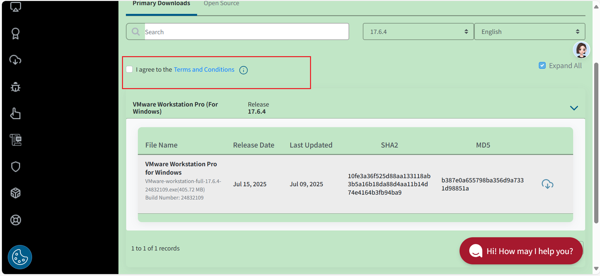

# 参考资料

[VMware 17 下载安装及永久激活使用教程 - 嘿笨笨熊 - 博客园 (cnblogs.com)](https://www.cnblogs.com/hellogmy/p/17253041.html)

[系统镜像](https://msdn.itellyou.cn/)

# 下载

下载地址：[下载 VMware Workstation Pro | CN](https://www.vmware.com/cn/products/workstation-pro/workstation-pro-evaluation.html)

# 安装

1. 打开安装包

2. 接受协议

3. 选择安装路径

   勾选增强键盘驱动程序

   勾选添加到Path

4. 取消勾选产品更新和客户体验计划
5. 勾选创建快捷方式
6. 安装

# 激活

点击许可证，输入密钥

> aa ：JU090-6039P-08409-8J0QH-2YR7F

> bb：ZA5RU-6FYD5-48EPY-3XXEE-PAUGD

# 最新

现已无需破解，官方提供免费使用，但需要注册账号

[注册地址](https://profile.broadcom.com/web/registration)

登录时使用邮箱和密码登录

登陆后访问

[ProductFiles - Support Portal - Broadcom support portal](https://support.broadcom.com/group/ecx/productfiles?subFamily=VMware Workstation Pro&displayGroup=VMware Workstation Pro 17.0 for Windows&release=17.6.4&os=&servicePk=&language=EN&freeDownloads=true)

# VMTools

下载iso后使用硬件设置加载iso，在系统中会弹出安装流程，安装即可