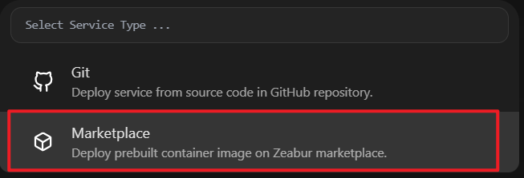
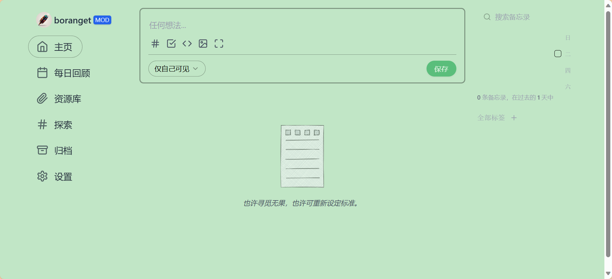

# 参考资料

[一分钟免费部署你的专属 Memos | 子虚栈 (si-on.top)](https://blog.si-on.top/2023/deploy-memos-in-60s/)

# 相关

zeabur是一个可以免费部署容器的平台，需要每7天点击延长一次，官网：[zeabur](https://zeabur.com?referralCode=Boranget)

memos是一款开源的记事本服务

# 步骤

- 注册需要使用github登录。

- 根据指引创建project

- 创建 service

  

- 选择从市场中挑选

  

- 找到memos，点击部署

- 部署结束后，点击domain标签，进行域名的生成或绑定，点击域名即可访问

  

# 其他

除了zeabur之外还了解了下railway等平台，railway我在网上看着是每个月5美元的额度，但我自己上了官网看定价现在写的是一次性的五美元体验额度。