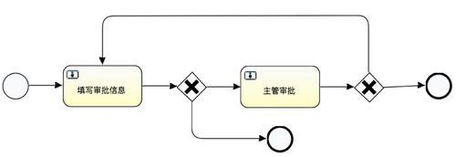

# 参考资料

[ 十分钟认识Activiti6.0工作流引擎 - 知乎](https://zhuanlan.zhihu.com/p/38035481)

# 基本概念

activity6能做到的东西其实就是根据画好的流程图走流程，但是具体流程里的逻辑，还是需要自定义实现，比如点击哪个按钮走到下一步，这个肯定是前后端配合实现。

# 流程图

流程图可以使用满足activity6协议的各种工具绘画，最后会生成一个xml的配置文件，activity流程引擎会根据该文件来判断流程的全局结构




```xml
<?xml version="1.0" encoding="UTF-8"?><definitions xmlns="http://www.omg.org/spec/BPMN/20100524/MODEL" xmlns:xsi="http://www.w3.org/2001/XMLSchema-instance" xmlns:xsd="http://www.w3.org/2001/XMLSchema" xmlns:activiti="http://activiti.org/bpmn" xmlns:bpmndi="http://www.omg.org/spec/BPMN/20100524/DI" xmlns:omgdc="http://www.omg.org/spec/DD/20100524/DC" xmlns:omgdi="http://www.omg.org/spec/DD/20100524/DI" xmlns:tns="http://www.activiti.org/test" typeLanguage="http://www.w3.org/2001/XMLSchema" expressionLanguage="http://www.w3.org/1999/XPath" targetNamespace="http://www.activiti.org/test" id="m1528728906382" name="">
  <process id="second_approve" name="二级审批流程" isExecutable="true" isClosed="false" processType="None">
    <startEvent id="startEvent" name="开始"></startEvent>
    <userTask id="submitForm" name="填写审批信息">
      <extensionElements>
        <activiti:formProperty id="message" name="申请信息" type="string" required="true"></activiti:formProperty>
        <activiti:formProperty id="name" name="申请人姓名" type="string" required="true"></activiti:formProperty>
        <activiti:formProperty id="submitTime" name="提交时间" type="date" datePattern="yyyy-MM-dd" required="true"></activiti:formProperty>
        <activiti:formProperty id="submitType" name="确认申请" type="string" required="true"></activiti:formProperty>
      </extensionElements>
    </userTask>
    <sequenceFlow id="flow1" sourceRef="startEvent" targetRef="submitForm"></sequenceFlow>
    <exclusiveGateway id="decideSubmit" name="提交OR取消"></exclusiveGateway>
    <sequenceFlow id="flow2" sourceRef="submitForm" targetRef="decideSubmit"></sequenceFlow>
    <userTask id="tl_approve" name="主管审批">
      <extensionElements>
        <activiti:formProperty id="tlApprove" name="主管审批结果" type="string"></activiti:formProperty>
        <activiti:formProperty id="tlMessage" name="主管备注" type="string" required="true"></activiti:formProperty>
      </extensionElements>
    </userTask>
    <sequenceFlow id="flow3" sourceRef="decideSubmit" targetRef="tl_approve">
      <conditionExpression xsi:type="tFormalExpression"><![CDATA[${submitType == "y" || submitType == "Y"}]]></conditionExpression>
    </sequenceFlow>
    <exclusiveGateway id="decideTLApprove" name="主管审批校验"></exclusiveGateway>
    <sequenceFlow id="flow4" sourceRef="tl_approve" targetRef="decideTLApprove"></sequenceFlow>
    <endEvent id="endEvent" name="结束"></endEvent>
    <endEvent id="endEventCancel" name="取消"></endEvent>
    <sequenceFlow id="flow8" sourceRef="decideSubmit" targetRef="endEventCancel">
      <conditionExpression xsi:type="tFormalExpression"><![CDATA[${submitType == "n" || submitType == "N"}]]></conditionExpression>
    </sequenceFlow>
    <sequenceFlow id="flow9" sourceRef="decideTLApprove" targetRef="submitForm">
      <conditionExpression xsi:type="tFormalExpression"><![CDATA[${tlApprove == "n" || tlApprove == "N"}]]></conditionExpression>
    </sequenceFlow>
    <sequenceFlow id="_2" sourceRef="decideTLApprove" targetRef="endEvent">
      <conditionExpression xsi:type="tFormalExpression"><![CDATA[${tlApprove == "y" || tlApprove == "Y"}]]></conditionExpression>
    </sequenceFlow>
  </process>
 </definitions>
```

# 流程执行

```java
import org.activiti.engine.FormService;
import org.activiti.engine.RuntimeService;
import org.activiti.engine.TaskService;
import org.activiti.engine.form.FormProperty;
import org.activiti.engine.form.TaskFormData;
import org.activiti.engine.form.StringFormType;
import org.activiti.engine.form.DateFormType;
import org.activiti.engine.runtime.ProcessInstance;
import org.activiti.engine.task.Task;
import org.slf4j.Logger;
import org.slf4j.LoggerFactory;
import org.springframework.beans.factory.annotation.Autowired;
import org.springframework.boot.CommandLineRunner;
import org.springframework.context.annotation.Bean;
import org.springframework.context.annotation.Configuration;

import java.text.ParseException;
import java.text.SimpleDateFormat;
import java.util.Date;
import java.util.HashMap;
import java.util.List;
import java.util.Map;
import java.util.Scanner;

/**
 * Activiti工作流自动配置演示类
 * 作用：Spring Boot容器启动后，自动执行二级审批流程（second_approve）的启动与任务处理
 */
@Configuration
public class AutoConfigurationProcessDemo {
    // 日志对象（替换原@Slf4j注解，显式声明更直观）
    private static final Logger logger = LoggerFactory.getLogger(AutoConfigurationProcessDemo.class);

    // 注入Activiti核心服务：
    // RuntimeService：负责流程实例的启动、暂停、查询等运行时操作
    @Autowired
    private RuntimeService runtimeService;

    // TaskService：负责任务的查询、完成、分配等操作
    @Autowired
    private TaskService taskService;

    // FormService：负责处理流程表单数据，如获取任务表单属性、提交表单数据等
    @Autowired
    private FormService formService;

    /**
     * 注册CommandLineRunner Bean
     * 特性：Spring Boot容器启动完成后，自动执行其run()方法，触发流程执行
     * @return CommandLineRunner 命令行执行器
     */
    @Bean
    public CommandLineRunner createProcessCommandLineRunner() {
        return args -> {
            logger.info("=== Activiti工作流程序启动 ===");
            // 1. 启动二级审批流程（流程定义Key：second_approve，对应BPMN文件中的process id）
            ProcessInstance approvalProcessInstance = startApprovalProcess("second_approve");
            // 2. 处理流程中的所有任务（循环直至流程结束）
            handleProcessTasks(approvalProcessInstance);
            logger.info("=== Activiti工作流程序结束 ===");
        };
    }

    /**
     * 启动审批流程实例
     * @param processDefinitionKey 流程定义Key（来自BPMN文件的process id）
     * @return ProcessInstance 启动后的流程实例对象（包含流程实例ID、状态等信息）
     */
    private ProcessInstance startApprovalProcess(String processDefinitionKey) {
        // 通过流程定义Key启动实例（类似根据类名创建对象，一个Key可生成多个实例）
        ProcessInstance processInstance = runtimeService.startProcessInstanceByKey(processDefinitionKey);
        logger.info("已启动流程，流程定义Key：{}", processInstance.getProcessDefinitionKey());
        return processInstance;
    }

    /**
     * 处理流程中的所有待办任务
     * 逻辑：循环查询待办任务，获取控制台输入的表单数据，完成任务直至流程结束
     * @param processInstance 待处理的流程实例
     * @throws ParseException 日期格式解析异常（当输入日期不符合yyyy-MM-dd时抛出）
     */
    private void handleProcessTasks(ProcessInstance processInstance) throws ParseException {
        // 控制台扫描器：用于接收用户输入的表单数据
        Scanner consoleScanner = new Scanner(System.in);

        // 循环条件：流程实例不为空且未结束（避免空指针与重复处理）
        while (processInstance != null && !processInstance.isEnded()) {
            // 查询当前所有待办任务
            List<Task> pendingTaskList = taskService.createTaskQuery().list();
            logger.info("当前待处理任务数量：{}", pendingTaskList.size());

            // 遍历处理每个待办任务
            for (Task currentTask : pendingTaskList) {
                logger.info("正在处理任务：{}", currentTask.getName());
                // 1. 从控制台获取当前任务所需的表单数据（如申请人姓名、审批结果等）
                Map<String, Object> taskFormData = getTaskFormDataFromConsole(consoleScanner, currentTask);
                // 2. 提交表单数据，完成当前任务（任务ID + 表单数据）
                taskService.complete(currentTask.getId(), taskFormData);
                // 3. 更新流程实例状态（避免使用旧状态判断流程是否结束）
                processInstance = runtimeService.createProcessInstanceQuery()
                        .processInstanceId(processInstance.getId())
                        .singleResult();
            }
        }

        // 关闭扫描器，释放资源
        consoleScanner.close();
    }

    /**
     * 从控制台获取单个任务的表单数据
     * 逻辑：先获取任务的表单属性（如申请信息、提交时间），再根据属性类型接收用户输入
     * @param consoleScanner 控制台扫描器（复用避免重复创建）
     * @param currentTask 当前待处理任务
     * @return Map<String, Object> 任务表单数据（key：表单属性ID，value：用户输入值）
     * @throws ParseException 日期格式解析异常
     */
    private Map<String, Object> getTaskFormDataFromConsole(Scanner consoleScanner, Task currentTask) throws ParseException {
        // 获取当前任务的表单元数据（包含表单属性列表，如id、name、类型）
        TaskFormData taskFormMeta = formService.getTaskFormData(currentTask.getId());
        List<FormProperty> formPropertyList = taskFormMeta.getFormProperties();

        // 调用静态方法，统一处理表单属性与用户输入的映射
        return buildFormDataFromConsole(consoleScanner, formPropertyList);
    }

    /**
     * 静态方法：根据表单属性列表，从控制台收集并构建表单数据
     * 支持类型：字符串（StringFormType）、日期（DateFormType，格式yyyy-MM-dd）
     * @param consoleScanner 控制台扫描器
     * @param formPropertyList 表单属性列表（来自任务表单元数据）
     * @return Map<String, Object> 构建后的表单数据
     * @throws ParseException 日期格式解析异常
     */
    public static Map<String, Object> buildFormDataFromConsole(Scanner consoleScanner, List<FormProperty> formPropertyList) throws ParseException {
        // 存储表单数据的Map（替换原Maps.newHashMap()，使用JDK原生类减少依赖）
        Map<String, Object> formDataMap = new HashMap<>();

        // 遍历每个表单属性，按类型处理用户输入
        for (FormProperty formProperty : formPropertyList) {
            String userInput = null;
            // 获取表单属性类型（判断是字符串还是日期）
            if (formProperty.getType() instanceof StringFormType) {
                // 字符串类型：直接提示用户输入
                logger.info("请输入 {} ：", formProperty.getName());
                userInput = consoleScanner.nextLine();
                formDataMap.put(formProperty.getId(), userInput);

            } else if (formProperty.getType() instanceof DateFormType) {
                // 日期类型：提示格式并解析输入（格式yyyy-MM-dd）
                logger.info("请输入 {} （格式：yyyy-MM-dd）：", formProperty.getName());
                userInput = consoleScanner.nextLine();
                SimpleDateFormat dateFormatter = new SimpleDateFormat("yyyy-MM-dd");
                Date formattedDate = dateFormatter.parse(userInput);
                formDataMap.put(formProperty.getId(), formattedDate);

            } else {
                // 不支持的类型：打印日志提示（避免程序崩溃）
                logger.info("暂不支持的表单类型：{}", formProperty.getType());
            }

            // 日志打印用户输入，便于调试
            logger.info("您输入的 {} 内容：{}", formProperty.getName(), userInput);
        }

        return formDataMap;
    }
}
```

# 主要组件

## RepositoryService（流程仓库服务）

存储并解析流程定义，创建并部署流程

- 把本地 / 远程的 BPMN 文件（.bpmn20.xml）、表单文件等打包成 “部署包”，部署到 Activiti 数据库中（本质是将文件解析为数据库记录，供引擎识别）。

- 关键 API：`createDeployment()`（创建部署构建器）、`deploy()`（执行部署）。

- 示例：部署 “请假审批流程” 的 BPMN 文件

    ```java
    repositoryService.createDeployment()
                    .addClasspathResource("processes/leave-approve.bpmn20.xml") // 加载BPMN文件
                    .name("请假审批流程V1.0") // 部署名称
                    .deploy(); // 执行部署
    ```

- 查询已部署的流程定义（如按流程 Key、版本号筛选），判断流程是否已部署、获取最新版本。
- 关键 API：`createProcessDefinitionQuery()`（创建流程定义查询器）、`deleteDeployment()`（删除部署，可选是否级联删除历史数据）。
- 场景：查询 “报销流程” 的所有版本，确认是否需要更新为最新版本。

- 从数据库中获取已部署的 BPMN 文件、流程图（.png）等原始资源，用于前端展示或二次编辑。
- 关键 API：`getResourceAsStream()`（获取资源流）。

## RuntimeService（流程运行时服务）

管理流程的 动态实例，负责流程实例的启动、暂停、推进、终止

- 根据流程定义 Key（BPMN 文件中`process`标签的`id`）启动一个流程实例（即 “发起一个具体的流程”，如 “张三发起请假申请”）。

    - 关键 API：`startProcessInstanceByKey()`（按流程 Key 启动）、`startProcessInstanceById()`（按流程定义 ID 启动，需指定版本）。
    - 示例：张三发起 3 天的请假流程，传入 “申请人”“请假天数” 等参数

    ```java
    Map<String, Object> variables = new HashMap<>();
    variables.put("applicant", "张三");
    variables.put("leaveDays", 3);
    // 按流程Key启动实例（自动选择最新版本的流程定义）
    ProcessInstance instance = runtimeService.startProcessInstanceByKey("leave-approve", variables);
    ```

- 暂停 / 激活流程实例（如 “请假流程因材料不全暂停，补充后激活”）、终止流程实例（如 “请假申请被驳回如 “请假申请被驳回，终止流程”）。
    
- 关键 API：`suspendProcessInstanceById()`（暂停实例）、`activateProcessInstanceById()`（激活实例）、`deleteProcessInstance()`（终止实例）。
    
- 读写流程实例的 “全局变量”（如 “请假天数”“审批意见”，整个流程实例可共享），支撑流程逻辑判断（如 “请假天数 > 3 天需部门经理审批”）。
    
- 关键 API：`setVariable()`（设置变量）、`getVariable()`（获取变量）。
    
- 推进流程实例的 “执行流”（如跳过某个节点、强制流转到指定节点），用于特殊场景（如 “紧急流程跳过部门审批，直接到 CEO 审批”）。
    
    - 关键 API：`signal()`（发送信号推进流程）、`createExecutionQuery()`（查询执行流状态）。

## TaskService（任务服务）

管理流程中的 人工任务，也就是我们说的审批节点，负责任务的查询、分配、完成、认领，处理流程中需要人参与的步骤（如 “部门经理审批请假申请”）。

- 按用户 / 用户组查询 “待办任务”（如 “查询张三的所有待审批任务”“查询财务部的待处理报销任务”）。

    - 关键 API：`createTaskQuery()`（创建任务查询器），支持按`assignee`（执行人）、`candidateUser`（候选用户）、`candidateGroup`（候选组）筛选。
    - 示例：查询张三的待办任务

    ```java
    List<Task> todoTasks = taskService.createTaskQuery()
                                      .taskAssignee("张三") // 执行人是张三
                                      .list();
    ```

- 直接分配任务给指定用户（`setAssignee`，如 “将请假审批任务分配给李四”）；
    - 候选任务认领（如 “财务部任务池中有一个报销任务，王五认领后成为执行人”）。
    - 关键 API：`setAssignee()`（分配任务）、`claim()`（认领任务）、`unclaim()`（释放任务）。

- 提交任务处理结果，推进流程到下一个节点（如 “李四审批通过请假申请，完成任务后流程流转到 HR 归档”）。

    - 关键 API：`complete()`（完成任务，可传入任务变量，如 “审批意见 = 同意”）。
    - 示例：李四完成请假审批，传入审批意见

    ```java
    Map<String, Object> taskVariables = new HashMap<>();
    taskVariables.put("approvalOpinion", "同意");
    taskService.complete("taskId123", taskVariables); // taskId为待办任务的ID
    ```

- 添加任务备注、附件（如 “审批时上传证明文件”），或设置任务到期时间（用于提醒）。
    
    - 关键 API：`addComment()`（添加备注）、`createAttachment()`（添加附件）、`setDueDate()`（设置到期时间）。

## IdentityService（身份服务）

管理流程的 “角色权限数据”，负责用户、用户组的创建、查询、关联，是流程 “权限控制” 的基础组件。
可以理解为：流程的 “用户权限系统”，定义 “谁能参与流程”“哪些人属于同一个部门”。

- 创建、查询、删除流程相关的用户（注意：Activiti 的用户体系是 “独立的”，可与业务系统用户关联，但不依赖业务系统）。

    - 关键 API：`newUser()`（创建用户）、`saveUser()`（保存用户）、`createUserQuery()`（查询用户）。
    - 示例：创建用户 “李四”，指定密码和邮箱

    ```java
    User user = identityService.newUser("李四");
    user.setPassword("123456"); // 实际场景需加密存储
    user.setEmail("lisi@example.com");
    identityService.saveUser(user);
    ```

- 创建、查询、删除用户组（如 “部门经理组”“财务部组”），用于批量分配任务（如 “将报销任务分配给财务部组，组内任何人可认领”）。
    
    - 关键 API：`newGroup()`（创建用户组）、`saveGroup()`（保存用户组）、`createGroupQuery()`（查询用户组）。

- 将用户加入用户组（如 “李四加入部门经理组”），支撑 “按组分配任务” 的场景。
    - 关键 API：`createMembership()`（建立用户 - 组关联）、`deleteMembership()`（解除关联）。

## ManagementService（管理服务）

主要用于运维和监控，一般不直接参与业务流程。

1. 作业调度管理
    - 管理 Activiti 的 “定时作业”（如 “流程超时自动终止”“定时发送流程提醒”），查询、执行、暂停定时作业。
    - 关键 API：`createJobQuery()`（查询作业）、`executeJob()`（手动执行作业）、`suspendJob()`（暂停作业）。
2. 数据库表操作
    - 手动执行 Activiti 数据库表的 “schema 更新”（如从 Activiti 5 升级到 6 时更新表结构），或查询表信息。
    - 关键 API：`databaseSchemaUpgrade()`（更新数据库 schema）、`getTableCount()`（查询表记录数）。
3. 引擎配置与元数据查询
    - 查询引擎的配置信息（如数据源、事务管理器）、流程引擎的元数据（如已部署的流程定义数量）。
    - 关键 API：`getProcessEngineConfiguration()`（获取引擎配置）、`getProperties()`（获取引擎属性）。

## HistoryService（历史服务）

**核心定位**：管理流程的 “历史数据”，负责查询流程实例、任务、变量的历史记录，是流程 “追溯与统计” 的组件。
可以理解为：流程的 “历史日志库”，记录所有流程的过往操作，用于审计、统计或复盘。

- 查询已结束 / 正在运行的流程实例的历史信息（如 “查询张三过去 3 个月的所有请假流程”“查询某个流程的启动时间、结束时间”）。
    - 关键 API：`createHistoricProcessInstanceQuery()`（创建历史实例查询器）。

- 查询已完成 / 未完成的任务的历史记录（如 “查询李四上周审批过的所有任务”“查询某个任务的处理人、处理时间、审批意见”）。
    - 关键 API：`createHistoricTaskInstanceQuery()`（创建历史任务查询器）。

- 查询流程实例 / 任务的历史变量（如 “查询某个请假流程的原始请假天数”）、历史操作记录（如 “谁在什么时候修改了流程变量”）。
    - 关键 API：`createHistoricVariableInstanceQuery()`（查询历史变量）、`createHistoricActivityInstanceQuery()`（查询历史活动记录，如 “某个节点的执行时间”）。

- 清理过期的历史数据（如 “删除 1 年前已结束的流程历史记录”），避免数据库表过大。
    - 关键 API：`deleteHistoricProcessInstance()`（删除单个流程的历史数据）、`bulkDeleteHistoricProcessInstances()`（批量删除历史数据）。

## FormService（表单服务）

Activiti 6 中表单功能相对基础，复杂场景常结合业务系统自定义表单

- 查询某个任务对应的表单元数据（如 “请假审批任务需要显示‘申请人’‘请假天数’‘审批意见’字段”），用于前端渲染表单。

    - 关键 API：`getTaskFormData()`（获取任务表单数据，包含表单字段列表）。

    - 示例：获取任务的表单字段

    ```java
    TaskFormData formData = formService.getTaskFormData("taskId123");
    List<FormProperty> formFields = formData.getFormProperties(); // 表单字段列表（如“审批意见”是字符串类型）
    ```

- 将前端填写的表单数据提交给引擎，并完成任务（本质是 “表单数据 + 任务完成” 的组合操作）。

    - 关键 API：`submitTaskFormData()`（提交表单数据并完成任务）。

    - 示例：提交审批意见并完成任务

    ```java
    Map<String, String> formValues = new HashMap<>();
    formValues.put("approvalOpinion", "同意"); // 表单字段ID -> 填写值
    formService.submitTaskFormData("taskId123", formValues); // 提交表单并完成任务
    ```

- 查询流程启动时需要的表单数据（如 “发起请假流程需要填写‘申请人’‘请假天数’‘请假原因’”），用于前端渲染启动表单。
    - 关键 API：`getStartFormData()`（获取流程启动表单数据）。

## 整体

以 “请假审批流程” 为例，7 个组件的协作流程如下：

1. **RepositoryService**：部署 “请假审批.bpmn” 文件，完成流程定义；
2. **IdentityService**：创建用户 “张三（申请人）”“李四（部门经理）”，并将李四加入 “部门经理组”；
3. **RuntimeService**：张三发起请假流程，启动一个流程实例，传入 “请假天数 = 3”；
4. **TaskService**：流程自动生成 “部门经理审批” 任务，分配给 “部门经理组”，李四认领任务；
5. **FormService**：李四通过表单填写 “审批意见 = 同意”，提交表单并完成任务；
6. **RuntimeService**：任务完成后，流程推进到 “HR 归档” 节点，最终流程结束；
7. **HistoryService**：记录整个流程的启动时间、处理人、审批意见等历史数据，供后续查询；
8. **ManagementService**：后台监控流程引擎的运行状态，处理可能的定时作业（如 “超时未审批提醒”）。

# 表

## 其他表

- `act_procdef_info`：存储流程定义的扩展信息，用于记录流程定义的额外配置等。
- `act_evt_log`： 用于记录事件日志

## 通用数据表（`act_ge_*`）

- **核心作用**：存储流程引擎共享的通用基础数据，不绑定特定业务模块，支撑引擎整体运行。
- 具体表及存储内容：
    1. `act_ge_bytearray`：存储二进制资源文件，例如流程部署时上传的 BPMN 流程图（.bpmn 文件）、流程节点图片（.png/.jpg）、表单模板文件等；
    2. `act_ge_property`：存储引擎全局配置属性，例如流程引擎版本号（`schema.version`）、下次生成流程实例 ID 的自增起始值（`next.dbid`）、引擎启动时间等。

## 历史数据表（`act_hi_*`）

- **核心作用**：存储流程运行的所有历史记录（数据不可修改），用于后续查询、统计、审计，对应 `HistoryService` 接口。
- 具体表及存储内容：
    1. `act_hi_actinst`：存储流程活动（节点）的历史记录，包括节点启动时间、完成时间、处理人、节点类型等。
    2. `act_hi_attachment`：存储历史流程中的附件信息，如流程相关的文档等。
    3. `act_hi_comment`：存储历史流程中的评论信息，用于记录流程处理过程中的备注等。
    4. `act_hi_detail`：存储变量变更等详细的历史信息，可追溯变量从旧值到新值的变化等。
    5. `act_hi_identitylink`：存储历史任务的权限关联记录，如任务被指派、抄送等关系。
    6. `act_hi_procinst`：存储流程实例的历史记录，包括流程实例 ID、启动时间、结束时间、启动人、流程状态等。
    7. `act_hi_taskinst`：存储用户任务的历史记录，包括任务 ID、任务名称、处理人、提交时间、任务状态等。
    8. `act_hi_varinst`：存储流程变量的历史记录，可回溯变量在不同节点的变化。

## 身份数据表（`act_id_*`）

- **核心作用**：存储流程专属的用户、用户组（角色）及二者关联关系，对应 `IdentityService` 接口（注：不建议用于系统全局用户管理，仅适配流程内身份权限）。
- 具体表及存储内容：
    1. `act_id_user`：存储流程用户基础信息，例如用户 ID、用户名、加密后的密码、邮箱、手机号、用户状态（启用 / 禁用）等；
    2. `act_id_group`：存储用户组（角色）信息，例如 “部门经理组”“HR 归档组”“财务审批组” 的组 ID、组名称、组类型（如 `assignment` 表示任务分配组）；
    3. `act_id_membership`：存储用户与用户组的映射关系，例如 “张三 - 部门经理组”“李四 - HR 归档组” 的关联记录，实现 “按组分配任务” 的权限基础；
    4. `act_id_info`：存储用户扩展信息（可选），以键值对（Key-Value）形式存储非核心字段，例如用户性别、入职时间、所属部门等。

## 流程存储表（`act_re_*`）

- **核心作用**：存储流程的 “静态定义数据”（部署后不随流程运行变化），是流程实例启动的 “模板库”，对应 `RepositoryService` 接口。
- 具体表及存储内容：
    1. `act_re_deployment`：存储流程部署记录，例如某次 BPMN 文件部署的部署 ID、部署名称、部署时间、部署人、部署备注（如 “请假流程 V2.0 部署”）等（一个部署可包含多个流程定义）；
    2. `act_re_procDef`：存储流程定义核心信息，例如 “请假流程” 的定义 ID、流程 Key（BPMN 中 `process` 标签的 `id`）、流程名称、流程版本号（多次部署同一流程自动升版）、流程状态（激活 / 暂停）等；
    3. `act_re_model`：存储流程模型设计记录（仅用于 Activiti 建模工具场景），例如流程模型 ID、模型名称、创建人、创建时间、模型对应的 BPMN 源码、模型状态（草稿 / 已发布）等。

## 运行时数据表（`act_ru_*`）

- **核心作用**：存储流程运行中的 “动态临时数据”（流程结束后自动清理，仅保留历史数据），支撑流程实时运行，对应 `RuntimeService`（流程实例管理）和 `TaskService`（任务管理）接口。
- 具体表及存储内容：
    - `act_ru_deadletter_job`：存储执行失败且无法重试的 “死信任务”，如定时任务多次执行报错后归档。
    - `act_ru_event_subscr`：存储事件订阅信息，用于流程中事件的监听和触发。
    - `act_ru_execution`：存储流程执行实例记录，包括当前运行中的流程实例 ID、当前所在节点、父执行实例、流程状态等。
    - `act_ru_identitylink`：存储运行时任务的权限关联记录，如当前任务被指派、抄送等关系。
    - `act_ru_job`：存储引擎定时任务记录，如流程中定时网关、延迟执行的服务任务对应的定时任务信息。
    - `act_ru_suspended_job`：存储被挂起的定时任务，暂时不执行。
    - `act_ru_task`：存储当前待处理的用户任务记录，如任务 ID、任务名称、处理人、到期时间等。
    - `act_ru_timer_job`：存储定时任务记录，用于处理流程中的定时相关逻辑。
    - `act_ru_variable`：存储流程运行时的变量记录，如当前流程中的实时变量值。

# 驳回

当两个不同来源的节点（如 **A1 节点**、**A2 节点**）都流转到同一个 **B 节点**，且需要从 B 节点 “精准驳回到上一个来源节点” 

一种实现方式是在流程监听器中，在到达下一个节点时记录上一个节点的id

```java
import org.activiti.engine.delegate.DelegateExecution;
import org.activiti.engine.delegate.JavaDelegate;

// A1节点流向B节点的服务任务：记录上一节点为A1
public class RecordPrevActivityFromA1 implements JavaDelegate {
    @Override
    public void execute(DelegateExecution execution) throws Exception {
        // 1. 获取当前服务任务的“上一节点ID”（即A1节点的ID，需与流程图中A1的id一致，如"activity_A1"）
        String prevActivityId = "activity_A1"; 
        // 2. 将上一节点ID存入流程变量，供B节点驳回时使用
        execution.setVariable("prevActivityId", prevActivityId);
        // 3. （可选）记录更完整的轨迹，如流转时间、操作人，便于追溯
        execution.setVariable("prevActivityTime", System.currentTimeMillis());
        execution.setVariable("prevActivityOperator", execution.getVariable("currentOperator")); // 假设currentOperator是已存的操作人变量
    }
}

// A2节点流向B节点的服务任务：记录上一节点为A2（逻辑同上，仅prevActivityId改为"activity_A2"）
public class RecordPrevActivityFromA2 implements JavaDelegate {
    @Override
    public void execute(DelegateExecution execution) throws Exception {
        execution.setVariable("prevActivityId", "activity_A2");
        // 其他轨迹信息可按需添加
    }
}
```

或者使用监听器

```java
public class RecordPrevActivityByListener implements JavaDelegate {
    @Override
    public void execute(DelegateExecution execution) throws Exception {
        // 获取当前序列流的“源节点ID”（即上一节点，如A1或A2）
        String prevActivityId = execution.getCurrentFlowElement().getSourceRef().getId();
        execution.setVariable("prevActivityId", prevActivityId);
    }
}
```

驳回时获取

```java
import org.activiti.engine.RuntimeService;
import org.activiti.engine.TaskService;
import org.activiti.engine.task.Task;
import org.springframework.beans.factory.annotation.Autowired;
import org.springframework.web.bind.annotation.PostMapping;
import org.springframework.web.bind.annotation.RequestParam;
import org.springframework.web.bind.annotation.RestController;

@RestController
public class RejectController {

    // 注入Activiti核心服务
    @Autowired
    private RuntimeService runtimeService;
    @Autowired
    private TaskService taskService;

    /**
     * B节点驳回接口
     * @param taskId B节点当前用户任务的ID（从前端获取，如用户点击“驳回”时携带）
     * @return 驳回结果
     */
    @PostMapping("/rejectToPrevNode")
    public String rejectToPreviousNode(@RequestParam String taskId) {
        try {
            // 1. 根据任务ID获取当前任务信息（确认是B节点的任务，避免误操作）
            Task currentTask = taskService.createTaskQuery().taskId(taskId).singleResult();
            if (currentTask == null) {
                return "驳回失败：任务不存在";
            }
            // 校验当前任务是否为B节点（B节点的ID需与流程图中一致，如"activity_B"）
            String currentActivityId = currentTask.getTaskDefinitionKey();
            if (!"activity_B".equals(currentActivityId)) {
                return "驳回失败：仅B节点支持此操作";
            }

            // 2. 获取流程实例ID和“上一节点ID”变量
            String processInstanceId = currentTask.getProcessInstanceId();
            String prevActivityId = (String) runtimeService.getVariable(processInstanceId, "prevActivityId");
            if (prevActivityId == null || (!"activity_A1".equals(prevActivityId) && !"activity_A2".equals(prevActivityId))) {
                return "驳回失败：无法定位上一节点，请检查流程轨迹记录";
            }

            // 3. （关键）通过流程实例修改器，实现从B节点定向跳转到上一节点
            runtimeService.createProcessInstanceModificationBuilder(processInstanceId)
                    // 3.1 暂停当前B节点的执行（避免流程继续向下流转）
                    .cancelAllForActivity(currentActivityId)
                    // 3.2 启动上一节点（A1或A2）的执行
                    .startBeforeActivity(prevActivityId)
                    // 3.3 执行修改（完成跳转）
                    .execute();

            // 4. （可选）删除B节点的当前任务（若任务未自动清除）
            taskService.deleteTask(taskId, "用户发起驳回，任务取消");

            return "驳回成功！已跳转至节点：" + prevActivityId;
        } catch (Exception e) {
            e.printStackTrace();
            return "驳回失败：" + e.getMessage();
        }
    }
}
```

另一种方式是通过历史记录，获取上一任节点

```java
import org.activiti.engine.HistoryService;
import org.activiti.engine.ProcessEngine;
import org.activiti.engine.ProcessEngines;
import org.activiti.engine.RuntimeService;
import org.activiti.engine.TaskService;
import org.activiti.engine.history.HistoricActivityInstance;
import org.activiti.engine.task.Task;
import org.springframework.beans.factory.annotation.Autowired;
import org.springframework.web.bind.annotation.PostMapping;
import org.springframework.web.bind.annotation.RequestParam;
import org.springframework.web.bind.annotation.RestController;

import java.util.Arrays;
import java.util.List;

@RestController
public class BNodeRejectController {

    @Autowired
    private RuntimeService runtimeService;
    @Autowired
    private TaskService taskService;
    @Autowired
    private HistoryService historyService; // 也可直接通过 ProcessEngine 获取

    /**
     * B 节点驳回接口：通过历史记录定位上一节点并跳转
     * @param taskId 当前 B 节点的任务 ID（用户点击“驳回”时携带）
     * @return 驳回结果
     */
    @PostMapping("/rejectBNode")
    public String rejectBNode(@RequestParam String taskId) {
        try {
            // 步骤1：获取当前 B 节点的任务信息
            Task bNodeTask = taskService.createTaskQuery().taskId(taskId).singleResult();
            if (bNodeTask == null) {
                return "驳回失败：B 节点任务不存在";
            }
            String processInstanceId = bNodeTask.getProcessInstanceId(); // 流程实例ID
            String bNodeActivityId = bNodeTask.getTaskDefinitionKey(); // B 节点的 activityId（如 "activity_B"）

            // 步骤2：通过历史记录查询 B 节点的上一节点
            String prevActivityId = getPrevNodeFromHistory(processInstanceId, bNodeActivityId);
            if (prevActivityId == null) {
                return "驳回失败：未找到上一来源节点（可能 B 节点是第一个节点）";
            }

            // 步骤3：验证上一节点是否为合法目标（如仅允许 A1/A2 作为上一节点）
            List<String> validPrevNodes = Arrays.asList("activity_A1", "activity_A2");
            if (!validPrevNodes.contains(prevActivityId)) {
                return "驳回失败：上一节点[" + prevActivityId + "]不允许作为驳回目标";
            }

            // 步骤4：执行驳回跳转（从 B 节点跳转到上一节点）
            runtimeService.createProcessInstanceModificationBuilder(processInstanceId)
                    .cancelAllForActivity(bNodeActivityId) // 取消当前 B 节点的执行
                    .startBeforeActivity(prevActivityId) // 启动上一节点的执行
                    .execute(); // 执行修改

            // 步骤5：删除 B 节点的当前任务（避免残留待办）
            taskService.deleteTask(taskId, "B 节点驳回，跳转至[" + prevActivityId + "]");

            return "驳回成功！已跳转至节点：" + prevActivityId;
        } catch (Exception e) {
            e.printStackTrace();
            return "驳回失败：" + e.getMessage();
        }
    }

    /**
     * 工具方法：通过历史记录查询上一节点
     */
    private String getPrevNodeFromHistory(String processInstanceId, String currentActivityId) {
        // 优化后的历史活动查询（按结束时间倒序，过滤有效节点类型）
        List<HistoricActivityInstance> finishedActivities = historyService.createHistoricActivityInstanceQuery()
                .processInstanceId(processInstanceId)
                .finished()
                .activityTypes(Arrays.asList("userTask", "serviceTask")) // 仅保留业务节点
                .orderByHistoricActivityInstanceEndTime().desc()
                .list();

        // 遍历找到 B 节点的上一节点
        boolean isBNodeFound = false;
        for (HistoricActivityInstance activity : finishedActivities) {
            if (isBNodeFound) {
                return activity.getActivityId(); // 上一节点的 activityId
            }
            // 匹配 B 节点的历史记录（若 B 节点已完成过，会有记录）
            if (currentActivityId.equals(activity.getActivityId())) {
                isBNodeFound = true;
            }
        }

        // 特殊情况：B 节点是第一次执行（无历史记录），需查询“当前正在执行的节点”找前置
        if (!isBNodeFound) {
            return getPrevNodeFromRunningActivities(processInstanceId, currentActivityId);
        }

        return null;
    }

    /**
     * 补充工具方法：当 B 节点第一次执行（无历史记录）时，从“正在执行的活动”中找前置
     */
    private String getPrevNodeFromRunningActivities(String processInstanceId, String currentActivityId) {
        // 查询当前流程实例中「正在执行的活动节点」（排除 B 节点本身）
        List<HistoricActivityInstance> runningActivities = historyService.createHistoricActivityInstanceQuery()
                .processInstanceId(processInstanceId)
                .unfinished() // 未完成的活动（正在执行）
                .activityTypes(Arrays.asList("userTask", "serviceTask"))
                .orderByHistoricActivityInstanceStartTime().desc()
                .list();

        // 若存在正在执行的前置节点（如 A1/A2 刚完成，B 节点刚启动），取最近的一个
        for (HistoricActivityInstance activity : runningActivities) {
            if (!currentActivityId.equals(activity.getActivityId())) {
                return activity.getActivityId();
            }
        }
        return null;
    }
}
```

