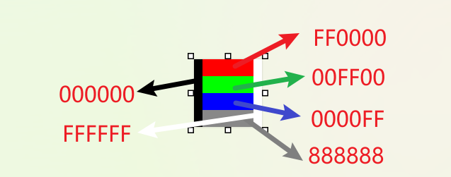

# 参考资料

[BMP图像文件完全解析 - 知乎 (zhihu.com)](https://zhuanlan.zhihu.com/p/260702527)

# 测试文件

文件大小为8*8，保存格式为24色，

每行的开头都为000000的黑色，结尾为ffffff的白色，方便判断行开头与行结尾

# 文件格式

- 文件标识：类似于class文件的cafebabe，bmp文件开头为ascii编码的BM，也就是424d
- 文件大小：从02字节到05字节为文件大小，且为小端字节序，测试文件中为000000f6，也就是246，单位为字节
- 保留位，无意义：06-09字节
- 图像开始位置：0A-0D字节，表示图像像素开始位置，这里可以看到是00000036，刚好是我们做了标识的纯黑色开头，只不过上下是颠倒的
- 图像头大小：0D-11字节，标识头的大小，测试文件中是0x28，也就是40个字节
- 图像宽高：紧挨着的4字节为图像宽度，再往后4字节为图像高度，这里都是8，注意图像的高度和宽度是有正负之分的，当高度为正数时，图像的存储方式为从下到上
- 颜色平面数：2字节 恒为1
- 每个像素的位数：2字节 其值可为1，4，8，16，24，32，24位为常见的RGB，32位则多了arpha通道
- 压缩方式：4字节，全为0为不压缩
- 原始图像大小：4字节，这里为196，也就是去掉图像头以及前面所有内容的纯像素内容
- 分辨率：缺省为0，4个字节的水平分辨率与4个字节的垂直分辨率
- 调色板颜色数：4字节，为0意为不使用调色板
- 重要颜色：4字节，为0则意为都重要
- 像素数据：从这里开始则为图像的像素数据，注意是倒着的（小端字节序），BGR，但如果有alpha通道则为 bgra
- 填充：为保证读取速度，会在bmp文件末尾进行字节填充以保证整个文件大小为4字节的倍数，但不填充貌似也可以，比如windows自带的画图工具在生成24色位图时就不会进行填充，但ps会填充

