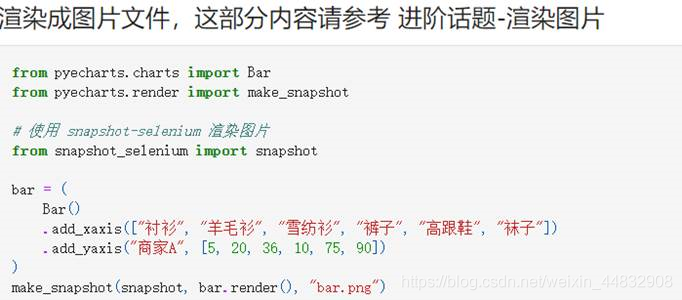
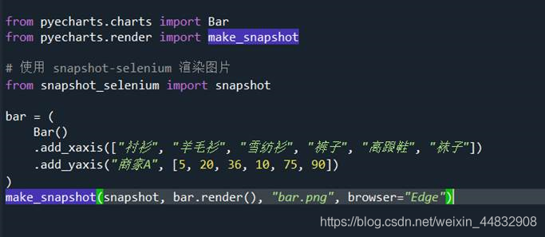

# pyecharts渲染成图片

snapshot-selenium 是 pyecharts + selenium 渲染图片的扩展，使用 selenium 需要配置 browser driver，这部分可以参考 selenium-python 相关介绍，推荐使用 Chrome 浏览器，可以开启 headless 模式。目前支持 Chrome, Safari

由于个人用的浏览器是edge，但selenium-python不支持edge，所以做了如下配置：
1. 下载edge web driver：https://developer.microsoft.com/en-us/microsoft-edge/tools/webdriver/
2. 将解压得到的文件放入一个文件夹中，将其中的exe文件重命名为MicrosoftWebDriver.exe, 然后将此文件夹放入path环境变量
3. 对snapshot源码做一点修改，添加edge相关的配置，期间通过查看webdriver的init文件得知获取edge浏览器驱动的方法为webdriver.Edge()：
	

4. 传入browser参数：
	

5. 运行结果
	

