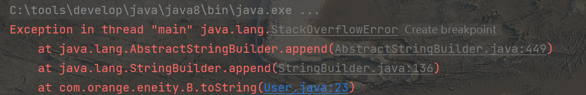

#  JSON

多以fastjson为例

**注意：jdk1.8之前的版本（不包括1.8）需要使用fastjson 1.*的版本，与其后版本不兼容**

## json字符串转为json对象

一个将json字符串转为json对象并将其中的json数组取出并处理的例子

```java
	// 将json字符串转为json对象
    JSONObject originalJsonObject = JSONObject.parseObject(originalJsonString);
    // 获取json数组
    JSONArray array = originalJsonObject.getJSONArray("jsonArray");
    // 遍历处理
    JSONArray targetArray = new JSONArray();
    for (int i = 0; i < array.size(); i++) {
        JSONObject jsonObject = array.getJSONObject(i);
        JSONObject targetJsonObject = getTargetJsonObject(jsonObject);
        targetArray.add(targetJsonObject);
    }
```


## 转义相关

使用fastjson来组装json节点时，如果其中某个节点的值是一个json字符串，在将整个对象转为json字符串后会将该值中的json字符串转义。如下中的orgAttr。

```json
{
  "obj": {
    "orgAttr": "{\"ORD42\":\"String 19\",\"ZHKONT3\":\"String 29\",\"ZKMMS3\":\"String 30\",\"ZHKONT2\":\"String 26\",\"ZKMMS2\":\"String 27\",\"ZHKONT1\":\"String 24\",\"GSBER\":\"String 28\",\"DRFLAG\":\"String 12\",\"ZKMMS1\":\"String 25\",\"SEND_TIME\":\"String 32\",\"ANLKL\":\"String 16\",\"PJTXT\":\"String 11\",\"AFASL\":\"String 21\",\"ZMISTYPE\":\"String 9\",\"ZMISTYPEPRO\":\"String 10\",\"CSKTEXT\":\"String 15\",\"NDPER\":\"String 23\",\"NDJAR\":\"String 22\",\"SEND_DATE\":\"String 31\",\"ANLUE\":\"String 17\",\"KTOGR\":\"String 18\",\"AUFTEXT\":\"String 14\",\"ORD44\":\"String 20\",\"EC_TYPE\":\"String 13\"}",
    "orgCode": "String 8"
  }
}
```

# OKHTTP

## 文件的上传和下载

```java
/**
     * 上传文件
     * @param url
     * @param file
     * @return
     * @throws IOException
     */
    public static boolean upload(String url, File file) {
        // 获取客户端
        OkHttpClient client = okHttpClient;

        // 填充请求体
        RequestBody requestBody = new MultipartBody.Builder()
                // 设置类型为表单
                .setType(MultipartBody.FORM)
                .addFormDataPart("file", file.getName(),
                        RequestBody.create(MediaType.parse("multipart/form-data"), file))
                .build();
        // 建立请求
        Request request = new Request.Builder()
                .header("Authorization", "ClientID" + UUID.randomUUID())
                .url(url)
                .post(requestBody)
                .build();
        // 执行请求
        Response response = null;
        try {
            response = client.newCall(request).execute();
        } catch (IOException e) {
            return false;
        }

        if (!response.isSuccessful()) {
            return false;
        }
        return true;
    }
    /**
     * 下载文件
     * @param url
     * @param file
     * @return
     * @throws IOException
     */
    public static Boolean download(String url, File file) {
        // 获取客户端
        OkHttpClient client = okHttpClient;
        Request request = new Request.Builder()
                .get()
                .url(url)
                .build();
        Call call = okHttpClient.newCall(request);
        // 执行请求
        Response response = null;
        try {
            response = client.newCall(request).execute();
        } catch (IOException e) {
            return false;
        }
        if (response.isSuccessful()){
            InputStream inputStream = Objects.requireNonNull(response.body()).byteStream();
            FileOutputStream fileOutputStream = null;
            try {
                fileOutputStream = new FileOutputStream(file);
            } catch (FileNotFoundException e) {
                return false;
            }
            try {
                byte[] buffer = new byte[2048];
                int len;
                while ((len = inputStream.read(buffer)) != -1) {
                    fileOutputStream.write(buffer, 0, len);
                }
                fileOutputStream.flush();
            } catch (IOException e) {
                return false;
            }
        }else{
            // 响应不成功
            return false;
        }
        return true;
    }
```


# Fegin

## Fegin传输文件MultipartFile

### 上传文件

报错org.springframework.web.multipart.MultipartException:Current request is not a multipart request

the request was rejected because no multipart boundary was found

在feign中，发送 multipartfile文件，应该使用【@RequestPart】而不是【@RequestParam】，且需要设置请求content-type为【multipart/form-data】

解决:

```java
@ApiOperation("上传一个文件")
@RequestMapping(value = "/file/uploadfile", method = RequestMethod.POST, consumes = MediaType.MULTIPART_FORM_DATA_VALUE)
public CommonResult fileupload(@RequestPart MultipartFile uploadfile, @RequestParam String bucket,
                               @RequestParam(required = false) String objectName);
```

其中 consumes = MediaType.MULTIPART_FORM_DATA_VALUE 解决"Current request is not a multipart request"

@RequestPart MultipartFile uploadfile 解决"the request was rejected because no multipart boundary was found"


### 下载文件

feignClient：

```java
@ApiOperation("下载一个文件")
    @RequestMapping(value = "/file/downloadFile", method = RequestMethod.GET)
    public Response downloadFile(@RequestParam String bucket, @RequestParam String objectName);
```

注意返回值不是void而是一个feign包中的Response类

controller:

```java
 Response feignResponse = fileService.downloadFile(BUCKET_NAME,objectName);
InputStream inputStream = feignResponse.body().asInputStream();
```

# SpringBoot系列

## 默认包扫描

springboot默认扫描启动类所在包以及其下的包,如果引入了另一个项目,但是零一项目中组件所在的包的包名在以上范围,则可扫描成功.

如果另一项目中所需组件不在该范围,可在启动类上进行配置

需要注意,配置扫描别的包,默认配置会失效,所以注意要把当前包加上

```java
@SpringBootApplication(scanBasePackages = {"com.orrangee","com.orange"})
```

## 自定义一个starter

可以实现自动配置,其实就是把别的项目中的bean自动装配进来

这里需要理解spring的自动装配原理

[SpringBoot 自动装配原理详解 | JavaGuide(Java面试+学习指南)](https://javaguide.cn/system-design/framework/spring/spring-boot-auto-assembly-principles.html#autoconfigurationimportselector-加载自动装配类)

首先,springboot在启动时会扫描外部引用jar包中的**META-INF/spring.factories**文件

> org.springframework.core.io.support.SpringFactoriesLoader#loadSpringFactories用于加载所有的META-INF/spring.factories文件


以如下作为父项目以控制版本

```xml
 <parent>
        <groupId>org.springframework.boot</groupId>
        <artifactId>spring-boot-starter-parent</artifactId>
        <version>2.6.11</version>
        <relativePath/> <!-- lookup parent from repository -->
    </parent>
```

引入依赖:

```xml
<dependency>
    <groupId>org.springframework.boot</groupId>
    <artifactId>spring-boot-starter</artifactId>
</dependency>
```

这里复制一波条件选择

- `@ConditionalOnBean`：当容器里有指定 Bean 的条件下
- `@ConditionalOnMissingBean`：当容器里没有指定 Bean 的情况下
- `@ConditionalOnSingleCandidate`：当指定 Bean 在容器中只有一个，或者虽然有多个但是指定首选 Bean
- `@ConditionalOnClass`：当类路径下有指定类的条件下
- `@ConditionalOnMissingClass`：当类路径下没有指定类的条件下
- `@ConditionalOnProperty`：指定的属性是否有指定的值
- `@ConditionalOnResource`：类路径是否有指定的值
- `@ConditionalOnExpression`：基于 SpEL 表达式作为判断条件
- `@ConditionalOnJava`：基于 Java 版本作为判断条件
- `@ConditionalOnJndi`：在 JNDI 存在的条件下差在指定的位置
- `@ConditionalOnNotWebApplication`：当前项目不是 Web 项目的条件下
- `@ConditionalOnWebApplication`：当前项目是 Web 项 目的条件下

整体配置类

```java
@Configuration
public class DrinkerConfiguration {
    /**
     * ConditionOnProperty用于控制该Bean是否引入
     * starter.orange是前缀
     * enabled是值的key
     * 在引用项目中这样配置
     * starter.orange.enabled=false
     * 这里会判断enabled的值,如果说true,则进行装载,否则不装载
     * matchIfMissing是默认,这里默认true,也就是默认装载
     * @return
     */
    @Bean
    @ConditionalOnProperty(prefix = "starter.orange",value = "enabled", matchIfMissing = true)
    public Drinker drinker(){
        return new Drinker("milker");
    }
}

```

一个测试的实体类

```java
public class Drinker {
    private String name;

    public Drinker(String name) {
        this.name = name;
    }

    public void drink(){
        System.out.println("drinker "+name+" is drinking");
    }
}
```


spring.factories配置

```properties
org.springframework.boot.autoconfigure.EnableAutoConfiguration=\
com.starter.orange.DrinkerConfiguration
```

其中第一行表示下面的配置是配置类

第二行是要装载的配置

**测试**

```java
@Autowired(required = false)
Drinker drinker;
@GetMapping("/getA")
public String a(){
    drinker.drink();
    return "hello";
}
```

```
drinker milker is drinking
```

成功加载

## FeignClient

1. 依赖

2. ```java
   @FeignClient(value = "orange-frame-rbac")
   ```

3. ```
   @EnableFeignClients
   ```

# 自适应ContentType

微信小程序需要根据下载文件接口返回的ContenType请求头来解析文件

```java
// 根据下载的文件名后缀获取文件类型
        Optional<MediaType> mediaType = MediaTypeFactory.getMediaType(objectName);
        String contentType = mediaType.orElse(MediaType.APPLICATION_OCTET_STREAM).toString();
        response.setContentType(contentType);
```

# http 401

碰到一种情况,使用postman可以正常调用的一个接口, 在代码中使用okhttp调用时,出现了401的问题,最后将请求地址改为https协议(之前是http)后,访问成功,经过资料查找,认为应该是如下原因:

**有防御性的安全策略**

简单来说就是， 来自一个知名浏览器的 HTTP 通讯是允许的， 但来自其他系统的自动通讯则被拒绝， 并生成 401 错误代码。这是一种异常情况， 但是也许表明您的 Web 服务器周围 采取了非常具有防御性的安全策略。

# java中对象的相互引用问题

在java中是允许对象之间的相互引用的,如:

```java
@Data
class A{
    B b;
}
@Data
class B{
    A a;
}
public static void main(String[] args) {
        A a = new A();
        B b = new B();
        a.b = b;
        b.a = a;
        // System.out.println(a);
}
```

相互引用是没问题的,但如果要对其进行序列化, 如使用lombok+sout,或者使用json工具将其中一个对象序列化时,便会因为递归次数太多而发生stackoverflow异常



所以在使用序列化时,需要注意该对象内有无递归引用

# nginx

## 配置文件编码格式问题

Nginx:[emerg] unknown directive ” ” in/usr/local/nginx/conf/nginx.conf:3

有可能是配置文件的编码格式变成了bom utf-8，需要改回utf-8

# 方法的重写

静态方法不可被重写

允许的是：在子类中定义一个与父类中同名的静态方法，但当指定一个子类实例赋值给父类变量时，调用该变量的静态方法，执行还是父类中的静态方法

# sql

mysql中delete语句可以使用别名

方法为：

```sql
delete r from role r WHERE r.id=5
```


# java调用python

```java
@RestController
public class CallPythonController {
    @RequestMapping("/call")
    public String call(@RequestParam int a,@RequestParam int b){
        StringBuilder stringBuilder = new StringBuilder();

        try {
            String[] args1 = new String[] { "py", "E:\\my_file\\study\\java_invoke_python\\testPy.py", String.valueOf(a), String.valueOf(b) };
            Process proc = Runtime.getRuntime().exec(args1);// 执行py文件
            BufferedReader in = new BufferedReader(new InputStreamReader(proc.getInputStream()));
            String line = null;
            while ((line = in.readLine()) != null) {
                System.out.println(line);
                stringBuilder.append(line);
            }
            in.close();
            proc.waitFor();
        } catch (IOException e) {
            e.printStackTrace();
        } catch (InterruptedException e) {
            e.printStackTrace();
        }finally {
            return stringBuilder.toString();
        }
    }
}
```

```python
import sys
 
def func(a,b):
    return (a+b)
 
if __name__ == '__main__':
    a = []
    for i in range(1, len(sys.argv)):
        a.append((int(sys.argv[i])))
 
    print(func(a[0],a[1]))
```

# lambda

lambda表达式中不允许使用非final的变量

或者引用非final变量之后不允许对其值做修改

>Variable used in lambda expression should be final or effectively final

# Maven

maven编译会将resource中的内容编译到target中的classes下的根目录

但默认不会将java文件夹中的非java文件编译

# 线程不安全问题

2023/4/3

在一个项目中，有个job服务，还有一个业务服务A

在job服务中通过feign远程去调用A中的一个方法，该方法会进行数据库的更新操作

该更新操作步骤为

删除旧数据->插入新数据

问题:

A中的该业务用时很长,导致job这边feign中超时,feign采取了重试操作,重新发送了一次请求

导致实际上第一次业务线程还没有跑完,但第二次业务开始,第二次业务会删除第一次业务已经插入的数据,但接下来两次业务会同时进行,导致数据库中的数据为第一次业务插入的数据与第二次插入的数据.

解决:

将业务代码抽离到service层中,添加synchronized关键字

# 带T和+08:00格式的时间转换

```java
String origin = "2023-04-06T13:57:00.029+08:00";
LocalDateTime date = LocalDateTime.parse(origin, DateTimeFormatter.ISO_OFFSET_DATE_TIME);
Instant instant = date.toInstant(java.time.ZoneOffset.UTC);
// 获取时间戳
long timestamp = instant.toEpochMilli();
// format
date.format(DateTimeFormatter.ofPattern("yyyy-MM-dd HH:mm:ss.SSS"));
```

# MySql8崩溃

服务器打了补丁后，MySql启动没有问题，但是只要系统向数据库发送请求，数据库就会崩溃，经过日志查询（默认日志位置：C:\ProgramData\MySQL\MySQL Server 8.0\Data\计算机名.error），发现日志中有如下记录

```
2023-06-15T13:25:16.093814Z 0 [ERROR] [MY-012611] [InnoDB] Operating system error number 995 in a file operation.
2023-06-15T13:25:16.094655Z 0 [ERROR] [MY-012617] [InnoDB] The error means that the I/O operation has been aborted because of either a thread exit or an application request. Retry attempt is made.
2023-06-15T13:25:16.196155Z 0 [ERROR] [MY-012611] [InnoDB] Operating system error number 995 in a file operation.
2023-06-15T13:25:16.196181Z 0 [ERROR] [MY-013183] [InnoDB] Assertion failure: os0file.cc:3776:ret || GetLastError() != ERROR_IO_PENDING thread 3300
2023-06-15T13:25:16.196690Z 0 [ERROR] [MY-012617] [InnoDB] The error means that the I/O operation has been aborted because of either a thread exit or an application request. Retry attempt is made.
InnoDB: We intentionally generate a memory trap.
InnoDB: Submit a detailed bug report to http://bugs.mysql.com.
InnoDB: If you get repeated assertion failures or crashes, even
InnoDB: immediately after the mysqld startup, there may be
InnoDB: corruption in the InnoDB tablespace. Please refer to
InnoDB: http://dev.mysql.com/doc/refman/8.0/en/forcing-innodb-recovery.html
InnoDB: about forcing recovery.
13:25:16 UTC - mysqld got exception 0x16 ;
Most likely, you have hit a bug, but this error can also be caused by malfunctioning hardware.
Thread pointer: 0x0
Attempting backtrace. You can use the following information to find out
where mysqld died. If you see no messages after this, something went
terribly wrong...
2023-06-15T13:25:16.298720Z 0 [ERROR] [MY-013183] [InnoDB] Assertion failure: os0file.cc:3776:ret || GetLastError() != ERROR_IO_PENDING thread 3312
InnoDB: We intentionally generate a memory trap.
InnoDB: Submit a detailed bug report to http://bugs.mysql.com.
InnoDB: If you get repeated assertion failures or crashes, even
InnoDB: immediately after the mysqld startup, there may be
InnoDB: corruption in the InnoDB tablespace. Please refer to
InnoDB: http://dev.mysql.com/doc/refman/8.0/en/forcing-innodb-recovery.html
InnoDB: about forcing recovery.
7ff7811cfd48    mysqld.exe!?my_print_stacktrace@@YAXPEBEK@Z()
7ff78040004b    mysqld.exe!?print_fatal_signal@@YAXH@Z()
7ff7803ffe13    mysqld.exe!?my_server_abort@@YAXXZ()
7ff7811b643a    mysqld.exe!?my_abort@@YAXXZ()
7ff7813ec579    mysqld.exe!??$endl@DU?$char_traits@D@std@@@std@@YAAEAV?$basic_ostream@DU?$char_traits@D@std@@@0@AEAV10@@Z()
7ff78133bd51    mysqld.exe!?set_compression_level@Zstd_comp@compression@transaction@binary_log@@UEAAXI@Z()
7ff78133d5da    mysqld.exe!?set_compression_level@Zstd_comp@compression@transaction@binary_log@@UEAAXI@Z()
7ff78133c7da    mysqld.exe!?set_compression_level@Zstd_comp@compression@transaction@binary_log@@UEAAXI@Z()
7ff78135e3f4    mysqld.exe!??$endl@DU?$char_traits@D@std@@@std@@YAAEAV?$basic_ostream@DU?$char_traits@D@std@@@0@AEAV10@@Z()
7ff7813ae091    mysqld.exe!??$endl@DU?$char_traits@D@std@@@std@@YAAEAV?$basic_ostream@DU?$char_traits@D@std@@@0@AEAV10@@Z()
7ff7813ab7b4    mysqld.exe!??$endl@DU?$char_traits@D@std@@@std@@YAAEAV?$basic_ostream@DU?$char_traits@D@std@@@0@AEAV10@@Z()
7fff9f85fb80    ucrtbase.dll!_o__realloc_base()
7fffa22784d4    KERNEL32.DLL!BaseThreadInitThunk()
7fffa26a1791    ntdll.dll!RtlUserThreadStart()
The manual page at http://dev.mysql.com/doc/mysql/en/crashing.html contains
information that should help you find out what is causing the crash.
13:25:16 UTC - mysqld got exception 0x16 ;
Most likely, you have hit a bug, but this error can also be caused by malfunctioning hardware.
Thread pointer: 0x0
Attempting backtrace. You can use the following information to find out
where mysqld died. If you see no messages after this, something went
terribly wrong...
7ff7811cfd48    mysqld.exe!?my_print_stacktrace@@YAXPEBEK@Z()
7ff78040004b    mysqld.exe!?print_fatal_signal@@YAXH@Z()
7ff7803ffe13    mysqld.exe!?my_server_abort@@YAXXZ()
7ff7811b643a    mysqld.exe!?my_abort@@YAXXZ()
7ff7813ec579    mysqld.exe!??$endl@DU?$char_traits@D@std@@@std@@YAAEAV?$basic_ostream@DU?$char_traits@D@std@@@0@AEAV10@@Z()
7ff78133bd51    mysqld.exe!?set_compression_level@Zstd_comp@compression@transaction@binary_log@@UEAAXI@Z()
7ff78133d5da    mysqld.exe!?set_compression_level@Zstd_comp@compression@transaction@binary_log@@UEAAXI@Z()
7ff78133c7da    mysqld.exe!?set_compression_level@Zstd_comp@compression@transaction@binary_log@@UEAAXI@Z()
7ff78135e3f4    mysqld.exe!??$endl@DU?$char_traits@D@std@@@std@@YAAEAV?$basic_ostream@DU?$char_traits@D@std@@@0@AEAV10@@Z()
7ff7813ae091    mysqld.exe!??$endl@DU?$char_traits@D@std@@@std@@YAAEAV?$basic_ostream@DU?$char_traits@D@std@@@0@AEAV10@@Z()
7ff7813ab7b4    mysqld.exe!??$endl@DU?$char_traits@D@std@@@std@@YAAEAV?$basic_ostream@DU?$char_traits@D@std@@@0@AEAV10@@Z()
7fff9f85fb80    ucrtbase.dll!_o__realloc_base()
7fffa22784d4    KERNEL32.DLL!BaseThreadInitThunk()
7fffa26a1791    ntdll.dll!RtlUserThreadStart()
The manual page at http://dev.mysql.com/doc/mysql/en/crashing.html contains
information that should help you find out what is causing the crash.
```

感觉其中**Operating system error number 995 in a file operation.**的部分应该是主要原因。

[MySQL - innodb - ERROR 995: InnoDB: Operating system error number 995 in a file operation (mysqlab.net)](http://www.mysqlab.net/knowledge/kb/detail/topic/innodb/id/8402)


查询资料后，感觉可能是缓冲池的原因，接着查看数据库缓冲池配置，发现大小为8M，偏小，于是改为128M，启动之后，系统访问数据库，数据库正常运行。


# jar包加密

[core-lib/xjar: Spring Boot JAR 安全加密运行工具，支持的原生JAR。 (github.com)](https://github.com/core-lib/xjar)

# String split

string在split的时候如果分割字符为竖杠‘|’或者别的正则表达式字符，需要进行转义

```java
str.split("\\|")
```

# jar包指定主类

修改Manifest文件中的 Main-Class: 主类全类名，注意是类名而不是文件名

```yml
Manifest-Version: 1.0
Main-Class: UserInfoFactory
```

# 一个maven项目中存在多个main方法指定运行主类

```xml
<build>
        <plugins>
            <plugin>
                <groupId>org.apache.maven.plugins</groupId>
                <artifactId>maven-shade-plugin</artifactId>
                <version>2.3</version>
                <executions>
                    <execution>
                        <phase>package</phase>
                        <goals>
                            <goal>shade</goal>
                        </goals>
                        <configuration>
                            <transformers>
                                <transformer implementation="org.apache.maven.plugins.shade.resource.ManifestResourceTransformer">
                                    <mainClass>com.boranget.Main</mainClass>
                                </transformer>
                            </transformers>
                        </configuration>
                    </execution>
                </executions>
            </plugin>
        </plugins>
    </build>
```

# java日期格式化的时候设置时区

```java
public static void main(String[] args) {
    final SimpleDateFormat simpleDateFormat = new SimpleDateFormat("yyyy-MM-dd 'T' HH:mm:ss Z");
    simpleDateFormat.setTimeZone(TimeZone.getTimeZone("America/Los_Angeles"));
    System.out.println(
            simpleDateFormat
                    .format(new Date(System.currentTimeMillis()))
    );
}
```

除Asia/Shanghai之外还可以使用Etc或者UTC时区

# 循环依赖问题

springboot最新版本禁止循环依赖

循环依赖场景比如:

Aservice中注入了Bservice

故建议注入BMapper而不是Bservice

# 非ie浏览器向ie跳转打开了edge

其他浏览器使用ietab会直接跳到edge，edge中设置“让ie在microsoft edge中打开网站”为“从不”可以直接打开ie浏览器

# tomcat url字符

参考：https://blog.csdn.net/qq_41024101/article/details/106413102

```
13-Oct-2023 14:22:31.449 INFO [http-nio-80-exec-4] org.apache.coyote.http11.Http11Processor.service Error parsing HTTP request header
 Note: further occurrences of HTTP header parsing errors will be logged at DEBUG level.
	java.lang.IllegalArgumentException: Invalid character found in the request target. The valid characters are defined in RFC 7230 and RFC 3986
		at org.apache.coyote.http11.Http11InputBuffer.parseRequestLine(Http11InputBuffer.java:483)
		at org.apache.coyote.http11.Http11Processor.service(Http11Processor.java:682)
		at org.apache.coyote.AbstractProcessorLight.process(AbstractProcessorLight.java:66)
		at org.apache.coyote.AbstractProtocol$ConnectionHandler.process(AbstractProtocol.java:810)

```

这时由于新版tomcat对URL中可以出现的字符做了限制，会严格按照对RFC 3986规范进行访问解析。

 RFC 3986规范定义了Url中只允许包含英文字母（a-zA-Z）、数字（0-9）、-_.~4种特殊字符以及所有保留字符(RFC3986中指定了以下字符为保留字符：! * ’ ( ) ; : @ & = + $ , / ? # [ ])。而我们的系统在通过地址传参时，在url中传了一段参数包含有有不在RFC3986中的保留字段中，所以会报这个错。

- 换低版本的tomcat (tomcat 7.0.76之前的版本不会出现这个问题)

- 修改tomcat目录底下的/conf/catalina.properties配置文件

    查看catalina.properties文件中是否存在着下面这句话，没有就不用尝试了，说明这个版本不支持。

    ```cobol
    ＃tomcat.util.http.parser.HttpParser.requestTargetAllow=|
    ```

    如果存在上面这句话就可以尝试去除#来开启该配置，然后在后面添加URL中可能会出现的非保留字符

    ```cobol
    tomcat.util.http.parser.HttpParser.requestTargetAllow=|{}-
    ```

    注：上面的{}-就是你填入想要非保留字符。

    上面这种做法应该在tomcat7.076、tomcat8.042、tomcat8.512之后这些子版本才支持。tomcat9.022版本不支持（原作者测试）

- 修改tomcat目录底下的/conf/server.xml 

     打开tomcat目录底下/conf/server.xml

     往Connector中添加relaxedQueryChars和relaxedPathChars，这里也是设置允许的字符

     ```xml
     <Connector port="xxx" relaxedQueryChars="[]|{}-^&#x60;&quot;&lt;&gt;"relaxedPathChars="[]|{}-^&#x60;&quot;&lt;&gt;"
     ```

     ```cobol
     注：其中的&#x60; &quot; &lt; &gt;   分别代表  \  `   <  >   四种符号
     ```

     第三种方法用tomcat9.022版本亲测是成功的。

- tomcat6 (6.0.51，6.0.48)也会出现这个问题，是因为CVE-2017-5647这个漏洞，似乎无法解决。

# mysql时间戳与java时间戳的转换

mysql的时间戳为10位数字而java中时间戳为13位数字

这是因为mysql时间戳中不保存毫秒精度的值

故mysql时间戳转java时间戳可通过*1000实现，相反可通过/1000实现

# postman get请求可以带body

不只是postman，其实http协议本身就没有限制get请求带body，除此之外post请求也可以带query

# postman调用webservice服务

使用post方式

- 请求地址为soupui解析出的地址（非wsdl地址）
- 请求体为xml完整报文
- 请求头content-type设为application/xml
- 其余认证等

# FastJSON反序列化列表出错

报错：

```
Exception in thread "main" com.alibaba.fastjson2.JSONException: illegal input， offset 647, char [
	at com.alibaba.fastjson2.JSONReader.read(JSONReader.java:2043)
	at com.alibaba.fastjson2.reader.ObjectReaderImplMap.readObject(ObjectReaderImplMap.java:434)
	at com.alibaba.fastjson2.reader.ORG_2_12_TicketsDto.readObject(Unknown Source)
	at com.alibaba.fastjson2.reader.ORG_1_4_TicketsQueryRespDto.readObject(Unknown Source)
	at com.alibaba.fastjson2.JSON.parseObject(JSON.java:726)
	at com.alibaba.fastjson2.JSONObject.parseObject(JSONObject.java:1987)
	at FastJsonTest.main(FastJsonTest.java:145)
```

原因：实体类中List使用了泛型接收

```java
  /**容联返回工单数据*/
    private List<TicketsDto> data;
```

解决：去掉泛型声明

```java
 private List data;
```

根本原因是该List属性的set方法上不能加泛型

# 服务停止脚本

```shell
@echo off
set port=9001
for /f "tokens=1-5" %%i in ('netstat -ano^|findstr ":%port%"') do (
 echo kill the process %%m who use the port 
 taskkill /pid %%m -t -f
 goto q
)
:q
```

> 这是一个批处理（Batch）脚本，主要用来查找并终止使用特定端口的进程。我们可以逐行解释这个脚本：
>
> 1. `@echo off`: 关闭命令的回显，这样在执行脚本时不会显示命令本身。
> 2. `set port=9001`: 设置变量`port`的值为9001，这是你要查找和终止进程使用的端口号。
> 3. `for /f "tokens=1-5" %%i in ('netstat -ano^|findstr ":%port%"') do (`: 这是一个for循环，它使用`netstat -ano`命令来获取当前系统所有打开的网络连接和监听的端口，然后通过`findstr ":%port%"`筛选出使用特定端口的行。
>     - `netstat -ano`：这是一个Windows命令，用于显示所有网络连接和端口。
>     - `findstr ":%port%"`：这是Windows的findstr命令，用于在文本中查找包含特定文本的行。这里它查找包含端口号的行。
>     - `tokens=1-5`：这是一个for循环的选项，表示将每行的内容分割成5个部分，并用这些部分填充变量`%%i`、`%%j`、`%%k`、`%%l`和`%%m`。
> 4. `echo kill the process %%m who use the port`: 显示一条消息，指出要终止的进程ID（PID）。
> 5. `taskkill /pid %%m -t -f`: 使用`taskkill`命令终止特定的进程。这是终止进程的命令。
>     - `/pid %%m`：指定要终止的进程ID。
>     - `-t`：关闭所有使用该进程的窗口。
>     - `-f`：强制关闭进程。
> 6. `goto q`: 跳转到标签`q`。在批处理脚本中，`goto`命令用于跳转到指定的标签。
> 7. `:q`: 这是标签`q`，表示脚本的结束。在批处理脚本中，标签是以`:`开头的。
>
> 这个脚本的目的是找到并终止使用端口9001的所有进程。不过要注意，使用强制关闭选项（-f）可能会导致数据丢失或其他问题，因此在使用时需要谨慎。

# java获取resources文件夹/jar包中的内容

maven项目resources中的内容打包后会存放在jar包根目录，获得其内容的方法是使用class

```java
// 获取resources中的init目录URL
final String init = Oexsder.class.getResource("/init").getFile();
```

但获取到的url也无法通过该路径读入jar包中的文件，也无法获取jar下文件夹的list，所以这里应该指定文件名并且直接获取文件输入流。

```java
inputStream = Oexsder.class.getResourceAsStream(sourceFileName);
```

# IDEA迁移项目显示Maven未安装

idea项目位置从一个位置直接拖动到另一个位置后用idea打开，在进行maven生命周期执行时提示maven未安装，查看idea中的maven设置，发现设置的maven位置变了

原因猜测：idea在索引maven位置时使用的是相对路径，项目路径变化后仍然使用相对路径计算maven路径导致项目错误

解决方法：删除项目中的.idea文件夹，重新导入项目，项目模块需要重新导入，非maven、gradle、eclipse项目选择Create module from exiting sources

# Invalid value'factoryBeanObjectType':String

springboot启动报错Invalid value type for attribute 'factoryBeanObjectType': java.lang.String

参考：[Invalid value type for attribute 'factoryBeanObjectType': java.lang.String · Issue #31247 · spring-projects/spring-framework (github.com)](https://github.com/spring-projects/spring-framework/issues/31247)

原因是springboot与springcloud版本不匹配

>I just ran into this issue and I found a fix (at least for my case).
>Eventually, while trying to find the issue, I got the log message that Spring Cloud 2022.0.XX is not compatible with Spring Boot 3.2.XX.
>
>I upgraded Spring Cloud to 2023.0.0-RC1 (available since 02.11.2023, see https://spring.io/blog/2023/11/02/spring-cloud-2023-0-0-rc1-aka-leyton-is-now-available) and my issue was fixed.
>
>I hope that helps someone.

解决：更换匹配版本的springboot或者springcloud

# 远程桌面剪贴板不生效

- 检查rdp剪贴板服务，尝试重启
- 连接时选择远程桌面资源：本地剪贴板

# Shell

## 延时操作

延时两秒

```ba
timeout /t 2
```