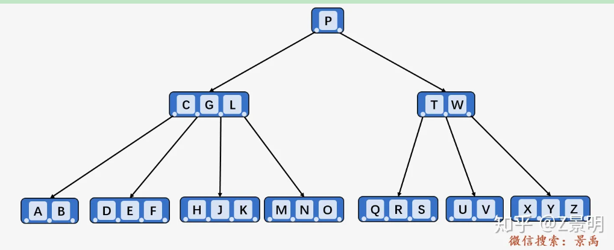

# 参考资料

[树（数据结构名词）_百度百科 (baidu.com)](https://baike.baidu.com/item/树/2699484?fromModule=lemma_sense-layer#viewPageContent)

[图解：什么是B树？（心中有 B 树，做人要虚心）一文读懂B-树 - 知乎 (zhihu.com)](https://zhuanlan.zhihu.com/p/146252512)

[B树详解与实现 - 知乎 (zhihu.com)](https://zhuanlan.zhihu.com/p/463641767)

[(53条消息) B树、B-树、B+树、B*树介绍_Zzzzzzzz_hu的博客-CSDN博客](https://blog.csdn.net/A_zhangq/article/details/99662693)

[图解：什么是红黑树？ - 知乎 (zhihu.com)](https://zhuanlan.zhihu.com/p/273829162)

[P9 3 3 1 Balanced Search Trees Red Black BSTs Coursera_哔哩哔哩_bilibili](https://www.bilibili.com/video/BV14z4y1U7uQ/?p=43)


# 树

## 概念

- 单节点是一棵树，树根为其本身
- 空集合成为空树，空树没有节点
- 一个节点含有的子树的根节点称为该节点的子节点
- 一个节点含有的子节点个数称为该节点的度
- 度为0的节点称为叶节点或终端节点
- 度不为0的节点称为非终端节点或分支节点
- 父节点也称双亲节点
- 一棵树中最大的节点度称为树的度
- 节点的层次为其父节点的层次+1，根节点为第一层
- 树的高度或深度为树中最大的节点层次
- 多棵互不相交的树称为森林

## 种类

- 无序树

  树中任意节点的子节点之间没有顺序关系

- 有序树

  书中任意节点的子节点之间有顺序关系

- 二叉树

  度为2的树，每个节点最多有两个字数

- 满二叉树

  每个分支节点都有两个子树

- 完全二叉树

  除最后一层外，所有层都是满节点，且最后一层左侧节点连续

- 哈夫曼树

# 二叉搜索树

**BST**

从根节点开始，若节点关键字与查询关键字相等，则查询成功，否则，若查询关键字小于节点关键字，进入该节点的左子树，若查询关键字大于节点关键字，则进入节点右子树。

问题在于，在多次的插入删除过程后，二叉树会变成一个线性的结构，使得查询效率降低，如何让二叉树左右子树尽量保持平衡，便是平衡问题。

# B树/B-树



B树就是B-树

- 首先要明确一个概念：最小度数 t
- 在B树中，每个节点包含的关键字有上界和下界，由最小度数 t 决定：除根节点外，每个内部节点（非叶子节点）都至少要有t-1个关键字，而包括根节点每个节点最多包含2t-1个关键字。
- 阶数 m=2t，表示内部节点最多可以有的子节点 数量，也就是最大度，至少要有m/2（上取整）个子节点（根除外）
- 通常使用阶数命名B树：最少子节点数-最大节点数 树 如 5阶B树：5/2-5 树 也就是 3-5 树，4阶B树：2-4树或者2-3-4树
- 一个包含x个关键字的节点有x+1个孩子
- 一个节点中的所有关键字升序排列，两个关键字k1，k2之间的孩子节点范围为(k1, k2)
- 搜索过程每到达一个节点需要做多路选择，而二叉搜索树一般是”非左即右“的二路选择
- 也有另一种概念：内部节点：包含键的节点，外部节点：不携带信息的节点，也叫空链接、空节点（叶子节点的子节点就是空节点）

其结构为

```c++
int *keys; // 存储关键字的数组
int t;  // 最小度 (定义一个结点包含关键字的个数 t-1 <= num <= 2t -1) 
BTreeNode **C; // 存储孩子结点指针的数组
int n;  // 记录当前结点包含的关键字的个数
bool leaf; // 叶子结点的一个标记，如果是叶子结点则为true,否则false
```

## 查找

从根开始，递归向下进行查找。这里假设查找的关键字为k，对于每一个非叶子节点，若当前节点包含关键字k，则返回当前节点指针，否则，进入当前节点可能包含k的子节点，递归查找。

若当前节点为叶子节点且没有找到k，说明该关键字不存在，返回null。

其中，在选择合适范围时，对于关键字k，则其应在当前节点中小于k的关键字和大于k的关键字之间。且由于B树节点中关键字是有序的，可从左向右依次比较。

这里给出代码

```c++
BTreeNode *BTreeNode::search(int k) 
{ 
 // 寻找第一个不小于k的关键字的下标
 int i = 0; 
 while (i < n && k > keys[i]) 
 {
     i++;   
 }
 // 如果该关键字等于 k，返回结点指针 
 if (keys[i] == k) 
 {
     return this;    
 }
 // 如果当前节点已经是叶子节点，但还是没有找到k
 if (leaf == true) 
  return NULL; 
 // 递归访问，由于当前关键字下标为i，而指针数组中下标为i的指针恰好是小于下标为i的关键字的范围
 return C[i]->search(k); 
}
```

## 中序遍历

**就是根在中间的遍历**


中序遍历结果即为

ABCDEFGHJKLMNOPQRSTUVWXYZ

可以看到，中序遍历的结果是符合查找树从小到大排列的

```c++
void BTreeNode::traverse() 
{ 
 // n为当前节点的关键词数
 int i; 
 for (i = 0; i < n; i++) 
 { 
  // 如果当前结点不是叶子结点, 在打印 key[i] 之前, 
  // 先遍历以 C[i] 为根的子树. 
  if (leaf == false) 
   C[i]->traverse(); 
  cout << " " << keys[i]; 
 } 

 // 打印以最后一个孩子为根的子树
 if (leaf == false) 
  C[i]->traverse(); 
} 
```

## 插入

**新的关键字总是被插入到叶子节点**

需要注意由于B树有度数限制，故在插入一个关键字时需要判断当前节点是否已满。

若一节点关键字已满（2k-1），则会对该节点做拆分操作，将该节点中间关键字移动到父节点中，两侧关键字均分给两个新的节点。

步骤为：

- 按照查找方式找到应该将关键字k插入到的位置
- 在查找过程中，若碰到当前节点已满的情况下，则将当前节点进行拆分。这样做的原因是避免在查找到叶子节点的时候进行插入操作时，会因为叶子节点已满而造成回溯拆分（回溯拆分：拆分时，需要将拆分后的根插入到父节点中，若其父节点已满，则会造成父节点的拆分，如此向上。）

```c++
// B-树中插入一个新的结点 k 主函数
void BTree::insert(int k)
{
    // 如果树为空树
    if (root == NULL)
    {
        // 为根结点分配空间
        root = new BTreeNode(t, true);
        root->keys[0] = k; // 插入结点 k
        root->n = 1;       // 更新根结点包含的关键字的个数为 1
    }
    else
    {
        // 当根结点已满，则对B-树进行生长操作
        if (root->n == 2 * t - 1)
        {
     +       // 为新的根结点分配空间
            BTreeNode *s = new BTreeNode(t, false);

            // 将旧的根结点作为新的根结点的孩子
            s->C[0] = root;

            // 将旧的根结点分裂为两个，并将一个关键字上移到新的根结点
            s->splitChild(0, root);

            // 新的根结点有两个孩子结点
            // 确定哪一个孩子将拥有新插入的关键字
            int i = 0;
            if (s->keys[0] < k)
                i++;
            s->C[i]->insertNonFull(k);

            // 新的根结点更新为 s
            root = s;
        }
        else // 根结点未满，调用insertNonFull()函数进行插入
            root->insertNonFull(k);
    }
}

// 将关键字 k 插入到一个未满的结点中
void BTreeNode::insertNonFull(int k)
{
    // 初始化 i 为结点中的最后一个关键字的位置
    int i = n - 1;

    // 如果当前结点是叶子结点
    if (leaf == true)
    {
        // 下面的循环做两件事：
        // a) 找到新插入的关键字位置并插入
        // b) 移动所有大于关键字 k 的向后移动一个位置
        while (i >= 0 && keys[i] > k)
        {
            keys[i + 1] = keys[i];
            i--;
        }

        // 插入新的关键字，结点包含的关键字个数加 1
        keys[i + 1] = k;
        n = n + 1;
    }
    else
    {
        // 找到第一个大于关键字 k 的关键字 keys[i] 的孩子结点
        while (i >= 0 && keys[i] > k)
            i--;

        // 检查孩子结点是否已满
        if (C[i + 1]->n == 2 * t - 1)
        {
            // 如果已满，则进行分裂操作
            splitChild(i + 1, C[i + 1]);

            // 分裂后，C[i] 中间的关键字上移到父结点，
            // C[i] 分裂称为两个孩子结点
            // 找到新插入关键字应该插入的结点位置
            if (keys[i + 1] < k)
                i++;
        }
        C[i + 1]->insertNonFull(k);
    }
}

// 结点 y 已满，则分裂结点 y
// 调用方是父节点，y是需要被分裂的子节点
void BTreeNode::splitChild(int i, BTreeNode *y)
{
    // 创建一个新的结点，节点中关键字数量为 （2t-1-1）/2 = t-1
    BTreeNode *z = new BTreeNode(y->t, y->leaf);
    z->n = t - 1;
	
 
    // 将结点 y 的后 t -1 个关键字拷贝到 z 中
    for (int j = 0; j < t - 1; j++)
        z->keys[j] = y->keys[j + t];

    // 如果 y 不是叶子结点（有子节点），拷贝 y 的后 t 个孩子结点到 z中
    if (y->leaf == false)
    {
        for (int j = 0; j < t; j++)
        {
            z->C[j] = y->C[j + t];
        }
    }

    // 将 y 所包含的关键字的个数也设置为 t -1
    // 这样同时也相当于剪切了，至于为什么是t-1
    // 原节点已满，则关键字个数为2t-1，分裂为两部分且上提一个关键字，则（2t-2）/2
    y->n = t - 1;

    ///////////////////// 插入指针过程 ////////////////////////
    // 给调用当前方法的结点（父节点）的孩子指针数组中的元素移动位置，给拆分出来的的节点腾出位置
    for (int j = n; j >= i + 1; j--)
    {
        C[j + 1] = C[j];
    }

    // 将z放入腾出位置
    C[i + 1] = z;
    ///////////////////// 插入关键字过程 /////////////////////
    // 将所有父结点中比上移的关键字大的关键字后移
    // 找到上移结点的关键字的位置
    for (int j = n - 1; j >= i; j--)
        keys[j + 1] = keys[j];

    // 拷贝 y 的中间关键字到其父结点中
    keys[i] = y->keys[t - 1];

    // 当前结点包含的关键字个数加 1
    n = n + 1;
}
```

## 删除

删除数据项，如果待删除数据项非叶子节点，则与其中序遍历的直接前驱交换数据项，删除当前节点后，直接前驱和当前节点的身份相同。一个非 叶子节点的直接前驱一定是叶子节点，叶子节点上的数据可删除。

删除之后，可能会导致节点所包含数据项小于最小值，需通过旋转和合并解决下溢问题

- 旋转

  在叶子节点上删除数据项后，若当前节点数据项数量已不足最小值，则观察左右兄弟节点，若左兄弟有富余项，则可以左兄弟最大项提到父节点中，将父节点中删除项的直接前驱下降到删除项的节点中，整体来看就像是旋转了一下。

  若左兄弟已无富裕项，则观察右兄弟。若右兄弟有富裕项，则将右兄弟最小项上移到父节点，并将删除项在父节点中的直接后继下移到删除节点中。

  若左右兄弟均无富裕项，则需要进行合并

- 合并

  将删除关键字所在节点，左兄弟，父节点中的直接前驱合并到同一个节点。若其父节点由于数据项下移也出现了数据项小于最小值的情况，则将父节点进行合并操作

```java
@Override
public V remove(K key) {
    Assert.notNull(key);
    // 1.查找键所在节点
    Tuple2<Integer, Node<K, V>> tuple2 = search(key);
    int pos = tuple2.getT1();
    Node<K, V> x = tuple2.getT2();
    Pair<K, V> item = x.items[pos];
    // 2.如果键不存在于树中，结束
    if (item == null || compare(item.getKey(), key) != 0) {
        return null;
    }
    // 3.如果键存在于树中，删除数据项，树包含的数据项数量减1
    size.decrement();
    V oldVal = item.getValue();
    if (x.isLeaf()) {
        // 3.1.如果是叶子节点，直接删除
        x.deleteItem(pos);
    } else {
        // 3.2.如果是非叶节点，与前驱交换数据项，前驱必定为叶子节点
        x = predecessor(x, pos);
    }
    // 4.解决下溢问题
    solveUnderflow(x);
    // 5.返回旧值
    return oldVal;
}

/**
 * 与前驱交换数据项
 *
 * @param x   待删除键的节点
 * @param pos 键的索引位置
 * @return 前驱节点
 */
private Node<K, V> predecessor(Node<K, V> x, int pos) {
    Node<K, V> pred = x.children[pos];
    while (!pred.isLeaf()) {
        pred = pred.children[pred.size];
    }
    // 1.前驱节点中的最后一个数据项即为前驱
    int swapIndex = pred.size - 1;
    x.items[pos] = pred.items[swapIndex];
    // 2.前驱节点删除已交换的数据项
    pred.deleteItem(swapIndex);
    // 3.返回前驱节点
    return pred;
}
/**
 * 下溢处理
 *
 * @param x 当前节点
 */
private void solveUnderflow(Node<K, V> x) {
    while (x.size < median) {
        Node<K, V> p = x.parent;
        if (p == null) {
            // 1.当前节点为根节点，且已无数据项，其唯一子节点设为根节点
            if (x.size == 0) {
                root = x.children[0];
                height.decrement();
            }
            return;
        }
        int pos = position(p, x);
        // 2. 旋转
        if (pos > 0) {
            Node<K, V> sl = p.children[pos - 1];
            // 2.1.左兄弟有富余数据项，右旋
            if (sl.size > median) {
                rotateRight(p, x, sl, pos);
                return;
            }
        }
        if (pos < p.size) {
            Node<K, V> sr = p.children[pos + 1];
            // 2.2.右兄弟有富余数据项，左旋
            if (sr.size > median) {
                rotateLeft(p, x, sr, pos);
                return;
            }
        }
        // 3. 合并
        if (pos > 0) {
            merge(p, p.children[pos - 1], x, pos - 1);
        } else {
            merge(p, x, p.children[pos + 1], pos);
        }
        x = p;
    }
}

/**
 * 获取子节点在父节点中的索引位置
 *
 * @param p 父节点
 * @param x 子节点
 * @return 索引位置
 */
private int position(Node<K, V> p, Node<K, V> x) {
    for (int i = 0; i <= p.size; i++) {
        if (x == p.children[i]) {
            return i;
        }
    }
    return -1;
}

/**
 * 右旋
 *
 * @param p   父节点
 * @param x   当前节点
 * @param sl  当前节点的左兄弟
 * @param pos 父节点中用于旋转的数据项索引位置
 */
void rotateRight(Node<K, V> p, Node<K, V> x, Node<K, V> sl, int pos) {
    x.addItem(0, p.items[pos]);
    p.setItem(pos, sl.items[sl.size - 1]);
    sl.deleteItem(sl.size - 1);
    x.addChild(0, sl.children[sl.size]);
    sl.deleteChild(sl.size);
}

/**
 * 左旋
 *
 * @param p   父节点
 * @param x   当前节点
 * @param sr  当前节点的右兄弟
 * @param pos 父节点中用于旋转的数据项索引位置
 */
void rotateLeft(Node<K, V> p, Node<K, V> x, Node<K, V> sr, int pos) {
    x.addItem(x.size, p.items[pos]);
    p.setItem(pos, sr.items[0]);
    sr.deleteItem(0);
    x.addChild(x.size, sr.children[0]);
    sr.deleteChild(0);
}

/**
 * 合并兄弟节点
 *
 * @param p   父节点
 * @param l   左孩子节点
 * @param r   右孩子节点
 * @param pos 父节点中用于合并的数据项索引位置
 */
void merge(Node<K, V> p, Node<K, V> l, Node<K, V> r, int pos) {
    l.addItem(l.size, p.items[pos]);
    p.deleteItem(pos);
    p.deleteChild(pos + 1);
    l.merge(r);
}
```

# 红黑树

**left leaning red-black BST** 

红黑树本质上其实是2-3b树的一种表示，红、黑色其实是指指向该节点的链接颜色，为了方便存储，将该属性存入节点中。

红色链接表示链接的两个节点在b树中其实是一个节点。也就是说在红黑树中的红色节点可以通过移入父节点中的方式来转为b树

## 约束

新插入的节点都是红色的，然后根据以下约束进行调整

- 红色节点只能左倾（红色节点只能出现在父节点的左侧）
- 没有一个节点可以有两个红色链接（因为如果出现这种情况，说明对应的B树中出现了4节点，而红黑树是2-3b树，是不应该存在4节点的 ），包括同侧的两个红色链接或者左右各有一个红色链接的情况。
- 从根到空链接（外部节点）具有相同数量的黑色链接

故不可能存在红色的空链接，空链接将会视为黑色链接

## 搜索

按二叉搜索树的方式搜索即可

## 插入操作

符合规范的红黑树在插入时的操作只有如下几种

1. 左旋转

   当插入的节点在父节点右侧，父节点左孩子为黑色节点。此时不满足红左约束，故需要对其进行左旋转：上提插入的红色节点，下降其父节点，由于父子之间还是红色链接，但父节点变成了子节点，故父节点与插入的红色节点会交换颜色：父节点变为红色节点，插入的节点变为父节点的颜色（若父节点本身为红色，则插入的节点还是会变为红色，因为是代替其父节点的位置）。

   ```java
   private Node rotateLeft(Node h){
       assert isRed(h,right);
       Node x = h.right;
       h.right = x.left;
       x.left = h;
       x.color = h.color;
       h.color = RED;
       return x;
   }
   ```

2. 右旋转(特殊情况)

   ```java
   private Node rotateRight(Node h){
       assert isRed(h,left);
       Node x = h.left;
       h.left = x.right;
       x.right = h;
       x.color = h.color;
       h.color = RED;
       return x;
   }
   ```

3. 颜色反转

   当出现了一个节点其左右链接都为红色，不满足红左约束，则只需要反转父节点和两个链接的颜色。

   将两个红色链接转为黑色链接，将父节点变为红色。当然若父节点为树的根节点，则无需将父节点变为红色，保持黑色。

   ```java
   private void flipColors(Node h){
       assert !isRed(h);
       assert isRed(h.left);
       assert isRed(h.right);
       h.color = RED;
       h.left.color = BLACK;
       h.right.color = BLACK;
   }
   ```

则可以应对如下情况

1. 插入节点在父节点左侧，父节点为黑色，父节点右侧无节点或为黑色节点

   则直接插入

2. 插入节点在父节点右侧，则需进行左旋转，将红色链接转到右侧
3. 插入节点在父节点右侧，且左侧节点为红色，此时父节点两侧都为红色，进行颜色反转
4. 插入节点在父节点左侧，且父节点为红色，此时先进行右旋转，变为情况3
5. 插入节点在父节点右侧，且父节点为红色，测试进行左旋转，变为情况4

应用以上情况，一步一步化简。


可依次插入1-5的数列进行练习

```java
private Node put(Node h, Key key, Value val){
    if(h == null){
        return new Node(key, val, RED);
    }
    // 比较并递归插入
    int cmp = key.compareTo(h.key);
    if(cmp < 0){
        h.left = put(h.left, key, val);
    }else if(cmp > 0){
        h.right = put(h.right, key, val);
    }else if(cmp == 0){
        h.val = val;
    }
    // 插入之后进行调整
    if(isRed(h.right) && !isRed(h.left)){
        h = rotateLeft(h);
    }
    if(isRed(h.left) && isRed(h.left.left)){
        h = rotateRight(h);
    }
    if(isRed(h.left) && isRed(h.right)){
        flipColors(h);
    }
    // 由于调整过后根节点可能会变化，所以这里返回新的根节点
    return h;
}
```

