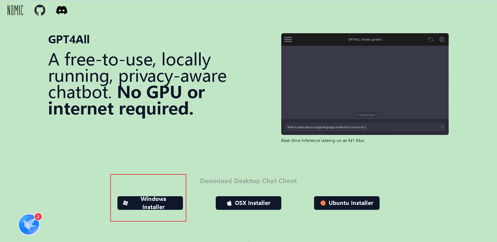
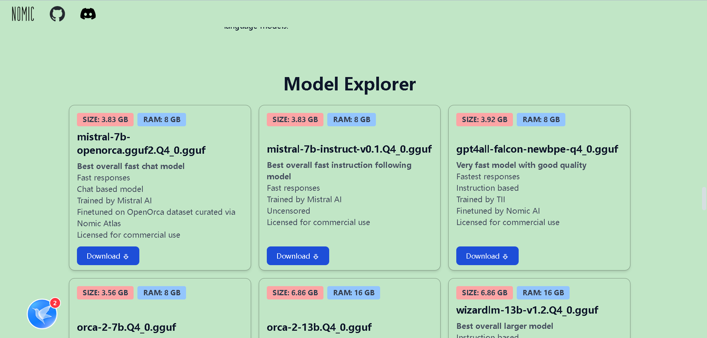

# 参考资料

[GPT4All 官网](https://gpt4all.io/index.html)

# 介绍

gpt4all是一款可以在本地运行的gpt工具，且可以不使用gpu，但是速度较慢，此外模型需要另外下载

# 下载GPT4ALL

在官网下载gpt4all的程序并安装

安装过程中各种设置目录的步骤建议在某处新建一个文件夹，将相关的目录在其中新建

# 下载并安装模型

安装完成后，会在桌面生成gpt4all的图标，双击执行，进入首页后会让你先下载一个模型使用，但程序内部的下载方式可能会有网络问题，这里建议在官网下载

打开gpt4all后，其下方会显示一个模型存放地址，默认在C盘某位置，可点击右侧browse修改为我们上面新建的文件夹

官网首页向下滚动会找到模型列表，根据自己设备的性能选择模型下载，由于我的电脑配置很低，所以这里使用了第一个模型，运行内存仅需8GB，将该文件下载到上方设置的模型文件夹中

下载完成后，重启chat4all，可以看到首页上方的下拉列表框内出现了刚下载的模型，选择该模型，等待加载到内存中后即可进行聊天，聊天输入框在最下方

# 其他设置

设置在软件右上角一个齿轮图标，可以对使用的设备是cpu还是gpu进行设置，也可以设置prompt语句等