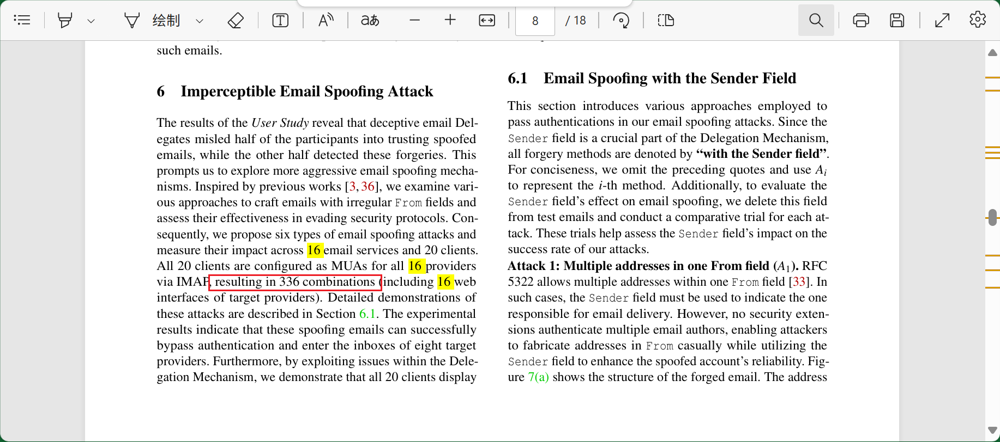
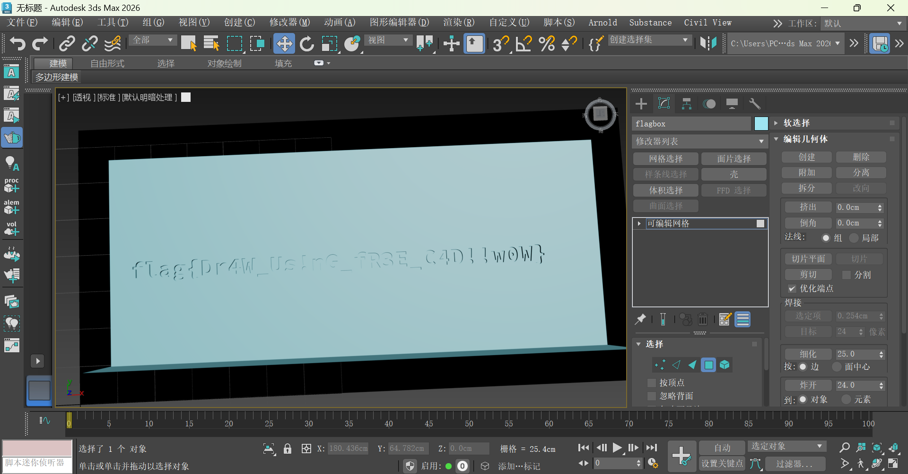
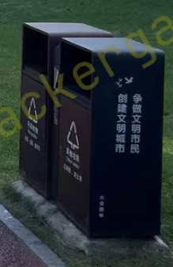
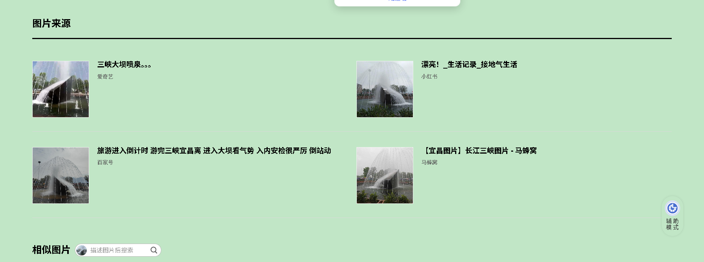
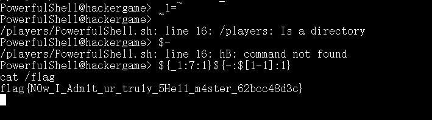
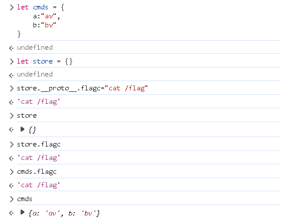

# 相关资料

https://hack.lug.ustc.edu.cn/

# 签到

## 本人解法

获取placeholder然后填入文本框

```js
let a = document.getElementById("inputs-container")
a.childNodes.forEach((c)=>{
    if(c.nodeType == 1){
        let en = c.getAttribute("placeHolder").split(":")[1];
        if(!en){
            en = c.getAttribute("placeHolder").split("：")[1];
        }
        console.log(en)
        c.value = en.trim();
    }   
})
```

## 官方解法

回答错误后，地址栏会出现flag=false，改为flag=true回车即可

# 喜欢做签到的 CTFer 你们好呀

## 个人解法

进入招新主页https://www.nebuu.la/

输入env，会得到第一个flag


## 官方解法

### 第一种

[nebuu.la/_next/static/chunks/pages/index-5cb01f7ec808f452.js](https://www.nebuu.la/_next/static/chunks/pages/index-5cb01f7ec808f452.js)

进入招新主页，f12找到如上代码，其中有flag的base64内容

### 第二种

在主页中执行ls -a，可找到.flag文件，里面是第二个flag

# 猫咪

1. https://lug.ustc.edu.cn/wiki/sec/contest.html
2. https://lug.ustc.edu.cn/news/2019/12/hackergame-2019/
    具体的题目数是从官方github页面统计的
3. https://www.ittc.ku.edu/~bluo/pubs/ma2024fakebehalf.pdf
    
4. https://github.com/torvalds/linux/commit/6e90b675cf942e50c70e8394dfb5862975c3b3b2
5. https://git.kernel.org/pub/scm/linux/kernel/git/torvalds/linux.git/commit/?id=6e90b675cf942e50c70e8394dfb5862975c3b3b2

## 官方

3：hackergame2018-writeups/misc/others.md at master · ustclug/hackergame2018-writeups · GitHub](https://github.com/ustclug/hackergame2018-writeups/blob/master/misc/others.md)

6: 需要执行python

```python
import transformers
import requests
tk=transformers.AutoTokenizer.from_pretrained("meta-llama/Meta-Llama-3-70B")
s=requests.session()
t=s.get("http://202.38.93.141:13030/", cookies={"session":"REDACTED"}).text
print(len(tk.encode(t)))
```


# 打不开的盒子

3dmax打开后删除顶面



flag{Dr4W_Us!nG_fR3E_C4D!!w0W}

# 每日论文太多了

改论文能搜到一个透明flag，但是没后续的内容

## 官方解法

该flag上盖了一张白色的图片，用pdf工具移开即可

# 大小王

通过比较两边的值获取inputs的答案，修改原代码的updateTimer进行循环

```js
function updateTimer() {
...
    if(state.value1 < state.value2){
        chooseAnswer("<")
    }else{
        chooseAnswer(">")
    }
...
}
```

控制台中执行如下命令，但是响应为检测到异常提交

```
state.score1=100
state.inputs = ['>', '<', '<', '>', '>', '>', '>', '>', '>', '<', '>', '>', '<', '<', '>', '<', '>', '<', '<', '<', '<', '>', '>', '>', '>', '<', '>', '>', '>', '<', '>', '<', '<', '<', '<', '<', '<', '<', '>', '>', '<', '>', '<', '>', '<', '<', '<', '<', '>', '<', '>', '<', '>', '<', '>', '<', '>', '>', '>', '<', '<', '>', '>', '<', '>', '<', '>', '>', '<', '<', '<', '>', '>', '<', '>', '<', '<', '>', '>', '>', '>', '>', '<', '>', '<', '>', '>', '<', '>', '>', '<', '>', '<', '>', '<', '>', '>', '<', '<', '>']
submit(state.inputs);
```

发现原理每次的值都不一样，所以每次刷新后重新计算并提交

```js
state.values.forEach((a)=>{
    if(a[0]>a[1]){
        state.inputs.push(">")
    }else{
        state.inputs.push("<")
    }
})
submit(state.inputs)
```

成功获取flag

# 照片

## 个人解法

**照片拍摄的位置距离中科大的哪个校门更近？**

暴力尝试直接

**科大今年的 ACG 音乐会？活动日期**

https://tieba.baidu.com/p/9022584688

贴吧的直播日期

**动车车型**
4编组列车思路出发，查到了类似的图片怀密号

https://zhuanlan.zhihu.com/p/346241499

型号应该是CRH6F-A，但站看着像北京北站（红色屋顶），但是有很多细节对不上

## 官方解法

1. 

2. 垃圾桶上写着"六安园林"，

   > 其实这种专供打卡的地标，几乎一定会出现在小红书上…… 并且小红书的推荐算法异常强悍，只需要搜索「六安」、「公园」，就能在前几个搜索结果中得到答案「中央森林公园」

3. 直接百度识图

4. 确实是怀密线，但不是具体某个站点，而是中途

   

# 不宽的宽字符

这里想输入`\0`避免他加字符，但怎么输入是个问题

使用java尝试但是失败

```java
import java.io.BufferedReader;
import java.io.IOException;
import java.io.InputStreamReader;

public class TestNc {
    public static void main(String[] args) {
        String command = "nc 202.38.93.141 14202";
        try {
            Process process = Runtime.getRuntime().exec(command);
            BufferedReader reader = new BufferedReader(new InputStreamReader(process.getInputStream()));
            BufferedReader consoleReader = new BufferedReader(new InputStreamReader(System.in));

            // 循环
            while (true) {
                String line = reader.readLine();
                if (line == null) {
                    break;
                }
                System.out.println(line);
                // 获取控制台输入
                String input = consoleReader.readLine();
                if ("test".equals(input)) {
                    input = "Z:\\theflag"+0x00;
                } else if ("token".equals(input)) {
                    input = "4305:MEYCIQD6SFEdceMjzNkciHcHlkey+g8Yd/PXFsPsANIn8QfvZQIhAIuyium/5mivOpzX/ERUdxceTGmBQlb6ulOeOFvl3K6m\n";
                }
                process.getOutputStream().write((input).getBytes());
                process.getOutputStream().flush();
            }
        } catch (IOException e) {
            e.printStackTrace();
        }
    }
}
```

查找宽字符转char的步骤，发现宽字符是utf-8，窄字符是ascii，那接找哪个字符可以将终止符包含进去

## 官方解法

找多字节字符包含终止符的思路是对的，可以让两两一位合成同一个字符，且使用小端字节序：


```python
b'theflag\x00'.decode('utf-16-le')
```


# PowerfulShell

思路是使用八进制，但是圆括号和单引号都被禁止了

## 官方解法

使用变量值的字符串拼接

~为home目录

-为作者隐藏的变量

拼接出sh，执行后会打开新的终端，在里面直接cat即可



# Node.js is Web Scale

相关代码：

```js
// server.js
const express = require("express");
const bodyParser = require("body-parser");
const path = require("path");
const { execSync } = require("child_process");
 
const app = express();
app.use(bodyParser.json());
app.use(express.static(path.join(__dirname, "public")));
 
let cmds = {
  getsource: "cat server.js",
  test: "echo 'hello, world!'",
};
 
let store = {};
 
// GET /api/store - Retrieve the current KV store
app.get("/api/store", (req, res) => {
  res.json(store);
});
 
// POST /set - Set a key-value pair in the store
app.post("/set", (req, res) => {
  const { key, value } = req.body;
 
  const keys = key.split(".");
  let current = store;
 
  for (let i = 0; i < keys.length - 1; i++) {
    const key = keys[i];
    if (!current[key]) {
      current[key] = {};
    }
    current = current[key];
  }
 
  // Set the value at the last key
  current[keys[keys.length - 1]] = value;
 
  res.json({ message: "OK" });
});
 
// GET /get - Get a key-value pair in the store
app.get("/get", (req, res) => {
  const key = req.query.key;
  const keys = key.split(".");
 
  let current = store;
  for (let i = 0; i < keys.length; i++) {
    const key = keys[i];
    if (current[key] === undefined) {
      res.json({ message: "Not exists." });
      return;
    }
    current = current[key];
  }
 
  res.json({ message: current });
});
 
// GET /execute - Run commands which are constant and obviously safe.
app.get("/execute", (req, res) => {
  const key = req.query.cmd;
  const cmd = cmds[key];
  res.setHeader("content-type", "text/plain");
  res.send(execSync(cmd).toString());
});
 
app.get("*", (req, res) => {
  res.sendFile(path.join(__dirname, "public", "index.html"));
});
 
// Start the server
const PORT = 3000;
app.listen(PORT, () => {
  console.log(`KV Service is running on port ${PORT}`);
});
```

## 原型链污染

在js中，{}也是一个对象，通过该对象的 `__proto__` 属性，可以给对象的的属性设置默认值：



于是可使用set方法向库中存储`__proto__.flagc`值为`cat \flag`

接着调用cmds接口执行即可

# PaoluGPT

题目已无法打开，该题解法为使用爬虫爬聊天记录查找flag字样获取第一个flag，另使用sql注入将隐藏聊天记录展示获取第二个flag

# 强大的正则表达式

## 一级

由于10000是16的倍数，故后四位可以决定当前数是否为16的倍数：

a*10000+b*16=16y

故暴力拼接所有的后四位

```
print('(0|1|2|3|4|5|6|7|8|9)*' + '(' + '|'.join(f'{i:04d}' for i in range(0, 10000, 16)) + ')')    
(0|1|2|3|4|5|6|7|8|9)*(0000|0016|0032|0048|0064|0080|0096|0112|0128|0144|0160|0176|0192|0208|0224|0240|0256|0272|0288|0304|0320|0336|0352|0368|0384|0400|0416|0432|0448|0464|0480|0496|0512|0528|0544|0560|0576|0592|0608|0624|0640|0656|0672|0688|0704|0720|0736|0752|0768|0784|0800|0816|0832|0848|0864|0880|0896|0912|0928|0944|0960|0976|0992|1008|1024|1040|1056|1072|1088|1104|1120|1136|1152|1168|1184|1200|1216|1232|1248|1264|1280|1296|1312|1328|1344|1360|1376|1392|1408|1424|1440|1456|1472|1488|1504|1520|1536|1552|1568|1584|1600|1616|1632|1648|1664|1680|1696|1712|1728|1744|1760|1776|1792|1808|1824|1840|1856|1872|1888|1904|1920|1936|1952|1968|1984|2000|2016|2032|2048|2064|2080|2096|2112|2128|2144|2160|2176|2192|2208|2224|2240|2256|2272|2288|2304|2320|2336|2352|2368|2384|2400|2416|2432|2448|2464|2480|2496|2512|2528|2544|2560|2576|2592|2608|2624|2640|2656|2672|2688|2704|2720|2736|2752|2768|2784|2800|2816|2832|2848|2864|2880|2896|2912|2928|2944|2960|2976|2992|3008|3024|3040|3056|3072|3088|3104|3120|3136|3152|3168|3184|3200|3216|3232|3248|3264|3280|3296|3312|3328|3344|3360|3376|3392|3408|3424|3440|3456|3472|3488|3504|3520|3536|3552|3568|3584|3600|3616|3632|3648|3664|3680|3696|3712|3728|3744|3760|3776|3792|3808|3824|3840|3856|3872|3888|3904|3920|3936|3952|3968|3984|4000|4016|4032|4048|4064|4080|4096|4112|4128|4144|4160|4176|4192|4208|4224|4240|4256|4272|4288|4304|4320|4336|4352|4368|4384|4400|4416|4432|4448|4464|4480|4496|4512|4528|4544|4560|4576|4592|4608|4624|4640|4656|4672|4688|4704|4720|4736|4752|4768|4784|4800|4816|4832|4848|4864|4880|4896|4912|4928|4944|4960|4976|4992|5008|5024|5040|5056|5072|5088|5104|5120|5136|5152|5168|5184|5200|5216|5232|5248|5264|5280|5296|5312|5328|5344|5360|5376|5392|5408|5424|5440|5456|5472|5488|5504|5520|5536|5552|5568|5584|5600|5616|5632|5648|5664|5680|5696|5712|5728|5744|5760|5776|5792|5808|5824|5840|5856|5872|5888|5904|5920|5936|5952|5968|5984|6000|6016|6032|6048|6064|6080|6096|6112|6128|6144|6160|6176|6192|6208|6224|6240|6256|6272|6288|6304|6320|6336|6352|6368|6384|6400|6416|6432|6448|6464|6480|6496|6512|6528|6544|6560|6576|6592|6608|6624|6640|6656|6672|6688|6704|6720|6736|6752|6768|6784|6800|6816|6832|6848|6864|6880|6896|6912|6928|6944|6960|6976|6992|7008|7024|7040|7056|7072|7088|7104|7120|7136|7152|7168|7184|7200|7216|7232|7248|7264|7280|7296|7312|7328|7344|7360|7376|7392|7408|7424|7440|7456|7472|7488|7504|7520|7536|7552|7568|7584|7600|7616|7632|7648|7664|7680|7696|7712|7728|7744|7760|7776|7792|7808|7824|7840|7856|7872|7888|7904|7920|7936|7952|7968|7984|8000|8016|8032|8048|8064|8080|8096|8112|8128|8144|8160|8176|8192|8208|8224|8240|8256|8272|8288|8304|8320|8336|8352|8368|8384|8400|8416|8432|8448|8464|8480|8496|8512|8528|8544|8560|8576|8592|8608|8624|8640|8656|8672|8688|8704|8720|8736|8752|8768|8784|8800|8816|8832|8848|8864|8880|8896|8912|8928|8944|8960|8976|8992|9008|9024|9040|9056|9072|9088|9104|9120|9136|9152|9168|9184|9200|9216|9232|9248|9264|9280|9296|9312|9328|9344|9360|9376|9392|9408|9424|9440|9456|9472|9488|9504|9520|9536|9552|9568|9584|9600|9616|9632|9648|9664|9680|9696|9712|9728|9744|9760|9776|9792|9808|9824|9840|9856|9872|9888|9904|9920|9936|9952|9968|9984)
```

## 二级

使用python构建状态机，然后生成正则表达式

>DFA 的状态代表余数（有 0~12 一共 13 个状态），初始状态是 0，每次读入一个 bit 更新余数（状态转移）（`s:=(s*2+b)%13`），读入完毕后如果 DFA 处于 0 状态（余数为 0），就意味着这个二进制数整除 13。

```python
# pip install greenery
# pip install regex
from greenery import Fsm, Charclass, rxelems
import regex as re
import random
# 模13
m = 13
# 二进制 
d = 2

# 允许的数字字符
digits = [Charclass(str(i)) for i in range(d)]
# 非法输入
other = ~Charclass("".join(str(i) for i in range(d)))
alphabet = set(digits + [other])
# 状态集合
states = set(range(m + 1))  # m is the dead state
initial_state = 0
# 只有余数为0可接受
accepting_states = {0}
#状态转换表
transition_map = dict()
for s in range(m):
    transition_map[s] = {digits[i]: (s * d + i) % m for i in range(d)}
    transition_map[s][other] = m
transition_map[m] = {digits[i]: m for i in range(d)}
transition_map[m][other] = m

# 构建状态机
dfa = Fsm(
    alphabet=alphabet,
    states=states,
    initial=initial_state,
    finals=accepting_states,
    map=transition_map,
)

# 这部分是为了满足题目限制（有些字符不允许）
def convert_regex(regex):
    # `(...)?` -> `((...)|)`
    while '?' in regex:
        regex = re.sub(r'\((.*?)\)\?', r'(\1|)', regex)
    # Handle `{n}` quantifier
    n = 1
    while '{' in regex:
        while '{' + str(n) + '}' in regex:
            regex = re.sub(r'(\((.*?)\)|\w)\{n\}'.replace('n', str(n)), r'\1' * n, regex)
        n += 1
    # [abc] -> (a|b|c)
    while '[' in regex:
        def convert_charset(match):
            chars = match.group(1)
            return '(' + '|'.join(chars) + ')'
        regex = re.sub(r'\[([^\]]+)\]', convert_charset, regex)
    assert set(regex) <= set("0123456789|()*")
    return regex
# 生成正则表达式
dfa = dfa.reduce()
regex = rxelems.from_fsm(dfa)
regex = regex.reduce()
regex = convert_regex(str(regex))
print(regex)
```


# 惜字如金 3.0

写个脚本判断哪行少于80，然后按照规则补充，第一关基本上都是些关键字或者常见单词

```python
def print_lines_under_80(file_path):
    try:
        with open(file_path, 'r') as file:
            count = 0;
            for line_number, line in enumerate(file, 1):
                stripped_line = line.rstrip('\n')
                line_length = len(stripped_line)
                if line_length < 80:
                    count+=1
                    print(f"Line {line_number}: (Length: {line_length}) {stripped_line}")
            print(count)
    except FileNotFoundError:
        print(f"错误：找不到文件 '{file_path}'")
    except Exception as e:
        print(f"发生错误：{e}")

if __name__ == "__main__":
    file_path = 'D:\\study\\hkgame\\answer_a.py'
    print_lines_under_80(file_path)
```

第二关在第一关的基础上，将b字符串进行了缩写，需要阅读源码，与CRC算法有关；

# 优雅的不等式

从代码注释给出的样例输入可以看出，将四分之一圆减去其内接三角形转换成定积分形式就能证明 π≥2，显然构造一个可以被四分之一圆覆盖并且面积等于 2/3 的函数图像就可以证明 π≥8/3，一个很容易想到的例子就是抛物线 f(x)=1−x2，刚好可以满足要求