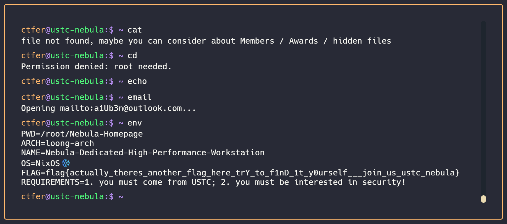

# 相关资料

https://hack.lug.ustc.edu.cn/

# 签到

```js
let a = document.getElementById("inputs-container")
a.childNodes.forEach((c)=>{
    if(c.nodeType == 1){
        let en = c.getAttribute("placeHolder").split(":")[1];
        if(!en){
            en = c.getAttribute("placeHolder").split("：")[1];
        }
        console.log(en)
        c.value = en.trim();
    }   
})
```

# 喜欢做签到的 CTFer 你们好呀

进入招新主页https://www.nebuu.la/

输入env，会得到flag



# 猫咪

1. https://lug.ustc.edu.cn/wiki/sec/contest.html
2. https://lug.ustc.edu.cn/news/2019/12/hackergame-2019/
    具体的题目数是从官方github页面统计的
3. null
4. https://www.ittc.ku.edu/~bluo/pubs/ma2024fakebehalf.pdf
    

5. https://github.com/torvalds/linux/commit/6e90b675cf942e50c70e8394dfb5862975c3b3b2
6. null

# 打不开的盒子

3dmax打开后删除顶面


flag{Dr4W_Us!nG_fR3E_C4D!!w0W}

# 每日论文太多了

null

# 大小王

通过比较两边的值获取inputs的答案，修改原代码的updateTimer进行循环

```js
function updateTimer() {
...
    if(state.value1 < state.value2){
        chooseAnswer("<")
    }else{
        chooseAnswer(">")
    }
...
}
```

控制台中执行如下命令，但是响应为检测到异常提交

```
state.score1=100
state.inputs = ['>', '<', '<', '>', '>', '>', '>', '>', '>', '<', '>', '>', '<', '<', '>', '<', '>', '<', '<', '<', '<', '>', '>', '>', '>', '<', '>', '>', '>', '<', '>', '<', '<', '<', '<', '<', '<', '<', '>', '>', '<', '>', '<', '>', '<', '<', '<', '<', '>', '<', '>', '<', '>', '<', '>', '<', '>', '>', '>', '<', '<', '>', '>', '<', '>', '<', '>', '>', '<', '<', '<', '>', '>', '<', '>', '<', '<', '>', '>', '>', '>', '>', '<', '>', '<', '>', '>', '<', '>', '>', '<', '>', '<', '>', '<', '>', '>', '<', '<', '>']
submit(state.inputs);
```

发现原理每次的值都不一样，所以每次刷新后重新计算并提交

```js
state.values.forEach((a)=>{
    if(a[0]>a[1]){
        state.inputs.push(">")
    }else{
        state.inputs.push("<")
    }
})
submit(state.inputs)
```

成功获取flag

# 照片

**照片拍摄的位置距离中科大的哪个校门更近？**

暴力尝试直接

**科大今年的 ACG 音乐会？活动日期**

https://tieba.baidu.com/p/9022584688

贴吧的直播日期

剩余的四道题没思路

**动车车型**
4编组列车思路出发，查到了类似的图片怀密号

https://zhuanlan.zhihu.com/p/346241499

型号应该是CRH6F-A，但站看着像北京北站（红色屋顶），但是有很多细节对不上

# 不宽的宽字符

这里想输入`\0`避免他加字符，但怎么输入是个问题

使用java尝试但是失败

```java
import java.io.BufferedReader;
import java.io.IOException;
import java.io.InputStreamReader;

public class TestNc {
    public static void main(String[] args) {
        String command = "nc 202.38.93.141 14202";
        try {
            Process process = Runtime.getRuntime().exec(command);
            BufferedReader reader = new BufferedReader(new InputStreamReader(process.getInputStream()));
            BufferedReader consoleReader = new BufferedReader(new InputStreamReader(System.in));

            // 循环
            while (true) {
                String line = reader.readLine();
                if (line == null) {
                    break;
                }
                System.out.println(line);
                // 获取控制台输入
                String input = consoleReader.readLine();
                if ("test".equals(input)) {
                    input = "Z:\\theflag"+0x00;
                } else if ("token".equals(input)) {
                    input = "4305:MEYCIQD6SFEdceMjzNkciHcHlkey+g8Yd/PXFsPsANIn8QfvZQIhAIuyium/5mivOpzX/ERUdxceTGmBQlb6ulOeOFvl3K6m\n";
                }
                process.getOutputStream().write((input).getBytes());
                process.getOutputStream().flush();
            }
        } catch (IOException e) {
            e.printStackTrace();
        }
    }
}
```


# PowerfulShell

思路是使用八进制，但是圆括号和单引号都被禁止了

