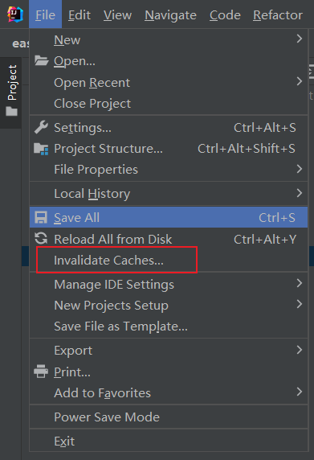

# idea2023全局配置

idea中关闭所有项目，展示启动界面，在启动界面中找到customize，点击all setting

# maven成功下载依赖但pom找不到版本

尝试`Invalidate Caches/Restart`

# 调试

idea调试的时候可以有如下操作：

- 强制返回：选中方法栈中的某个方法，右键force return，在其中输入返回语句
- reset：可以撤回到某个方法，相当于读档
- set变量：在变量监控的视图中，右键某个变量可强制设置他在运行时候的值
- 条件断点：设置条件断点，在满足条件的时候才会暂停，适用于循环中