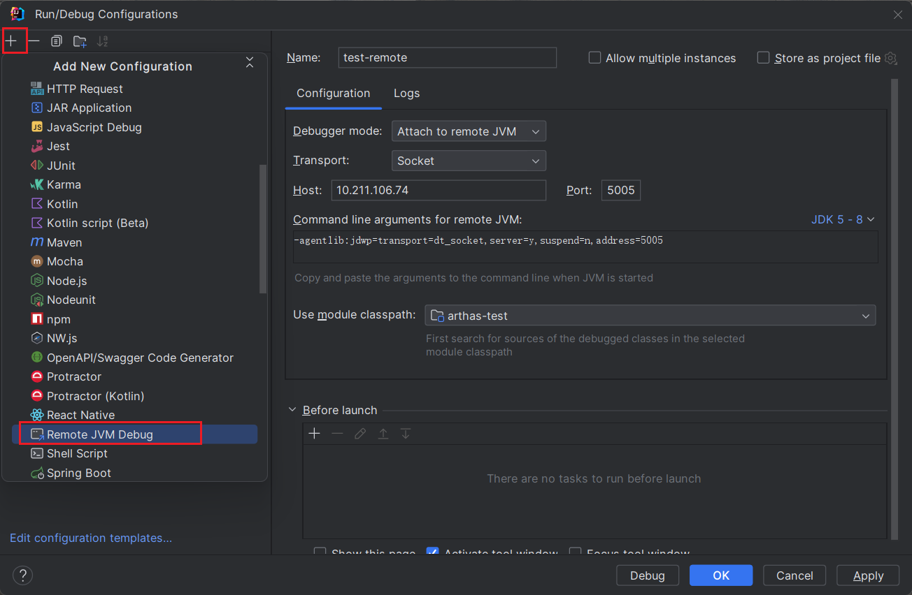
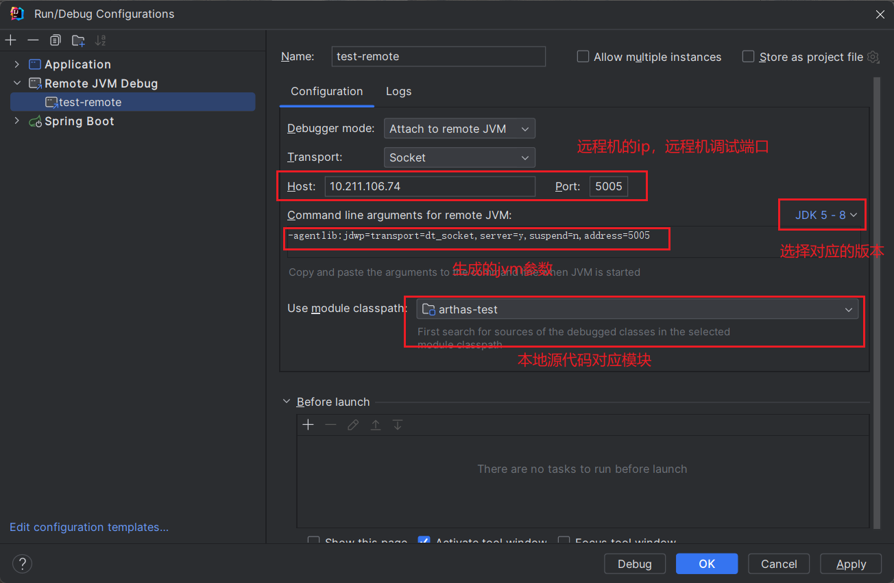
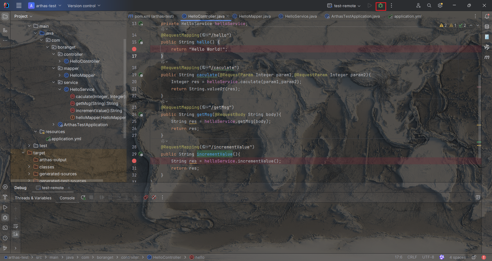

# 参考资料

[使用IDEA远程debug调试(一篇懂所有)_idea remote debug-CSDN博客](https://blog.csdn.net/w8y56f/article/details/116493681)

# 前期准备

本地idea需要打开远程服务的源代码，远端服务必须在启动时添加特定的jvm参数，已经启动的服务无法使用idea远程调试

# 使用idea生成jvm参数

打开idea的run configuration，添加远程debug配置



填写相关配置



其中：

- 远程机调试端口不是服务的端口，而是远程机上的空闲端口，用于与本地机进行调试通信的
- 需要选择对应的jvm版本，不同版本的参数不同

# 远程机启动服务

远程机启动服务需要添加上面生成的jvm参数：

```
java -agentlib:jdwp=transport=dt_socket,server=y,suspend=n,address=5005 -jar arthas-test-1.0-SNAPSHOT.jar
```

# idea启动调试



# 调试

主要远程上的代码版本必须与本地相同，否则会出现调试的时候发现代码错乱的情况

同一台服务器上可启动多个agent对应多个微服务，新增idea项目配置然后修改端口就可以