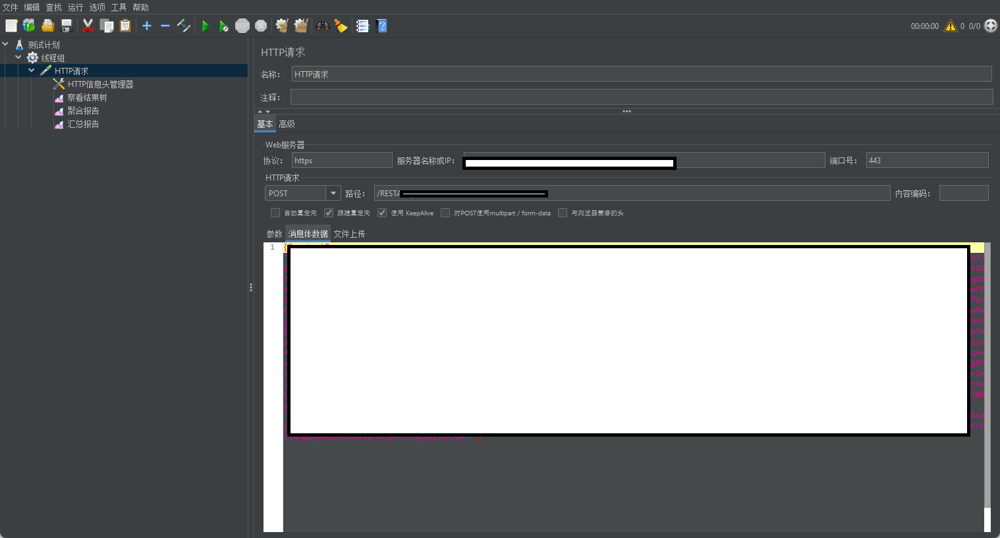
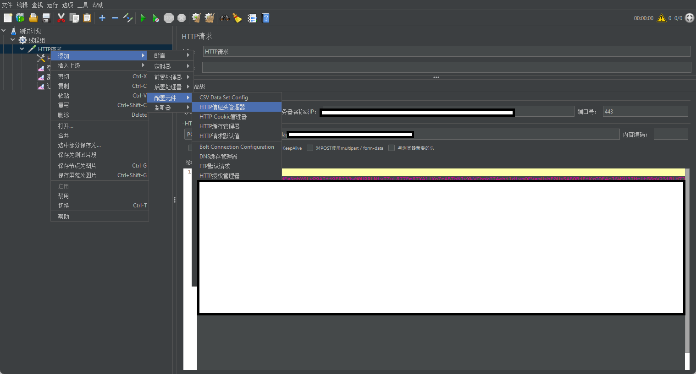
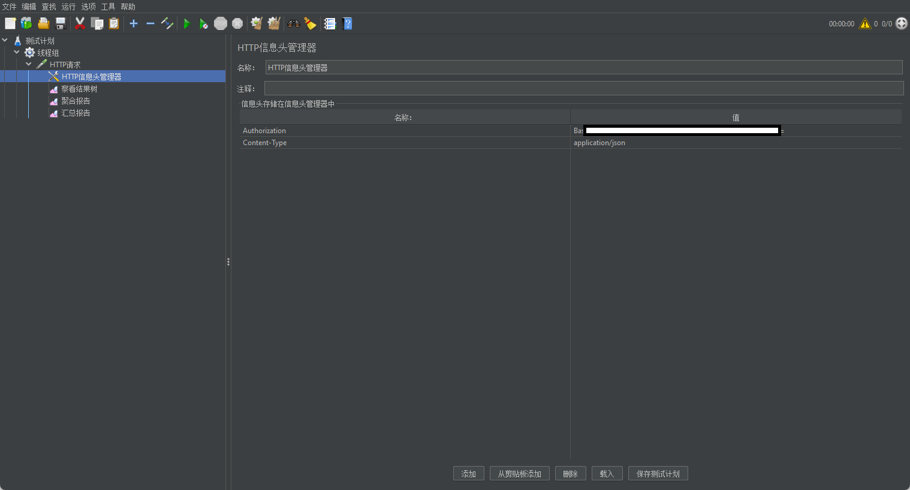
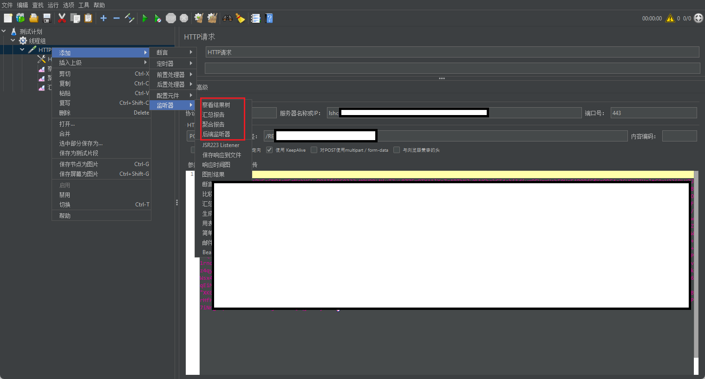

# 参考资料

[JMeter性能测试，完整入门篇教程-CSDN博客](https://blog.csdn.net/weixin_40943297/article/details/96480607)

[JMeter带json数据的post请求测试_jmeter post json数组-CSDN博客](https://blog.csdn.net/chuntian_feng/article/details/51871481)

# 介绍

jmeter用于压测

# 发送json报文带basic认证请求头

## 地址配置

## 请求头

## 请求结果查看

## 压测报告

