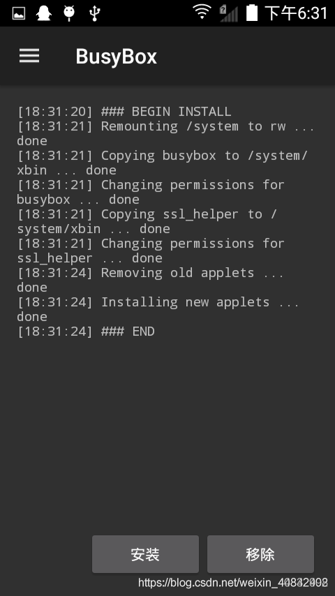

# 参考教程
[https://blog.csdn.net/weixin_40842492/article/details/107288522](https://blog.csdn.net/weixin_40842492/article/details/107288522)
[https://www.jianshu.com/p/687ba1e11ab5](https://www.jianshu.com/p/687ba1e11ab5)
[https://pluhuxc.github.io/2020/10/23/linuxdeploy-guide.html](https://pluhuxc.github.io/2020/10/23/linuxdeploy-guide.html)
同时本文中一些图片来自于这些教程
# 准备工作
## 机型选择
这里建议采用配置较高，安卓版本较新且内存较大的手机，最好支持内存卡扩展的手机。本案例使用的机型为小米3移动版，该机型安卓版本较旧，所以在找合适的Linux deploy版本时花了不少时间。且该机型不支持内存卡扩展。该机型安卓系统为4.4.4，miui8开发版。
## 手机root
其他机型的手机请自行搜索root方法，小米手机需要系统为开发版，如果你的手机为稳定版请手动刷成合适的开发版。切记刷成开发版之后不要再点击升级系统了，不然很大可能会升成稳定版。小米手机开发版可以直接获得root权限。之后需要给busybox和linux deploy root权限。
## busybox 下载
busybox一般手机的应用商店就有，直接下载安装即可
## Linux deploy 下载
[首先贴上linuxdeploy的下载地址https://github.com/meefik/linuxdeploy/releases](https://github.com/meefik/linuxdeploy/releases)
注意要选择适合自己手机的版本，本案例使用了2.2.2版本
# 配置
## 安装busybox
busybox安装app完成后，打开，点击左上角的设置按钮，找到设置选项。设置语言为中文简体。其他配置默认就好，返回主界面点击安装。（安装路径使用默认配置/system/xbin）

## 配置Linux deploy
### linux deploy设置
linux deploy 安装app完成后，打开应用，点击左上角三个横杠后点击设置，选中锁定wifi、保持CPU唤醒、屏幕常亮（有的手机在息屏状态下CPU会降频运行），PATH变量与BusyBox中配置一致 /system/xbin，设置完成点击更新环境。其他设置看个人情况配置
### 配置文件设置
左上角三道杠选择配置文件，点击添加，起个名字如linux，选中你新建的这个配置文件，返回。
点击右下角设置图标，设置如下：
 - 容器类型
建议使用 chroot
 proot 目前在linuxdeploy不完备,可能无法在安装
 - 发行版GNU/linux  /  发行版GNU/linux 版本
选择你需要的系统，本案例选择了debian ，版本stable
 - 架构
选择你手机支持的架构，可以点击右上角三个点，选择状态，输出的信息中 Architecture即为本机cpu架构，一般默认即可
 - 源地址建议使用国内镜像，下载快一些，本案例使用镜像为：http://mirrors.aliyun.com/debian/
 - 安装类型
 0. 本案例使用了目录类型
 1. 镜像文件
将GNU/linux安装到一个镜像文件(虚拟磁盘)中
如果你将GNU/linux安装到fat32的sd卡中请使用该选项
安装路径为镜像文件的绝对路径 默认为/sdcard/linux.img
镜像大小为镜像文件的大小 默认为自动
如果镜像路径设置在fat32内存卡的目录下镜像大小应不大于4096mb (fat32文件系统文件大小限制)
文件系统为镜像文件内要使用的分区的文件系统 默认为ext4
2. 目录
将GNU/linux安装在一个ext4或f2fs分区的一个目录里
安装路径为要安装到的目录 默认为linuxdeploy的应用数据目录(在data分区)
安装目录请勿使用fat32分区的目录,以及/sdcard/ 内部共享存储目录, 它们不支持linux文件系统的基本权限
3. 分区
格式化一个分区并将GNU/Linux安装到里面
安装路径为一个块设备分区文件的绝对路径 默认为/dev/block/mmcblkXpY
如果要安装到内存卡的第一个分区请写: /dev/block/mmcblk1p1
如果要安装到otg u盘的第一个分区请写: /dev/block/sda1
文件系统格式化分区所指定的文件系统 默认为ext4
4. RAM
创建一个ramdisk并将linux安装到里面
安装路径为ramdisk的挂载路径 默认为/data/local/ram
镜像大小为ramdisk的大小
ramdisk会在关机后清除
- 用户名  /  用户密码
用户名填写为root，用户密码自定，只是自己玩玩的话推荐使用123456就可以了，不然很容易忘，如果你不小心忘记密码，可以返回本教程查看本教程推荐的密码。
- 特权用户 root
- DNS 自动
- 本地化选择：zh_CN.UTF-8‘
- 初始化启用打勾
- ssh启用打勾
- 图形界面看个人需要，本案例一开始是使用图形界面的，不过体验太差，故第二次安装时没有勾选。
- 其他设置看个人情况配置
# 安装
返回app主界面，点击右上角三个点点击安装，等待. . . . . . 
安装完成好最后重启下手机，然后点启动
# 运行
登入家里的路由器，查看部署了Linux deploy的设备分配的ip地址(局域网ip)
cmd 中 ssh root@ip地址
如 ssh root@192.168.88.113
然后输入密码（推荐密码为123456）
登入成功！

# 图形界面
若想使用图形界面，可以去看一下上面的三篇参考教程