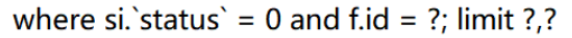

# 基本思路

- 引入mybatis与数据库驱动的依赖
- 配置数据源信息
- 编写mapper接口
- 编写mapper映射文件
- 使用mapper

# 引入依赖

```xml
<!--druid-->
<dependency>
    <groupId>com.alibaba</groupId>
    <artifactId>druid</artifactId>
    <version>1.2.8</version>
</dependency>
<!--mysql驱动-->
<dependency>
    <groupId>mysql</groupId>
    <artifactId>mysql-connector-java</artifactId>
</dependency>
<!--mybatis-->
<dependency>
    <groupId>org.mybatis.spring.boot</groupId>
    <artifactId>mybatis-spring-boot-starter</artifactId>
    <version>2.2.0</version>
</dependency>
```

有个知识点： SpringBoot官方的Starter命名格式为：spring-boot-starter-*，而第三方的starter命名格式为： *-spring-boot-starter

# 数据源配置

```yml
spring:
  datasource:
    type: com.alibaba.druid.pool.DruidDataSource
    driver-class-name: com.mysql.cj.jdbc.Driver
    url: jdbc:mysql://localhost:3306/sstestdb?useUnicode=true&characterEncoding=utf-8&serverTimezone=Asia/Shanghai
    username: root
    password: 123456
```


# mybatis配置

```yml
# 配置mybatis规则
mybatis:
  config-location: classpath:mybatis/mybatis-config.xml  #全局配置文件位置
  mapper-locations: classpath:mybatis/mapper/*.xml  #sql映射文件位置
  configuration:
    map-underscore-to-camel-case: true # 下划线到驼峰的转换（不建议使用，还是建议自己在resultMap中配置）

```

# 接口

**注解模式**

```java
@Mapper
public interface CityMapper {
    @Select("select * from city where id=#{id}")
    public City getById(Long id);
    public void insert(City city);
}
```

# 数据类型映射

JDBC TYPE JDBCTYPE java type javatype


# VO/DO/DTO

- VO
  - 前端展示的数据所对应
- DO
  - 数据库中的表所对应
- DTO
  - 其他需要传递的数据

使用原因:

1. 不需要的字段也会传输到前端,臃肿且不安全
2. 某些字段需要先行处理再展示
3. 某些信息需要展示但不需要存入数据库

# Type Handler

实体类中特定参数到数据库中字段的映射

比如map->json字符串的需求

**编写typeHandler,这里注意要放入Bean容器中,不然会提示映射异常**

```java
@Component
public class MapTypeHandler extends BaseTypeHandler<Map<String,String>> {
    @Override
    public void setNonNullParameter(PreparedStatement preparedStatement, int i, Map map, JdbcType jdbcType) throws SQLException {
        String s = JSONObject.toJSONString(map);
        preparedStatement.setString(i,s);
    }

    @Override
    public Map getNullableResult(ResultSet resultSet, String s) throws SQLException {
        Map map = JSONObject.parseObject(resultSet.getString(s), Map.class);
        return map;
    }

    @Override
    public Map getNullableResult(ResultSet resultSet, int i) throws SQLException {
        Map map = JSONObject.parseObject(resultSet.getString(i), Map.class);
        return map;
    }

    @Override
    public Map getNullableResult(CallableStatement callableStatement, int i) throws SQLException {
        Map map = JSONObject.parseObject(callableStatement.getString(i), Map.class);
        return map;
    }
}
```

**mapper文件**

```xml 
<mapper namespace="com.orange.frame.job.mapper.JobInfoMapper">

    <resultMap id="jobInfo" type="com.orange.frame.job.entity.OrangeJobInfo">
        <id column="id" property="jobId"/>
        <result column="job_name" property="jobName"/>
        <result column="job_group" property="jobGroup"/>
        <result column="job_status" property="jobStatus"/>
        <result column="target_url" property="targetUrl"/>
        <result column="headers" property="headers" typeHandler="com.orange.frame.job.util.MapTypeHandler"/>
        <result column="method" property="method"/>
        <result column="params" property="params" typeHandler="com.orange.frame.job.util.MapTypeHandler"/>
        <result column="body" property="body"/>
        <result column="corn" property="corn"/>
        <result column="create_user_id" property="createUserId"/>
        <result column="create_time" property="createTime"/>
    </resultMap>
    <select id="listAllJobInfo" resultMap="jobInfo">
        select *
        from job_info
    </select>
    <insert id="saveJobInfo" useGeneratedKeys="true" keyProperty="jobId" parameterType="com.orange.frame.job.entity.OrangeJobInfo">
        insert into job_info
        ( job_name
        , job_group
        , job_status
        , target_url
        , headers
        , method
        , params
        , body
        , corn
        , create_user_id
        , create_time)
        values ( #{jobName}
               , #{jobGroup}
               , #{jobStatus}
               , #{targetUrl}
               , #{headers,typeHandler=com.orange.frame.job.util.MapTypeHandler}
               , #{method}
               , #{params,typeHandler=com.orange.frame.job.util.MapTypeHandler}
               , #{body}
               , #{corn}
               , #{createUserId}
               , #{createTime})
    </insert>
</mapper>
```

查询使用result Map,其中配置特定字段使用的TypeHandler

insert中,在values中配置使用的TypeHandler

# 插入数据返回主键问题

在insert语句中添加如下属性，在将传入对象插入到数据库中后，传入对象的主键会被修改为插入之后的数据的id

```xml
useGeneratedKeys="true" keyProperty="实体类中保存id的属性名" 
```

e.g.

```xml
<insert id="saveJobInfo" useGeneratedKeys="true" keyProperty="jobId" parameterType="com.orange.frame.job.entity.OrangeJobInfo">
        insert into job_info
        ( job_name
        , job_group
        , job_status
        , target_url
        , headers
        , method
        , params
        , body
        , corn
        , create_user_id
        , create_time)
        values ( #{jobName}
               , #{jobGroup}
               , #{jobStatus}
               , #{targetUrl}
               , #{headers,typeHandler=com.orange.frame.job.util.MapTypeHandler}
               , #{method}
               , #{params,typeHandler=com.orange.frame.job.util.MapTypeHandler}
               , #{body}
               , #{corn}
               , #{createUserId}
               , #{createTime})
    </insert>
```

# 一对一查询

association 标签

需要注意的是, association必须在collection之前

且必须要有一个column属性

这里association中有select属性，指向当前mapper中的其他方法，会分步调用该方法，将column作为参数传入，接着将结果注入实体类。

```xml
 <resultMap id="RoleResultMap" type="com.orange.eneity.OrangeRole">
        <id column="id" property="id"/>
        <result column="name" property="name"/>
        <result column="desc" property="desc"/>
        <association property="user"
                     javaType="com.orange.eneity.User"
                     select="selectAllUser"
                     column="id"
        />
        <collection property="derivedRoleList"
                    ofType="com.orange.eneity.OrangeRole"
                    select="selectDerivedRoleList"
                    column="id"
        />
        <collection property="baseRoleList"
                    ofType="com.orange.eneity.OrangeRole"
                    select="selectBaseRoleList"
                    column="id"
        />

    </resultMap>
```


# 一对多查询

- xml配置

    ```xml
    <mapper namespace="com.example.firstdemo.domain.repository.HandStudentCourseCoreRepository">
        <resultMap id="HandStudentCourseCoreResultMap" type="com.example.firstdemo.domain.vo.HandStudentCourseCore">
            <result column="STUDENT_NO" property="studentNo"/>
            <collection property="studentCourseCore" ofType="com.example.firstdemo.domain.entity.HandStudentCore" foreignColumn="STUDENT_NO">
                <id column="STUDENT_NO" property="studentNo"/>
                <id column="COURSE_NO" property="courseNo"/>
                <id column="CORE" property="core"/>
            </collection>
        </resultMap>
        <select id="selectHandStudentCourseCore" resultMap="HandStudentCourseCoreResultMap">
            select hs.STUDENT_NO, hsc.*
            from hand_student hs left join hand_student_core hsc
            on hs.STUDENT_NO = hsc.STUDENT_NO
            where hs.STUDENT_NO = #{studentNo};
        </select>
    </mapper>
    ```
    
- vo类构造

    ```java
    @Data
    public class HandStudentCourseCore {
        private String studentNo;
        List<HandStudentCore> studentCourseCore;
    }
    ```

- 运行结果

    ```txt
    HandStudentCourseCore(
    studentNo=s001,
    studentCourseCore=[
    HandStudentCore(studentNo=s001, courseNo=c001, core=58.9), HandStudentCore(studentNo=s001, courseNo=c002, core=82.9), HandStudentCore(studentNo=s001, courseNo=c003, core=59.0)
    ])
    ```

# resultType/Map

这两者都是作为查询结果的存在

```xml
<?xml version="1.0" encoding="UTF-8" ?>
<!DOCTYPE mapper
        PUBLIC "-//mybatis.org//DTD Mapper 3.0//EN"
        "http://mybatis.org/dtd/mybatis-3-mapper.dtd">
<mapper namespace="com.threetree.mapper.TicketInfoMapper">
    <resultMap id="TicketInfo" type="com.threetree.pojo.TicketInfo">
        <id column="_ID" property="_id"/>
        <result column="NUMBER" property="number"/>
        <result column="FLOW" property="flow"/>
        <result column="FLOWNAME" property="flowName"/>
    </resultMap>
    <select id="queryAll" resultMap="TicketInfo">
        select * from CDS_INNOVATE.TICKET_INFO;
    </select>
	<select id="queryAll" resultType="com.threetree.pojo.TicketInfo">
        select * from CDS_INNOVATE.TICKET_INFO;
    </select>
</mapper>
```

不同点在于：

- resultTpye：必须字段名与属性名完全对应
- resultMap：可以自定义映射关系

除去简单的区别外，resultType由于是固定的实体类，所以只有填充功能，而在resultMap中可以自定义查询，也就是说，如果将查询结果指定resultMap， 若resultMap中有查询操作，则会调用该查询操作。

```xml
 <resultMap id="RoleResultMap" type="com.orange.eneity.OrangeRole">
        <id column="id" property="id"/>
        <result column="name" property="name"/>
        <result column="desc" property="desc"/>
        <collection property="derivedRoleList"
                    ofType="com.orange.eneity.OrangeRole"
                    select="selectDerivedRoleList"
                    column="id"
        />
        <collection property="baseRoleList"
                    ofType="com.orange.eneity.OrangeRole"
                    select="selectBaseRoleList"
                    column="id"
        />
    </resultMap>
```

像这里的collection中就包含一个select操作

# sql语句分号

映射文件中编写sql语句时不需要加分号，mybatis执行时会自动添加，如果添加了分号，在使用分页插件时，分页插件会在sql语句后添加limit操作，如果前面有个分号会导致最终语句分割从而报错。




# 扫不到mapper

mapper上使用@Repository出现无法扫描到mapper的情况

在springboot 中，给mapper的接口上加上@Repository，无法生成相应的bean,从而无法@Autowired，这是因为spring扫描注解时，自动过滤掉了接口和抽象类。

这种情况下可以在启动的类前加上@MapperScan（“×××.×××.mapper”)，从而使mapper可以自动注入，但是idea还会提示bean无法找到，但是不会影响运行。

# Mapper接口Autowired爆红

在Mapper接口上使用@Mapper注解，在别的类中使用Autowired会爆红

不影响运行，无需解决

# 多参数方法

mybatis中，多参数的接口方法需要在形参上用@Param标注字段名，因为mybatis会将多个参数封装为map传给mapper，默认key为param1、param2.....，在增加自定义注解后，原先的默认参数名还可以使用，只是同时会增加自定义的key

- 顺序传参

```xml
public Integer countRole(int a, int b);

<select id="countRole" resultType="Integer">
    select count(0)+#{param1}+#{param2} from role
</select>
```

- @param传参

```xml
public Integer countRole(@Param("a") int a,@Param("b") int b);

<select id="countRole" resultType="Integer">
    select count(0)+#{a}+#{b} from role
</select>
```

- map传参
注意多个parameterType属性
```xml
public User selectUser(Map<String, Object> params);

<select id="selectUser" parameterType="java.util.Map" resultMap="UserResultMap">
    select * from user
    where user_name = #{userName} and dept_id = #{deptId}
</select>
```

- 实体类传参
注意多个parameterType属性
```xml
public User selectUser(User user);

<select id="selectUser" parameterType="com.test.User" resultMap="UserResultMap">
    select * from user
    where user_name = #{userName} and dept_id = #{deptId}
</select>
```

# $与#的区别

#{}的时候，sql中，#{}的内容会自动被加上“”，而${}是直接替换。

- #{}是预编译处理
- ${}原样输出,会直接插入sql语句中

# 设置返回结果为map

在接口方法上标注@MapKey("name")，name为作为key的列名

```java
@Mapper
public interface RoleMapper extends BaseMapper<Role> {
    @MapKey("name")
    public Map getRole();
}
// 注意，xml中的resultMap配置的是map的值的类型，也就是这样配置返回的类型为Map<String,Map>
<select id="getRole" resultType="Map">
    select * from role
</select>
```

一般应该这样配置

```java
@MapKey("name")
public Map<String,Role> getRole();
<select id="getRole" resultType="com.example.springweb.bean.Role">
    select * from role
</select>
```

# 返回结果List

resultType定为List中的实体类

```java
public List<Role> getRole();
<select id="getRole" resultType="com.example.springweb.bean.Role">
    select * from role
</select>
```

# 日志

mybatis在debug级别日志下会打印sql语句

# 缓存

namespace：mapper映射文件

缓存时key值为namespace+sqlId+ 参数

- 一级缓存/本地缓存：sqlsession级别：底层是个map，相同的查询会命中，可以切换范围为statement
- 二级缓存：被多个sqlsession共享，同一个namespace访问同一个cache

每个session被创建时，mybatis会创建一个与之关联的本地缓存，只要是session执行过的查询结果都会被保存在本地缓存中，所以当再次执行参数相同的相同查询时，会查询本地缓存。本地缓存会在做出修改、事务的提交或回滚以及关闭session时清空。可以设置localCacheScope=STATEMENT来只在语句执行时使用缓存。

如果 localCacheScope 被设置为 SESSION，对于某个对象，MyBatis 将返回在本地缓存中唯一对象的引用。对返回的对象（例如 list）做出的任何修改将会影响本地缓存的内容，进而将会影响到在本次 session 中从缓存返回的值。因此，不要对 MyBatis 所返回的对象作出更改，以防后患。

可通过session.clearCache()方法清除缓存

# 动态sql标签

## if

用于判断条件是否满足，若满足则将其所包含语句拼接到sql中

```xml
<select id="findActiveBlogWithTitleLike"
     resultType="Blog">
  SELECT * FROM BLOG
  WHERE state = ‘ACTIVE’
  <if test="title != null">
    AND title like #{title}
  </if>
  <if test="author != null and author.name != null">
    AND author_name like #{author.name}
  </if>
</select>
```

## choose、when、otherwise

相当于switch

```xml
<select id="findActiveBlogLike"
     resultType="Blog">
  SELECT * FROM BLOG WHERE state = ‘ACTIVE’
  <choose>
    <when test="title != null">
      AND title like #{title}
    </when>
    <when test="author != null and author.name != null">
      AND author_name like #{author.name}
    </when>
    <otherwise>
      AND featured = 1
    </otherwise>
  </choose>
</select>
```

## trim

自定义动态标签的功能

```xml
<trim prefix="WHERE" prefixOverrides="AND |OR ">
  ...
</trim>
<trim prefix="SET" suffixOverrides=",">
  ...
</trim>
```

## where

用于避免查询条件不满足导致的拼接过程中where后无条件或者where后丢失第一个条件直接接and

此时会自动去除多余的AND或者OR等连接符，若都不满足也不会拼接where

```xml
<select id="findActiveBlogLike"
     resultType="Blog">
  SELECT * FROM BLOG
  <where>
    <if test="state != null">
         state = #{state}
    </if>
    <if test="title != null">
        AND title like #{title}
    </if>
    <if test="author != null and author.name != null">
        AND author_name like #{author.name}
    </if>
  </where>
</select>
```

## set

set关键字会在行首拼接set关键字，并且在行尾删除额外逗号，所以若要拼接应该把逗号后置而不是放在前面

```xml
<update id="updateAuthorIfNecessary">
  update Author
    <set>
      <if test="username != null">username=#{username},</if>
      <if test="password != null">password=#{password},</if>
      <if test="email != null">email=#{email},</if>
      <if test="bio != null">bio=#{bio}</if>
    </set>
  where id=#{id}
</update>
```

## foreach

```xml
<select id="selectPostIn" resultType="domain.blog.Post">
  SELECT *
  FROM POST P
  WHERE ID in
  <foreach item="item" index="index" collection="list"
      open="(" separator="," close=")">
        #{item}
  </foreach>
</select>
```

## script

用于简单接口的注解中，一般用不到，都这么复杂了还用什么简单接口

```java
    @Update({"<script>",
      "update Author",
      "  <set>",
      "    <if test='username != null'>username=#{username},</if>",
      "    <if test='password != null'>password=#{password},</if>",
      "    <if test='email != null'>email=#{email},</if>",
      "    <if test='bio != null'>bio=#{bio}</if>",
      "  </set>",
      "where id=#{id}",
      "</script>"})
    void updateAuthorValues(Author author);
```

## 内置参数

\_databaseId在用于多数据源选择（方言），\_parameter是方法中的参数(如果有一个参数的情况下就是那个参数)

## bind

额外定义变量

```xml
<select id="selectBlogsLike" resultType="Blog">
  <bind name="pattern" value="'%' + _parameter.getTitle() + '%'" />
  SELECT * FROM BLOG
  WHERE title LIKE #{pattern}
</select>
```

# sql

可以将重用sql抽取出来

# jdbc执行多条语句

在mybatis中如果想要在一个动态sql中执行多条语句，需要在jdbc的连接驱动中开启“允许多条语句执行”，否则会报语法错误异常

```xml
<update id="move">
    INSERT INTO dir_dir_table (parent_dir_id, child_dir_id)
    SELECT #{parentId}, #{dirId}
    WHERE NOT EXISTS (
    SELECT 1 FROM dir_dir_table WHERE child_dir_id = #{dirId}
    )
    ;
    UPDATE dir_dir_table SET parent_dir_id = #{parentId} WHERE child_dir_id = #{dirId};
</update>
```

开启：

jdbc:mysql://localhost:3306/file_sys?useUnicode=true&characterEncoding=utf-8&serverTimezone=Asia/Shanghai**&allowMultiQueries=true**