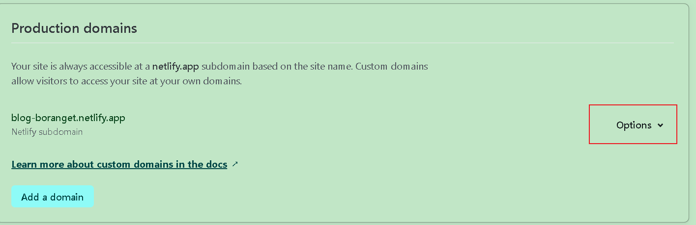

# netlify

与vercel相同，netlify也是一个针对个人用户免费的服务托管服务，但优点是国内可访问

官网地址：https://app.netlify.com/

netlify与github账号进行绑定后，可以自动监控博客仓库的更改从而进行部署。并且国内可以访问。

# 注册

进入官网，点击注册，选择使用github账户登录即可

# 导入仓库

登录后，授权并导入git仓库，允许github仓库读取权限，接着在展示的列表中选中hexo仓库，点击import

# 构建

如果是hexo的构建，一切默认即可，填写完一些信息比如项目的名称后，便可以点击构建

# 展示

构建完成后便会部署到生成的域名，域名可以自定义

