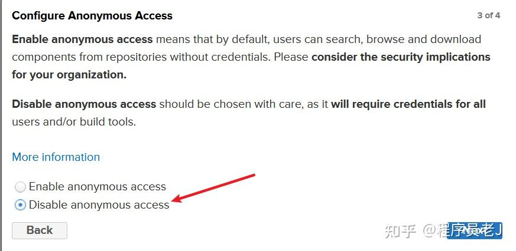
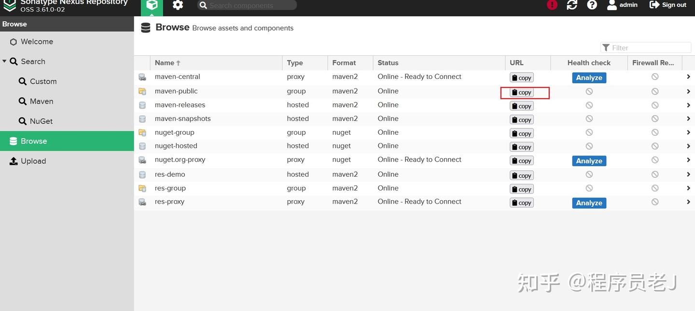
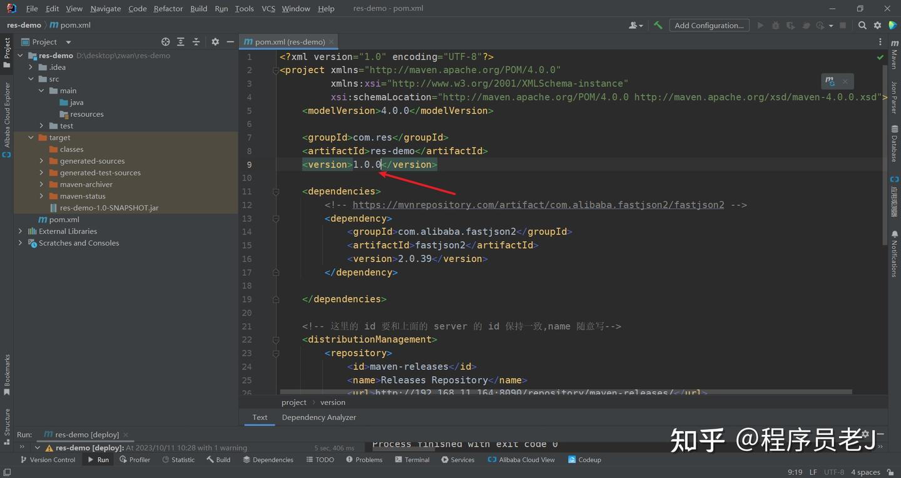

# 参考资料

[从零开始：Nexus私服搭建与Maven仓库配置的完全指南-阿里云开发者社区](https://developer.aliyun.com/article/1328445)

[(35 封私信 / 80 条消息) 超级详细Maven私服搭建：Nexus - 知乎](https://zhuanlan.zhihu.com/p/660765855)

# 用途

主要用于公司或者团队，一来可以做中央仓库镜像，二来可以管理公司自己开发的依赖

# 搭建

- 下载和安装Nexus
- 找到安装包路径，执行nexus.exe  /run

```text
# 启动
/opt/nexus/nexus-3.61.0-02/bin/nexus start
# 查看状态
/opt/nexus/nexus-3.61.0-02/bin/nexus status
#停止
/opt/nexus/nexus-3.61.0-02/bin/nexus stop
```

# 访问

配置文件：\nexus-3.20.1-01\etc\nexus-default.properties

application-port=访问Nexus端口号(默认8081)

application-host=访问Nexus的ip地址(默认localhost本地ip)

账号是admin，密码在\nexus-3.20.1-01\etc\sonatype-work\nexus3\admin.password

# nexus仓库

**默认仓库**

maven-central	Nexus 对 Maven 中央仓库的代理
maven-public	Nexus 默认创建，供开发人员下载使用的组仓库
maven-releasse	Nexus 默认创建，供开发人员部署自己 jar 包的宿主仓库，要求 releasse 版本
maven-snapshots	Nexus 默认创建，供开发人员部署自己 jar 包的宿主仓库，要求 snapshots 版本

其中 maven-public 相当于仓库总和

**自建仓库**

另外可以自己创建仓库

# 匿名访问

可配置匿名访问，下载依赖时无需登陆



# 使用Nexus作为Maven仓库

配置文件中的server部分（未配置匿名访问的情况下需要配置用户名和密码）

```xml
<server><!-- 发布版本-->
   <id>nexus</id> <!-- 随意填写，但项目中repository的id得与这里一致-->
   <username>admin</username> <!-- 账户-->
   <password>admin123</password>  <!-- 密码-->
</server>
<server><!-- 发布版本-->
   <id>nexus-releases</id> <!-- 随意填写，但项目中repository的id得与这里一致-->
   <username>admin</username> <!-- 账户-->
   <password>admin123</password>  <!-- 密码-->
</server>
<server><!-- 发布版本-->
   <id>nexus-snapshots</id> <!-- 随意填写，但项目中repository的id得与这里一致-->
   <username>admin</username> <!-- 账户-->
   <password>admin123</password>  <!-- 密码-->
</server>
```

配置mirror节点

```xml
<mirror>
  <id>nexus</id>
  <!--表示访问哪些工厂时需要使用镜像-->
  <mirrorOf>*</mirrorOf>
  <url>http://localhost:8081/repository/maven-public/</url>
</mirror>
```



# 将 jar 包部署到 Nexus

在项目的pom.xml中做配置，这里的 id 要和上面的 server 的 id 保持一致,name 随意写

```xml
<!-- 本地nexus私有库-->
<distributionManagement>
    <snapshotRepository>
        <id>nexus-snapshots</id>
        <name>snapshots</name>
        <url>http://localhost:8081/repository/maven-snapshots/</url>
    </snapshotRepository>
    <repository>
        <id>nexus-releases</id>
        <name>release</name>
        <url>http://localhost:8081/repository/maven-releases/</url>
    </repository>
</distributionManagement>
```

版本号默认为**1.0-SNAPSHOT**，所以就对应发布到**snapshot**

要发布到releases仓库该需要将版本号改为正式版本号

