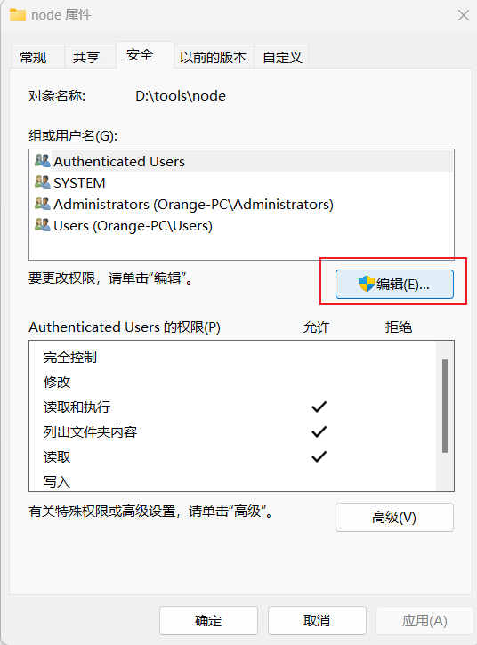

# 参考资料

[【Node.js】Node.js安装及环境配置-腾讯云开发者社区-腾讯云 (tencent.com)](https://cloud.tencent.com/developer/article/1572591)

# 下载

官网下载 [Node.js (nodejs.org)](https://nodejs.org/en)

# 软件安装

打开node安装程序，一直默认+next即可，中途碰到选择安装位置可以自定义一下。这里安装目录为“D:\tools\node”

# 软件配置

## 分配权限

首先选择安装目录 node ，右键属性->安全->编辑，勾选完全控制




## 配置环境变量

在node文件夹下新建两个文件夹，分别命名为 “node_global” 和 “node_cache”

打开命令行，输入如下命令

```bash
npm config set prefix D:\tools\node\node_global
npm config set cache D:\tools\node\node_cache
```

打开环境变量设置，在系统变量下新建“NODE_PATH”，值为 “D:\tools\node\node_global\node_modules”

用户变量下Path新增 “D:\tools\node\node_global”

# 测试

打开命令行，执行

```bash
npm install -g cnpm --registry=https://registry.npmmirror.com
```

D:\tools\node\node_global\node_modules 文件夹中出现 cnpm 文件夹即代表配置成功

至此node配置结束