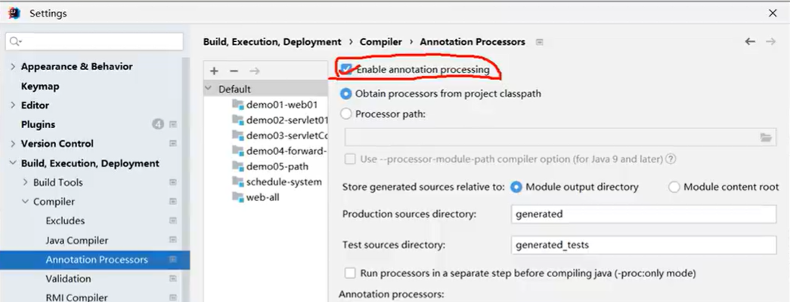

# 安装

- 在idea插件市场找到lombok插件进行安装：Lombok

    新版idea会默认安装

- 在idea的设置中启用 enable annotation processing

    Build, Execution, Deployment > Compuler > Annoation Processors

    

- 导入LomBok依赖

# 构造器相关

- @AllArgsConstructor 全参数构造器
- @NoArgsConstructor 全参数构造器

# Getter与Setter

- @Getter
- @Setter

# equals

- @EqualsAndHashCode

# toString

- @ToString

## @Data

相当于标记了Getter与Setter、equals以及toString