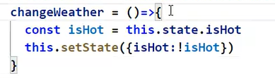

# 虚拟DOM

- 本质是object类型的一般对象
- 虚拟DOM比较轻，因为虚拟DOM是React的内部使用，无需真实DOM的那么多属性
- 虚拟DOM最终会被React转换为真实DOM呈现在页面上

# jsx语法

- 定义虚拟DOM时，不要写引号
- 标签中混入jsx表达式且只能是表达式时要用{}
- 样式的类名指定不要用class会与react中class冲突，需要使用className
- 只有一个根标签
- 标签必须闭合
- 标签首字母
  - 小写字母开头react会理解为htmlyuansu，若html元素中无同名标签，则报错
  - 大写字母开头，react会理解为对应的组件，若组件没有定义，则报错

- 注意js表达式和js语句的区别
  - 表达式可返回一个值  

# 函数式组件

- 首字母必须大写
- 引用需要加尖括号作为一个标签

## 至于

React.DOM(函数式组件，........)，后发生了什么

1. React解析组件标签，找到了组件
2. 发现组件是函数式组件，调用该函数，获取虚拟DOM，将其转换为真实DOM，呈现在页面中。

# 类

1. 类中的构造器不是必须要写的，除非要对实例进行一些初始化
2. 若A类继承B类，且A类中写了构造器，则A类构造器中必须调用super的构造器
3. 类中所定义的方法，都是放在了类的原型对象上，供实例去使用。

# 类组件

组件中的render方法

- render是放在哪里的？
  - 组件的原型对象上，供实例使用
- render中的this是谁
  - 组件的实例对象

React.DOM(类组件，........)，后发生了什么

1. React解析组件标签，找到了组件
2. 发现组件是类组件，new出了该类的实例，调用该实例的render函数，获取虚拟DOM，将其转换为真实DOM，呈现在页面中

# 原生事件绑定

```html
<button id= "btn1">btn1</button>
<button id= "btn2">btn2</button>
<button onclick="demo()">btn3</button>
<script type = "text/javascript">
	const btn1 = document.getElementById('btn1')
    btn1.addEventListener('click',()=>{
        alert('btn1 was clicked')
    })
    const btn2 = document.getElementById('btn2')
    btn1.onClick = ()=>{
        alert('btn2 was clicked')
    }
    function demo(){
        alert('btn3 was clicked')
    }
</script>
```

# this

- 不开启严格模式,函数中的this指向为window
-  开启严格模式,函数中的this指向为undefined
- 通过组件实例去调用组件实例内部的函数,组件实例函数中的this指向组件实例
- 类中方法this的指向
  -  类中所有方法在局部都开起了严格模式
  - 类中方法作为回调函数时,不是通过实例调用,而是直接调用,这时this为undefined.
  - 在构造器和render中的this为当前实例,可在构造器中使用bind方法,获取一个绑定了当前实例对象的方法,然后将方法赋予当前实例对象中的同名函数.
- 箭头函数与直接function的区别
  - a = ()=>{} 与 a = function(){}
  - 箭头函数没有自己的this,当在其中调用this时,会寻找其外部函数的this

# state

state值必须是一个对象,通过更新与监控state的变化来重新渲染

组件中自定的函数中的this默认都为undefined

- 构造器中使用bind
- 使用赋值语句加箭头函数

状态数据不能直接修改更新,需要使用setState

## 构造器作用

- 初始化状态

- 绑定this

  - 若不想绑定bind,可使用赋值语句加箭头函数

    

# 展开运算符

- 展开一个数组
- 连接数组
  - arr3 = [...arr1,...arr2]
- 不定参数列表
- {...person}复制一份对象
  - 复制时可修改属性 

# props

- 通过标签属性传值
  - 字符串""
  - 数值{}
- props只读
- 可对props限制于默认值与类型限制
  - 静态变量 propTypes，defaultProps

- 函数值组件可通过参数接受来使用props
# refs
使用ref标识标签可获得标签的对象
- 使用字符串

- 使用回调

  - 内联回调ref = {c => this.a1 = c}

    const {a1} = this

  - 绑定函数 ref = this.fun

    fun = (c)=>{this.a1 = c}

- createRef
  
  - 获取一个容器

# 生命周期

生命周期函数都是由组件实例所调用，注意其中this指向

- componentDidMount 组件已挂载
- componentWillUnmount 组件将要卸载

旧生命周期


​    

新生命周期


# key

  