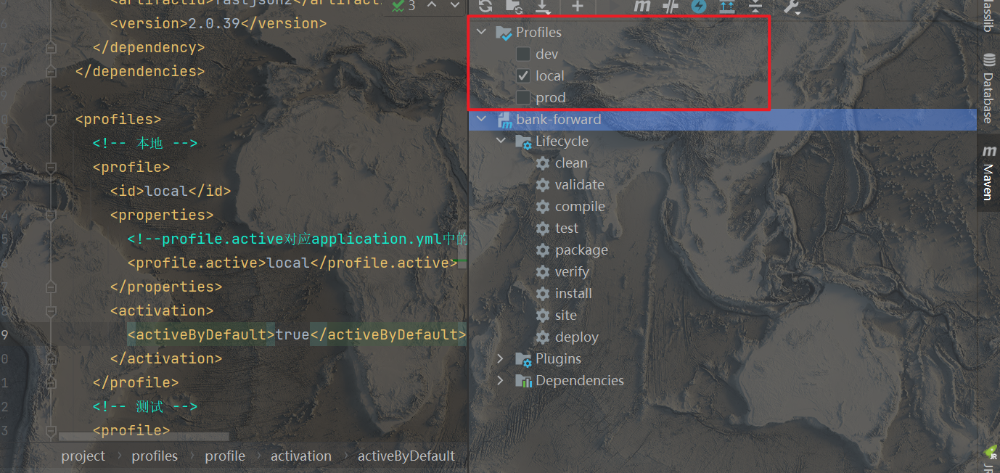
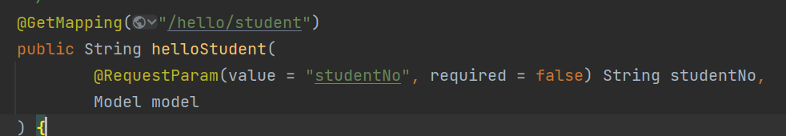

# 个人经验

## 配置注入实体类

1. 编写实体类

   ```java
   public class AppConfig {
      	String appId;
       String apigwPublicKey;
       String priKey;
       String baseUrl;
   }
   ```

2. 参数注入需要set方法，所以加上@Data注解

3. 交由Spring管理当前对象，添加@Component注解

   或在启动类添加@EnableConfigurationProperties（{实体类class}）

4. 设置前缀，添加@ConfigurationProperties(prefix = "app")注解

5. 在配置文件进行配置

   ```yml
   app:
     appId: 123
     apigwPublicKey: 456
     priKey: 789
     baseUrl: 0
   ```

6. 使用，在需要用到的类@Autowired AppConfig即可

### 提示配置

引入依赖

```xml
<!--自定义配置处理器-->
<dependency>
    <groupId>org.springframework.boot</groupId>
    <artifactId>spring-boot-configuration-processor</artifactId>
    <optional>true</optional>
</dependency>
```

如果无效果，检查maven插件版本是否吻合，尝试install查看是否会报错

## 配置文件优先级

### 覆盖关系：

  对于key不同，则直接生效；

  对于key相同的同名配置项，后加载会覆盖掉前加载，故而最终为后加载的配置项生效

### 本地配置

- 同文件名配置 *.yaml **加载先于** *.properties
- bootstrap配置 **加载先于** application配置
- 不带profile的配置 **加载先于** 带profile的配置

**故**

1. bootstrap.yaml
2. bootstrap.properties
3. bootstrap-{profile}.yaml
4. bootstrap-{profile}.properties
5. application.yaml
6. application.properties
7. application-{profile}.yaml
8. application-{profile}.properties

### nacos配置

- 本地配置 **加载先于** nacos配置中心
-  nacos配置中心上共享配置(见下说明) **加载先于** nacos配置中心该服务配置（见下说明）
- 不带profile的配置 **加载先于** 带profile的配置
- nacos配置中心因需要通过data ID指定（或者通过spring.cloud.nacos.config.file-extension指定后缀），所以对于Nacos配置中心上的某个Data ID而言，不会存在既加载其*.yaml又加载其*.properties的情形。

**故**

1. 本地配置
2. nacos配置中心共享配置（通过spring.cloud.nacos.config.shared-configs指定）
3. Nacos配置中心该服务配置（通过spring.cloud.nacos.config.prefix和spring.cloud.nacos.config.file-extension指定）
4. Nacos配置中心该服务-{profile}配置（通过spring.cloud.nacos.config.prefix和spring.cloud.nacos.config.file-extension、以及spring.profiles.active指定）

## controller 请求参数注入命名转换

**参考资料** [springboot项目配置参数请求及返回均为下划线方式_springboot responsebody 指定返回的格式 为下划线分割_偶系渣渣灰的博客-CSDN博客](https://blog.csdn.net/breakaway_01/article/details/119033959)

在配置文件中添加配置

```yaml
spring:
  jackson:
    property-naming-strategy: SNAKE_CASE #下划线参数
```

CamelCase策略，Java对象属性：personId，序列化后属性：persionId

PascalCase策略，Java对象属性：personId，序列化后属性：PersonId

SnakeCase策略，Java对象属性：personId，序列化后属性：person_id

KebabCase策略，Java对象属性：personId，序列化后属性：person-id

## 多配置切换

可同时定义多个配置文件，命名方式为“application-*.yml”，如


- 切换方法一：修改springboot配置文件

  在application.yml中配置

  ```properties
  spring.profiles.active=dev
  spring.profiles.active=local
  spring.profiles.active=prod
  ```

- 切换方法二：maven配置

  maven在编译时可以动态决定当前编译环境

  application.yml中配置为：

  ```properties
  # @@中变量名可自定义，但要与下面的配置中标签相同
  spring.profiles.active=@profiles.active@
  ```

  maven中配置profiles内容

  ```xml
   <profiles>
      <!-- 本地 -->
      <profile>
        <id>local</id>
        <properties>
          <!--profile.active对应application.yml中的@profile.active@-->
          <profile.active>local</profile.active>
        </properties>
        <activation>
          <!-- 默认选择的配置 -->
          <activeByDefault>true</activeByDefault>
        </activation>
      </profile>
      <!-- 测试 -->
      <profile>
        <id>dev</id>
        <properties>
          <!--profile.active对应application.yml中的@profile.active@-->
          <profile.active>dev</profile.active>
        </properties>
      </profile>
      <!-- 正式 -->
      <profile>
        <id>prod</id>
        <properties>
          <!--profile.active对应application.yml中的@profile.active@-->
          <profile.active>prod</profile.active>
        </properties>
      </profile>
    </profiles>
  ```

  该配置会在maven工具中生成profile菜单，可进行勾选

  

  如果想要在编译时排除其他环境的配置，可以在pom中配置

  ```xml
  <build>
      <resources>
        <!--排除配置文件-->
        <resource>
          <directory>src/main/resources</directory>
          <!--先排除所有的配置文件-->
          <excludes>
            <!--使用通配符，当然可以定义多个exclude标签进行排除-->
            <exclude>application*.yml</exclude>
          </excludes>
        </resource>
   
        <!--根据激活条件引入打包所需的配置和文件-->
        <resource>
          <directory>src/main/resources</directory>
          <!--引入所需环境的配置文件-->
          <filtering>true</filtering>
          <includes>
            <include>application.yml</include>
            <!--根据maven选择环境导入配置文件-->
            <include>application-${profile.active}.yml</include>
          </includes>
        </resource>
      </resources>
    </build>
  ```

  

# 别的一些

**SpringBoot与Spring的关系、SpringAOP/IOC了解**
Spring Boot 为Spring的扩展封装，免去了很多配置，使得使用spring更加便捷

**SpringAOP：面向切面编程**
AOP 要达到的效果是，保证开发者不修改源代码的前提下，去为系统中的业务组件添加某种通用功能。比如添加日志等。AOP 的本质是由 AOP 框架修改业务组件的多个方法的源代码，AOP是代理模式的典型应用。
**SpringIOC：控制反转**
Spring来控制对象的生命周期
DI：依赖注入，spring依赖注入，不用关心具体的实现，比如日志有多个框架，我们只需要知道spring会给我们提供，不需要了解底层用的哪个框架

spring boo提供了很多stater，官方配置，可以直接用；组件需要依赖的其他jar包，也会自动导入。

# SpringBoot自动装配原理

Spring Boot启动的时候会通过@EnableAutoConfiguration注解找到META-INF/spring.factories配置文件中的所有自动配置类，并对其进行加载，这些自动配置类都是以AutoConfiguration结尾来命名的，它实际上就是一个JavaConfig形式的Spring容器配置类，通过@Bean导入到Spring容器中，以Properties结尾命名的类是和配置文件进行绑定的。它能通过这些以Properties结尾命名的类中取得在全局配置文件中配置的属性，我们可以通过修改配置文件对应的属性来修改自动配置的默认值，来完成自定义配置

# SpringBoot版本

- 版本号

Spring Boot 的版本号由 3 位组成，这里还是以上边两个版本为例，如下图：


- 主版本：有可能进行大的架构调整，各大版本之间并不一定兼容

- 次版本：在主版本架构不变的前提下，增加了一些新的特性或变化

- 增量版本：bug 修复，细节的完善，用来描增量版本的，不一定是数字，例如：3.0.0-SNAPSHOT

- 发布状态

发布状态也有很多同行人称为发布计划，常见的有以下几个：

- GA：General Availability，正式发布的版本，官方推荐使用该版本，国外很多项目都是使用GA来表示正式发布版本的

- PRE：预览版，主要是用来内部开发人员和测试人员测试使用，因此不建议使用

- SNAPSHOT：快照版，可以稳定使用，且该版本会一直进行小量的优化和改进

- RC：Release，该版本已经相当成熟了，基本上不存在导致错误的BUG，与即将发行的正式版相差无几。

# RestFul接口规范

RESTful的特点： a. 每个互联网资源都有一个唯一的URI地址； b. 通过操作资源的表现形式来操作资源； c. 一般情况下使用JSON格式来表示具体的数据； c. 使用HTTP协议进行客户端与服务端之间的交互，从客户端到服务端的每个请求都必须包含理解请求所必需的信息； d. 客户端使用GET、POST、PUT（patch）、DELETE 4个表示操作方式的动词对服务端资源进行“状态”操作。

- 命名必须全部`小写`
- 资源（resource）的命名必须是`名词`，并且必须是`复数形式`
- 如果要使用连字符，建议使用‘ - ’而不是‘ _ ’，‘ _ ’字符可能会在某些浏览器或屏幕中被部分遮挡或完全隐藏
- 易读

# 常用注解

## 启动注解

- @SpringBootApplication
  - 启动类注解
  - 包含@SpringBootConfiguration，@EnableAutoConfiguration，@ComponentScan
- @SpringBootConfiguration
  - 继承@Configuration，标注当前类为配置类，会将当前类中声明的一个或多个以@Bean注解标记的方法纳入spring容器中，且实例名就是方法名
- @EnableAutoConfiguration
  - 将当前所有符合条件的配置都加载到当前SpringBoot创建并使用IOC容器。
- @ComponentScan
  - 自动扫描并加载符合条件的组件或bean定义，最终将改些bean加载到容器中
  - 可以通过basePackages等属性指定@ComponentScan自动扫描的范围，如果不指定，则默认Spring框架实现从声明@ComponentScan所在类的package进行扫描，默认情况下是不指定的，所以SpringBoot的启动类最好放在root package下。

## Controller相关注解

- @Controller
  - 控制器，处理HTTP请求
- @RestController
  - 将方法返回的对象直接在浏览器上展示成json格式
- @RequestBody
  - 通过HttpMessageConverter读取Request Body并反序列化为Object（泛指）对象
- @RequestMapping
  - 会将 HTTP 请求映射到 MVC 和 REST 控制器的处理方法上
- @GetMapping / @PostMapping
  - 将HTTP get / post请求映射到特定处理

## 取请求参数值

- PathVariable

```
@Controller
@RequestMapping("/User")
public class HelloWorldController {

    @RequestMapping("/getUser/{uid}")
    public String getUser(@PathVariable("uid")Integer id, Model model) {
        System.out.println("id:"+id);
        return "user";
    }
}
```

- RequestParam

```
@RequestMapping("/getUser")
public String getUser(@RequestParam("uid")Integer id, Model model) {
    System.out.println("id:"+id);
    return "user";
}
```

- @RequestHeader 把Request请求header部分的值绑定到方法的参数上
- @CookieValue 把Request header中关于cookie的值绑定到方法的参数上

# SpringBoot 核心功能

- 独立运行spring项目，springboot 可以以jar包的形式独立运行
  - 打包:https://blog.csdn.net/jin_tk/article/details/88226287

```text
java -jar xx.jar
```

- 使用嵌入式的Servlet容器,应用无需打成war包
- 大量自动配置,简化开发,可修改默认配置
- 提供starter简化Maven配置。Springboot提供了一系列的start pom用来简化maven依赖。如：常用的spring-boot-starter-web、spring-boot-starter-tomcat、spring-boot-starter-actuator

- 准生产环境的运行时应用监控
- 自动配置spring,Springboot会根据我们项目中类路径的jar包，为jar包的类进行自动装配bean。

- 应用监控。springboot提供了基于HTTP、ssh、telnet对运行时的项目进行监控。springboot提供了actuator组 件，只需要在配置中加入spring-boot-starter-actuator依赖，通过继承AbstractHealthIndicator这个抽象类， 然后在doHealthCheck()方法中检测服务健康的方法，就可以实现一个简单的监控。


# idea构建spring boot 项目

- 脚手架使用阿里的,速度会快一点
- 记得配置maven的镜像,不然下载很慢
  - 如无配置,可新建一个settings.xml

## pom文件

管理依赖

## 启动类

一个普通的Java程序需要有一个入口，一般是某个类中的main方法。我们启动程序，就是运行这个 main方法。SpringBoot的主程序也就是整个项目的入口，同样会有一个main方法。SpringBoot项目就是从主程 序开始运行的。下图是一个实际项目中的主程序，对于SpringBoot程序来说，必须要用@SpringBootApplication 来标识启动类。其他的注解都是实际项目中为了实现其他的功能而添加的。

## 配置文件

- application.properties

- application.yml

**配置文件的作用**

- 修改SpringBoot自动配置的默认值 SpringBoot的底层把我们的常用配置都给我们配置好了，一般来说我们不需要去调整大部分的配置，直接使 用默认的配置就好。这也是SpringBoot“习惯大于配置”的思想。但有的时候默认值不符合我们项目的要求， 这个时候我们就可以通过配置文件来修改这些默认值

- 为程序添加变量

  有的时候我们不会把所有的变量都写死在代码中，有些东西是会经常发生变化，或者不同环境的值不同。比如 对接系统接口的地址、数据库的连接信息等等。这个时候我们就可以将这些内容写在配置文件中，程序在使用 的时候，可以去读取配置文件中的值。

**profile**

Profile是Spring对不同环境提供不同配置功能的支持，可以通过激活、指定参数等方式快速切换环境 多profile文件形式： – 格式：application-{profile}.properties/yml： • application-dev.properties、application-prod.properties


# 入门案例

1. 搭建一个spring boot 工程并开发几个简单的接口

   a. GET: 接口传入id参数，后端返回id*100后的结果 

   ```java
   /**
    * GET: 接口传入id参数，后端返回id*100后的结果
    * @param id
    * @return
    */
   @GetMapping("/id-plus-100")
       public String getIdPlus100(
               @RequestParam("id") Integer id
       ){
           return String.valueOf(id*100);
       }
   ```

   

   b. POST:接口传入{name: ”张三” ,sex: “男” ,age: “18”}，后端返回“张三，男性，18周岁” 

   ```java
    /**
        * POST:接口传入{name: ”张三” ,sex: “男” ,age: “18”}，后端返回“张三，男性，18周岁”
        * @param name
        * @param sex
        * @param age
        * @return
        */
       @PostMapping("/user")
       public String postUser(
               @RequestParam("name") String name,
               @RequestParam("sex") String sex,
               @RequestParam("age") Integer age
       ){
           return String.valueOf(name+","+sex+"性"+","+age+"周岁");
       }
   ```

   

   c. PUT:接口传入{name: ”张三” ,sex: “男” ,age: “18”} ，后端返回{name: ”张三” ,sex: “男” ,age: “18” ， mark: “已成年”} 

   ```java
   /**
        * PUT:接口传入{name:”张三”,sex:“男”,age:“18”} ，后端返回{name:”张三”,sex:“男”,age:“18”， mark:“已成年”}
        * @param name
        * @param sex
        * @param age
        * @return
        */
   
       @PutMapping("/user-mark")
       public String putUserMark(
               @RequestParam("name") String name,
               @RequestParam("sex") String sex,
               @RequestParam("age") Integer age
       ){
           StringBuilder sb = new StringBuilder();
           sb.append("{");
           sb.append("name:”");
           sb.append(name);
           sb.append("”,sex:“");
           sb.append(sex);
           sb.append("“,age:“");
           sb.append(age);
           sb.append("“， mark:“");
           if(age >= 18){
               sb.append("已成年”}");
           }else {
               sb.append("未成年”}");
           }
   
           return String.valueOf(sb);
       }
   ```

   

   

   d. DELETE: 接口传入{name: ”张三” ,sex: “男” ,age: “18”} ，后端返回， “张三信息已删除“

   ```java
   /**
        * DELETE: 接口传入{name: ”张三” ,sex: “男” ,age: “18”} ，后端返回， “张三信息已删除“
        * @param name
        * @param sex
        * @param age
        * @return
        */
       @DeleteMapping("/user")
       public String deleteUser(
               @RequestParam("name") String name,
               @RequestParam("sex") String sex,
               @RequestParam("age") Integer age
       ){
           return String.valueOf(name+"信息已删除");
       }
   ```

   

   

   


# 一个案例

## 引入依赖

```xml
		<dependency>
            <groupId>org.springframework.boot</groupId>
            <artifactId>spring-boot-starter-web</artifactId>
        </dependency>
		<dependency>
            <groupId>org.springframework.boot</groupId>
            <artifactId>spring-boot-starter-thymeleaf</artifactId>
        </dependency>
        <dependency>
            <groupId>org.springframework.boot</groupId>
            <artifactId>spring-boot-devtools</artifactId>
            <scope>runtime</scope>
            <optional>true</optional>
        </dependency>
```


## Student表的增删改查

~~~java
package com.example.firstdemo.api.controller;

import com.example.firstdemo.app.servive.HandStudentService;
import com.example.firstdemo.domain.entity.HandStudent;
import com.example.firstdemo.infra.util.Utils;
import org.springframework.beans.factory.annotation.Autowired;
import org.springframework.stereotype.Controller;
import org.springframework.ui.Model;
import org.springframework.web.bind.annotation.*;

import java.util.ArrayList;
import java.util.List;

@Controller
public class ListController {
    @Autowired
    HandStudentService handStudentService;

    /**
     * 若传入了学号,则按照学号查询,否则查询所有学生信息
     *
     * @param studentNo
     * @param model
     * @return
     */
    @GetMapping("/hello/student")
    public String helloStudent(
            @RequestParam(value = "studentNo", required = false) String studentNo,
            Model model
    ) {
        List<HandStudent> studentList = new ArrayList<>();
        if (studentNo != null) {
            HandStudent s = handStudentService.selectByStudentNo(studentNo);
            studentList.add(s);
        } else {
             studentList = handStudentService.selectAll();
        }
        model.addAttribute("studentList", studentList);

        return "list";
    }

    /**
     * 新增学生信息
     *
     * @param studentName
     * @param studentAge
     * @param studentGender
     * @param model
     * @return
     */
    @PostMapping("/hello/student")
    public String insertStudent(
            @RequestParam("studentName") String studentName,
            @RequestParam("studentAge") String studentAge,
            @RequestParam("studentGender") String studentGender,
            Model model

    ) {
        // 查出当前最大学号
        String maxNo = handStudentService.selectMaxNo();
        Integer maxNoNum = Integer.valueOf(maxNo.substring(1));
        // 生成学号
        // 学号+1并转为字符串
        String newNoStr = String.valueOf(maxNoNum + 1);
        // 左边填充0得到三位学号
        for (int i = 0; i < 3 - (newNoStr).length(); i++) {
            newNoStr = "0" + newNoStr;
        }
        String newNo = "s" + newNoStr;
        // 插入数据
        try {
            HandStudent handStudent = new HandStudent();
            handStudent.setStudentNo(newNo);
            handStudent.setStudentName(studentName);
            handStudent.setStudentAge(Integer.valueOf(studentAge));
            handStudent.setStudentGender(studentGender);
            handStudentService.insertHandStudent(handStudent);
            model.addAttribute("insert_msg", "添加成功");
        } catch (Exception e) {
            model.addAttribute("insert_msg", "添加失败");
        }


        // 返回插入的数据
        HandStudent s = handStudentService.selectByStudentNo(newNo);
        model.addAttribute("student", s);
        return "list";
    }

    /**
     * 修改学生信息
     *
     * @param studentNo
     * @param studentName
     * @param studentAge
     * @param studentGender
     * @param model
     * @return
     */
    @PutMapping("/hello/student")
    public String updateStudent(
            @RequestParam("studentNo") String studentNo,
            @RequestParam("studentName") String studentName,
            @RequestParam("studentAge") String studentAge,
            @RequestParam("studentGender") String studentGender,
            Model model

    ) {
        // 学号是否为空判断
        if (!Utils.isNotEmptyStr(studentNo)) {
            model.addAttribute("update_msg", "修改失败,学号不能为空");
            return "list";
        }
        // 修改数据
        try {
            HandStudent handStudent = new HandStudent();
            if (Utils.isNotEmptyStr(studentName)) {
                handStudent.setStudentName(studentName);
            }
            handStudent.setStudentNo(studentNo);
            if (Utils.isNotEmptyStr(studentAge)) {
                handStudent.setStudentAge(Integer.valueOf(studentAge));
            }
            if (Utils.isNotEmptyStr(studentGender)) {
                handStudent.setStudentGender(studentGender);
            }

            handStudentService.updateByStudentNo(handStudent);
            model.addAttribute("update_msg", "修改成功");
        } catch (Exception e) {
            model.addAttribute("update_msg", "修改失败");
        }


        // 返回修改的数据
        HandStudent s = handStudentService.selectByStudentNo(studentNo);
        model.addAttribute("student", s);
        return "list";
    }

    /**
     * 删除学生信息
     *
     * @param studentNo
     * @param model
     * @return
     */
    @DeleteMapping("/hello/student")
    public String deleteStudent(
            @RequestParam("studentNo") String studentNo,
            Model model

    ) {
        // 返回修改的数据
        HandStudent s = handStudentService.selectByStudentNo(studentNo);
        model.addAttribute("student", s);
        // 修改数据
        try {

            handStudentService.deleteByStudentNo(studentNo);
            model.addAttribute("delete_msg", "删除成功");
        } catch (Exception e) {
            model.addAttribute("delete_msg", "删除失败");
        }


        return "list";
    }
}

~~~

~~~html
<!DOCTYPE html>
<html lang="en" xmlns:th="http://www.thymeleaf.org">
<head>
    <meta charset="UTF-8">
    <style>
        table {
            width: 100%;
            border-collapse: collapse;
        }

        table caption {
            font-size: 2em;
            font-weight: bold;
            margin: 1em 0;
        }

        th, td {
            border: 1px solid #999;
            text-align: center;
            padding: 20px 0;
        }

        table thead tr {
            background-color: #008c8c;
            color: #fff;
        }

        table tbody tr:nth-child(odd) {
            background-color: #eee;
        }

        table tbody tr:hover {
            background-color: #ccc;
        }


        table tfoot tr td {
            text-align: right;
            padding-right: 20px;
        }
    </style>
</head>
<body>
<h1>查询</h1>
<form action="/hello/student" method="get">
    学号:<br>
    <input type="text" name="studentNo"> <br>
    <input type="submit">
</form>
<table>
    <thead>
    <td>学号</td>
    <td>姓名</td>
    <td>年龄</td>
    <td>性别</td>
    </thead>
    <tbody>

    <tr th:each="student:${studentList}">
        <td th:text="${student.getStudentNo()}"/>
        <td th:text="${student.getStudentName()}"/>
        <td th:text="${student.getStudentAge()}"/>
        <td th:text="${student.getStudentGender()}"/>
    </tr>
    </tbody>

</table>


<h1>新增</h1>
<h2 th:text="${insert_msg}"></h2>
<form action="/hello/student" method="post">
    姓名:<br>
    <input type="text" name="studentName"><br>
    年龄:<br>
    <input type="text" oninput="this.value = this.value.replace(/[^0-9]/g, '');" name="studentAge"> <br>
    性别:<br>
    <input type="text" name="studentGender"> <br>
    <input type="submit">
</form>
<h1>修改</h1>
<h2 th:text="${update_msg}"></h2>
<form action="/hello/student" method="post">
    <input type="hidden" name="_method" value="put"/>
    学号:<br>
    <input type="text" name="studentNo"><br>
    姓名:<br>
    <input type="text" name="studentName"><br>
    年龄:<br>
    <input type="text" oninput="this.value = this.value.replace(/[^0-9]/g, '');" name="studentAge"> <br>
    性别:<br>
    <input type="text" name="studentGender"> <br>
    <input type="submit">
</form>
<h1>删除</h1>
<h2 th:text="${delete_msg}"></h2>
<form action="/hello/student" method="post">
    <input type="hidden" name="_method" value="delete"/>
    学号:<br>
    <input type="text" name="studentNo"> <br>
    <input type="submit">
</form>

</body>
</html>
~~~


## ajax

```html
<!DOCTYPE html>
<html lang="en">
<head>
    <meta charset="UTF-8">
    <script src="https://code.jquery.com/jquery-3.1.1.min.js"></script>
    <script type="text/javascript" src="/static/js/main.js"></script>
    <title>Title</title>
</head>
<body>
<form id="update-student-core">
    学号:<br>
    <input type="text" name="studentNo" id="studentNo"><br>
    课程号:<br>
    <input type="text" name="courseNo" id="courseNo"><br>
    成绩:<br>
    <input type="number" name="core" id="core" value=""><br>
    <input type="submit">
</form>
</body>
</html>
```

```js
$(document).ready(function () {
    // 文档页面加载完成之后
    $("#update-student-core").submit(function (event) {
        //stop submit the form, we will post it manually.
        event.preventDefault();
        fire_ajax_submit();
    });

});
function fire_ajax_submit() {
    var coreObj = {}
    coreObj["studentNo"] = $("#studentNo").val();
    coreObj["courseNo"] = $("#courseNo").val();
    coreObj["core"] = $("#core").val();

    $.ajax({
        type: "PUT",
        contentType: "application/json",
        url: "/hello/student/core",
        data: JSON.stringify(coreObj),
        dataType: 'json',
        cache: false,
        timeout: 600000,
        success: function (data) {
            // alert(data.core);
            $("#core").prop("value",data.core)
        }
    });
}


```

```java

@Controller
public class ajaxController {
    @Autowired
    HandStudentCoreService handStudentCoreService;
    @ResponseBody
    @PutMapping("/hello/student/core")
    public HandStudentCore helloStudentCore(
            @RequestBody HandStudentCore handStudentCore
    ) {
        HandStudentCore handStudentCoreRes = handStudentCoreService.selectByStudentNoAndCourseNo(handStudentCore.getStudentNo(), handStudentCore.getCourseNo());
        return handStudentCoreRes;
    }

    @GetMapping("/hello/student/core")
    public String helloStudent(
            Model model
    ) {
        return "ajax_study";
    }


}

```

# 一些问题

## restful风格的前端请求

- ```
  spring boot 默认关闭了隐藏方法过滤器,使得前端 form 无法发送 put 或者 delete 请求,需要在 yml 中开启
  * spring:
  *   mvc:
  *     hiddenmethod:
  *       filter:
  *         enabled: true
  ```

## required=false

某些请求参数不一定会传入，为了防止400错误，可使用 required = false来设置该参数



## thymeleaf非空判断

thymeleaf中如果要从一个对象中获取属性，但对象有可能为null，可使用问号进行非空判断

## ajax

- ```js
   $.ajax({
          type: "POST", // 发送的请求类型
          contentType: "application/json", // 发送给服务器的编码类型
          url: "/hello/student/core", // 请求地址
          data: JSON.stringify(coreObj), // 发送的数据,这里使用JSON.stringify将一个对象转为JSON格式
          dataType: 'json',//服务器返回的数据类型
          cache: false,
          timeout: 600000, // 超时毫秒
          success: function (data) { // 请求成功后调用的函数
              alert("插入成功");
              // $("#core").prop("value",data.core)
          },
          error: function (){ // 请求失败调用的函数
              alert("插入失败");
          }
      })
  ```

