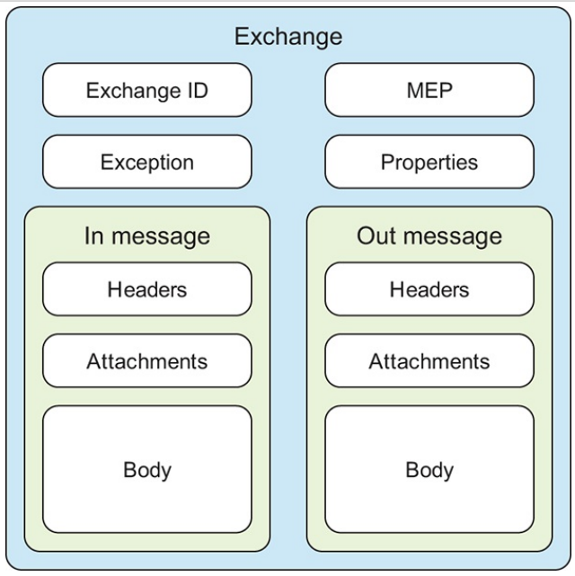

# 认识Camel

## Camel的消息模型

### MESSAGE

message按照一个方向流动，从发送方到接收方。

message包含以下部分

- body

  object类型，无大小限制，若发送接收两方使用不同的body格式，camel提供了适配器组件

- headers

  键值对的形式，存储一些与消息由关的值，比如发送方的标识，或者消息的编码、验证信息等。

  key为大小写不敏感的唯一值，value可以为任意object，且对大小，数量无限制，以map存储

- attachments

  附件，web service或者email 中使用

每个message都有一个string类型的id标识，其唯一性由消息的创建者保证。

message也有失败标识“fault flag”，在一些协议中比如soap，错误信息和返回的消息是不同的消息。 但它们都属于合法的响应

### EXCHANGE

exchange是message在routing过程时的容器

exchange包含以下部分

- exchange id

  camel自动生成的exchange唯一标识

- MEP

  标识是否需要响应，如果该值为`inOnly`

  ，则exchange只包含inMesage，如果是`inOut`，则exchange会包含请求消息和响应消息

- Exception

  如果在路由过程中出现了error，则异常会存入该字段

- Properties

  在整个exchange的过程中做数据存取操作，类似于message中的header，但是范围是整个exchange，而header只在消息中有效

- In message

  Input message, 在一个exchange中肯定会有一个in message，其内容为请求消息

- Out message

  当MEP为`InOut`，exchange中会包含out message，其内容为响应消息

