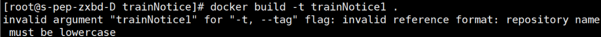

# 概念

## 镜像

只读模板，用于创建容器

## 容器

由模板创建的  实例，包括一个linux环境和运行在其中的应用     

## 仓库

存放镜像的地方

# 安装

需要在linux上部署docker

仓库安装时注意不要选择国外镜像
阿里云个人加速服务 

# 服务命令

启动 systemctl start docker 

停止 systemctl stop docker

重启 systemctl restart docker

查看状态 systemctl status docker

开机启动 systemctl status docker

查看docker概要信息 docker info

查看总体帮助文档 docker --help

查看命令帮助文档 docker 具体命令 --help

# 镜像

## 操作

- 查看本地镜像：docker images

- 在远端仓库查找镜像-限制数目：docker search

- 拉取镜像（下载），不加tag默认最新：docker pull

- 删除镜像：docker rmi 镜像id

- 查看镜像、容器、数据卷所占的空间：docker system df

- 运行镜像：docker run ***
    在本地仓库寻找有没有这个镜像，若有，照其实例化一个容器，若没有，在远端仓库查找有无该镜像，若有，下载到本地仓库并执行，若无，报错找不到
- 打包镜像：docker build -t myimage .
    打包一个Docker镜像主要需要通过Dockerfile来完成。Dockerfile是一个文本文件，包含了一组用于创建Docker镜像的指令。

## 概念

虚悬镜像 仓库名，标签名都是none的镜像，无用，删除 

# docker拉取nacos

```shell
//拉取2.0.3版本
docker pull nacos/nacos-server:2.0.3
```

# docker部署SpringBoot项目

## 插件配置

官方推荐使用 [dockerfile-maven-plugin](https://github.com/spotify/dockerfile-maven)

docker-maven-plugin：We recommend you use dockerfile-maven instead.

注意：需要结合Dockerfile文件，设置环境变量

```xml
 <build>
        <plugins>
            <plugin>
                <groupId>org.apache.maven.plugins</groupId>
                <artifactId>maven-compiler-plugin</artifactId>
                <version>3.8.1</version>
                <configuration>
                    <source>1.8</source>
                    <target>1.8</target>
                    <encoding>UTF-8</encoding>
                </configuration>
            </plugin>
            <!--jar包主类设置-->
            <plugin>
                <groupId>org.springframework.boot</groupId>
                <artifactId>spring-boot-maven-plugin</artifactId>
                <version>${spring-boot.version}</version>
                <configuration>
                    <mainClass>com.example.springweb.SpringWebApplication</mainClass>
                </configuration>
                <executions>
                    <execution>
                        <id>repackage</id>
                        <goals>
                            <goal>repackage</goal>
                        </goals>
                    </execution>
                </executions>
            </plugin>
            <plugin>
                <groupId>com.spotify</groupId>
                <artifactId>dockerfile-maven-plugin</artifactId>
                <version>1.4.13</version>
                <!--在build或push的时候自动执行本插件-->
                <executions>
                    <execution>
                        <id>default</id>
                        <goals>
                            <goal>build</goal>
                            <goal>push</goal>
                        </goals>
                    </execution>
                </executions>
                <configuration>
                    <repository>${docker.image.prefix}/springboottestdocker</repository>
                    <!--tag就相当于版本-->
                    <tag>${project.version}</tag>
                    <buildArgs>
                        <JAR_FILE>target/${project.build.finalName}.jar</JAR_FILE>
                    </buildArgs>
                </configuration>
            </plugin>
        </plugins>
    </build>
```

上述配置中，`<repository>` 指定了 Docker 镜像的仓库地址，`<buildArgs>` 用于传递构建参数给 Dockerfile。

## 编写dockerfile文件

在项目根目录（与pom同级）编写名为`Dockerfile`的文件，无后缀

- FROM 表示在什么镜像的基础上
- VOLUME 表示创建一个临时文件夹
- ARG 表示获取maven插件中定义的变量，key为标签名
- COPY 表示将打包出的jar文件复制到容器中的哪里
- ENTRYPOINT 表示run容器的时候会执行的命令
- 如果需要暴露端口使用EXPOSE

```dockerfile
FROM openjdk:8-jdk-alpine
VOLUME /tmp
ARG JAR_FILE
COPY ${JAR_FILE} app.jar
EXPOSE 8080
ENTRYPOINT ["java","-jar","app.jar"]
```

## 打包

注意要在docker服务启动的情况下执行，否则会显示 \\.\pipe\docker_engine (系统找不到指定的文件。)

同时注意确保设置了打包后jar包的运行主类，否则无法执行

重新打包记得把target删除，clean删不了就手动删

```shell
mvn clean package dockerfile:build
```

## 运行

```shell
docker run -p 8080:8080 -t testrep/springboottestdocker:0.0.1-SNAPSHOT
# 如果执行
docker run -p 8080:8080 -t testrep/springboottestdocker
# 会去找 testrep/springboottestdocker:latest，但我们没有这个镜像版本，只有0.0.1-SNAPSHOT，所以必须加上版本号
```

# 命名规范

Docker容器和镜像的命名长度不应超过**255个字符**。 过长的命名可能导致一些问题，比如在某些系统中无法识别或无法正常使用。 

Docker命名规则允许使用字母、数字、下划线和连字符。 命名应该以字母开头，并且只能包含小写字母。 命名中不允许使用大写字母、空格、特殊字符或中文字符。包括镜像名和仓库名，所以在以组件名打包的时候需要注意。



# docker部署nginx

## 拉取镜像

```shell
docker pull nginx
# 或加版本
docker pull nginx:xxx
```

## 运行

```shell
docker run  --name nginx_test -p 80:80 -d nginx
```

## 复制配置文件到宿主机

```bash
# 创建目录用于存放
mkdir nginx
# 复制文件到宿主机
docker cp nginx_test:/etc/nginx/nginx.conf E:\test\dockertest\nginx
docker cp nginx_test:/etc/nginx/conf.d E:\test\dockertest\nginx
docker cp nginx_test:/usr/share/nginx/html E:\test\dockertest\nginx
```

## 停止容器并删除

```bash
docker stop nginx_test
docker rm nginx_test
```

## 挂载文件重新启动

```bash
docker run -p 80:80 --name nginx_test -v /E/test/dockertest/nginx/nginx.conf:/etc/nginx/nginx.conf -v /E/test/dockertest/nginx/conf.d:/etc/nginx/conf.d -v /E/test/dockertest/nginx/log:/var/log/nginx -v /E/test/dockertest/nginx/html:/usr/share/nginx/html -d nginx
```

## 修改文件内容查看是否生效

修改index.html，保存刷新页面，内容更改