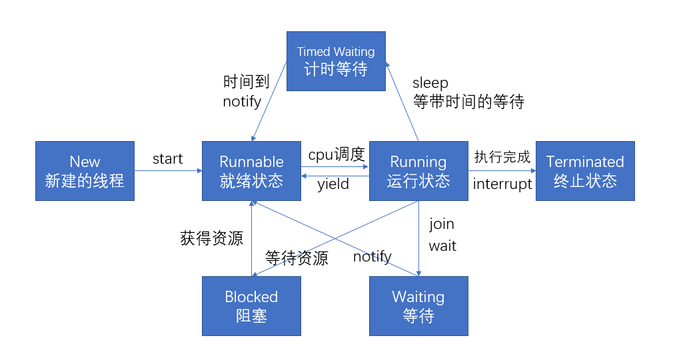

# JUC概述

**Java.util.concurrent**

## 基本概念



- 进程：资源分配最小单元

- 线程：操作系统调度的最小单元

- 线程状态
  - NEW
  
    新建的线程实例会进入new状态
  
  - RUNNABLE
  
  就绪状态，已经达到可以执行的条件了，等待cpu的调度
  
  - RUNNING
  
    获得了cpu的时间片，正在执行，在java中此状态与Runnable合并了
  
  - BLOCKED
  
    获取资源的状态，比如正在等待进入synchronized区域的时候
  
  - WAITTING
  
    不会被cpu调度，除非显式唤醒
  
  - TIMED_WAITING
  
    和waitting是一个性质，不过在等待时间到达后会被自动唤醒
  
  - TERMINATED
  
    结束，且不可再被调用，否则抛出异常
  
- wait/sleep

  - sleep是thread类的静态方法， wait是object的方法
  - sleep不会释放锁(不会释放占用的资源比如进入的同步块)，wait会释放锁，可以让其他线程获取资源。
  - 都可以被interrupted中断

  ```java
  public class ThreadTest {
      static Thread t1 = new Thread(new MyThread(), "t1");
      static Thread t2 = new Thread(new MyThread(), "t2");
      public static void main(String[] args) throws InterruptedException {
          t1.start();
          t2.start();
  
      }
      static synchronized void lockOut(){
          for(int i = 0; i < 99; i ++){
              System.out.println(Thread.currentThread().getName()+": "+i+" "+Thread.currentThread().getState());
              if(i==55){
                  try {
                      // wait 方法和 notify 方法都是监听者调用，且必须在同步块中调用
                      ThreadTest.class.notify();
                      ThreadTest.class.wait();
                  } catch (InterruptedException e) {
                      e.printStackTrace();
                  }
              }
          }
          ThreadTest.class.notify();
      }
  }
  class MyThread implements Runnable{
      @Override
      public void run() {
          ThreadTest.lockOut();
      }
  }
  ```

- 并发和并行

- 管程

  充当监视器的对象

- 用户/守护线程

  - 用户线程

    自定义线程默认都是用户线程

  - 守护线程

    守护线程会在非守护线程结束后自动结束，比如垃圾回收线程

    ```java
    public class Thread01 {
        public static void main(String[] args) {
            Thread thread = new Thread(() -> {
                System.out.println(Thread.currentThread().getName() + "::" + Thread.currentThread().isDaemon());
                while (true) {
                }
            }, "thread");
            // 设置为守护线程
            thread.setDaemon(true);
            thread.start();
            System.out.println(Thread.currentThread().getName()+" over");
        }
    }
    ```

## 多线程编程步骤

1. 创建一个资源类,在其中创建属性和操作方法

2. 在资源类中

   1. 判断

      当前资源是否适合当前线程执行

   2. 执行

   3. 通知   

      通知其他线程

3. 创建多个线程,调用资源类的操作方法

  ```java
class Ticket {
    private int ticketCount = 30;

    synchronized void sale() {
        // 判断
        if (ticketCount > 0) {
            System.out.println(Thread.currentThread().getName() + "卖出了第" + ticketCount-- + "张票");
        }
    }
}
  ```

# Thread

```java
new Thread(){
    @Override
    public void run() {
        Resource.sout();
    }
}.start();
```

## thread的一些方法

对象方法

- start 启动线程

- run 线程在被调度时执行的操作

- setName 设置线程的名称

- getName 返回线程的名称

- join

  当A线程调用B线程的join方法时，A线程状态变为Waiting，等待B线程执行结束后执行。

- stop 强制结束线程

- isAlive 判断线程是否存活

- setPriority 设置线程优先级，最大10，最小1

  线程创建时会继承父线程的优先级

- setPriority 获取线程优先级，默认5

静态方法

- curentThread 返回当前线程

- yield

  暂停当前执行的线程，把执行机会让给优先级相同或者更高的线程，若队列中没有符合条件的线程，忽略此方法

- sleep

  指定当前线程在指定时间段放弃时间片申请，状态变为TIMED_WAITING

# Runnable

创建一个Runnable接口的实例交付给一个Thread对象，由Thread对象来作为线程执行，其中只有一个run方法，可通过lambda表达式创建。

没有单继承的局限性，且更适合用来处理多个线程共享数据的情况

```java
public class ThreadTest {

    public static void main(String[] args) {
        MyRunnable m = new MyRunnable();
        new Thread(m, "t1").start();
        new Thread(m, "t2").start();
        new Thread(m, "t3").start();

    }
}

/**
 * 资源类
 */
class MyRunnable implements Runnable {
    int ticket = 100;
    @Override
    public void run() {
        while (ticket > 0) {
            synchronized (MyRunnable.class) {
                if (ticket > 0) {
                    System.out.println(Thread.currentThread().getName() + "线程卖出了第 " + ticket + " 张票");
                    ticket--;
                }
            }
        }
    }
}
```

# 加锁方式

## Synchronized关键字

- 修饰一个代码块,作用范围大括号

  ```java
  synchronized(){
      
  }
  ```

- 修饰一个方法,作用范围整个方法

- 修饰静态方法


对于普通同步方法，锁是当前实例对象。
对于静态同步方法，锁是当前类的Class对象。
对于同步代码块，锁是synchronized括号里的对象。

## Lock

使用Lock类的lock方法

需要注意的是，由于使用lock对象加锁，故万不可将lock对象的初始化放入方法中，否则每个调用该方法的线程都可以新建一个该lock对象，起不到加锁的作用

```java
import java.util.concurrent.locks.Lock;
import java.util.concurrent.locks.ReentrantLock;

public class ThreadTest {
    public static void main(String[] args) {
        new Thread(new MyRunnable(),"t1").start();
        new Thread(new MyRunnable(),"t2").start();

    }
}

/**
 * 资源类
 */
class MyRunnable implements Runnable {
    @Override
    public void run() {
        Resource.sout();
    }
}

class Resource{
    static Lock lock = new ReentrantLock();
    static void sout(){

        lock.lock();
        try{
            for (int i = 0; i < 55; i ++){
                System.out.println(Thread.currentThread().getName()+": "+i);
            }
        }finally {
            lock.unlock();
        }

    }
}
```

## Lock与sync比较

- synchronized是java内置语言实现,Lock是个类
- synchronized在发生异常时会自动释放线程占有的锁,不会导致死锁现象,lock需要手动释放锁,并且应该在finally中释放,避免发生异常无法释放.
- lock可以让等待锁的线程响应中断, 而synchronized不行,线程会一直等待下去,不能响应中断
- 通过Lock可以知道有没有成功获取锁
- 竞争激烈,大量线程同时竞争,Lock性能好

# 线程间通信

## synchronized实现

object.wait
object.notifyAll
- 虚假唤醒
  将wait放入if语句中只会判断一次，而当前线程再度被唤醒之后，则不会做wait判断，直接向下执行。所以用while防止虚假唤醒
  
  ```java
  while (count != 0) {
      this.wait();
  }
  ```

## Lock实现

condition 对象 

```java
// 初始化锁
private Lock lock = new ReentrantLock();
// 创建线程通信对象
private Condition condition = lock.newCondition();
void incr() throws InterruptedException {
    lock.lock();
    try {
        while (count != 0) {
            condition.await();
        }
        System.out.println(Thread.currentThread().getName() + count + " -> " + ++count);
        condition.notifyAll();
    }finally {
        lock.unlock();
    }

}
```

  ```java
import java.util.concurrent.locks.Condition;
import java.util.concurrent.locks.Lock;
import java.util.concurrent.locks.ReentrantLock;

public class ThreadTest {
    public static void main(String[] args) {
        // 资源对象
        ShateResource shateResource = new ShateResource();
        new Thread(() -> {
            for (int i = 0; i < 10; i++) {
                try {
                    shateResource.print5(i);
                } catch (InterruptedException e) {
                    e.printStackTrace();
                }
            }
        }, "A").start();
        new Thread(() -> {
            for (int i = 0; i < 10; i++) {
                try {
                    shateResource.print10(i);
                } catch (InterruptedException e) {
                    e.printStackTrace();
                }
            }
        }, "B").start();
        new Thread(() -> {
            for (int i = 0; i < 10; i++) {
                try {
                    shateResource.print15(i);
                } catch (InterruptedException e) {
                    e.printStackTrace();
                }
            }
        }, "C").start();
    }
}

/**
 * 资源类
 */
class ShateResource {
    private int flag = 1;
    private Lock lock = new ReentrantLock();
    private Condition c1 = lock.newCondition();
    private Condition c2 = lock.newCondition();
    private Condition c3 = lock.newCondition();

    void print5(int loop) throws InterruptedException {
        lock.lock();
        try {
            while (flag != 1) {
                c1.await();
            }
            for (int i = 0; i < 5; i++) {
                System.out.println(Thread.currentThread().getName() + " :: " + i + " :轮数: " + loop);
            }
            flag = 2;
            // 唤醒c2
            c2.signal();
        } finally {
            lock.unlock();
        }
    }

    void print10(int loop) throws InterruptedException {
        lock.lock();
        try {
            while (flag != 2) {
                c2.await();
            }
            for (int i = 0; i < 10; i++) {
                System.out.println(Thread.currentThread().getName() + " :: " + i + " :轮数: " + loop);
            }
            flag = 3;
            // 唤醒c3
            c3.signal();
        } finally {
            lock.unlock();
        }
    }

    void print15(int loop) throws InterruptedException {
        lock.lock();
        try {
            while (flag != 3) {
                c3.await();
            }
            for (int i = 0; i < 15; i++) {
                System.out.println(Thread.currentThread().getName() + " :: " + i + " :轮数: " + loop);
            }
            flag = 1;
            // 唤醒c1
            c1.signal();
        } finally {
            lock.unlock();
        }
    }


}

  ```

# 集合的线程安全

**并发修改异常**

> Exception in thread "0" Exception in thread "3" java.util.ConcurrentModificationException

## Vector

在add等方法上添加列synchronized关键字

```java
public static void main(String[] args) {
        List<String> l = new Vector<>();
        for (int i = 0; i < 30; i++) {
            new Thread(() -> {
                l.add(UUID.randomUUID().toString().substring(0, 8));
                System.out.println(l);
            }, i+"").start();
        }
    }
```

## Collections.synchronizedList

```java
List<String> la = new ArrayList<>();
List<String> l = Collections.synchronizedList(la);
```

## CopyOnWriteArrayList

不打扰读，但写的时候需要复制一份，且会加锁 

## CopyOnWriteSet

## ConcurrentHashMap

# 多线程锁

- synchronized 加到非静态方法上 锁为this
- synchronized 加到静态方法上 锁为当前类.class
- synchronized 方法块,锁为括号中对象 

**同一个锁互相隔离,不同锁不影响**

## 公平锁与非公平锁

公平锁: 给别人机会,效率低

非公平锁: 别人看本事拿,效率高

## 可重入锁

线程获取锁后可重复使用,比如一个syn方法调用另一个持相同锁的syn方法

## 死锁 

```java
public class DeadLock {
    static Object a = new Object();
    static Object b = new Object();

    public static void main(String[] args) {

        new Thread(()->{
            synchronized (a){
                System.out.println("a");
                try {
                    Thread.sleep(1);
                } catch (InterruptedException e) {
                    e.printStackTrace();
                }
                synchronized (b){}
            }
        }).start();
        new Thread(()->{
            synchronized (b){
                System.out.println("b");
                try {
                    Thread.sleep(1);
                } catch (InterruptedException e) {
                    e.printStackTrace();
                }
                synchronized (a){}
            }
        }).start();
    }
}

```


### 检查

- jps 获取j进程号
- jstack 查看该进程下是否有死锁

```
PS C:\Users\PC> jps -l
11792 org.jetbrains.idea.maven.server.RemoteMavenServer36
26752 sun.tools.jps.Jps
15716 com.example.demo.thread.DeadLock
25892
5300 org.jetbrains.jps.cmdline.Launcher
PS C:\Users\PC> jstack 15716
2023-03-07 16:19:06
Full thread dump Java HotSpot(TM) 64-Bit Server VM (25.201-b09 mixed mode):

"DestroyJavaVM" #14 prio=5 os_prio=0 tid=0x0000000002c82800 nid=0x6e40 waiting on condition [0x0000000000000000]
   java.lang.Thread.State: RUNNABLE

"Thread-1" #13 prio=5 os_prio=0 tid=0x000000001f352800 nid=0x4f6c waiting for monitor entry [0x000000001fd0f000]
   java.lang.Thread.State: BLOCKED (on object monitor)
        at com.example.demo.thread.DeadLock.lambda$main$1(DeadLock.java:32)
        - waiting to lock <0x000000076c78f920> (a java.lang.Object)
        - locked <0x000000076c78f930> (a java.lang.Object)
        at com.example.demo.thread.DeadLock$$Lambda$2/1078694789.run(Unknown Source)
        at java.lang.Thread.run(Thread.java:748)

"Thread-0" #12 prio=5 os_prio=0 tid=0x000000001f350000 nid=0x6420 waiting for monitor entry [0x000000001fc0f000]
   java.lang.Thread.State: BLOCKED (on object monitor)
        at com.example.demo.thread.DeadLock.lambda$main$0(DeadLock.java:21)
        - waiting to lock <0x000000076c78f930> (a java.lang.Object)
        - locked <0x000000076c78f920> (a java.lang.Object)
        at com.example.demo.thread.DeadLock$$Lambda$1/1324119927.run(Unknown Source)
        at java.lang.Thread.run(Thread.java:748)
```

## 锁的种类 

- 乐观锁与悲观锁

  - 乐观锁
  - 悲观锁

- 行锁与表锁

  - 行锁

    只对操作行加锁

  - 表锁

    对整张表加锁

- 读写锁

  - 读锁/共享锁
  - 写锁/独占锁 读读共享,读写互斥,写写互斥 

  一个线程先获取写锁,在不释放的情况下,可以获取读锁 

# Callable接口

 可以有返回值, 抛出异常

## FutureTask

```java
public class CallableTest {
    public static void main(String[] args) throws ExecutionException, InterruptedException {
        FutureTask futureTask = new FutureTask(()->{
            System.out.println(Thread.currentThread().getName());
            return 1;
        });
        new Thread(futureTask,"fut0").start();
        System.out.println(futureTask.get());
        System.out.println("over");
    }
}
```

调用get方法会一直等待

# 辅助类

## CountDownLatch

```java
public class CountDown {

    public static void main(String[] args) throws InterruptedException {
        CountDownLatch countDownLatch = new CountDownLatch(6);
        for(int i = 0; i < 6; i ++){
            new Thread(()->{
                System.out.println(Thread.currentThread().getName()+"号同学离开了教室");
                countDownLatch.countDown();
                },i+"").start();
        }
        countDownLatch.await();
        System.out.println("锁门");
    }
}
```

## CyclicBarrier

await数量多于7会继续等待,但等于7时会执行默认操作,接着继续等待

```java
public class DragonBall {
    private static final  int number = 7;
    public static void main(String[] args) {
        CyclicBarrier cyclicBarrier = new CyclicBarrier(number,()->{
            System.out.println("集齐七颗龙珠就可以召唤神龙");
        });
        for(int i = 0; i < number; i ++){
            new Thread(()->{
                System.out.println("第"+Thread.currentThread().getName()+"颗龙珠已找到");
                try {
                    cyclicBarrier.await();
                } catch (InterruptedException e) {
                    e.printStackTrace();
                } catch (BrokenBarrierException e) {
                    e.printStackTrace();
                }
            },""+i).start();
        }
    }
}

```

## Semaphore

```java
public class Car {
    public static void main(String[] args) {
        // 车位数
        Semaphore semaphore = new Semaphore(3);
        for(int i = 0; i < 6; i ++){
            new Thread(()->{
                try{
                    semaphore.acquire(2);
                    System.out.println(Thread.currentThread().getName()+"抢到了车位");
                    TimeUnit.SECONDS.sleep(new Random().nextInt(5));
                    System.out.println(Thread.currentThread().getName()+"离开了车位");

                }catch (InterruptedException e){
                    e.printStackTrace();
                }finally {
                    semaphore.release(2);
                }
            },i+"").start();
        }
    }
}
```


# 阻塞队列

`BlockingQueue` 是一个线程安全的队列，它提供了在生产者-消费者模式下使用的阻塞队列。

`ArrayBlockingQueue` 是 `BlockingQueue` 的一个实现，它使用数组来存储元素。

要使用 `ArrayBlockingQueue`，你需要首先创建一个实例，然后使用 `put()` 方法将元素添加到队列中，使用 `take()` 方法从队列中取出元素。如果队列已满，`put()` 方法将阻塞直到有空间可用；如果队列为空，`take()` 方法将阻塞直到有元素可用。

```java
import java.util.concurrent.ArrayBlockingQueue;
import java.util.concurrent.BlockingQueue;

public class ThreadTest {
    public static void main(String[] args) throws InterruptedException {
        // 创建一个容量为 3 的 ArrayBlockingQueue
        BlockingQueue<String> blockingQueue = new ArrayBlockingQueue<>(3);

        // 生产者线程
        Thread producer = new Thread(() -> {
            for(int i = 0; i < 99; i ++){
                try {
                    String s = "Element "+i;
                    blockingQueue.put(s);  // 若队列已满，put() 方法将阻塞直到有空间可用
                    System.out.println("put "+s);
                } catch (InterruptedException e) {
                    e.printStackTrace();
                }
            }

        });

        // 消费者线程
        Thread consumer = new Thread(() -> {
            for(int i = 0; i < 99; i ++){
                try {
                    String element = blockingQueue.take(); // 从队列中取出元素，如果队列为空，take() 方法将阻塞直到有元素可用
                    System.out.println("Consumed: " + element);
                } catch (InterruptedException e) {
                    e.printStackTrace();
                }
            }

        });

        // 启动生产者和消费者线程
        producer.start();
        consumer.start();

        // 等待生产者和消费者线程完成
        producer.join();
        consumer.join();
    }
}

```

# 线程池

```java
// 固定数量线程
ExecutorService threadPool = Executors.newFixedThreadPool(5);
// 一线程
ExecutorService threadPool = Executors.newSingleThreadExecutor();
// 可扩容线程
ExecutorService threadPool = Executors.newCachedThreadPool();
```

## 自定义

```java
public class ThreadPool {
    public static void main(String[] args) {
        ExecutorService threadPool = new ThreadPoolExecutor(
                // 最小/常驻线程槽
                2,
                // 最大线程数
                5,
                // 存活时间
                2L,
                TimeUnit.SECONDS,
                // 阻塞队列
                new ArrayBlockingQueue<>(3),
                // 线程工厂
                Executors.defaultThreadFactory(),
                // 拒绝策略
                new ThreadPoolExecutor.AbortPolicy()
        );

        try{
            for(int i = 0; i < 300; i ++){
                final int j = i;
                threadPool.execute(()->{
                    System.out.println(Thread.currentThread().getName()+"办理业务 "+j);
                });
                // 会逼着线程池扩容到5
                Thread.sleep(0);
                // 线程池不会超过2
                Thread.sleep(1);
            }
        }catch (Exception e){
            e.printStackTrace();
        }finally {
            threadPool.shutdown();
        }
    }
}
```

# Fork/join

```java
class MyTask extends RecursiveTask<Integer>{
    private static final Integer VALUE = 10;
    private int begin;
    private int end;
    private  int res;

    public MyTask(int begin, int end) {
        this.begin = begin;
        this.end = end;
    }

    @Override
    protected Integer compute() {
        if(end - begin < VALUE){
            for(int i = begin; i <= end; i ++){
                res+=i;
            }

        }else{
            int mid = (begin+end)/2;
            MyTask myTaskl = new MyTask(begin,mid);
            MyTask myTaskr = new MyTask(mid+1,end);
            myTaskl.fork();
            myTaskr.fork();
            res = myTaskl.join()+ myTaskr.join();
        }
            return  res;
    }
}
public class Task {
    public static void main(String[] args) throws ExecutionException, InterruptedException {
        MyTask myTask = new MyTask(1,100);
        ForkJoinPool forkJoinPool = new ForkJoinPool();
        ForkJoinTask<Integer> submit = forkJoinPool.submit(myTask);
        System.out.println(submit.get());
    }
}
```

# 异步回调

```java
public class Asyn {
    public static void main(String[] args) throws ExecutionException, InterruptedException {
        CompletableFuture<Void> completableFuture1 = CompletableFuture.runAsync(()->{
            // ForkJoinPool.commonPool-worker-1
            System.out.println(Thread.currentThread().getName());
        });
        // null
        System.out.println(completableFuture1.get());
        CompletableFuture<Integer> completableFuture2 = CompletableFuture.supplyAsync(()->{
            // ForkJoinPool.commonPool-worker-1
            System.out.println(Thread.currentThread().getName());
            int i = 9/0;
            return 1024;
        });
        // 1024
        System.out.println(completableFuture2.whenComplete((t, u) -> {
            // 1024
            System.out.println("t: " + t);
            // ava.util.concurrent.CompletionException: java.lang.ArithmeticException: / by zero
            System.out.println("u: " + u);
        }).get());
    }
}
```