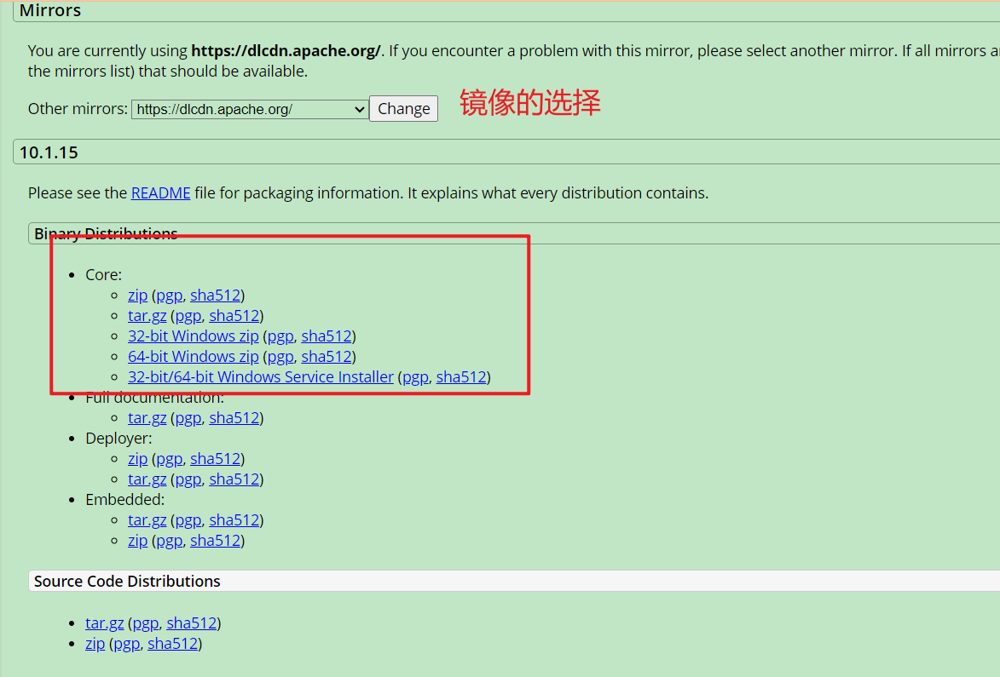
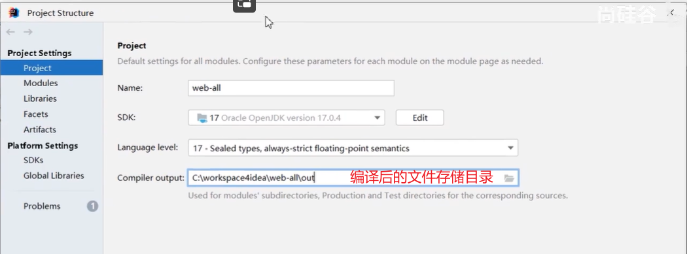
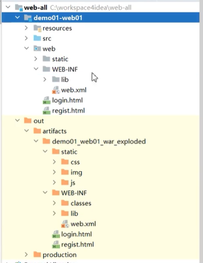

# 官网

[Apache Tomcat® - Welcome!](https://tomcat.apache.org/)

[Apache Tomcat® - 我应该用哪个版本？](https://tomcat.apache.org/whichversion.html)

# 常见的JavaWeb服务器

- Tomcat 应用最广
- Jetty 轻量级
- JBoss
- GlassFish
- Resin
- WebLogic（Oracle） 付费
- WebSphere（IBM） 付费

# 特点

- 技术更新速度快
- 性能好
- 免费

# 安装

## 前置条件

需要配置对应版本的jvm，参考[Apache Tomcat® - 我应该用哪个版本？](https://tomcat.apache.org/whichversion.html)

## 下载



注意tomcat10开始，原来的javax包命名由于版权原因更新为jakarta包，故之前开发的应用如果用到了javax会无法运行。（同样反向也不可），故不要项目开发到一半更换tomcat

> [迁移工具 https://github.com/apache/tomcat-jakartaee-migration](https://github.com/apache/tomcat-jakartaee-migration)

下载压缩包后直接解压到某目录即可

# 启动

进入tomcat目录下的bin，执行startup.bat

# 验证

访问 [tomcat首页](http://localhos:8080/)

# 停止

进入tomcat目录下的bin，执行shutdown.bat

# 解决控制台乱码

乱码的原因是控制台的默认编码不是utf-8，而tomcat日志输出默认编码为utf-8

进入tomcat安装目录下的conf目录，编辑logging.properties

修改 java.util.logging.ConsoleHandler.encoding = GBK

# 目录结构

- bin 运行文件
- conf 配置文件
    - logging.properties 日志相关
    - server.xml 服务相关
    - tomcat-users.xml  认证相关
    - web.xml 项目公共配置
- lib jar包，所有项目都会用到的
- logs 日志
- temp 临时目录
- work jsp相关
- webapps 部署项目 
    - 项目的上下文路径与项目的部署目录名称可以通过配置达到不同

# WEB-INF

存在于应用根目录中，其下可放置受保护资源，无法通过浏览器直接访问

存储一些重要文件

- classes 字节码
- lib 依赖

- web.xml 当前项目配置文件

# 指定项目源位置

项目文件可以不放到webapps目录中

在tomcat的conf目录中创建一个Catalina/localhost目录，其中新建与项目同名的xml文件

```xml
<Context path="项目上下文路径" docBase="C:\项目真实路径"/>
```

# idea结合tomcat

1. 添加tomcat到idea

    1. 在idea的构建设置中找到Application Servers
    2. 添加Tomcat server
        1. 配置tomcat home

2. 创建java web工程

    

3. 添加tomcat依赖并添加框架支持

    框架支持：右键项目，点击 add framework support

    

4. 构建

    点击构建选择Build Artifact

    

5. 添加运行配置

    

6. 解决idea日志乱码

    同样找到logging.properties，修改catalina的encoding为gbk

## idea运行tomcat原理

idea启动javaweb工程时会将tomcat主体复制一份到c盘，但其中只有配置文件，没有运行文件，运行时，使用tomcat主体中的运行文件来运行复制出来的配置文件。

配置文件中会通过catalina指定项目源位置的方式指定到编译结果

# tomcat部署文件并开放https

- 使用jdk 的 keytool生成一个ssl证书

    ```shell
    keytool -genkey -alias tomcat -keysize 2048 -validity 3650 -keyalg RSA -keystore tomcat.jks
    ```

    回车之后，首先设置两次密钥库的密码，不显示

    提问名字与姓氏的时候，输入域名，这里使用loc.test.com.cn（本机测试配置host文件）

    其余的默认回车，直到问是否正确 【否】的时候，输入y确认

    接着设置密钥密码，如果与密钥库密码相同，直接回车即可

    此时便会在keytool运行目录生成一个*.jks文件

- 修改tomcat的server.xml配置文件

    添加https（可以直接在http配置下挨着粘贴进去就好）

    ```xml
    <Connector port="443" protocol="HTTP/1.1" SSLEnabled="true"
        maxThreads="150" scheme="https" secure="true"
        keystoreFile="/usr/local/tomcat/ssl/YourDomain.jks"
        keystorePass="SSLPass"
        clientAuth="false" sslProtocol="TLS" />
    注意：
        keystoreFile ：证书存放目录，可以写绝对路径或Tomcat相对路径；
        keystorePass：证书私钥密码；
    ```
- 修改两个localhost

  ```xml
  <Engine name="Catalina" defaultHost="localhost">   
  ## 这里指定的localhost是默认HOST的名称，修改为证书绑定的域名即可
  ## .........
  ## .........
  ## .........
        <Host name="localhost"  appBase="webapps"  
  ### 将这里的localhost修改Wie刚才添加解析的域名即可，且必须与证书的通用名称保持一致
            unpackWARs="true" autoDeploy="true">
  ```

- 重启tomcat，查看 https://loc.test.com.cn/...是否能够访问