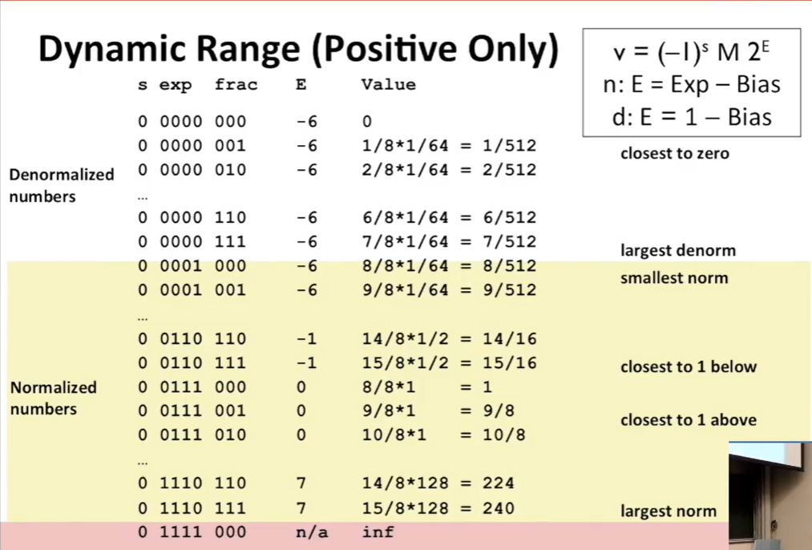

# 资料

[CS:APP3e, Bryant and O'Hallaron (cmu.edu)](https://csapp.cs.cmu.edu/)

[15-213/15-513 Introduction to Computer Systems (cmu.edu)](http://www.cs.cmu.edu/~213/)

Kernighan *The C Programming Language*

# Bits，Bytes，Integer

- Byte = 8bits
-  二进制每四位可以转为一个十六进制
- 地址是由机器字长决定的，比如64位的机器表示地址是64位长=8字节
- 基于布尔运算来进行位运算

## 布尔运算

- AND & 交

  A&B = 1 when A和B都为1

- Or | 并

  A|B=1 when A和B至少有一个为1

- Not ~ 补

  ~A=1 when A = 0

- Exclusive-Or(Xor) | 对称差

  A^B=1 when A和B值不同   

非位运算：&&，||，！

- 0为假，非0为真，且有短路运算

## 位移操作

- 左移 x << y

  - 高位丢失，低位补0

- 右移 x >> y

  -  高位补0，低位丢失

    10100010 >> 2 = 00101000

  - 高位补符号位，低位丢失

    10100010 >> 2 = 11101000

## 二进制转整型

- 无符号 B2U

- 有符号 B2T

  two's complement 二进制补码

  最高位为1是负值

  补码的速记方式

  | 4    | 3    | 2    | 1    | 0    |
  | ---- | ---- | ---- | ---- | ---- |
  | -16  | 8    | 4    | 2    | 1    |

  10000 = -16，10001 = -15  

  Tmin = -Tmax-1 [1000 = 1001-1]

  Tmax = Tmin - 1 [0111+ 1 = 1000]

  -Tmin = Tmin

理解补码：时钟，倒着走11下和正着走1下是一样的。也就是说，减去一个数A就等于加-A，同时也等于加一个数B：加到溢出后继续加，直到加到等于加-A为止，而增加的数B即为-A的补码。

在C语言中，有符号数在与无符号数做计算与比较的时候会转换为无符号数

一种现象

```c
// 此时若i为无符号数，循环会永远持续下去
for(i = n-1; i >= 0; i --){
    
}
//sizeof会返回一个无符号数，而与无符号数做运算的整数会转为无符号
for(i = n-1; i- sizeof(int) >=0 ; i --){
    
}
```

## 补码的扩充

10(-2) -> 110(-2) -> 1110(-2)

01(1) -> 001(1) -> 0001(1)

补码的扩充只需往左添加符号位的值 

## 截取

无符号截取后几位就等于取2的几次模，比如截取后三位就等于取8的模

## 计算

### Unsigned Addition

相加，进位，超过字数w则舍弃进位，进行溢出  

### Two‘s Complement Addition

与无符号类似 

5+(-3) = 0101 + 1101 = 10010 =舍弃进位= 0010 = 2 = 5 - 3，这也是减法的实现原理

同样会溢出： (-3) + (-6) = 1101 + 1010 = 7 

w为位数

### Unsigned Multiplication

w+w，需要w+1的字长来保存完整结果

w*w，需要w+1+1+.....+1 = w+w个字长

但通常会截断为w位

### Signed Multiplication

直接当作无符号乘，最后截断，该为符号位的就为符号位，当然也会有溢出

### 移位运算 = */2

讨论补码的情况

负数若右移且要保留符号位，需要补1：**算数移位**

1000 -> 1100 -> 1110 : -8 -> -4 -> -2

但是

1010 -> 1101 -> 1110 : -6 -> -3 -> -2

所以需要加一个偏移量

1010 -> 1101 + 1 （1110）-> 1111 : -6 -> -3 -> -1

### 取负

包括符号位全部取反再加1

-Tmin = Tmin 

### 溢出

有符号的情况下，若两个数符号相同，但计算结果的符号发生变化，则产生溢出，若两个计算数的符号不同，则不会发生溢出

# 字节存储

64位机器最大内存地址位47位：128MM

## 字长

64位字长机器意味着它通常处理64位的值和运算，且其地址的值为64位

编译器在编译时可以决定使用32位还是64位编译，故一个程序的字长由机器和编译器共同决定

## 字节排序

- 小端序 Little Endian

  第一个字节是最低有效字节

- 大端序 Big Endian

  最后一个字节是最低有效字节
  
  使用互联网发送32位字的数据包时，是使用大端序

存入0x1234567

| 排序方法\|内存地址 | 0x100 | 0x101 | 0x102 | 0x103 |
| ------------------ | ----- | ----- | ----- | ----- |
| 大端序             | 01    | 23    | 45    | 67    |
| 小端序             | 67    | 45    | 23    | 01    |

# 浮点数 

101.11 

小数点后依次 10^-1, 10^-2, 10^-3.....

右移相当于除二：10.111 

## IEEE 浮点数

类似于科学计数法 

(-1)^S * M * 2^E

S为符号位，尾数M 介于1.0~2.0之间

| s：符号位 | exp：encode E                                     | frac： encode M                             |
| --------- | ------------------------------------------------- | ------------------------------------------- |
| 1位       | 32：8位<br />64：11位<br />80：15位（intel only） | 32：23位<br />64：52位<br />80：63 or 64 位 |

由于指数除了整数也会存在负数，故在存储时会经过编码，存储的值为EXP，计算公式为Exp=指数E+Bias

其中 exp 不能全为0或全为1，Bias 值为 (2^(k-1))-1:

- 单精度 Bias 值为 127

  则 Exp：1~254；E：-126~127

- 双精度 Bias 值为 1023

  则 Exp：1~2046；E: -1022~1023

至于为何不用补码来表示正负，是因为方便比较大小

M 位的值都为1.XXXX，但1不进行存储，如此省去了一位。  

但如何表示0呢？下面有说。

**例如**

float F = 15213.0;

15213 = 11101101101101

​			= 1.1101101101101*2^13

所以

​	M = 1101101101101

​    frac = M补零 = 11011011011010000000000

​	E = 13

​    Exp = E + Bias = 13 + 127 = 140 = 10001100

结果

| s    | exp      | frac                    |
| ---- | -------- | ----------------------- |
| 0    | 10001100 | 11011011011010000000000 |

## Denormalized Values

当exp全为0 称为Denormalized Values

​	此时E = 1 - Bias  

​	且frac不是1.XXXXX，而是0.XXXXXX

​	当exp全为0且frac全为0，则整个浮点数表示0，包括正0和负0

若当exp全为1

​	当frac全为0，表示无穷大数

​	当frac不为0，表示NaN



## 一些特殊属性

- FloatPoint 0 与 整数0相同，都是所有位为0

- 基本上可以使用无符号整型的比较方式 
  - 必须先比较符号位
  - 必须考虑-0 = 0
  - NaN 是有问题的

## 运算

 进行精确运算，然后进行round

### rounding

|                                  | 1.4  | 1.6  | 1.5  | 2.5  | -1.5 |
| -------------------------------- | ---- | ---- | ---- | ---- | ---- |
| 向0                              | 1    | 1    | 1    | 2    | -1   |
| 向负无穷                         | 1    | 1    | 1    | 2    | -2   |
| 向正无穷                         | 2    | 2    | 2    | 3    | -1   |
| 最近偶数（四舍五偶六入）【默认】 | 1    | 2    | 2    | 2    | -2   |

最近偶数中，若当前值为中间值（比如0.5）且上一位为奇数，则上一位向上取整到偶数，若上一位为偶数，则保持。

在二进制中，可以通过观察舍入的部分中是否以1开头后面全为0，若以0开头，说明不到中间值，若以1开头且后不全为0，说明大于中间值

| Binary   | Rounded | 原因                                   |
| -------- | ------- | -------------------------------------- |
| 10.00011 | 10.00   | 后三位011小于中间值100                 |
| 10.00110 | 10.01   | 110大于中间值                          |
| 10.11100 | 11.00   | 100为中间值，上一位1取最近偶数，+1进位 |
| 10.10100 | 10.10   | 100为中间值，最近偶数为0               |

### 乘法

(-1)^s1M1 2^(E1) * (-1)^s2 M2 2^(E2)

符号位 Sign = s1 异或 s2

尾数 M = M1 * M2

阶数 E = E1 + E2

当M计算结果大于等于2时，将其右移，直到为1.XXX，并增加阶数E

如果E超出范围，则溢出

将M进行舍入使其符合frac的范围

### 加法

(-1)^s1M1 2^(E1) + (-1)^s2 M2 2^(E2)

对齐小数点


当M计算结果大于等于2时，将其右移，直到为1.XXX，并增加阶数E

当M计算结果小于1时，将其左移，直到为1.XXX，并减小阶数E

如果E超出范围，则溢出

将M进行舍入使其符合frac的范围

- 符合交换律但不符合结合律

  大数+小数 会造成小数的丢失

  (3.14 + 1e10) - 1e10 = 0 but 3.14 + (1e10 - 1e10) = 3.14

### 类型

- float
- double

float，double -> int 舍弃小数部分，double可能会舍弃整数部分的部分

int -> double 不会舍弃

int -> float 可能会舍弃

# 机器编程

x86 名称来源：intel   第一个处理器叫做8086，16位计算机

inter 32 位机： IA32

又称CISC Complex Instruction Set Computer 复杂指令计算机

ARM：Acorn RISC Machine

## 寄存器

- 通用寄存器

  x86-64中，有8个寄存器是有两个名字的，当使用%r开头的名字时，会得到64位的空间，当使用%e开头的名字时，会得到32位的空间，旧的8个寄存器是有名字的，新的8个寄存器名字为从%r8-%r15，且每个寄存器都可以直接操作最后一个字节，将其设为0或1，该字节可做单独的寄存器使用，称之为单字节寄存器

  

  - 临时数据

    %rax - %rdx

  - 内存地址

    %rsi %rdi

  - 栈指针

    %rsp

    ​	不能随意使用和设置

  - 当前执行代码指针

    %rip

- condition code

  是很多指令都会设置的位，但lea不会设置这四个状态码。

  cmp指令，会对两个数做减法操作然后设置这四个状态码，而sub指令给两个参数x，y，操作为x-=y。

  test指令，查看a&b的结果，只需两个相同的参数，就可以置位状态码.

  - CF

    carry flag

    计算结果有进位，无符号数

  - SF

    sign flag

    符号数的计算结果是负值 

  - ZF

    zero flag

    计算结果为0

  - OF

    overflow flag

    有符号的溢出

- 段寄存器

  - CS

    code segment

    代码段地址寄存器，存放代码段的起始地址

  - DS

    data segment

    数据段地址寄存器，存放数据段的起始地址

  - SS

    stack segment

    堆栈段地址寄存器，存放堆栈段的起始地址

  - ES

    extra segment

    附加段地址寄存器，存放附加段的起始地址

- 控制寄存器

  - IP

    Instruction Pointer

    指令指针寄存器，存放代码段中指令的偏移地址

  - FR

    Flags Register

    标志寄存器，存放反应处理器和运行程序执行结果状态的控制标志和条件码标志


## movq

以q结尾的指令表示对64位数据进行操作

movb、movw、movl和movq。 这些指令都执行同样的操作：主要区别在于它们操作的数据大小不同：分别是1、2、4和8字节。

Imm可理解为立即数，Reg是寄存器，Mem为内存

| Source | Dest | movq               | C Analog      |
| ------ | ---- | ------------------ | ------------- |
| Imm    | Reg  | movq $0x4, %rax    | temp = 0x4    |
| Imm    | Mem  | movq $-147, (%rax) | *p = -147     |
| Reg    | Reg  | movq $rax, %rdx    | temp2 = temp1 |
| Reg    | Mem  | movq $rax, (%rdx)  | *p = temp     |
| Mem    | Reg  | movq (%rax), %rdx  | temp = *p     |

**Example**

```c
void swap(long *xp, long *yp){
    long t0 = *xp;
    long t1 = *yp;
    *xp = t1;
    *yp = t0;
}
```

汇编：

```assembly
swap:
	movq (%rdi), %rax
	movq (%rsi), %rdx
	movq %rdx, (%rdi)
	movq %rax, (%rsi)
	ret
```

**地址表达式**

```assembly
movq 8(%rbp), %rdx
```

D(Rb,Ri,S)  Mem[Reg[Rb]+S*Reg[Ri]+D]

这里的两个寄存器可以理解为：Rb或者D存储数组首地址，Ri存储数组下标，至于S则为每个元素的大小

- D：偏移常量 1，2或4bytes
- Rb：基地址寄存器，任何16进制整型
- Ri：索引寄存器，除去%rsp外的任何值
- S：scale 1，2，4或8bytes

| 指令      | 含义                   |
| --------- | ---------------------- |
| (Rb,Ri)   | Mem[Reg[Rb]+Reg[Ri]]   |
| D(Rb,Ri)  | Mem[Reg[Rb]+Reg[Ri]+D] |
| (Rb,Ri,S) | Mem[Reg[Rb]+S*Reg[Ri]] |

## leaq

第一个参数是传入地址计算的表达式，第二个参数是保存结果的地址

本来地址表达式是用来计算地址的，但实际上也可以用来算数

```c
long m12(long x){
    return x*12;
}
```

```assembly
# rdi中值*3，存入rax
leaq (%rdi,%rdi,2), %rax 
# rax中值左移两位
salq $2, %rax 
```

## 一些算数指令

| 格式           | 含义                       |
| -------------- | -------------------------- |
| addq Src,Dest  | Dest = Dest + Src          |
| subq Src,Dest  | Dest = Dest  - Src         |
| imulq Src,Dest | Dest = Dest * Src          |
| salq Src,Dest  | Dest = Dest << Src         |
| sarq Src,Dest  | Dest = Dest >> Src（算数） |
| shrq Src,Dest  | Dest = Dest >> Src（逻辑） |
| xorq Src,Dest  | Dest = Dest ^ Src          |
| andq Src,Dest  | Dest = Dest & Src          |
| orq Src,Dest   | Dest = Dest \| Src         |
| incq Dest      | Dest = Dest + 1            |
| decq Dest      | Dest = Dest - 1            |
| negq Dest      | Dest = - Dest              |
| notq Dest      | Dest = ~ Dest              |

## SetX

可以根据状态码寄存器来设置单字节寄存器

| SetX  | 比较         | 含义              |
| ----- | ------------ | ----------------- |
| sete  | ZF           | 等于0             |
| setne | ~ZF          | 不等于0           |
| sets  | SF           | 负数              |
| setns | ~SF          | 非负数            |
| setg  | ~(SF^OF)&~ZF | 大于（补码）      |
| setge | ~(SF^OF)     | 大于等于（补码）  |
| setl  | (SF^OF)      | 小于（补码）      |
| setle | (SF^OF)      | 小于等于（补码）  |
| seta  | ~CF&~ZF      | Above（无符号数） |
| setb  | CF           | Below（无符号数） |

**测试**

```c
int gt (long x,long y){
    return x > y;
}
```

| Register | Use    |
| -------- | ------ |
| %rdi     | x      |
| %rsi     | y      |
| %rax     | return |

```assembly
cmpq %rsi, %rdi # compare x:y
setg %al 		# set when >
# setg 指令只会操作最低一位字节，，而不会影响其他位，故需要一个复制指令，将剩余部分填充为0
movzbl %al, %eax # zero rest of %rax
ret
```

## JX

| JX   | Condition    | Description              |
| ---- | ------------ | ------------------------ |
| jmp  | 1            | 无条件跳转               |
| je   | ZF           | Equal/Zero               |
| jne  | ~ZF          | Not Equal/Not Zero       |
| js   | SF           | Negative                 |
| jns  | ~SF          | Nonnegative              |
| jg   | ~(SF^OF)&~ZF | Greater(Signed)          |
| jge  | ~(SF^OF)     | Greater or Equal(Signed) |
| jl   | (SF^OF)      | Less(Signed)             |
| jle  | (SF^OF)\|ZF  | Lessor Equal(Signed)     |
| ja   | ~CF&~ZF      | Above(unsigned)          |
| jb   | CF           | Below(unsigned)          |

**条件分支**


```c
long absdiff(long x, long y){
    long res;
    if(x>y){
        res = x - y;
    }else{
        res = y-x;
    }
    return res;
}
```

```assembly
absdiff:
	cmpq	%rsi, %rdi
	jle		.L4
	movq	%rdi, %rax
	subq	%rsi, %rax
	ret
  .L4:
  	movq	%rsi, %rax
  	subq	%rdi, %rax
  	ret
```

有的时候分支情况可以使用条件移动实现：当res=boolean？1-2：2-1这种情况的时候，可以将1-2的值保存到res中，2-1的值保存到另一个变量中，接着再查看boolean的结果，若boolean为false则将另一个变量的值赋给res。

但如果两个分支都是复杂计算时或者当分支会改变程序状态时不建议这样做。

**循环**

```c
long pcount_do(unsigned long x){
    long result = 0;
    do{
        result += x & 0x1;
        x>>=1;
    }while(x);
    return result;
}
```

使用goto的话

```c
long pcount_do(unsigned long x){
    long result = 0;
    loop:
    result += x & 0x1;
    x>>=1;
    if(x) goto loop;
    return result;
}
```

| register | use    |
| -------- | ------ |
| %rdi     | x      |
| %rax     | result |

```assembly
pcount_do:
	movl	$0, %eax
  .L2:
  	movq	%rdi, %rdx
  	andl	$1,   %edx	# t = x&0x1
  	addq	%rdx, %rax	# result += t
  	shrq	%rdi		# x >>= 1
  	jne		.L2			# if(x) goto loop
  	rep; ret
```

如果是while的循环，会将条件判断上面加一个goto，在循环之前先跳到判断，在判断中跳到循环体

```c
while(test){
    body
}
```

```c
	goto test;
loop:
	body
test:
	if(test)
        goto loop;
done:
```

个人认为可以像下面这样

```c
test:
	if(test)
        goto done;
	body
	goto test;
done:
```

for循环的变化

```c
for(init; test; update){
    body;
}
// 相当于
init;
while(test){
    body;
    update;
}
// 相当于
init;
if(!test){
    goto done;
}
do{
    body;
    update;
}while(test);
done:
```

**switch case**

switch的机器码中会将所有case块按顺序编译到一起，接着维护一个代码表，标识了各个case块的起始索引。

- case 0-..-6 ，则编译器会把小于0和大于6的情况走default
    有个很有意思的事情就是，小于0的数字，负数如果当作无符号的化是一个非常大的数，所以这里只需要比较是否大于6，如果最小值是个负数，则会添加一定的偏移量使其变为0
    但如果我case 1和3、4、5、6，0和2还会建表吗？会，但其指针会指向default
- 如果case 0和10000，编译器不会将中间所有的值都建表，而是会进行优化比如优化为if-else，判断逻辑有可能是建立一棵树jump tree


## 流程控制

- stack

    stack用于管理程序状态

    call的时候压入即将要调用的方法的返回地址，return的时候返回信息，其余信息直接丢弃，很符合栈的特性

    x86中，在rsp寄存器中保存栈顶指针，栈顶指针会随着入栈出栈递减或递增（栈是向下增长的，所以入栈是递减）

- 流程调用：call
- 返回地址：调用地址的下一条
- 流程返回：ret

在32位机种，参数在栈上传递，64位机参数使用寄存器传递

一个方法调用例子

```c
long A(long* p, long val){
    long x = *p;
    long y = x + val;
    *p = y;
    return x;
}
long B(){
    long v1 = 15213;
    long v2 = A(&v1, 3000);
    return v1 + v2;
}
```

```assembly
B:
	# rsp存储的是栈顶指针，栈是向下分配空间的，这里对栈顶指针做减法意图是将栈顶指针向下扩容16个空间
	subq $16, %rsp
	# 在栈顶指针网上8个地址写入15213
	movq $15213, 8(%rsp)
	# 在esi寄存器存入3000
	movl $3000, %esi
	# 将rsp中存的值，也就是栈顶指针+8后的结果存入rdi
	leaq 8(%rsp), %rdi
	# 调用A函数
	call A
	# rax中存储返回值，将15123加到rax上
	addq 8(%rsp), %rax
	# 栈顶指针做加法，相当于释放空间，这里将刚开始分配的空间释放
	# 所以说这部分空间是要手动释放的，应该是在ret的时候会直接将栈顶指针数据作为返回地址
	addq $16, %rsp
	# 返回
	ret
	
```

寄存器中不应该用于存储临时值，在某个方法caller调用其他方法callee之前应当先存到内存。因为寄存器中的值很有可能被callee改写。

## 寄存器常见角色(约定)


```c
long A(long* p, long val){
    long x = *p;
    long y = x + val;
    *p = y;
    return x;
}
long B(long x){
    long v1 = 15213;
    long v2 = A(&v1, 3000);
    return x + v2;
}
```

```assembly
B:
	# 由于本方法有参数x，参数是在rdi中存着的，且在方法中会调用其他方法，也就是rdi会被复用，所以必须将rdi中的数据存起来，这里使用了rbx寄存器，因为约定中rbx寄存器是callee使用后必须恢复的，同样的，第一步也应该将rbx中原有的值备份，这里选择备份到栈上，当然同时会修改栈顶指针
	pushq %rbx
	# rsp存储的是栈顶指针，栈是向下分配空间的，这里对栈顶指针做减法意图是将栈顶指针向下扩容16个空间
	subq $16, %rsp
	# 这里将参数x备份到rbx上
	movq %rdi, %rbx
	# 在栈顶指针网上8个地址写入15213
	movq $15213, 8(%rsp)
	# 在esi寄存器存入3000
	movl $3000, %esi
	# 将rsp中存的值，也就是栈顶指针+8后的结果存入rdi
	leaq 8(%rsp), %rdi
	# 调用A函数
	call A
	# rax中存储返回值，将x加到rax上
	addq %rbx, %rax
	# 栈顶指针做加法，相当于释放空间，这里将刚开始分配的空间释放
	# 所以说这部分空间是要手动释放的，应该是在ret的时候会直接将栈顶指针数据作为返回地址
	addq $16, %rsp
	# popq 将栈顶数据存到rbx中，这里正是刚开始备份的rbx数据，同时恢复栈顶指针到返回地址
	popq %rbx
	# 返回
	ret
	
```

