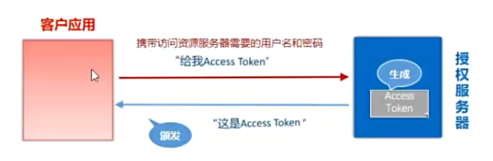
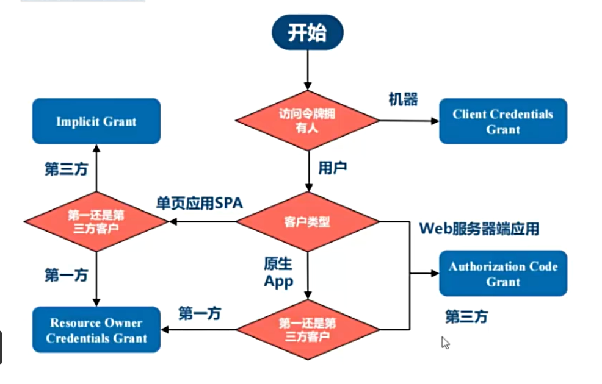

# 基本概念

Oauth是一种授权机制，由资源的所有者告诉系统，同意第三方进入系统获取资源，系统会产生一个短期的进入令牌（token）供第三方应用使用

# 交互角色

1. 资源所有者：即用户，用户在某些情况下会需要访问自己的资源
2. 客户应用：通常是一个web或者无线应用，他需要访问用户的受保护资源
3. 资源服务器：存储受保护的资源，定义了可访问资源的api，接收并验证客户端的访问令牌以决定是否授权访问资源
4. 授权服务器：负责验证资源所有者的身份并向客户端办法访问令牌

# 使用场景

## 开放系统间的授权

### 社交登录

如使用github账号登录gitee

### 开放api

# 令牌与密码

令牌与密码都可以用来进入系统，但有差异

- 令牌是短期的，到期会自动失效， 用户自己无法修改，密码一般长期有效，用户不修改不会发生变化
- 令牌可以被资源拥有者撤销，会立即失效
- 令牌范围有限

# 授权方式

不管哪一种授权方式，第三方应用申请令牌之前，都必须到系统备案。说明自己的身份，然后会拿到两个身份识别码，客户端ID（client ID）和客户端密钥（client secret）。这是为了防止令牌被滥用，没有备案过的第三方应用，是拿不到令牌的。

## 授权码 authorization-code

最常用的方式，第三方应用先申请一个授权码，再用该码获取令牌

适用于有后端的web应用。 授权码通过登录获取，传递给后端，后端使用授权码向资源服务器获取令牌，令牌存储在后端。


假设一个场景，A网站需要获取B网站的授权

1. A网站拼接一个地址展示给用户，用户点击后会跳转到B网站

   ```js
   // 网址示例
   https://b.com/oauth/authorize?
     response_type=code&
     client_id=CLIENT_ID&
     redirect_uri=CALLBACK_URL&
     scope=read
   ```

   其中,response_type为要求对方返回授权码(code), client_id表明自己身份, redirect_uri 为希望对方处理请求后重定向到的地址, scope 参数表示要求的授权范围.

2. 跳转到b网站后,b网站会要求用户登录, 询问是否同意给A网站授权, 用户同意后, b网站会重定向到redirect_uri参数指定的网址，注意重定向是浏览器发起的请求, 重定向时会携带一个授权码

   ```js
   https://a.com/callback?code=AUTHORIZATION_CODE
   ```

   其中code即为授权码

3. A 拿到授权码, 在后端发送一条请求,用于向B请求令牌

   ```js
   https://b.com/oauth/token?
    client_id=CLIENT_ID&
    client_secret=CLIENT_SECRET&
    grant_type=authorization_code&
    code=AUTHORIZATION_CODE&
    redirect_uri=CALLBACK_URL
   ```

   其中 client_id 与 client_secret参数用于让B确认A的身份, 并且client_secret参数是保密的,因此只能在后端发请求. grant_type参数的值是AUTHOEIZATION_CODE, 表示采用的授权方式是授权码,code参数是上一步拿到的授权码, redirect_uri参数是令牌颁发后的回调地址

4. B网站收到请求后,会颁发令牌,向redirect_uri发送一段JSON.

   ```json
   {    
     "access_token":"ACCESS_TOKEN",
     "token_type":"bearer",
     "expires_in":2592000,
     "refresh_token":"REFRESH_TOKEN",
     "scope":"read",
     "uid":100101,
     "info":{...}
   }
   ```

   其中access_token字段就是令牌,A会在后端进行保存

## 隐藏式 implicit

直接向前端颁发令牌, 没有授权码步骤，适用于纯前端获取token


1. A网站提供一个连接, 要求用户跳转到B网站

   ```js
   https://b.com/oauth/authorize?
     response_type=token&
     client_id=CLIENT_ID&
     redirect_uri=CALLBACK_URL&
     scope=read
   ```

   其中,response_type参数为token,表示要求直接返回令牌.

2. 用户跳转到B网站,登陆后同意授权给A网站,这时,B网站就会跳回redirect_uri参数指定的跳转网址,并且把令牌作为URL参数,

   ```js
   https://a.com/callback#token=ACCESS_TOKEN
   ```

   其中token就是令牌

   注意,令牌的位置是 URL 锚点（fragment），而不是查询字符串（querystring），这是因为 OAuth 2.0 允许跳转网址是 HTTP 协议，存在"中间人攻击"的风险，但锚点不会发送到服务器，网络传输不会携带就减少了泄漏令牌的风险。

   这种方式直接把令牌传给前端,只能用于一些安全要求不高的场景,并且令牌有效期必须非常短,通常是session有效,浏览器关掉令牌就失效了

## 密码式 password

若高度信任某应用，可将用户名密码直接告诉应用。该种情况下会将资源服务器的用户名和密码暴露给客户应用，相当于将github密码暴露给gitee



1. A网站要求用户提供B网站的用户名和密码,拿到之后,用户直接向B请求令牌

   ```js
   https://oauth.b.com/token?
     grant_type=password&
     username=USERNAME&
     password=PASSWORD&
     client_id=CLIENT_ID
   ```

2. B验证通过后们直接给出令牌,无需跳转,将令牌放入json中作为http回应

这种方式风险很大,只适用于高度信任应用

## 客户端凭证 client credentials

适用于无前端的系统获取token，后端对后端的模式


1. A在命令行向B发送请求

   ```js
   https://oauth.b.com/token?
     grant_type=client_credentials&
     client_id=CLIENT_ID&
     client_secret=CLIENT_SECRET
   ```

2. B通过验证后直接返回令牌

## 授权方式的选择



# 标准接口

- /oauth/authorize 授权端点
-  /oauth/token 获取令牌端点
- /oauth/confirm_access 用户确认授权提交端点
- /oauth/error 授权服务错误信息端点
- /oauth/check_token 用于资源服务访问的令牌解析端点
- /oauth/token_key 提供公有密钥的端点(JWT)

# 令牌的使用

A网站拿到令牌之后,向B网站的API做请求

此时,每个发到API的请求都必须带有令牌,具体做法是在请求头中加入Authorization字段, 令牌就放在这个字段中

# 更新令牌

令牌有效期到后, Oatuh2允许更新,而不是重新申请

B网站在办法令牌时,一次性颁发两个令牌,其中一个用于业务操作, 另一个用于获取新的令牌(refresh token),在令牌到期前,用户使用refresh token发一个请求,去更新令牌.

```js
https://b.com/oauth/token?
  grant_type=refresh_token&
  client_id=CLIENT_ID&
  client_secret=CLIENT_SECRET&
  refresh_token=REFRESH_TOKEN
```


# HTTPS

## https通信原理

https本质上是对http通信内容进行加密，那就引出了两个问题;

- 问题1: 如何确定加密算法以及密码

- 问题2: 如何保证密码不被监听

通常来说, 密码应由服务器和客户端使用随机的方式生成, 但 如何将这个随机数告诉对方? 首先是不可能使用明文的方式传输, 所以这里引入非对称加密。

非对称加密：

​	两套密钥,公钥和私钥,公钥只能用于加密,私钥用于解密,即使中间人获得了公钥,仍然无法解密

举例：浏览器使用https的方式访问百度：

1. 客户端使用百度的公钥去加密一个自己生成的随机数作为后续交互密码。
2. 百度收到了加密密文,并用百度的私钥进行解密获得后续交互密码，使用该密码进行后续的操作。
3. 之后二者就可以使用最初生成的随机数作为密码进行通信。

这里有一个漏洞:

网站的公钥如何获得? 可以直接想到, 浏览器访问服务器, 然后获得该公钥,但如何保证浏览器拿到的公钥就是百度的公钥呢,如何保证该公钥不是中间人劫持后替换的公钥呢.

这就是中间人攻击的方式之一

1. 客户端询问百度的公钥
2. 查询请求被中间人拦截,伪造了百度的公钥,换成了中间人的公钥,发回客户端
3. 在此之后客户端其实一直在用中间人的公钥去加密，其信息也会被中间人得知

故这里引入了https证书

证书的原理相当于对网站下发的公钥做一次哈希校验,与本机预存的证书信息做验证,如果一致则说明公钥可信，本机预存的证书来自于证书颁发机构

> 证书颁发机构，需要向其缴纳费用，然后机构会颁发一个可信的证书给网站，同时，操作系统厂商（Windows、Linux、MacOS）信任“证书颁发机构”颁发的证书，在浏览器或者操作系统里默认集成了这些机构的根证书，这样就保证了证书是可信可靠的。每个证书都是有有效期的，如果有网站恶意使用了证书，那么“证书颁发机构”就会吊销对应的证书，之后浏览器再访问这些网站的时候，如果网站证书校验不通过，那么浏览器地址栏里的小锁头就不见了，取而代之的是一个浏览警告:
>
> 
>
> 这种情况可能是：1. 你的浏览器到百度网站之间的通信发生了中间人攻击；2. 百度这个网站的证书被吊销了。通常情况下，此时你的浏览器访问将不再安全。

## https防火墙

https防火墙需要强制安装一个证书到受信任列表中, 中间人可以把任何想要监听的网站证书都替换成这个受信任证书.

这种方式是有很大的安全风险的，因为，如果HTTPS防火墙本身被攻击，私钥泄漏，那么在公司上网将不再安全，所有HTTPS网页上的密码，都可能有泄漏的危险，比如知乎、微博等网站，仅仅依靠HTTPS加密来保证登录密码的安全，这些密码都不再安全。

> HTTPS防火墙需要模拟真实的HTTPS请求，这里有一个问题，就是如果请求量巨大的话，工作负载会很重，需要缓存大量的请求中间状态（相当于自己变成一个网站服务器），所以对于大公司来说，HTTPS防火墙如果一直监听，那么对访问外网影响很大。
>
> 一些网站，以及一些APP会在客户端做二次校验，校验不通过的话是无法登陆的，这种会避免密码泄露（点名：网易邮箱网页版）。