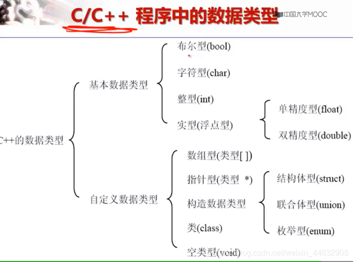

# C程序设计语言基本构成
## 数据成分

### 数据类型



### 整型
| int  | short | long |
| ---- | ----- | ---- |
| 32b  | 16b   | 32b  |
c语言中规定：long型不短于int型、short型不长于int型
如何查看某个类型的大小：sizeof（）运算符
```c
cout<<"sizeof(short int)="<<sizeof(short int)<<endl;
```
计算机中存储整数使用补码的形式：
正整数的反码和补码都是原码
负整数的补码为反码加一
负整数的反码为除符号位外全部取反

|-| 八进制|十进制|十六进制|
|-|----|----|----|
控制符|oct|dec|hex
前缀|0||0x
```c
int a = 10;
cout<<hex<<a<<endl;
```
int型在无符号的情况下最大可存储42亿左右，有符号的情况下可存储21亿
有符号的情况下，当最高位是1，其他位是0，则1即表示符号位也表示数字位：-2147483648

### 浮点型
|        | -    | float | double | long double |
| ------ | ---- | ----- | ------ | ----------- |
|        | 存储 | 32b   | 64b    | 64b         |
| 有效位 | 7位  | 15位  | 15位   |             |
cout默认打印六位精度，可通过控制符控制
```c
cout<<setprecision(100)<<a<<endl;
```
存储方式：IEEE754标准
**避免将一个很大的数与一个很小的数直接相乘或相加，否则会丢失较小数**
### 字符型
c语言中，一个字符占用一个字节 ASCII码
因存储类型与整型相同，so与整型可相互赋值或运算
### 布尔型
占用一个字节，只能为0或1
可以赋给任何值，但存储的时候只存01，不管正负，非0就存1
### 变量 
变量，是值可以变化的量，需要先定义再使用
初始化变量是一个好习惯
>[C语言变量名和地址的关系 https://blog.csdn.net/sunlin972913894/article/details/78935556](https://blog.csdn.net/sunlin972913894/article/details/78935556)
### 常量
常量就是值保持不变的量
字面常量，符号常量
字面常量就是我们直接写在代码中的数字，文字等代码文本，这就叫做字面常量。
符号常量：也就是我们用标识符指代的常量就称之为符号常量，符号常量有三个规则：
1. 符号常量前面必须要有关键字const修饰。
2. 符号常量只能进行读取，不能进行修改。
3. 符号常量必须初始化。
```cpp
const double PI = 3.14159//符号常量
//整型常量的后缀
n = 10000L//长整型
m = -0x88abL//长整型
K = 1000U//无符号
i = 077777LU//无符号长整型
//浮点型常量后缀
X = 3.1415F//单精度
Y = 3.1415L//双精度长浮点型
//浮点型常量默认双精度，后缀不分大小写
```
### c语言保留字
| 保留字   | 含义                                                    |
| -------- | ------------------------------------------------------- |
| auto     | 指定变量的存储类型，是默认值                            |
| break    | 跳出循环或switch语句                                    |
| case     | 定义switch中的case子句                                  |
| char     | 定义字符型变量或指针                                    |
| const    | 定义常量或参数                                          |
| continue | 在循环语句中，回到循环体的开始处重新执行循环            |
| default  | 定义switch中的default子句                               |
| do       | 定义do-while语句                                        |
| double   | 定义双精度浮点数变量                                    |
| else     | 定义枚举类型                                            |
| enum     | 声明外部变量或函数                                      |
| extern   | 声明外部变量或函数                                      |
| float    | 定义浮点型变量或指针                                    |
| for      | 定义for语句                                             |
| goto     | 定义goto语句                                            |
| if       | 定义if语句或if-else语句                                 |
| int      | 定义整型变量或指针                                      |
| long     | 定义长整型变量或指针                                    |
| register | 指定变量的存储类型是寄存器变量，Turbo c中用自动变量代替 |
| return   | 从函数返回                                              |
| short    | 定义短整型变量或指针                                    |
| signed   | 定义有符号的整型变量或指针                              |
| sizeof   | 获取某种类型的变量或数据所占内存的大小，是运算符        |
| static   | 指定变量的存储类型是静态变量，或指定函数是静态函数      |
| struct   | 定义结构体类型                                          |
| switch   | 定义switch语句                                          |
| typedef  | 为数据类型定义别名                                      |
| union    | 定义无符号的整型或字符型变量或指针                      |
| unsigned | 定义无符号的整型变量或数据                              |
| void     | 定义空类型变量或空类型指针，或指定函数没有返回值        |
| volatile | 变量的值可能在程序的外部被改变                          |
| while    | 定义while或do-while语句                                 |


## 控制成分
### 分支
```c
//if语句
if(){

}
if()else{

}
if(){

}else if(){

}
//switch case语句
switch(表达式){
case 常量表达式:语句;break;
case 常量表达式:语句;
case 常量表达式:语句;
case 常量表达式:语句;break;
default:语句;
}
```
### 循环
```c
for(表达式1;表达式2;表达式3){

}
while(){

}
do{

}while();
```
break：跳出一层循环
continue： 结束本次循环
### goto语句
无条件跳转语句
```c
	int j = 0;
test:
	printf("HelloWorld");
	int i = 2;
	goto test;
```