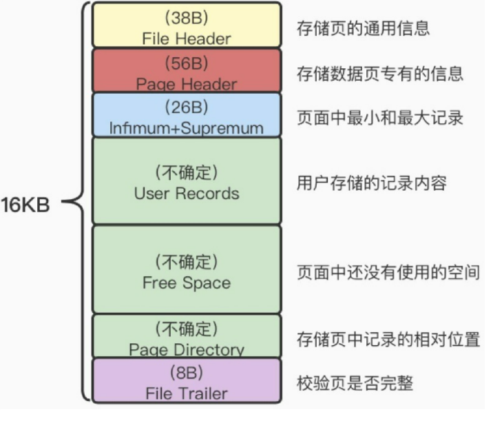
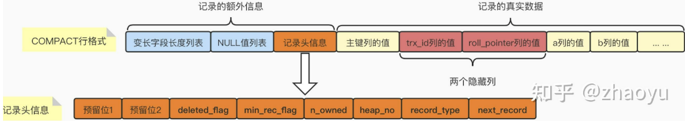

# 虚拟表

我有一个名为a的字符串，其中包含多个值，我有一张表b，其中包含多个值，我想使用sql语句来知道有哪些数据是a中有但是b中没有的

```sql
CREATE TEMPORARY TABLE temp_a (value VARCHAR(255));
INSERT INTO temp_a (value)
VALUES ('value1'), ('value2'), ('value3');

SELECT temp_a.value
FROM temp_a
LEFT JOIN b
ON temp_a.value = b.value
WHERE b.value IS NULL;
```

这里使用了虚拟/临时表的概念，虚拟表不会实际创建一张表，只在当前连接可见。当关闭当前的数据库连接后会清除该缓存

# 连接时 ON 和 WHERE 的区别

- 在使用left jion时，on和where条件的区别如下：
  1、 on条件是在生成临时表时使用的条件，它不管on中的条件是否为真，都会返回左边表中的记录。
  2、where条件是在临时表生成好后，再对临时表进行过滤的条件。这时已经没有left join的含义（必须返回左边表的记录）了，条件不为真的就全部过滤掉。

# 在没有group by时也可以使用having

效果相当于将整体视为一个分组，但不建议；还是建议使用whee

# 关于in/exists

IN是做外表和内表通过Hash连接，先查询子表，再查询主表，不管子查询是否有数据，都对子查询进行全部匹配。
EXISTS是外表做loop循环，先主查询，再子查询，然后去子查询中匹配，如果匹配到就退出子查询返回true，将结果放到结果集
所以：子查询结果集越大用EXISTS，子查询结果集越小用IN

# 存储引擎对比表

|        | 特性                                                         | 使用场景                                                     |
| ------ | ------------------------------------------------------------ | ------------------------------------------------------------ |
| MyISAM | 1. 不支持事务<br />2. 不支持外键<br />3. 非聚集索引<br />4. 维护一个变量保存行数<br />5. 支持全文索引<br />6. 可以被压缩后进行查询操作<br />7.支持表级锁<br />8.可以没有唯一索引如主键<br />9. 存储文件: frm 表定义文件,mbd 数据文件,myi索引文件 | 大多数都只是读查询<br />可以接受系统奔溃后，MyISAM恢复起来更困难 |
| InnoDB | 1. 支持事务<br />2. 支持外键<br />3. 聚集索引<br />4. 事务原因无法维护<br />5. 5.7之前不支持全文索引<br />6. 支持表\行级锁<br />7. 必须有一个唯一索引如主键<br />8. frm 表定义文件,ibd数据文件 | 支持事务<br />需要外键                                       |

# Explain

- id select 的序列号，有几个select就有几个id，
- select_type
  - simple 简单查询，查询不包含子查询和union
  - primary：复杂查询最外面的select
  - subquery： 包含在select中的子查询（不在from子句中）
  - derived： 包含在from中的子查询
  - union： 在union中的第二个或者随后出现的select
  - union result： 从union临时表检索结果的select
- table
  - 表示explain的一行正在访问哪个表
- type
  - 表示关联类型或者访问类型，即MySQL决定如何查找表中的行。
- possible_keys列
  - 显示查询可能使用哪些索引来查找
- key
  - 显示MySQL实际采用哪个索引来优化对该表的访问
- key_len
  - 显示了mysql在索引里使用的字节数,通过这个值可以算出具体使用了索引中的哪些列。 
    - key_len计算规则如下：
      - 字符串 
        - char(n)：n字节长度
        - varchar(n)：2字节存储字符串长度，如果是utf-8，则长度 3n + 2
      - 数值类型 
        - tinyint：1字节
        - smallint：2字节
        - int：4字节
        - bigint：8字节　　
      - 时间类型　 
        - date：3字节
        - timestamp：4字节
        - datetime：8字节
      - 如果字段允许为 NULL，需要1字节记录是否为 NULL
- ref
  - 显示在key列记录的索引中,表查找值要用到的列或者常量
- rows
  - MySQL估计要读取并检测的行数
- extra
  - 额外信息

# 开窗函数

```sql
-- 创建一个临时表
CREATE TABLE TempTable (
    ID INT,
    Score INT
);
 
-- 插入一些数据
INSERT INTO TempTable (ID, Score)
VALUES
(1, 90),
(2, 85),
(3, 90),
(4, 80),
(5, 95),
(6, 85);
-- ROW_NUMBER()：
-- 为每一行分配一个连续的唯一行号。
SELECT
    ID,
    Score,
    ROW_NUMBER() OVER (ORDER BY Score DESC) AS RowNum
FROM
    TempTable;
-- RANK()：
-- 为具有相同值的行分配相同的排名，但后续的排名会跳过。
SELECT
    ID,
    Score,
    RANK() OVER (ORDER BY Score DESC) AS RankNum
FROM
    TempTable;
-- DENSE_RANK()：
-- 也为具有相同值的行分配相同的排名，但后续的排名不会跳过。
SELECT
    ID,
    Score,
    DENSE_RANK() OVER (ORDER BY Score DESC) AS DenseRankNum
FROM
    TempTable;
		
-- NTILE()：
-- 将结果集分为指定数量的近似相等的组，并为每个组分配一个组号。如下为分为了两组
SELECT
    ID,
    Score,
    NTILE(2) OVER (ORDER BY Score DESC) AS NTileNum
FROM
    TempTable;
```


# 数据库类型

* 关系型数据库
* 非关系型数据库
  * 键值型：如redis
  * 文档型：如MongoDB
  * 列式数据库：如HBase
  * 图形数据库：如NEo4J

## 不同数据库的特点及应用

* 关系型数据库

  优点

  * 保持数据的一致性
  * 容易理解，接近人的思考方式
  * SQL语言方便使用

  缺点

  * 由于其需要维护一致性导致其读写性能比较差
  * 当字段不固定时，关系型数据库处理麻烦
  * 在进行大量数据的写入时效率较差

  应用

  ​	处理复杂、数据量相对较少、安全性要求较高、数据格式单一的场景

* 非关系型数据库

  优点

  * 适合处理高并发、大批量的数据
  * 支持分布式集群，负载均衡，效率较高
  * 扩展简单
  * 成本低廉

  缺点

  * 技术起步晚，相关资料有限
  * 事务处理能力弱
  * 无法保证数据的完整性和安全性

  应用

  ​	海量数据、多格式数据存储，对查询速度要求快的场景

# DML

## SELECT

基本语法：

```sql
SELECT column, group_function
FROM table
[WHERE condition]
[GROUP BY group_by_expression]
[HAVING group_condition]
[ORDER BY column];
```

- 查询过程中可对数值,日期等进行计算

```sql
# 1.	显示员工代号、员工姓名及薪水* 1.5倍后资料
SELECT
	EMPLOYEE_ID,
	CONCAT( FIRST_NAME, ' ', LAST_NAME ) 'NAME',
	SALARY * 1.5 
FROM
```

- 对NULL进行比较用IS关键字

```sql
# 2.	显示主管(MANAGER_ID)为Null的员工资料
SELECT
	* 
FROM
	employees 
WHERE
	MANAGER_ID IS NULL;
```

- 搜索结果去重,这里需要注意虽然GROUP BY 可以达到效果但是性能不及DISTINCT

```sql
# 3.	透过emp表格找出所有可能的部门代号(不可重复)
SELECT
	DEPARTMENT_ID 
FROM
	employees 
GROUP BY
	DEPARTMENT_ID 
HAVING
	DEPARTMENT_ID IS NOT NULL;
# (建议)distinct
SELECT
	DISTINCT DEPARTMENT_ID 
FROM
	employees 
WHERE
	DEPARTMENT_ID IS NOT NULL;
```

- 排序
  - 其中 ASC为升序(默认),DESC为降序

```sql
# 4.	依照员工薪水资料，由大至小排列
SELECT
	* 
FROM
	employees 
ORDER BY
	SALARY DESC;
```

- 大小写字符串
  - 转为小写:LOWER

```sql
# 5.	找出员工姓名为JOHN的员工数据
SELECT
	* 
FROM
	employees 
WHERE
	UPPER( FIRST_NAME ) = 'JOHN' 
	OR UPPER( LAST_NAME ) = 'JOHN';
# 例
select id,`name`,sex, LOWER(`name`), UPPER(sex) from test_table ;
```

- 数值对比

```sql
# 6.	找出薪水小于$3000的员工数据
SELECT
	* 
FROM
	employees 
WHERE
	SALARY < 3000;
```

- like

| 通配符     | 使用场景               |
| ---------- | ---------------------- |
| %          | 代替0个或多个字符      |
| _          | 代替一个字符           |
| [charlist] | 字符列中的任何单一字符 |

( 正则表达式:使用 **REGEXP** 或 **NOT REGEXP** 运算符 (或 RLIKE 和 NOT RLIKE) 来操作)

```sql
# 7.	显示工作类别JOB_TITLE非'PRESIDENT'及'MANAGER'的员工数据
SELECT
	employees.* 
FROM
	employees,
	jobs 
WHERE
	jobs.JOB_ID = employees.JOB_ID 
	AND jobs.JOB_TITLE NOT LIKE '%PRESIDENT%' 
	AND jobs.JOB_TITLE NOT LIKE '%MANAGER%';
```

- concat

```sql
# 8.	找出员工名字为S开头的员工
SELECT
	* 
FROM
	employees 
WHERE
	FIRST_NAME LIKE 'S%';# 9.	将员工姓名及员工代码结合为新字段，重新命名为NAME_NO
SELECT
	CONCAT( FIRST_NAME, ' ', LAST_NAME, '_', EMPLOYEE_ID ) 'NAME_NO' 
FROM
	employees;
```

- between and 与 <= >=
  - 两者在mysql中都包括端点
  - 两者在mysql中都可以比较整型或字符串
  - BETWEEN AND 使用时需要注意顺序，<= and >=比较灵活
  - BETWEEN AND 使用更加简洁

```sql
# 10.	找出部门代号为20且薪水介于2000及4000间(包含2000及4000)，并依照(HIRE_DATE)资深至资浅排序(入职日期由小到大)
SELECT
	* 
FROM
	employees 
WHERE
	DEPARTMENT_ID = 20 
	AND SALARY BETWEEN 2000 
	AND 4000 
ORDER BY
	HIRE_DATE;
```

- 截取字符串&获取字符串长度
  - 截取函数: SUBSTR(待截取字符串,起始位置从1开始,截取长度)
  - 获取字符串长度函数: LENGTH(str)

```sql
# 2.	显示员工LastName名字(转换为第一个字大写其余为小写格式)
SELECT LAST_NAME, CONCAT(
		UPPER(SUBSTR(LAST_NAME,1,1)),
		LOWER(SUBSTR(LAST_NAME,2,LENGTH(LAST_NAME)-1))
	) FROM employees;


```

- 获取子字符串在母字符串中的索引
  - 相关函数: INSTER(母串,子串)

```sql
# 3.	显示员工名字及工作名称结合的新字符串，并找出工作名称在新字符串的开始位置
SELECT CONCAT(FIRST_NAME,'_',JOB_TITLE) newStr,INSTR(CONCAT(FIRST_NAME,'_',JOB_TITLE),JOB_TITLE) 'index' FROM employees,jobs WHERE employees.JOB_ID = jobs.JOB_ID;
```

- 其他字符串相关函数

```sql
# 字符串左右填充
select `name`,RPAD(LPAD(`name`,10,'-'),15,'-') from test_table;
# 去除左右任意个数指定字符
select TRIM('a' FROM 'aabaca');
# 替换字符
select REPLACE(sex,'m','w') FROM test_table;
```


- 数据的四舍五入与截断

```sql
# 四舍五入
# 四舍五入取整
SELECT ROUND(16.5);
# 四舍五入指定保留小数位数
SELECT ROUND(16.12348765, 4);
# 截断
# 指定保留小数位数截断
SELECT TRUNCATE(12.234,2);
# 5.	显示员工薪水数据(无条件舍去到整数字数的千位数)16800 –> 10000
SELECT SALARY, TRUNCATE(SALARY / 10000,0) * 10000 FROM employees;
SELECT SALARY, FLOOR(SALARY / 10000) * 10000 FROM employees;
```

- 其余数字函数

```sql
# 取余
SELECT MOD(100,33);
```


- sign函数
  - sign(x): x=0得值0,x>0得值1,x<0得值-1	

```sql
# 6.	显示员工名字、薪水及薪水代号(薪水大于3000显示'1'，小于3000显示'-1'，与3000相等时显示0，可使用Sign函数)
SELECT FIRST_NAME, SALARY,Sign(SALARY-3000) FROM employees;
```

- 时间函数
  - 相关函数
    - timestaffdiff(结果的单位,时间1,时间2):返回（时间2-时间1）的时间差，结果单位由interval参数给出。
    - timediff(时间1,时间2):返回差值
    - datediff(日期1,日期2):返回相差天数
    - now():当前年月日时分秒
    - curdate():当前年月日
    - curtime():当前时分秒
    - last_date(date):获取参数日期中月的最后一天
    - NOW()和CURRENT_TIMESTAMP()没有任何区别，他们都表示的是SQL开始执行时的系统时间；而SYSDATE()则表示执行此函数时的系统时间。

```sql
# 获取当前时间
SELECT NOW();
# 字符串转为时间，非法日期结果为空
SELECT STR_TO_DATE('1-13-1999','%m-%d-%Y');
# 时间转换为字符串
SELECT DATE_FORMAT(NOW(),'%Y年%m月');
# 7. 显示当月的天数，试写出两种以上方法，SQL mysql虚拟表
SELECT CASE 
	WHEN SUBSTR(NOW(),6,2) in ('01','03','05','07','08','10','12')  THEN 31

	WHEN SUBSTR(NOW(),6,2) in ('04','06','09','11')  THEN 30
	
	# 闰年判断
	WHEN ((MOD(SUBSTR(NOW(),1,4),4) = 0 AND MOD(SUBSTR(NOW(),1,4),100) <> 0) OR MOD(SUBSTR(NOW(),1,4),400) = 0) AND
SUBSTR(NOW(),6,2) = '02'  THEN 28
	# 以上都不满足则为非闰年2月
	ELSE 29
END 'day';
# 方法二 增加一个月的时间再减去当前时间
SELECT DATEDIFF(date_add(NOW(), INTERVAL 1 MONTH), NOW());
# 方法三 使用last_date获得当月最后一天,截取最后两位即为结果
SELECT SUBSTR(LAST_DAY(NOW()),9,2);
```

- WHEN-CASE-END
  end 跟字段名

```sql
# 第一种用法，case后无表达式，when中加条件
# 10.	若员工工作名称为'PRESIDENT'、 'MANAGER'及'SALESMAN'则显示'A'，其他则显示'B'  
SELECT employees.EMPLOYEE_ID,jobs.JOB_TITLE, CASE 
	WHEN JOB_TITLE LIKE '%PRESIDENT%' OR JOB_TITLE LIKE '%MANAGER%' OR JOB_TITLE LIKE '%SALESMAN%'  THEN 'A'
	ELSE 'B'
END 'TYPE'
from employees,jobs
WHERE employees.JOB_ID = jobs.JOB_ID ORDER BY EMPLOYEE_ID;
# 第二种用法，case后加表达式，when比较值
CASE expr
	WHEN 'x' THEN ...
	...
	else ...
END 字段名
```

### 多表查询

- 基本概念

  - 内连接

    只有两个表同时满足连接条件时会保留

  - 左外连接

    - 保留左边表中所有记录,右边表中不满足以空代替

  - 右外连接

    - 与左外连接相反

- 内连接

```sql
# 1.	列出emp表格及dept表格，结合后所有可能排列组合
SELECT * FROM employees INNER JOIN departments;
```


- 左/右外连接

```sql
# 2.	显示LastName是'SMITH'及其所属部门资料
SELECT employees.EMPLOYEE_ID,employees.LAST_NAME, departments.* from employees LEFT JOIN departments ON employees.DEPARTMENT_ID = departments.DEPARTMENT_ID WHERE employees.LAST_NAME = 'SMITH';
```

- 别名

```sql
# 3.	显示'SMITH'员工及其所属部门数据(使用表格别名的方式，表格emp别名为a、表格dept别名为b)
SELECT a.EMPLOYEE_ID,a.LAST_NAME, b.* from employees a LEFT JOIN departments b ON a.DEPARTMENT_ID = b.DEPARTMENT_ID WHERE a.LAST_NAME = 'SMITH';
```

- 子查询

```sql
# 6.	列出员工名字、职称及薪水及其管理者名字、职称及薪水数据
SELECT 
a.FIRST_NAME emp_first_name,a.LAST_NAME emp_last_name,a.JOB_TITLE emp_job_title, a.SALARY emp_salary,
b.FIRST_NAME mng_first_name,b.LAST_NAME mng_last_name,b.JOB_TITLE mng_job_title, b.SALARY mng_salary 
FROM
# 两个小表
	(SELECT FIRST_NAME,LAST_NAME,JOB_TITLE,SALARY,MANAGER_ID FROM employees e,jobs j WHERE e.JOB_ID = j.JOB_ID) as a,
	(SELECT FIRST_NAME,LAST_NAME,JOB_TITLE,SALARY,EMPLOYEE_ID FROM employees e,jobs j WHERE e.JOB_ID = j.JOB_ID) as b
WHERE a.MANAGER_ID = b.EMPLOYEE_ID;
# 员工包含‘KING’
SELECT 
a.FIRST_NAME emp_first_name,a.LAST_NAME emp_last_name,a.JOB_TITLE emp_job_title, a.SALARY emp_salary,
b.FIRST_NAME mng_first_name,b.LAST_NAME mng_last_name,b.JOB_TITLE mng_job_title, b.SALARY mng_salary 
FROM
# 两个小表
	(SELECT FIRST_NAME,LAST_NAME,JOB_TITLE,SALARY,MANAGER_ID FROM employees e,jobs j WHERE e.JOB_ID = j.JOB_ID) as a
	LEFT JOIN
	(SELECT FIRST_NAME,LAST_NAME,JOB_TITLE,SALARY,EMPLOYEE_ID FROM employees e,jobs j WHERE e.JOB_ID = j.JOB_ID) as b
ON a.MANAGER_ID = b.EMPLOYEE_ID;
```

### 分组/聚合函数

group by 分组函数用于在聚合之前的分组统计

* 聚合函数

  * AVG() - 返回集合的平均值。
  * COUNT() - 返回集合中的项目数。
  * MAX() - 返回集合中的最大值。
  * MIN() - 返回集合中的最小值。
  * SUM() - 返回集合中所有或不同值的总和。

* 聚合函数示例

  ```sql
  # 1.	计算所有员工总数、薪水最低、薪水最高、薪水总和、平均薪水等数据
  SELECT COUNT(*) employees_count,MIN(e.SALARY) min_salary,MAX(e.SALARY) max_salary,SUM(e.SALARY) sum_salary,AVG(e.SALARY) avg_salary
  FROM employees e;
  # 2.	计算各部门员工总数、薪水最低、薪水最高、薪水总和、平均薪水
  SELECT IFNULL(DEPARTMENT_ID,'无部门') department,COUNT(*) employees_count,MIN(e.SALARY) min_salary,MAX(e.SALARY) max_salary,SUM(e.SALARY) sum_salary,AVG(e.SALARY) avg_salary
  FROM employees e GROUP BY DEPARTMENT_ID;
  # 3.	同范例二，但不含部门20及管理者'KING'数据
  # 使用IFNULL给DEPARTMENT_ID空值赋值，否则在IN比较时会丢失
  SELECT IFNULL(DEPARTMENT_ID,'无部门') department,COUNT(*) employees_count,MIN(e.SALARY) min_salary,MAX(e.SALARY) max_salary,SUM(e.SALARY) sum_salary,AVG(e.SALARY) avg_salary
  FROM employees e
  GROUP BY DEPARTMENT_ID
  HAVING department NOT IN (
  	20,
  	# 管理者姓名中含有‘King’的部门号
  	(SELECT e2.DEPARTMENT_ID FROM departments d,employees e2 WHERE UPPER(CONCAT(e2.LAST_NAME,e2.FIRST_NAME))LIKE '%KING%' AND d.MANAGER_ID = e2.EMPLOYEE_ID)
  );
  # 补回因为IN判断丢失的部门号为空的记录(若不用IFNULL重新给NULL赋值)
  # OR DEPARTMENT_ID IS NULL;
  ```

* 起别名后排序问题

  * 别名建议直接使用英文并不加单引号，使用中文会造成无法排序

- ROLLUP与填充问题
  - ROLLUP 分层计算综合，GROUP BY a1, a2 .... an:先计算以an分组的总和，最后计算a1的总和

```sql
# 8.	计算员工数据表格中，各工作部门代号、工作类别薪水总和
# 9.	同上例，且依照阶层关系找出各部门薪水小计及总计
# ROLLUP 分层计算综合，GROUP BY a1, a2 .... an:先计算以an分组的总和，最后计算a1的总和
SELECT e.DEPARTMENT_ID, e.JOB_ID,j.JOB_TITLE,sum(e.SALARY) sum_salary FROM employees e LEFT JOIN jobs j ON e.JOB_ID = j.JOB_ID GROUP BY e.DEPARTMENT_ID, e.JOB_ID WITH ROLLUP;

# 10.	同范例8，当部门小计时JOB字段显示’ALL JOB’，当总计时detpno字段显示’ALL DEPT’ 及JOB字段显示’ALL JOB’
SELECT IFNULL(e.DEPARTMENT_ID,'ALL DEPT'), IFNULL(e.JOB_ID,'ALL JOB'),j.JOB_TITLE,sum(e.SALARY) sum_salary FROM 
# 无部门记录的空值会影响最后的填充，所以先子表填充替换
(SELECT IFNULL(DEPARTMENT_ID,'无部门信息') DEPARTMENT_ID,JOB_ID, SALARY FROM employees) as e LEFT JOIN jobs j ON e.JOB_ID = j.JOB_ID GROUP BY e.DEPARTMENT_ID, e.JOB_ID WITH ROLLUP;
```

- 10题的另一种做法
  - 涉及概念:
    - grouping (字段名): 生成一个列,可判断当前行是否为按照参数字段分组总结行,如是,值1,否则为0

```sql
SELECT dep,job,
CASE        
        WHEN
                dep = 1 THEN
                        'all dept' ELSE department_id 
                END "department_id",
CASE
                
                WHEN job = 1 THEN
                'all job' ELSE job_id 
        END "job_id",
        sum_sa 
FROM
        (
        SELECT
                department_id,
                job_id,
                sum( salary ) sum_sa,
                grouping ( department_id ) dep,
                grouping ( job_id ) job 
        FROM
                employees 
        GROUP BY
                department_id,
        job_id WITH ROLLUP 
        ) a;
```

### 子查询

查询出来的结果作为新表或者作为一个值在别的查询中使用

- 简单子查询

```sql
# 1.	找出员工数据:其薪资低于部门代码为10中最低薪员工
-- 找出部门代码为10的部门中的最低薪资
-- 找出薪资低于部门10中最低薪资的员工
SELECT e.* FROM employees e WHERE e.SALARY < (
	SELECT MIN(e.SALARY) FROM employees e WHERE e.DEPARTMENT_ID = 10
);
# 3.	找出主管工作类别为'MANAGER'员工数据
-- jobs表中找出job_title中包含'MANAGER'的job_id
-- emp表中找出job_id在以上结果集中的员工id
-- emp表中找出manager_id在以上结果集中的员工信息
SELECT * FROM employees WHERE MANAGER_ID IN	(
	SELECT EMPLOYEE_ID FROM employees WHERE JOB_ID IN (
		SELECT JOB_ID FROM jobs WHERE JOB_TITLE LIKE '%MANAGER%'
	)
);
```

- UNION 合并两个表并去除重复的记录(只保留一个),要求两个表列数相同
  - UNION ALL 合并两个表并保留重复记录

```sql
# 4.	找出属于部门代号10及20的员工，且薪水大于该部门平均薪水
-- 查出两张表来连接,一张查部门号为10,一张查部门号为20
SELECT EMPLOYEE_ID,SALARY FROM employees WHERE SALARY > (
	SELECT AVG(SALARY) FROM employees GROUP BY DEPARTMENT_ID HAVING DEPARTMENT_ID = 10 
)
AND DEPARTMENT_ID = 10
-- UNION ALL 纵向连接表,要求列数相同
UNION ALL
SELECT EMPLOYEE_ID,SALARY FROM employees WHERE SALARY > (
	SELECT AVG(SALARY) FROM employees GROUP BY DEPARTMENT_ID HAVING DEPARTMENT_ID = 20 
)
AND DEPARTMENT_ID = 20;
```

- 子查询于SELECT子句
  - 子查询跟在select之后,先执行外部查询,得到结果集后便利其代入子查询

```sql
# 6.	使用子查询于Select子句，找出员工数据及其主管名字
-- 这里的子查询跟在select之后,应该也是先执行外部查询,得到结果集后便利其代入子查询
SELECT e1.*, (select e2.FIRST_NAME from employees e2 WHERE e1.MANAGER_ID=e2.EMPLOYEE_ID) as manager_name FROM employees e1 ORDER BY e1.EMPLOYEE_ID;	
```

- EXISTS 子查询
  - EXISTS:结果存在为真,不存在为假
    - 1、 首先执行一次外部查询，并缓存结果集，如 SELECT * FROM A
    - 2、遍历外部查询结果集的每一行记录R，代入子查询中作为条件进行查询，如 SELECT 1 FROM B WHERE B.id = A.id
    - 3、如果子查询有返回结果，则EXISTS子句返回TRUE，这一行R可作为外部查询的结果行，否则不能作为结果

```sql
# 7.	使用Exists子句找出主管工作类别为'MANAGER'的员工数据
SELECT * 
FROM employees e1, employees e2
WHERE e1.MANAGER_ID = e2.EMPLOYEE_ID
AND
EXISTS (
-- 使用外部查询查出的每一条记录作为表在内部查询中比较,若内部查询中满足条件,保留该结果
-- 这里是查找该雇员的jobid所对应的jobtitle为manager的记录是否存在
	SELECT * FROM jobs j WHERE e2.JOB_ID = j.JOB_ID AND j.JOB_TITLE LIKE '%MANAGER%' 
);
# 8.	同上例，找出主管工作类型不为'MANAGER的员工数据'
SELECT * 
-- 这里用左外连接,使用内连接会出现很多冗余
FROM employees e1 LEFT JOIN employees e2
ON e1.MANAGER_ID = e2.EMPLOYEE_ID
WHERE
NOT EXISTS (
	SELECT * FROM jobs j WHERE e2.JOB_ID = j.JOB_ID AND j.JOB_TITLE LIKE '%MANAGER%' 
)
-- 补充主管为null的员工数据
OR e1.MANAGER_ID IS NULL
ORDER BY e1.EMPLOYEE_ID
;

```

### 两个表的交并差

- 测试数据

```sql
# 1.	由emp表格中，找出为主管的数据 ，此为主管数据
SELECT DISTINCT e2.* FROM employees e1 INNER JOIN employees e2 ON e2.EMPLOYEE_ID = e1.MANAGER_ID;
# 2.	由emp表格中，找出部门为30，此为业务部门数据
SELECT * from employees WHERE DEPARTMENT_ID = 30;
```


- 交

  交的话可以通过IN, 在其中一个表查出所有的ID,接着在另一个表中保留ID IN (集合)的记录

```sql
# 4.	透过范例一及范例二所得的数据，找出为业务部门且为主管数据
SELECT DISTINCT e2.* FROM employees e1 INNER JOIN employees e2 ON e2.EMPLOYEE_ID = e1.MANAGER_ID WHERE e2.EMPLOYEE_ID IN
(SELECT EMPLOYEE_ID from employees WHERE DEPARTMENT_ID = 30);
```

- 并

  并可以直接使用UNION

```sql
# 3.	透过范例一及范例二所得的数据，找出为业务部门或为主管数据
SELECT DISTINCT e2.* FROM employees e1 INNER JOIN employees e2 ON e2.EMPLOYEE_ID = e1.MANAGER_ID
UNION 
SELECT * from employees WHERE DEPARTMENT_ID = 30;
```

- 差

  与交类似,改为NOT IN

```sql
# 5.	透过范例一及范例二所得的数据，找出为主管但不为业务部门数据
SELECT DISTINCT e2.* FROM employees e1 INNER JOIN employees e2 ON e2.EMPLOYEE_ID = e1.MANAGER_ID WHERE e2.EMPLOYEE_ID NOT IN
(SELECT EMPLOYEE_ID from employees WHERE DEPARTMENT_ID = 30);
```

### 查询语句执行顺序

(8) SELECT (9) DISTINCT (11) <TOP_specification> <select_list>
(1) FROM <left_table> 
(3) <join_type> JOIN <right_table>
(2) ON <join_condition> 
(4) WHERE <where_condition>
(5) GROUP BY <group_by_list> 
(6) WITH {CUBE | ROLLUP} 
(7) HAVING <having_condition> 
(10) ORDER BY <order_by_list> 

## INSERT

- 单条记录插入

```sql
# 注明字段名
INSERT INTO jobs(字段列表,..,.....) VALUES (值列表,...,.....)
# 所有字段都插入
INSERT INTO jobs VALUES (值列表,...,.....)

```

- 从其他表拷贝
  - 需要查出来的子表与即将插入到的表的列数相同

```sql
# 插入整张表
INSERT INTO emp_temp SELECT * FROM employees;
# 指定元素插入
INSERT INTO table1 (name, sex, age)SELECT user_name, sex, age FROM table2 WHERE ....;
```

## DELETE

- 一定注意条件

```sql
DELETE FROM table1 WHERE .....
```

删除时不可以给表起别名

## UPDATE

- 子查询出来要当表用需要起别名 
  - Every derived table must have its own alias
- 如果在修改的过程中需要使用该表中的数据,需要先把该表中的数据查询出来之后,起一个别名作为子表,外边再套一层SELECT * FROM(...)AS a;
  - You can't specify target table 'employees' for update in FROM clause

```sql
# 7.	工作职称为'MANAGER'的员工加薪1.5倍
-- You can't specify target table 'employees' for update in FROM clause
-- 解决方法:中间包一层
UPDATE employees SET SALARY = SALARY * 1.5 WHERE EMPLOYEE_ID IN (
	SELECT * FROM(
		SELECT EMPLOYEE_ID FROM employees e, jobs j WHERE e.JOB_ID = j.JOB_ID AND j.JOB_TITLE LIKE '%MANAGER%'
	) AS a
)
# 8.	工作职称为'CLARK'的员工，薪水修正为所有员工的平均薪水
UPDATE employees SET SALARY = (
	SELECT * FROM(
		-- 平均薪资
		SELECT AVG(employees.SALARY) FROM employees
	) as b
) WHERE EMPLOYEE_ID IN (
	SELECT * FROM (
		SELECT EMPLOYEE_ID FROM employees e, jobs j WHERE e.JOB_ID = j.JOB_ID AND j.JOB_TITLE LIKE '%CLERK%'
	) as a
);
```

# DDL

## CREATE TABLE

```sql
CREATE TABLE table_name(
     column_name_1 data_type default value column_constraint,
     column_name_2 data_type default value column_constraint,
     ...,
     table_constraint
);
```

- 表名唯一: 由table_name指定的表名在数据库中必须是唯一的。 如果创建的表的名称与已存在的表相同，则数据库系统将发出错误。
- 类型,约束: 在CREATE TABLE语句中，指定以逗号分隔的列定义列表。每个列定义由列名，列的数据类型，默认值和一个或多个列约束组成。列的数据类型指定列可以存储的数据类型。 列的数据类型可以是数字，字符，日期等。列约束控制可以存储在列中的值的类型。 例如，NOT NULL约束确保列不包含NULL值。列可能有多个列约束。 例如，users表的username列可以同时具有NOT NULL和UNIQUE约束。如果约束包含多个列，则使用表约束。 例如，如果表的主键包含两列，则在这种情况下，必须使用PRIMARY KEY表约束。

## 约束

- NOT NULL - 某列不能存储NULL 值
- UNIQUE - 某列每行的值必须唯一
- PRIMARY KEY - 主键，附有NOT NULL与UNIQUE效果
- FOREIGN KEY - 参照另一个表中的值，参照完整性
- CHECK - 保证列中的值符合指定的条件
- DEFULT - 规定没有给列赋值时的默认值

```sql
# mysql
CREATE TABLE Persons
(
P_Id int NOT NULL,
LastName varchar(255) NOT NULL,
FirstName varchar(255),
Address varchar(255),
City varchar(255),
CHECK (P_Id>0)
)
# oracle, sql server
CREATE TABLE Persons
(
P_Id int NOT NULL CHECK (P_Id>0),
LastName varchar(255) NOT NULL,
FirstName varchar(255),
Address varchar(255),
City varchar(255)
)
# check命名,多列check
CREATE TABLE Persons
(
P_Id int NOT NULL,
LastName varchar(255) NOT NULL,
FirstName varchar(255),
Address varchar(255),
City varchar(255),
CONSTRAINT chk_Person CHECK (P_Id>0 AND City='Sandnes')
)
```

## 索引

- 普通索引、单列索引
  - length: 每列值的前length

```sql
# 创建
CREATE INDEX index_name ON table(column(length))
# 修改
ALTER TABLE table_name ADD INDEX index_name ON (column(length))
# 删除
DROP INDEX index_name ON table
```

- 唯一索引
  - 唯一索引不止用于提升查询性能，还用于保证数据完整性。唯一索引不允许向表中插入任何重复值。其基本语法如下所示：

```sql
CREATE UNIQUE INDEX index_name
on table_name (column_name);

ALTER TABLE table_name ADD UNIQUE indexName ON (column(length))
```

- 聚簇索引
  - 　聚簇索引在表中两个或更多的列的基础上建立。其基本语法如下所示：

```sql
CREATE INDEX index_name
on table_name (column1, column2);
```

- 隐式索引
  - 隐式索引由数据库服务器在创建某些对象的时候自动生成。例如，对于主键约束和唯一约束，数据库服务器就会自动创建索引。
- 何时避免使用索引
  - 小的数据表不应当使用索引；
  - 需要频繁进行大批量的更新或者插入操作的表；
  - 如果列中包含大数或者 NULL 值，不宜创建索引；
  - 频繁操作的列不宜创建索引。

## ALTER TABLE

### 添加列

- ADD COLUMN

```sql
# 4.于emp_temp表格中，加入性别字段
ALTER TABLE emp_temp ADD COLUMN sex VARCHAR(1);
```

### 删除列

- DROP COLUMN

```sql
# 6.将SEX字段删除
ALTER TABLE emp_temp DROP COLUMN sex;
```

### 改变数据类型

- MODIFY COLUMN

```
# 5.修正范例四性别字段为Varhar2(10)
ALTER TABLE emp_temp MODIFY COLUMN sex VARCHAR(10);
```

### 更改表名

- RENAME TO

```sql
# 7.将表格对象更名为emp_temp2
ALTER TABLE emp_temp RENAME TO emp_temp2;
```

### 增加约束

```sql
# 8.加入限制条件emp_pk(Primary Key)于emp_temp2表格中empno字段上
ALTER TABLE emp_temp2 ADD PRIMARY KEY(EMPLOYEE_ID);
```

## DROP TABLE

```sql
DROP TABLE table_name
```

## CREATE INDEX

- 见<CREATE TABLE - 索引>

## DROP INDEX

```sql
ALTER TABLE table_name DROP INDEX index_name
```

## DROP DATABASE

databasename用反引号圈住

```sql
DROP DATABASE `database_name`
```

## CREATE VIEW

- CREATE VIEW ... AS SELECT.... : SELECT后为view中数据 

```
CREATE VIEW emp_v1 AS SELECT * FROM employees WHERE DEPARTMENT_ID = 20;
```

- SELECT 结果中有列名重复时无法创建视图

```sql
# 3.	建立emp_v3的VIEW，数据源为emp表格与dept表格，使用JOIN合并(键值为deptno)
-- 重复的列
-- 如果只有一个重复的列可使用using
-- 若有多个,应该显示的列出所有字段
DROP VIEW emp_v3;
CREATE VIEW emp_v3 AS 
SELECT 
e.EMPLOYEE_ID,e.FIRST_NAME,e.LAST_NAME,e.EMAIL,e.PHONE_NUMBER,e.HIRE_DATE,e.JOB_ID,e.SALARY,e.COMMISSION_PCT,e.MANAGER_ID,e.DEPARTMENT_ID,d.DEPARTMENT_ID dep_dep_id,d.DEPARTMENT_NAME,d.MANAGER_ID dep_manager_id,d.LOCATION_ID
 FROM employees e LEFT JOIN departments d USING(DEPARTMENT_ID);
```

# DCL

## GRANT

授予访问权限,对用户进行mysql服务器/数据库/表/表字段等的不同权限授予

## REVOKE

撤销访问权限

## COMMIT

提交事务处理

## ROLLBACK

事务处理回退

## SAVEPOINT

设置保存点

## LOCK

对数据库的特定部分进行锁定

# 常用SQL函数及关键字

## 函数

- AVG() 返回平均值
- COUNT() 返回匹配条件的行数,null值不计入
- MAX() 返回该列最大值
- MIN()返回该列最小值

## 关键字

- WITH ROLLUP 分层算总和
- TRUNCATE 截断数字,可指定小数位数
- DUAL 虚拟表 可以当一个表使用,mysql中可以查询多条

# SQL优化基础

## 存储引擎

可通过更改STOERGE_ENGINE配置变量来更改MySQL服务器的默认存储引擎

- MyISAM: MySQL插件式的存储引擎,在WEB,数据仓储等其他应用环境下最常用的存储引擎之一。
- InnoDB：用于事务处理应用程序，具有众多特性，包括ACID事务支持
- BDB：可替代InnoDB的事务引擎，支持COMMIT，ROLLBACK 和其他事务特性。
- Memory：将所有数据存储在RAM中，在需要快速查找引用和其它类似数据的环境下，可提供极快的访问
- Merge：允许MySQL DBA或者开发人员将一系列等同的MyISAM表以逻辑方式组合在一起，并作为一个对象引用他们。对于诸如数据仓储等VLDB环境十分适合
- Archive：为大量很少引用的历史，归档或安全审计信息的存储和检索提供了完美的解决方案
- Federated：能够将多个分离的MySQL服务器连接起来，从多个物理服务器创建一个逻辑数据库，十分适合于分布式环境或者数据集市环境

### 存储引擎相关命令

- 查看当前默认的引擎

```sql
show variables like 'default_storage_engine';
```

- 查看指定表当前的引擎

```sql
show table status where NAME = '表名';
```

- 修改MySQL默认的数据库引擎
  打开配置文件my.ini，将“default-storage-engine=MYISAM”改为你想设定的，然后重启即可
- 查看MySQL支持的引擎有哪些

```sql
show engines;
```

## MySQL优化方式

### 应用优化方式

- 设计合理的数据表结构,适当冗余
  - 如若某表中某一字段经常要与别的表联合查询,可将该字段冗余到其他表中
- 对数据库表建立合适有效的数据库索引
- 数据查询编写简洁高效的SQL语句

**表结构设计原则**

- 选择合适的数据类型,如果能够定长尽量定长,定长的表查询检索更新速度都很快
- 使用ENUM而不是VARCHAR,如果你有一个字段，比如“性别”，“国家”，“民族”， “状态”或“部门”，你知道这些字段的取值是有限而且固定的，那么，你应该使用 ENUM 而不是VARCHAR。ENUM类型是非常快和紧凑的，在实际 上，其保存的是 TINYINT，但其外表上显示为字符串。这样一来，用这个 字段来做一些选项列表变得相当的完美 。
- 不要使用无法加索引的类型作为关键字段，比如 text类型
- 为了避免联表查询，有时候可以适当的数据冗余，比如 邮箱、姓名这些不容易更改的数据
- 选择合适的表引擎，有时候 MyISAM 适合，有时候 InnoDB适合
- 为保证查询性能，最好每个表都建立有 auto_increment 字段， 建立合适的数据库索引
- 最好给每个字段都设定 default 

**索引建立规则**

- 一般针对数据分散的关键字进行建立索引，比如ID、QQ， 像性别、状态值等等建立索引没有意义
- 字段唯一，最少，不可为null
- 对大数据量表建立聚集索引，避免更新操作带来的碎片。（**聚集索引就是存放的物理顺序和列中的顺序一样。**）
- 尽量使用短索引，一般对int、char/varchar、date/time 等 类型的字段建立索引
- 需要的时候建立联合索引，但是要注意查询SQL语句的编写
- 谨慎建立 unique 类型的索引（唯一索引）
- 大文本字段不建立为索引，如果要对大文本字段进行检索， 可以考虑全文索引
- 频繁更新的列不适合建立索引
- order by 字句中的字段，where 子句中字段，最常用的sql 语句中字段，应建立索引。
- 唯一性约束，系统将默认为该字段建立索引。
- 对于只是做查询用的数据库索引越多越好，但对于在线实时系统建议控制在5个以内。
- 索引不仅能提高查询SQL性能，同时也可以提高带where字句的update，Delete SQL性能。
- Decimal 类型字段不要单独建立为索引，但覆盖索引可以包含这些字段。（覆盖索引是select的数据列只用从索引中就能够取得，不必读取数据行，换句话说查询列要被所建的索引覆盖。实现索引覆盖最常见的方法就是：将被查询的字段，建立到联合索引（如果只有一个字段，普通索引也可以）里去。）
- 只有建立索引以后，表内的行才按照特地的顺序存储，按照 需要可以是asc或desc方式。
- 如果索引由多个字段组成将最用来查询过滤的字段放在前面 可能会有更好的性能

**编写高效SQL**

- 能够快速缩小结果集的 WHERE 条件写在前面，如果有恒量条件， 也尽量放在前面
- 尽量避免使用 GROUP BY、DISTINCT 、OR、IN 等语句的使用，避免使用联表查询和子查询，因为将使执行效率大大下降
- 能够使用索引的字段尽量进行有效的合理排列，如果使用了 联合索引，请注意提取字段的前后顺序
- 针对索引字段使用 >, >=, =, <, <=, IF NULL和BETWEEN 将会使用 索引， 如果对某个索引字段进行 LIKE 查询，使用 LIKE ‘%abc%，不能使用索引，使用 LIKE ‘abc%’ 将能够使用索引
- 如果在SQL里使用了MySQL部分自带函数，索引将失效，同时将无法 使用 MySQL 的 Query Cache，比如 LEFT(), SUBSTR(), TO_DAYS()  DATE_FORMAT(), 等，如果使用了 OR 或 IN，索引也将失效
- 使用 Explain 语句来帮助改进我们的SQL语句
- 不要在where 子句中的“=”左边进行算术或表达式运算，否则系统将 可能无法正确使用索引
- 尽量不要在where条件中使用函数，否则将不能使用索引
- 避免使用 select *, 只取需要的字段
- 对于大数据量的查询，尽量避免在SQL语句中使用order by 字句，避免额外的开销，替代为使用ADO.NET 来实现。
- 只关心需要的表和满足条件的数据
- 适当使用临时表或表变量
- 对于连续的数值，使用between代替in
- where 字句中尽量不要使用CASE条件
- 尽量不用触发器，特别是在大数据表上
- 更新触发器如果不是所有情况下都需要触发，应根据业务需要加 上必要判断条件
- 使用union all 操作代替OR操作，注意此时需要注意一点查询条件可以使用聚集索引，如果是非聚集索引将起到相反的结果
- 当只要一行数据时使用 LIMIT 1
- 尽可能的使用 NOT NULL填充数据库
- 拆分大的 DELETE 或 INSERT 语句
- 批量提交SQL语句

### 其他技巧

#### 常用技巧

- 使用 Explain/ DESC 来分析SQL的执行情况
- 使用 SHOW PROCESSLIST 来查看当前MySQL服务器线程 执行情况，是否锁表，查看相应的SQL语句
- 设置 my.cnf 中的 long-query-time 和 log-slow-queries 能够 记录服务器那些SQL执行速度比较慢
- 另外有用的几个查询：SHOW VARIABLES、SHOW  STATUS、SHOW ENGINES
- 使用 DESC TABLE xxx 来查看表结构，使用 SHOW INDEX FROM xxx 来查看表索引
- 使用 LOAD DATA 导入数据比 INSERT INTO 快多了
- SELECT COUNT(*) FROM Tbl 在 InnoDB 中将会扫描全表 MyISAM 中则效率很高

#### MySQL Slow Log

- mysqldumpslow - mysql官方提供的慢查询日志分析工具
- mysqlsla - hackmysql.com推出的一款日志分析工具，功能 非常强大
- mysql-explain-slow-log – 德国工程师使用Perl开发的把 Slow Log 输出到屏幕，功能简单
- mysql-log-filter - Google code 上一个开源产品，报表简洁

# 习题答案解析

## lab 2

```sql
# 1.        显示员工代号、员工姓名及薪水 * 1.5倍后资料
SELECT
        employee_id,
        CONCAT( first_name, ' ', last_name ),
        salary * 1.5 
FROM
        employees;
        
#2.        显示主管(mgr)为Null的员工资料
SELECT
        * 
FROM
        employees 
WHERE
        manager_id IS NULL;
        
#3.        透过emp表格找出所有可能的部门代号(不可重复)
SELECT DISTINCT
        department_id 
FROM
        employees;
        
#4.        依照员工薪水资料，由大至小排列
SELECT
        * 
FROM
        employees 
ORDER BY
        salary DESC;
        
#5.        找出员工姓名为JOHN的员工数据
SELECT
        * 
FROM
        employees 
WHERE
        upper( last_name ) = 'JOHN';
        
#6.        找出薪水小于$3000的员工数据
SELECT
        * 
FROM
        employees 
WHERE
        salary < 3000;
        
#7.        显示工作类别非'PRESIDENT'及'MANAGER'的员工数据
SELECT
        e.first_name,
        e.last_name,
        j.job_title 
FROM
        employees e,
        jobs j 
WHERE
        e.job_id = j.job_id 
        AND LOCATE(
                'PRESIDENT',
        upper( j.job_title )) = 0 
        AND LOCATE(
                'MANAGER',
        upper( j.job_title )) = 0;
        
#8.        找出员工名字为S开头的员工
SELECT
        * 
FROM
        employees 
WHERE
        last_name LIKE 'S%';
        
#9.        将员工姓名及员工代码结合为新字段，重新命名为NAME_NO
SELECT
        CONCAT( first_name, ' ', last_name ) "NAME_NO" 
FROM
        employees;
        
#10.        找出部门代号为20且薪水介于2000及4000间(包含2000及4000)，并依照资深至资浅排序
SELECT
        * 
FROM
        employees 
WHERE
        department_id = 20 
        AND salary BETWEEN 2000 
        AND 4000 
ORDER BY
        hire_date;

```

## lab 3

```sql
#1.        显示工作名称字段(转换为小写格式)
SELECT
        lower( job_title ) 
FROM
        jobs;
        
#2.        显示员工名字(转换为第一个字为大写其余为小写格式)
SELECT
        concat(
                UPPER(
                LEFT ( last_name, 1 )),
                substring(
                        last_name,
                        2,(
                                length( last_name )- 1 
                        ))) 
FROM
        employees;
        
#3.        显示员工名字及工作名称结合的新字符串，并找出工作名称在新字符串的开始位置
SELECT
        concat( last_name, ' ', job_title ) "NAME_JOB",
        instr( concat( last_name, ' ', job_title ), job_title ) "location" 
FROM
        employees e,
        jobs j 
WHERE
        e.job_id = j.job_id;
        
#4.        列出年资大于15年的员工数据
SELECT
        * 
FROM
        employees 
WHERE
        (
        date_format( now(), '%Y-%m-%d' ) - date_format( hire_date, '%Y-%m-%d' )) > 15;
        
#5.        显示员工薪水数据(无条件舍去到整数字数的千位数)
SELECT TRUNCATE
        ( salary, - 3 ) 
FROM
        employees;
        
#6.        显示员工名字、薪水及薪水代号(薪水大于3000显示'1'，小于3000显示'-1'，与3000相等时显示0，使用Sign函数)
SELECT
        last_name,
        salary,
CASE
                sign( salary - 3000 ) 
                WHEN 1 THEN
                1 
                WHEN - 1 THEN
                - 1 
                WHEN 0 THEN
                0 
        END "SALARY_ID" 
        
#7.        显示当月的天数，试写出两种以上方法
SELECT DAY
        (
                LAST_DAY(
                sysdate()))

-- 第二种方法：
SELECT
        DATE_FORMAT( last_day( sysdate()), '%d' ) 
FROM
        DUAL;
        
#8.        计算2010年1月1日与目前日期差异天数
SELECT
        to_days(
        now()) - to_days( '20100101' ) 
FROM
        DUAL;
        
#9.        若当该名员工无主管时，显示'NO MGR'
SELECT
        last_name,
CASE
                
                WHEN manager_id IS NULL THEN
                'NO MGR' ELSE manager_id 
        END "MANAGER_ID" 
FROM
        employees;
        
#10.        若员工工作名称为'PRESIDENT'、 'MANAGER'及'SALESMAN'则显示'A'，其他则显示'B'
SELECT
        last_name,
        job_title,
CASE
                upper( job_title ) 
                WHEN 'PRESIDENT' THEN
                'A' 
                WHEN 'MANAGER' THEN
                'A' 
                WHEN 'SALESMAN' THEN
                'A' ELSE 'B' 
        END "JOB_TYPE" 
FROM
        employees e,
        jobs j
```

## lab 4

```sql
#1.        列出emp表格及dept表格，结合后所有可能排列组合
SELECT
        * 
FROM
        employees,
        departments;
        
#2.        显示'SMITH'及其所属部门资料
SELECT
        employee_id,
        last_name,
        department_name 
FROM
        employees,
        departments 
WHERE
        last_name = 'Smith' 
        AND employees.department_id = departments.department_id;
        
#3.        显示'SMITH'员工及其所属部门数据(使用表格别名的方式，表格emp别名为a、表格dept别名为b)
SELECT
        a.employee_id,
        a.last_name,
        b.department_name 
FROM
        employees a,
        departments b 
WHERE
        last_name = 'Smith' 
        AND a.department_id = b.department_id;
        
#4.        显示dept表格中，所在地为'NEW YORK'的员工数据
SELECT
        e.employee_id,
        e.last_name,
        t.department_name,
        t.city 
FROM
        employees e,
        ( SELECT department_id, department_name, city FROM departments d, locations l WHERE city = 'NEW YORK' AND d.location_id = l.location_id ) t 
WHERE
        e.department_id = t.department_id;
        
#5.        显示主管'KING'，直属员工资料
SELECT
        a.employee_id,
        a.last_name 
FROM
        employees a,
        employees b 
WHERE
        a.manager_id = b.employee_id 
        AND upper( b.last_name ) = 'KING';
        
#6.        列出员工名字、职称及薪水及其管理者名字、职称及薪水数据
SELECT
        a.last_name,
        a.job_id,
        a.salary,
        b.last_name "MANAGER_NAME",
        b.job_id "MANAGER_JOB_ID",
        b.salary "MANAGER_SALARY" 
FROM
        employees a,
        employees b 
WHERE
        a.manager_id = b.employee_id;
        
#7.        同习题六范例，并依照所属部门代码及员工薪水由大至小排列
SELECT
        a.last_name,
        a.job_id,
        a.salary,
        b.last_name "MANAGER_NAME",
        b.job_id "MANAGER_JOB_ID",
        b.salary "MANAGER_SALARY" 
FROM
        employees a,
        employees b 
WHERE
        a.manager_id = b.employee_id 
ORDER BY
        a.department_id,
        a.salary DESC 
        
#8.        找出雇用日期早于其管理者雇用日期的员工数据，显示字段包含员工姓名、雇用日期及其管理者姓名、雇用日期
SELECT
        a.last_name,
        a.hire_date,
        b.last_name "MANAGER_NAME",
        b.hire_date "MANAGER_HIRE_DATE" 
FROM
        employees a,
        employees b 
WHERE
        a.manager_id = b.employee_id 
        AND a.hire_date < b.hire_date;
        
        
```

## lab 5

```sql
-- 1. 计算所有员工总数、薪水最低、薪水最高、薪水总和、平均薪水等数据
SELECT
        count(*),
        min( salary ),
        max( salary ),
        sum( salary ),
        avg( salary ) 
FROM
        employees;
        
-- 2. 依照部门人数由大至小排列
SELECT
        department_id,
        count(*),
        min( salary ),
        max( salary ),
        sum( salary ),
        avg( salary ) 
FROM
        employees 
GROUP BY
        department_id 
ORDER BY
        count(*) DESC;
        
-- 5. 计算各部门员工薪水最大与最小差额
SELECT
        department_id,
        max( salary )- min( salary ) cha 
FROM
        employees 
GROUP BY
        department_id;
        
-- 6. 找出部门员工总数大于等于5，且平均薪水大于$2000的员工数据，显示部门代码、部门员工数、部门平均薪水数据
SELECT
        department_id,
        num,
        average 
FROM
        ( SELECT department_id, count(*) num, avg( salary ) average FROM employees GROUP BY department_id ) a 
WHERE
        num >= 5 
        AND average > 2000 
        
-- 8. 计算员工数据表格中，各工作部门代号、工作类别薪水总和
SELECT
        department_id,
        job_id,
        sum( salary ) 
FROM
        employees 
GROUP BY
        department_id,
        job_id;
-- ----end
SELECT
        department_id,
        job_id,
        sum( salary ) 
FROM
        employees 
GROUP BY
        department_id,
        job_id WITH ROLLUP 
-- 9：select department_id,job_id,sum(salary) from employees group by department_id,job_id with rollup      
-- 10. 当部门小计时JOB字段显示'ALL JOB'，当总计时，detpno字段显示'ALL DEPT'及JOB字段显示'ALL JOB'
SELECT
CASE        
        WHEN
                dep = 1 THEN
                        'all dept' ELSE department_id 
                END "department_id",
CASE
                
                WHEN job = 1 THEN
                'all job' ELSE job_id 
        END "job_id",
        sum_sa 
FROM
        (
        SELECT
                department_id,
                job_id,
                sum( salary ) sum_sa,
                grouping ( department_id ) dep,
                grouping ( job_id ) job 
        FROM
                employees 
        GROUP BY
                department_id,
        job_id WITH ROLLUP 
        ) a;
```

## lab 6

```sql
# 1.        找出员工数据，其薪资低于部门代码为10中最低薪员工
select *
  from employees
 where salary <
       (select min(salary) from employees where department_id = 10);

#2.        找出部门代码为10及20的员工数据
select * from employees where department_id in (10,20);

#3.        找出主管工作类别为'MANAGER'之员工数据
select *
  from employees
 where manager_id in (select employee_id
                        from employees a, jobs b
                       where a.job_id = b.job_id
                         and b.job_title like '%Manager%');
#4.        找出属于部门代号10及20的员工，且薪水大于该部门平均薪水
select a.*
  from employees a,
       (select department_id, avg(salary) average
          from employees
         where department_id in (10, 20)
         group by department_id) b
 where a.department_id = b.department_id and salary>average;
 
 #5.        使用子查询于FROM子句方式，找出主管工作类别为'MANAGER'的员工数据
 select a.*
  from employees a,
       (select a.*
          from employees a, jobs b
         where a.job_id = b.job_id
           and b.job_title like '%Manager%') b
 where a.manager_id = b.employee_id;
 
 #6.        使用子查询于Select子句，找出员工数据及其主管名字
 select a.*,(select b.last_name from employees b where a.manager_id = b.employee_id ) as manager_name from employees a
 
 #7.        使用Exists子句找出主管工作类别为'MANAGER'的员工数据
 select *
  from employees c
 where exists (select employee_id
          from employees a, jobs b
         where a.job_id = b.job_id
           and b.job_title like '%Manager%'
           and c.manager_id = a.employee_id);


#8.        同上例，找出主管工作类型不为'MANAGER'的员工数据
select *
  from employees c
 where exists (select employee_id
          from employees a, jobs b
         where a.job_id = b.job_id
           and b.job_title not like '%Manager%'
           and c.manager_id = a.employee_id);


-- -----------------------------------------

#1.        由emp表格中，找出为主管的数据 ，此为主管数据

-- SELECT DISTINCT mag.EMPLOYEE_ID from employees emp LEFT JOIN  employees mag ON emp.MANAGER_ID = mag.EMPLOYEE_ID

select * from employees where employee_id in (select distinct manager_id from employees )

#2.        由emp表格中，找出部门为30，此为业务部门数据
select * from employees a where a.department_id=30

#3.        透过范例一及范例二所得的数据，找出为业务部门或为主管数据
select *
  from employees
 where employee_id in (select distinct manager_id from employees)
union
select * from employees a where a.department_id = 30


#4.        透过范例一及范例二所得的数据，找出为业务部门且为主管数据
select *
  from employees
 where employee_id in (select distinct manager_id from employees)
intersect
select * from employees a where a.department_id = 30

#5.        透过范例一及范例二所得的数据，找出为主管但不为业务部门数据
select *
  from employees
 where employee_id in (select distinct manager_id from employees)
minus
select * from employees a where a.department_id = 30
```

## lab 8

```sql
-----------Lab 8：如何操作数据-----------
1.        将员工'CLARK'数据重新写一笔于emp表格中(其中empno修改为8000、deptno 修改为20)
update employees set employee_id=8000,department_id=20 where upper(last_name) like '%CLARK%'
2.        工作职称为'MANAGER'的员工加薪1.5倍
update employees
   set salary = salary * 1.5
 where employee_id in (select employee_id
                         from employees a, jobs b
                        where a.job_id = b.job_id
                          and b.job_title like '%Manager%')
3.        工作职称为'CLARK'的员工，薪水修正为所有员工的平均薪水
update employees
   set salary = avg(salary)
 where employee_id in (select employee_id
                         from employees a, jobs b
                        where a.job_id = b.job_id
                          and upper(b.job_title) like '%CLARK%')
```

# SQL 思考：

**A)  BETWEEN AND 对比 <= and >=**


 * 相同点

   * 两者在mysql中都包括端点
   * 两者在mysql中都可以比较整型或字符串

 * 不同点

   * BETWEEN AND 使用时需要注意顺序，<= and >=比较灵活

   * BETWEEN AND 使用更加简洁

     

​    **B) ORDER BY 执行时机**

​	ORDER BY 在查询语句最后、分页之前（若分页）对结果进行排序。


​	**C) ORDER BY 多列顺序对结果影响**

​	ORDER BY 会按照比较的字段顺序对结果进行排序，若有多个条件，先按条件一进行排序，在条件一相同的结果集中按照条件二进行排序，以此类推。

**D）日期为何能作计算**

日期底层或许是直接使用数值存储为yyyyMMddHHmmss的数据


# 现在都有那些数据库，每种数据库的区别、应用场景、优点是什么

       eg: 关系型、文档型、内存型、分布式....
           Mysql Oracle 达梦 Hbase...

* 类型

  * 关系型数据库
    * 如MYSQL，Oracle，SQL Server，SQLite，达梦等
  * 非关系型数据库
    * 键值型：如redis
    * 文档型：如MongoDB
    * 列式数据库：如HBase
    * 图形数据库：如NEo4J

* 特点

  * 关系型数据库

    优点

    * 保持数据的一致性
    * 容易理解，接近人的思考方式
    * SQL语言方便使用

    缺点

    * 由于其需要维护一致性导致其读写性能比较差
    * 当字段不固定时，关系型数据库处理麻烦
    * 在进行大量数据的写入时效率较差

  * 非关系型数据库

    优点

    * 适合处理高并发、大批量的数据
    * 支持分布式集群，负载均衡，效率较高
    * 扩展简单
    * 成本低廉

    缺点

    * 技术起步晚，相关资料有限
    * 事务处理能力弱
    * 无法保证数据的完整性和安全性

* 应用场景：

  * 关系型数据库
    * 处理复杂、数据量相对较少、安全性要求较高、数据格式单一的场景
  * 非关系型数据库
    * 海量数据、多格式数据存储，对查询速度要求快的场景

# 了解Mysql SQL解析器、存储结构、索引结构相关知识

* SQL解析器

  通过词法分析和语法分析将sql语句进行解析并生成语法树

* 存储结构

  MySQL 5.5 版本以后，默认存储引擎由 MyISAM 修改为 InnoDB。InnoDB采取页的方式，作为磁盘和内存之间交互的基本单位，一个页的大小一般是16KB，一次数据读取会把整页都读取到内存中，再从内存中读取目标数据；

  

  

  

* 索引结构

  mysql索引的数据结构是树，常用的存储引擎innodb采用的是B+Tree。

  

# DML/DDL/DCL：基础用法掌握。

​    eg: 给用户A添加数据库B中的表C的查询权限，DCL语句该怎么写？

```sql
GRANT select ON B.C TO 'A';
```


# 基础查询部分：

​    

[MySQL实战 | 01-当执行一条 select 语句时，MySQL 到底做了啥？ - hoxis - 博客园 (cnblogs.com)](https://www.cnblogs.com/hoxis/p/10006871.html#3-解析器)

思考题：一条SQL查询语句是如何执行的
    问题：如果表 T 中没有字段 k，而你执行了这个语句 select * from T where k=1, 
     那肯定是会报“不存在这个列”的错误： “Unknown column ‘k’ in ‘where clause’”
     这个错误是在上面提到的哪个阶段报出来的呢？

​	答： 在分析器阶段发现该错误 

# MySQL常用函数学习

测试数据：


* 大小写控制函数

```sql
select id,`name`,sex, LOWER(`name`), UPPER(sex) from test_table ;
```

运行结果：


* 字符控制函数

```sql
# 连接字符串
select id,`name`,sex, CONCAT(id,' : ',`name`,'-',sex) 'concat' from test_table ;
# 连接字符串,截取字符串
select `name`, UPPER(substr(sex,1,1)) from test_table ;
# 获得字符串长度
select `name`,LENGTH(`name`) name_length from test_table;
# 获取字符所在位置
select `name`,INSTR(sex,'m') from test_table;
# 字符串左右填充
select `name`,RPAD(LPAD(`name`,10,'-'),15,'-') from test_table;
# 去除左右任意个数指定字符
select TRIM('a' FROM 'aabaca');
# 替换字符
select REPLACE(sex,'m','w') FROM test_table;
```

* 数字函数

```sql
# 四舍五入取整
SELECT ROUND(16.5);
# 四舍五入指定保留小数位数
SELECT ROUND(16.12348765, 4);
# 指定保留小数位数截断
SELECT TRUNCATE(12.234,2);
# 取余
SELECT MOD(100,33);
```

* 日期函数

```sql
# 获取当前时间
SELECT NOW();
# 字符串转为时间，非法日期结果为空
SELECT STR_TO_DATE('1-13-1999','%m-%d-%Y');
# 时间转换为字符串
SELECT DATE_FORMAT(NOW(),'%Y年%m月');
```


* 条件表达式

~~~sql
# 第一种用法，case后无表达式，when中加条件
SELECT CASE 
	WHEN SUBSTR(NOW(),6,2) in ('01','03','05','07','08','10','12')  THEN 31

	WHEN SUBSTR(NOW(),6,2) in ('04','06','09','11')  THEN 30
	
	# 闰年判断
	WHEN ((MOD(SUBSTR(NOW(),1,4),4) = 0 AND MOD(SUBSTR(NOW(),1,4),100) <> 0) OR MOD(SUBSTR(NOW(),1,4),400) = 0) AND
SUBSTR(NOW(),6,2) = '02'  THEN 28
	# 以上都不满足则为非闰年2月
	ELSE 29
END 'day';
# 第二种用法，case后加表达式，when比较值
CASE expr
	WHEN 'x' THEN ...
	...
	else ...
END 字段名
~~~

# 去重DISTINCT

# LIKE/NOT LIKE

# IN/EXISTS

IN是做外表和内表通过Hash连接，先查询子表，再查询主表，不管子查询是否有数据，都对子查询进行全部匹配。
EXISTS是外表做loop循环，先主查询，再子查询，然后去子查询中匹配，如果匹配到就退出子查询返回true，将结果放到结果集
所以：子查询结果集越大用EXISTS，子查询结果集越小用IN

# 内连接/全连接/左右连接、子查询

- 基本概念

  - 内连接

    只有两个表同时满足连接条件时会保留

  - 左外连接

    - 保留左边表中所有记录,右边表中不满足以空代替

  - 右外连接

    - 与左外连接相反

- 内连接

```sql
# 1.	列出emp表格及dept表格，结合后所有可能排列组合
SELECT * FROM employees INNER JOIN departments;
```


- 左/右外连接

```sql
# 2.	显示LastName是'SMITH'及其所属部门资料
SELECT employees.EMPLOYEE_ID,employees.LAST_NAME, departments.* from employees LEFT JOIN departments ON employees.DEPARTMENT_ID = departments.DEPARTMENT_ID WHERE employees.LAST_NAME = 'SMITH';
```

- 别名

```sql
# 3.	显示'SMITH'员工及其所属部门数据(使用表格别名的方式，表格emp别名为a、表格dept别名为b)
SELECT a.EMPLOYEE_ID,a.LAST_NAME, b.* from employees a LEFT JOIN departments b ON a.DEPARTMENT_ID = b.DEPARTMENT_ID WHERE a.LAST_NAME = 'SMITH';
```

- 子查询

```sql
# 6.	列出员工名字、职称及薪水及其管理者名字、职称及薪水数据
SELECT 
a.FIRST_NAME emp_first_name,a.LAST_NAME emp_last_name,a.JOB_TITLE emp_job_title, a.SALARY emp_salary,
b.FIRST_NAME mng_first_name,b.LAST_NAME mng_last_name,b.JOB_TITLE mng_job_title, b.SALARY mng_salary 
FROM
# 两个小表
	(SELECT FIRST_NAME,LAST_NAME,JOB_TITLE,SALARY,MANAGER_ID FROM employees e,jobs j WHERE e.JOB_ID = j.JOB_ID) as a,
	(SELECT FIRST_NAME,LAST_NAME,JOB_TITLE,SALARY,EMPLOYEE_ID FROM employees e,jobs j WHERE e.JOB_ID = j.JOB_ID) as b
WHERE a.MANAGER_ID = b.EMPLOYEE_ID;
# 员工包含‘KING’
SELECT 
a.FIRST_NAME emp_first_name,a.LAST_NAME emp_last_name,a.JOB_TITLE emp_job_title, a.SALARY emp_salary,
b.FIRST_NAME mng_first_name,b.LAST_NAME mng_last_name,b.JOB_TITLE mng_job_title, b.SALARY mng_salary 
FROM
# 两个小表
	(SELECT FIRST_NAME,LAST_NAME,JOB_TITLE,SALARY,MANAGER_ID FROM employees e,jobs j WHERE e.JOB_ID = j.JOB_ID) as a
	LEFT JOIN
	(SELECT FIRST_NAME,LAST_NAME,JOB_TITLE,SALARY,EMPLOYEE_ID FROM employees e,jobs j WHERE e.JOB_ID = j.JOB_ID) as b
ON a.MANAGER_ID = b.EMPLOYEE_ID;
```

## 子查询

查询出来的结果作为新表或者作为一个值在别的查询中使用

- 简单子查询

```sql
# 1.	找出员工数据:其薪资低于部门代码为10中最低薪员工
-- 找出部门代码为10的部门中的最低薪资
-- 找出薪资低于部门10中最低薪资的员工
SELECT e.* FROM employees e WHERE e.SALARY < (
	SELECT MIN(e.SALARY) FROM employees e WHERE e.DEPARTMENT_ID = 10
);
# 3.	找出主管工作类别为'MANAGER'员工数据
-- jobs表中找出job_title中包含'MANAGER'的job_id
-- emp表中找出job_id在以上结果集中的员工id
-- emp表中找出manager_id在以上结果集中的员工信息
SELECT * FROM employees WHERE MANAGER_ID IN	(
	SELECT EMPLOYEE_ID FROM employees WHERE JOB_ID IN (
		SELECT JOB_ID FROM jobs WHERE JOB_TITLE LIKE '%MANAGER%'
	)
);
```

- UNION 合并两个表并去除重复的记录(只保留一个),要求两个表列数相同
  - UNION ALL 合并两个表并保留重复记录

```sql
# 4.	找出属于部门代号10及20的员工，且薪水大于该部门平均薪水
-- 查出两张表来连接,一张查部门号为10,一张查部门号为20
SELECT EMPLOYEE_ID,SALARY FROM employees WHERE SALARY > (
	SELECT AVG(SALARY) FROM employees GROUP BY DEPARTMENT_ID HAVING DEPARTMENT_ID = 10 
)
AND DEPARTMENT_ID = 10
-- UNION ALL 纵向连接表,要求列数相同
UNION ALL
SELECT EMPLOYEE_ID,SALARY FROM employees WHERE SALARY > (
	SELECT AVG(SALARY) FROM employees GROUP BY DEPARTMENT_ID HAVING DEPARTMENT_ID = 20 
)
AND DEPARTMENT_ID = 20;
```

- 子查询于SELECT子句
  - 子查询跟在select之后,先执行外部查询,得到结果集后便利其代入子查询

```sql
# 6.	使用子查询于Select子句，找出员工数据及其主管名字
-- 这里的子查询跟在select之后,应该也是先执行外部查询,得到结果集后便利其代入子查询
SELECT e1.*, (select e2.FIRST_NAME from employees e2 WHERE e1.MANAGER_ID=e2.EMPLOYEE_ID) as manager_name FROM employees e1 ORDER BY e1.EMPLOYEE_ID;	
```

- EXISTS 子查询
  - EXISTS:结果存在为真,不存在为假
    - 1、 首先执行一次外部查询，并缓存结果集，如 SELECT * FROM A
    - 2、遍历外部查询结果集的每一行记录R，代入子查询中作为条件进行查询，如 SELECT 1 FROM B WHERE B.id = A.id
    - 3、如果子查询有返回结果，则EXISTS子句返回TRUE，这一行R可作为外部查询的结果行，否则不能作为结果

```sql
# 7.	使用Exists子句找出主管工作类别为'MANAGER'的员工数据
SELECT * 
FROM employees e1, employees e2
WHERE e1.MANAGER_ID = e2.EMPLOYEE_ID
AND
EXISTS (
-- 使用外部查询查出的每一条记录作为表在内部查询中比较,若内部查询中满足条件,保留该结果
-- 这里是查找该雇员的jobid所对应的jobtitle为manager的记录是否存在
	SELECT * FROM jobs j WHERE e2.JOB_ID = j.JOB_ID AND j.JOB_TITLE LIKE '%MANAGER%' 
);
# 8.	同上例，找出主管工作类型不为'MANAGER的员工数据'
SELECT * 
-- 这里用左外连接,使用内连接会出现很多冗余
FROM employees e1 LEFT JOIN employees e2
ON e1.MANAGER_ID = e2.EMPLOYEE_ID
WHERE
NOT EXISTS (
	SELECT * FROM jobs j WHERE e2.JOB_ID = j.JOB_ID AND j.JOB_TITLE LIKE '%MANAGER%' 
)
-- 补充主管为null的员工数据
OR e1.MANAGER_ID IS NULL
ORDER BY e1.EMPLOYEE_ID
;

```

# TRUNCATE关键字

truncate的作用是清空表或者说是截断表，只能作用于表。truncate的语法很简单，后面直接跟表名即可，例如： truncate table tbl_name 或者 truncate tbl_name 。

执行truncate语句需要拥有表的drop权限，从逻辑上讲，truncate table类似于delete删除所有行的语句或drop table然后再create table语句的组合。为了实现高性能，它绕过了删除数据的DML方法，因此，它不能回滚。尽管truncate table与delete相似，但它被分类为DDL语句而不是DML语句。


# 虚拟表DUAL

 可以当一个表使用,mysql中可以查询多条

# 连表查询：区别/使用场景/联表限制&技巧/全连接Where和On的区别

在使用left jion时，on和where条件的区别如下：
1、 on条件是在生成临时表时使用的条件，它不管on中的条件是否为真，都会返回左边表中的记录。
2、where条件是在临时表生成好后，再对临时表进行过滤的条件。这时已经没有left join的含义（必须返回左边表的记录）了，条件不为真的就全部过滤掉。

# WITH ROLLUP及其他关键字/新特性了解。

ROLLUP 分层计算综合，GROUP BY a1, a2 .... an:先计算以an分组的总和，最后计算a1的总和

# 一些练习sql

```sql
# 1. 查询 01 课程比 02 课程成绩高的学生的信息及课程分数
-- 联表目的：一行记录中包括s1的分数与s2的分数
SELECT s.s_id, s.s_name, s.s_birth, s.s_sex, sc1.s_score sc1_score,sc2.s_score sc2_score
FROM student s 
LEFT JOIN score sc1 ON sc1.s_id = s.s_id AND sc1.c_id = 01
LEFT JOIN score sc2 ON sc2.s_id = s.s_id AND sc2.c_id = 02
WHERE sc2.s_score < sc1.s_score;

# 2. 查询 01 课程比 02 课程成绩高的学生的信息及课程分数
SELECT s.s_id, s.s_name, s.s_birth, s.s_sex, sc1.s_score sc1_score,sc2.s_score sc2_score
FROM student s
LEFT JOIN score sc1 ON sc1.s_id = s.s_id AND sc1.c_id = 01
LEFT JOIN score sc2 ON sc2.s_id = s.s_id AND sc2.c_id = 02
WHERE sc2.s_score > sc1.s_score;

# 3. 查询平均成绩大于等于 60 分的同学的学生编号和学生姓名和平均成绩
SELECT s.s_id,s.s_name, AVG(sc.s_score) avg_score
FROM student s 
LEFT JOIN score sc ON sc.s_id = s.s_id
GROUP BY sc.s_id
HAVING avg_score > 60;

# 4. 查询平均成绩小于 60 分的同学的学生编号和学生姓名和平均成绩，包括有成绩的和无成绩的
SELECT s.s_id,s.s_name, AVG(sc.s_score) avg_score
FROM student s 
LEFT JOIN score sc ON sc.s_id = s.s_id
GROUP BY sc.s_id
HAVING avg_score < 60 OR avg_score IS NULL;

# 5. 查询所有同学的学生编号、学生姓名、选课总数、所有课程的总成绩
SELECT s.s_id, s.s_name, COUNT(sc.c_id) count_course, SUM(sc.s_score)
FROM student s
LEFT JOIN score sc ON sc.s_id = s.s_id
GROUP BY s.s_id;

# 6. 查询 “李” 姓老师的数量
-- 聚合函数什么时候执行？
-- 这里可以count（1）来得到组内的记录数
SELECT SUBSTR(t.t_name,1,1) last_name,COUNT(1) flag 
FROM teacher t 
GROUP BY last_name 
HAVING last_name = "李";

# 7. 查询学过张三老师授课的同学的信息
-- 子查询组合教师信息，课程信息，选课信息
SELECT s.* 
FROM student s
WHERE s.s_id IN (
	SELECT s_id 
	FROM teacher t 
	LEFT JOIN course c ON t.t_id = c.t_id
	LEFT JOIN score sc ON c.c_id = sc.c_id
	WHERE t.t_name = "张三"
);

# 8. 找出没有学过张三老师课程的学生
SELECT s.* 
FROM student s
WHERE s.s_id NOT IN (
	SELECT s_id 
	FROM teacher t 
	LEFT JOIN course c ON t.t_id = c.t_id
	LEFT JOIN score sc ON c.c_id = sc.c_id
	WHERE t.t_name = "张三"
);

# 9. 查询学过编号为 01 ，并且学过编号为 02 课程的学生信息
-- 与第一题类似
SELECT s.*
FROM student s
LEFT JOIN score sc1 ON sc1.s_id = s.s_id AND sc1.c_id = 01
LEFT JOIN score sc2 ON sc2.s_id = s.s_id AND sc2.c_id = 02
WHERE sc1.c_id IS NOT NULL AND sc2.c_id IS NOT NULL;

# 10. 查询学过编号为 01 ，但是没有学过编号为 02 课程的学生信息
SELECT s.*
FROM student s
LEFT JOIN score sc1 ON sc1.s_id = s.s_id AND sc1.c_id = 01
LEFT JOIN score sc2 ON sc2.s_id = s.s_id AND sc2.c_id = 02
WHERE sc1.c_id IS NOT NULL AND sc2.c_id IS NULL;

# 11. 查询没有学完全部课程的同学的信息
SELECT s.*
FROM student s
WHERE s.s_id IN (
	SELECT sc.s_id
	FROM score sc
	GROUP BY sc.s_id
	HAVING COUNT(1) < (
		SELECT COUNT(*) FROM course
	)
);

# 12. 查询至少有一门课与（学号为01的同学所学）相同的同学的信息
-- 查出学号为01的同学所学的课程的课程号
SELECT * 
FROM student s
WHERE s.s_id IN(
	SELECT DISTINCT sc.s_id
	FROM score sc
	WHERE sc.c_id IN (
		SELECT sc.c_id 
		FROM score sc
		WHERE sc.s_id = 01
	)
);

# 13. 查询和01同学学习的课程完全相同的同学的信息
-- 取不相同的反
-- 不相同：
--		选课数量小于01的选课数量 的同学
--		选了01没选的课 的同学
SELECT s.* 
FROM student s
LEFT JOIN score sc ON s.s_id = sc.s_id
GROUP BY sc.s_id
HAVING count(sc.c_id) < (
	SELECT count(sc.c_id) count_course
	FROM student s
	LEFT JOIN score sc ON s.s_id = sc.s_id
	GROUP BY sc.s_id
	HAVING sc.s_id = 01
)
UNION
SELECT s.* 
FROM student s
WHERE s.s_id NOT IN(
	SELECT DISTINCT sc.s_id
	FROM score sc
	WHERE sc.c_id IN (
		SELECT sc.c_id 
		FROM score sc
		WHERE sc.s_id = 01
	)
);

# 14. 查询没有修过张三老师讲授的任何一门课程的学生姓名
SELECT s.s_name 
FROM student s
WHERE s.s_id NOT IN (
	SELECT s_id 
	FROM teacher t 
	LEFT JOIN course c ON t.t_id = c.t_id
	LEFT JOIN score sc ON c.c_id = sc.c_id
	WHERE t.t_name = "张三"
);

# 15. 查询两门及以上不及格课程的同学的学号，姓名及平均成绩
SELECT s.s_id, s.s_name, AVG(sc.s_score)
FROM student s
LEFT JOIN score sc ON s.s_id = sc.s_id
WHERE sc.s_score < 60
GROUP BY s_id
HAVING COUNT(*) >= 2;

# 16. 检索01课程分数小于60，按分数降序排列的学生信息
select s.*
FROM student s
LEFT JOIN score sc ON s.s_id = sc.s_id AND sc.c_id = 01
WHERE sc.s_score < 60
ORDER BY sc.s_score DESC;

# 17. 按平均成绩从高到低（降序） 显示所有学生的所有课程的成绩以及平均成绩
-- 这里是按照课程的平均成绩还是学生的？
SELECT *
FROM score sc
LEFT JOIN (
	SELECT sc.c_id avg_cid, AVG(sc.s_score) avg_score FROM score sc GROUP BY c_id
) AS avg_score_t ON avg_score_t.avg_cid = sc.c_id
ORDER BY avg_score_t.avg_score;

# 18. 查询各科成绩最高分、最低分和平均分
SELECT sc.c_id,MAX(sc.s_score),MIN(sc.s_score),AVG(sc.s_score)
FROM score sc
GROUP BY sc.c_id;

# 19. 按照各科成绩进行排序并显示排名
-- 开窗函数
SELECT *,
RANK() OVER(PARTITION BY sc.c_id ORDER BY sc.s_score DESC)
FROM score sc;

# 20. 查询学生的总成绩并进行排名
SELECT *,SUM(sc.s_score) sum_score
FROM score sc
GROUP BY sc.s_id
ORDER BY sum_score DESC;

# 21. 查询不同老师所教不同课程平均分从高到低显示
SELECT t.*,c.*,AVG(sc.s_score) avg_score
FROM teacher t
LEFT JOIN course c ON t.t_id = c.t_id
LEFT JOIN score sc ON c.c_id = sc.c_id
GROUP BY sc.c_id
ORDER BY avg_score DESC;

# 22. 查询所有课程的成绩第二名到第三名的学生信息及该课程成绩

select * FROM (
SELECT s.*,sc.s_score,sc.c_id,
RANK() OVER(PARTITION BY sc.c_id ORDER BY sc.s_score DESC) rank_order
FROM student s
LEFT JOIN score sc ON s.s_id = sc.s_id
) AS result
WHERE rank_order BETWEEN 2 AND 3;

# 23. 统计各科成绩各分数段人数：课程编号，课程名称，[100-85],[85-70],[70-60],[0-60]及所占百分比
SELECT c.c_id,c.c_name,
(SELECT count(*) FROM score sc WHERE sc.s_score BETWEEN 85 AND 100 AND c.c_id = sc.c_id)'[100-85]',
(SELECT count(*) FROM score sc WHERE sc.s_score BETWEEN 70 AND 85 AND c.c_id = sc.c_id)'[85-70]',
(SELECT count(*) FROM score sc WHERE sc.s_score BETWEEN 60 AND 70 AND c.c_id = sc.c_id)'[70-60]',
(SELECT count(*) FROM score sc WHERE sc.s_score BETWEEN 0 AND 60 AND c.c_id = sc.c_id)'[0-60]'
FROM course c;

# 24. 查询学生的平均成绩名次
SELECT s.s_id,s.s_name,AVG(s_score),
RANK() OVER(ORDER BY sc.s_score DESC) rank_order
FROM student s
LEFT JOIN score sc ON s.s_id = sc.s_id
GROUP BY s.s_id;

# 25. 查询各科成绩前三名的记录
select * FROM (
SELECT sc.*,RANK() OVER(PARTITION BY sc.c_id ORDER BY sc.s_score DESC) rank_order
FROM score sc ) result
WHERE rank_order < 4;

# 26. 查询每门课被选修的学生数
SELECT c.*,(SELECT count(*) FROM score sc WHERE sc.c_id = c.c_id) 'student_count'
FROM course c;

# 27. 查询出只有两门课程的全部学生的学号和姓名
SELECT s.s_id,s.s_name
FROM student s
WHERE s.s_id IN (
	SELECT sc.s_id
	FROM score sc 
	GROUP BY sc.s_id 
	HAVING COUNT(*) = 2 
);

# 28. 查询男女生人数
SELECT s.s_sex,COUNT(*) 
FROM student s
GROUP BY s.s_sex;

# 29. 查询名字中含有风字的学生信息
SELECT * 
FROM student s
WHERE s.s_name LIKE "%风%";

# 30. 查询同名同姓的学生名单，并统计学生人数
SELECT DISTINCT s1.*,
(
	SELECT COUNT(*) 
	FROM(
			SELECT DISTINCT s3.*
			FROM student s3
			INNER JOIN student s4 ON s3.s_name = s4.s_name AND s3.s_id <> s4.s_id
	) AS result
	WHERE result.s_name = s1.s_name
) count_name
FROM student s1
INNER JOIN student s2 ON s1.s_name = s2.s_name AND s1.s_id <> s2.s_id;

# 31. 查询1990年出生的学生信息
SELECT * 
FROM student s
WHERE SUBSTR(s.s_birth,1,4) = 1990;

# 32. 查询每门课程的平均成绩，结果按照平均程序降序排列，平均成绩相同时，按课程编号c_id升序排列
SELECT sc.*,AVG(sc.s_score) avg_score
FROM score sc
GROUP BY sc.c_id
ORDER BY avg_score DESC, c_id ASC;

# 33. 查询平均成绩大于等于85的所有学生的学号、姓名和平均成绩
SELECT s.s_id,s.s_name,AVG(sc.s_score) avg_score
FROM student s
LEFT JOIN score sc ON s.s_id = sc.s_id
GROUP BY sc.s_id
HAVING avg_score >= 85;

# 34. 查询课程名称为数学，且分数低于60的学生姓名和分数
SELECT s.s_name, sc.s_score
FROM course c
LEFT JOIN score sc ON sc.c_id = c.c_id
LEFT JOIN student s ON sc.s_id = s.s_id
WHERE c.c_name = '数学' 
AND sc.s_score < 60;

# 35. 查询所有学生的课程及分数情况
SELECT * 
FROM student s
LEFT JOIN score sc ON s.s_id = sc.s_id
LEFT JOIN course c ON sc.c_id = c.c_id;

# 36. 查询任何一门课程成绩在70分以上的姓名、课程名称和分数
SELECT s.s_name,c.c_name,sc.s_score
FROM student s
LEFT JOIN score sc ON s.s_id = sc.s_id
LEFT JOIN course c ON sc.c_id = c.c_id
WHERE sc.s_score > 70;

# 37. 查询不及格的课程
SELECT c.*,sc.*
FROM score sc 
LEFT JOIN course c ON sc.c_id = c.c_id
WHERE sc.s_score < 60;

# 38. 查询课程编号为01且课程成绩大于等于80的学生的学号和姓名
SELECT s.s_name,c.c_name
FROM student s
LEFT JOIN score sc ON s.s_id = sc.s_id
LEFT JOIN course c ON sc.c_id = c.c_id
WHERE sc.s_score > 80 AND sc.c_id = 01;

# 39. 每门课程的学生人数
SELECT c_id, COUNT(*) 
FROM score sc
GROUP BY c_id;

# 40. 查询选修“张三”老师所授课程中，成绩最高的学生信息及其成绩
SELECT s.*, sc.s_score
FROM teacher t
LEFT JOIN course c ON t.t_id = c.c_id
LEFT JOIN score sc ON c.c_id = sc.c_id
LEFT JOIN student s ON sc.s_id = s.s_id
WHERE t.t_name = "张三"
ORDER BY sc.s_score DESC
LIMIT 1;

# 41. 查询不同课程成绩相同的学生的学生编号、课程编号、学生成绩
SELECT DISTINCT s.s_id, sc1.c_id, sc1.s_score
FROM score sc1 
LEFT JOIN score sc2 ON sc1.s_id = sc2.s_id
LEFT JOIN student s ON sc1.s_id = s.s_id
WHERE sc1.s_score = sc2.s_score AND sc1.c_id <> sc2.c_id;

# 42. 查询每门功课成绩最好的前两名
SELECT * 
FROM(
	SELECT *
	,ROW_NUMBER() over(PARTITION BY sc.c_id ORDER BY sc.s_score) row_over
	FROM score sc
) AS result
WHERE row_over < 3;

# 43. 统计每门课程的学生选修人数(超过5人的课程才统计)
SELECT sc.c_id, COUNT(*) count_num
FROM score sc
GROUP BY c_id
HAVING count_num > 5;

# 44. 检索至少选修两门课程的学生学号
SELECT sc.s_id
FROM score sc
GROUP BY sc.s_id
HAVING COUNT(*) >= 2

# 45. 查询选修了全部课程的学生信息
SELECT s.*
FROM student s
WHERE s.s_id IN (
	SELECT sc.s_id
	FROM score sc
	GROUP BY sc.s_id
	HAVING COUNT(1) = (
		SELECT COUNT(*) FROM course
	)
);

# 46. 查询各学生的年龄：按照出生日期来算，当前月日 < 出生年月的月日则年龄减一
SELECT s.*, CASE 
	WHEN 
	SUBDATE(NOW(),INTERVAL TIMESTAMPDIFF(YEAR,s.s_birth,NOW()) year) > s.s_birth 
	THEN
		TIMESTAMPDIFF(YEAR,s.s_birth,NOW())
	ELSE
		TIMESTAMPDIFF(YEAR,s.s_birth,NOW()) - 1
END 'age'
FROM student s;

# 47. 查询本周过生日的学生
SELECT s.*,WEEK(s.s_birth),WEEK(NOW())
FROM student s
WHERE
WEEK(s.s_birth) = WEEK(NOW());

# 48. 查询下周过生日的学生
-- 一年52周
SELECT s.*,WEEK(s.s_birth),WEEK(NOW())
FROM student s
WHERE
MOD(WEEK(s.s_birth),52) = MOD(WEEK(NOW())+1,52);

# 49. 查询本月过生日的同学
SELECT s.*,MONTH(s.s_birth),MONTH(NOW())
FROM student s
WHERE
MONTH(s.s_birth) = MONTH(NOW());

# 50. 查询下月过生日的同学
SELECT s.*,MONTH(s.s_birth),MONTH(NOW())
FROM student s
WHERE
MOD(MONTH(s.s_birth),12) = MOD(MONTH(NOW())+1,12);
--1、查询没学过“谌燕”老师课的同学，显示（学号、姓名）
SELECT
	hs.student_no,
	hs.student_name 
FROM
	hand_student hs 
WHERE
	NOT EXISTS (
	SELECT
		1 
	FROM
		hand_course hc,
		hand_teacher ht,
		hand_student_core hsc 
	WHERE
		hc.teacher_no = ht.teacher_no 
		AND hc.course_no = hsc.course_no 
		AND ht.teacher_name = '谌燕' 
		AND hsc.student_no = hs.student_no 
	);


--2、查询没有学全所有课的同学，显示（学号、姓名）
SELECT
	hs.student_no,
	hs.student_name,
	COUNT( hsc.course_no ) 
FROM
	hand_student hs,
	hand_student_core hsc 
WHERE
	hs.student_no = hsc.student_no (+) 
GROUP BY
	hs.student_no,
	hs.student_name 
HAVING
	COUNT( hsc.course_no ) <  (SELECT COUNT( hc.course_no ) FROM hand_course hc ));
	
	
	--3、查询“c001”课程比“c002”课程成绩高的所有学生，显示（学号、姓名）
SELECT
	hsc1.student_no,
	hs.student_name 
FROM
	( SELECT * FROM hAND_student_core sc1 WHERE sc1.course_no = 'c001' ) hsc1, #c001对应的成绩作为临时表1
	( SELECT * FROM hAND_student_core sc2 WHERE sc2.course_no = 'c002' ) hsc2, #c002对应的成绩作为临时表2
	hand_student hs 
WHERE 
	hsc1.student_no = hsc2.student_no 
	AND hsc1.core > hsc2.core #分数比较
	AND hsc1.student_no = hs.student_no;


--4、按各科平均成绩和及格率的百分数，按及格率高到低顺序，显示（课程号、平均分、及格率）
SELECT
	hsc.course_no,
	AVG( hsc.core ) avg_core, #平均分
	( SUM( CASE WHEN hsc.core >= 60 THEN 1 ELSE 0 END ) / COUNT(*) * 100 ) AS pass_rate 
	#( SUM( CASE WHEN hsc.core >= 60 THEN 1 ELSE 0 END ) / COUNT(*) * 100 ) || % AS pass_rate 
	#及格率=及格数÷总数×100%
FROM
	hand_student_core hsc 
GROUP BY
	hsc.course_no #通过课程号分组
ORDER BY
	pass_rate DESC; #降序
-- case when语句，平均分在60及以上输出1，反之输出0
-- case when 可以写判断，并且函数只会返回第一个符合条件的值，其他case被忽略


--5、1992年之后出生的学生名单找出年龄最大和最小的同学，显示（学号、姓名、年龄）
SELECT
	* 
FROM
	hand_student;
	
SELECT
	hs.student_no,
	hs.student_name,
	hs.student_age 
FROM
	hand_student hs,
	(
	SELECT
		max( student_age ) max_age,
		min( student_age ) min_age 
	FROM
		hand_student 
	WHERE
		to_number ( to_char ( sysdate, 'yyyy' ) - student_age ) > 1992 
	) hh 
WHERE
	hs.student_age = hh.max_age 
	OR hs.student_age = hh.min_age;


--6、统计列出矩阵类型各分数段人数，横轴为分数段[100-85]、[85-70]、[70-60]、[<60]，纵轴为课程号、课程名称
SELECT hsc.course_no,
       hc.course_name,
       SUM(CASE
             WHEN hsc.core BETWEEN 85 AND 100 THEN
              1
             ELSE
              0
           END) AS "[100-85]",
       SUM(CASE
             WHEN hsc.core BETWEEN 70 AND 85 THEN
              1
             ELSE
              0
           END) AS "[85-70]",
       SUM(CASE
             WHEN hsc.core BETWEEN 60 AND 70 THEN
              1
             ELSE
              0
           END) AS "[70-60]",
       SUM(CASE
             WHEN hsc.core < 60 then
              1
             ELSE
              0
           END) AS "[<60]"
  FROM hand_student_core hsc, 
       hand_course hc
 WHERE hsc.course_no = hc.course_no
 GROUP BY hsc.course_no, hc.course_name;


--7、查询各科成绩前三名的记录:(不考虑成绩并列情况)，显示（学号、课程号、分数）
SELECT student_no,
       course_no,
       core
  FROM (SELECT hsc.student_no,
               hsc.course_no,
               hsc.core,
               DENSE_RANK() OVER(PARTITION BY hsc.course_no ORDER BY hsc.core DESC) ranks
          FROM hand_student_core hsc)
 WHERE ranks < 4;


--8、查询选修“谌燕”老师所授课程的学生中，成绩最高的学生，显示（学号、姓名、课程名称、成绩）
SELECT
	hs.student_no,
	hs.student_name,
	hc.course_name,
	hsc.core 
FROM
	hand_student hs,
	hand_student_core hsc,
	hand_course hc,
	hand_teacher ht 
WHERE
	hs.student_no = hsc.student_no 
	AND hsc.course_no = hc.course_no 
	AND hc.teacher_no = ht.teacher_no 
	AND ht.teacher_name = '谌燕' 
	AND hsc.core = ( SELECT MAX( sc.core ) FROM hand_student_core sc WHERE sc.course_no = hc.course_no );
	
	
	--9、查询两门以上不及格课程的同学及平均成绩，显示（学号、姓名、平均成绩（保留两位小数））
SELECT
	hsc.student_no,
	hs.student_name,
	ROUND( AVG( hsc.core ), 2 ) avg_core 
FROM
	hand_student_core hsc,
	hand_student hs 
WHERE
	hsc.student_no IN (
	SELECT
		sc.student_no 
	FROM
		hand_student_core sc 
	WHERE
		sc.core < 60 GROUP BY sc.student_no HAVING COUNT( sc.student_no ) > 1 
	) 
	AND hsc.student_no = hs.student_no 
GROUP BY
	hsc.student_no,
	hs.student_name;

	
	--10、查询姓氏数量最多的学生名单，显示（学号、姓名、人数）
SELECT
	hs.student_no,
	hs.student_name,
	ht.cnt 
FROM
	(
	SELECT
		SUBSTR( hs.student_name, 1, 1 ) surname,
		COUNT( 1 ) cnt,
		dense_rank() OVER ( ORDER BY COUNT( 1 ) DESC ) ranks 
	FROM
		hand_student hs 
	GROUP BY
	SUBSTR( hs.student_name, 1, 1 )) ht,
	hand_student hs 
WHERE
	substr( hs.student_name, 1, 1 ) = ht.surname 
	AND ht.ranks = 1;

	
--11、查询课程名称为“J2SE”的学生成绩信息，90以上为“优秀”、80-90为“良好”、60-80为“及格”、60分以下为“不及格”，
--显示（学号、姓名、课程名称、成绩、等级）
SELECT hsc.student_no, hs.student_name, hc.course_name, hsc.core, CASE WHEN hsc.core >= 90 THEN
	'优秀' 
	WHEN hsc.core < 90 AND hsc.core >= 80 THEN
	'良好' 
	WHEN hsc.core < 80 AND hsc.core >= 60 THEN
	'及格' 
	WHEN hsc.core < 60 THEN
	'不及格' 
END core_level 
FROM
	hand_student_core hsc,
	hand_course hc,
	hand_student hs 
WHERE
	hsc.course_no = hc.course_no 
	AND hsc.student_no = hs.student_no 
	AND hc.course_name = 'J2SE';


--12、查询教师“胡明星”的所有主管及姓名:（无主管的教师也需要显示），显示（教师编号、教师名称、主管编号、主管名称）
 SELECT ht1.teacher_no,
        ht1.teacher_name,
        ht1.manager_no,
        ht2.teacher_name manager_name
   FROM hand_teacher ht1,
        hand_teacher ht2
  WHERE ht1.manager_no = ht2.teacher_no(+)
  START WITH ht1.teacher_name = '胡明星'
CONNECT BY PRIOR ht1.manager_no = ht1.teacher_no;


--13、查询分数高于课程“J2SE”的所有学生课程信息，显示（学号，姓名，课程名称、分数）
SELECT
	hsc.student_no,
	hs.student_name,
	hc.course_name,
	hsc.core 
FROM
	hand_student_core hsc,
	hand_course hc,
	hand_student hs 
WHERE
	hsc.course_no = hc.course_no 
	AND hsc.student_no = hs.student_no 
	AND hsc.core > ALL ( SELECT hsc.core FROM hand_student_core hsc, hand_course hc WHERE hsc.course_no = hc.course_no AND hc.course_name = 'J2SE' ) 
	AND hc.course_name != 'J2SE';


--14、查询教师、课程及选课的学生数量：(使用rollup),显示（教师名称、课程名称、选课数量）
SELECT ht.teacher_name,
       hc.course_name,
       COUNT(1) nums
  FROM hand_student_core hsc,
       hand_teacher ht,
       hand_course hc
 WHERE hsc.course_no = hc.course_no
   AND hc.teacher_no = ht.teacher_no
 GROUP BY ROLLUP(ht.teacher_name,hc.course_name)
 WITH ROLLUP
 ;


--15、查询所有课程成绩前三名的按照升序排在最开头，其余数据排序保持默认,显示（学号、成绩）
SELECT hs.student_no,
       hs.core
  FROM (SELECT rownum rn,
               hsc.student_no,
               hsc.core,
               row_number() OVER(ORDER BY hsc.core DESC) ranks
          FROM hand_student_core hsc) hs
 ORDER BY CASE WHEN ranks <= 3 THEN -ranks ELSE null END,rn;


```

# 约束条件

UNSIGNED ：无符号，值从0开始，无负数
ZEROFILL：零填充，当数据的显示长度不够的时候可以使用前补0的效果填充至指定长度,字段会自动添加UNSIGNED
NOT NULL：非空约束，表示该字段的值不能为空
DEFAULT：表示如果插入数据时没有给该字段赋值，那么就使用默认值
PRIMARY KEY：主键约束，表示唯一标识，不能为空，且一个表只能有一个主键。一般都是用来约束id
AUTO_INCREMENT：自增长，只能用于数值列，而且配合索引使用,默认起始值从1开始，每次增长1
UNIQUE KEY：唯一值，表示该字段下的值不能重复，null除外。比如身份证号是一人一号的，一般都会用这个进行约束
FOREIGN KEY：外键约束，目的是为了保证数据的完成性和唯一性，以及实现一对一或一对多关系

# 一种修改或插入的办法

场景为：若存在child为2的关系，则将该关系中的parent修改为5，若不存在child等于2的关系，则直接新增5，2的关系对

1. 不存在则插入否则不插入

    ```sql
    INSERT INTO dir_dir_table (parent_dir_id, child_dir_id)  
    SELECT '5', '2'  
    WHERE NOT EXISTS (  
        SELECT 1 FROM dir_dir_table WHERE child_dir_id = 2  
    );
    ```

    这里使用了将子查询作为插入源的方式，若子查询没有查到内容，则不会插入任何内容，相反，若子查询的条件满足，则可插入内容

2. 修改（此时肯定已经有了可修改的内容）

    ```sql
    UPDATE dir_dir_table SET parent_dir_id = 1 WHERE child_dir_id = 2;
    ```

# insert ignore into

当新增的记录在表中不存在的话则插入新的记录，注意这里比较的是全部字段，而不只是插入的时候指定的字段，比如插入的时候指定自增主键的话，则肯定会插入，因为带上数据库自动分配的自增主键的话，整条记录完全是新的字段。

```sql
INSERT IGNORE INTO dir_dir_table (id, parent_dir_id, child_dir_id) VALUES (13,'5', '2')
```

# 删除表内容的几个方式

- DROP

    删除整张表数据，表结构以及表的索引、约束和触发器

    效率高，无法回滚

- TRUNCATE

    删除表中全部数据，保留结构、索引、约束、触发器等其他数据，无法回滚，主键自增会重置

- DELETE

    删除部分数据，效率低，可以回滚，自增主键不会重置

# 复制表的几个方式

- AS

    这种方式不会复制表的索引、约束、触发器等，只会复制结构和数据

    ```sql
    CREATE TABLE TEMP_TABLE AS SELECT * FROM MY_TABLE WHERE ...;
    ```

- LIKE

    会复制结构、索引、约束、触发器等，但不会复制数据

    ```sql
    CREATE TABLE TEMP_TABLE LIKE MY_TABLE;
    ```

    

# mysql存储文件

mysql中自带的longblob类型，该类型最大可存储4g的内容

# linux mysql执行SQL文件

命令行中use数据库，执行source  文件路径

# 裁剪字符串

SUBSTR(name, 1, CHAR_LENGTH(name)-3) 截取name字段，取除name字段后三位的所有字符

```
SELECT SUBSTR('成都融资事业部', 1, CHAR_LENGTH('成都融资事业部')-3)
```

结果：成都融资

# 开启/提交/回滚事务

```sql
mysql> select * from test1;
+------+
| a   |
+------+
|   1 |
+------+
1 row in set (0.00 sec)

mysql> start transaction;
Query OK, 0 rows affected (0.00 sec)

mysql> insert into test1 values (2);
Query OK, 1 row affected (0.00 sec)

mysql> insert into test1 values (3);
Query OK, 1 row affected (0.00 sec)

mysql> commit;
Query OK, 0 rows affected (0.00 sec)

mysql> select * from test1;
+------+
| a   |
+------+
|   1 |
|   2 |
|   3 |
+------+
3 rows in set (0.00 sec)


mysql> select * from test1;
+------+
| a   |
+------+
|   1 |
|   2 |
|   3 |
+------+
3 rows in set (0.00 sec)

mysql> start transaction;
Query OK, 0 rows affected (0.00 sec)

mysql> delete from test1;
Query OK, 3 rows affected (0.00 sec)

mysql> rollback;
Query OK, 0 rows affected (0.00 sec)

mysql> select * from test1;
+------+
| a   |
+------+
|   1 |
|   2 |
|   3 |
+------+
3 rows in set (0.00 sec)

```

# 索引

## 复合索引

索引本身是为了加速查询，对于查询操作来说，对数据进行预先的排序，在查询的时候进行大小的比较当然会加快查询速度。

索引的底层实现比如可以是B+树，对于树来说，排序的时候会有往左节点还是右节点插入值的操作，决定哪一侧就是通过比较插入值的大小

单个字段索引就是比较该字段的大小

复合索引就是，比如有三个字段ABC，则会先比较A，在A比较结果的基础上比较B，在AB的结果上比较C，从而决定插入位置，这同时也限制了，要使用符合索引的时候，必须有最左侧的字段，否则不会触发该符合索引