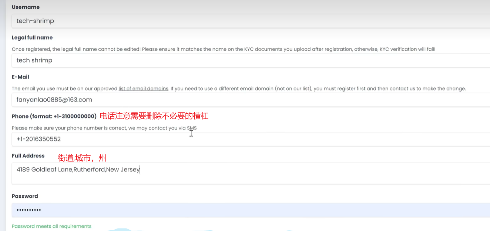
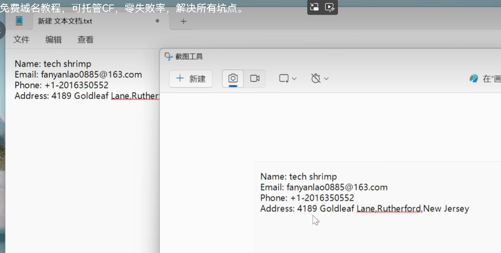

# 参考资料

[2024最新免费域名教程，可托管CF，零失败率，解决所有坑点。_哔哩哔哩_bilibili](https://www.bilibili.com/video/BV1by411B7Ko/?spm_id_from=333.999.0.0&vd_source=7103983ce7cdb97d8715a21074de9a20)

[美国身份证生成，美国人地址信息生成-世界各国身份信息、地址、信用卡生成器 (ssnzk.com)](https://www.ssnzk.com/)

# 步骤

访问地址：https://register.us.kg/

## 注册

进入官网后，点击Sign Up，填写用户名、全名、邮箱

注意全名中间需要有空格，邮箱可以使用163或者qq邮箱

电话和地址信息可以使用虚拟生成器，注意电话前面要加前缀并且删掉不必要的横线，地址信息按照街道，城市，州的顺序用逗号拼接

最后填写密码与人机验证，点击注册

## 激活

完成上面的步骤后，邮箱中会收到一封邮件，访问邮件中的地址进行邮箱的确认

## 登录

再次访问官网，此次选择登录，用户名为邮箱地址

### KYC认证

登录后会显示需要验证KYC身份

在文本编辑器中填入注册时的信息，截图并保存，注意只截图信息部分，且信息要与注册时完全相同（包括大小写）

返回官网页面，选择验证方式，选择第一个Upload

点击`Proceed to Default Server(Click me to redirect KYC Page)`

填写注册理由，比如“For create website”

文档类型Document Type 填写 work ID

KYC Document 正面文件上传刚刚制作的截图，背面不用管，点击提交，此时若验证有误则检查截图中信息与注册时是否相同

## 创建域名

再次访问官网，重新登录

点击首页的域名注册

申请的同时可托管到cloudflare，一个账户可免费创建三个域名

# 续费

域名注册好后有一年有效期，可以免费续费

点击上图中的管理域名，进入后选择要续费的域名，在过期前180天内可以点击ReNew

