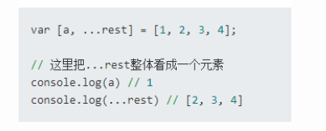
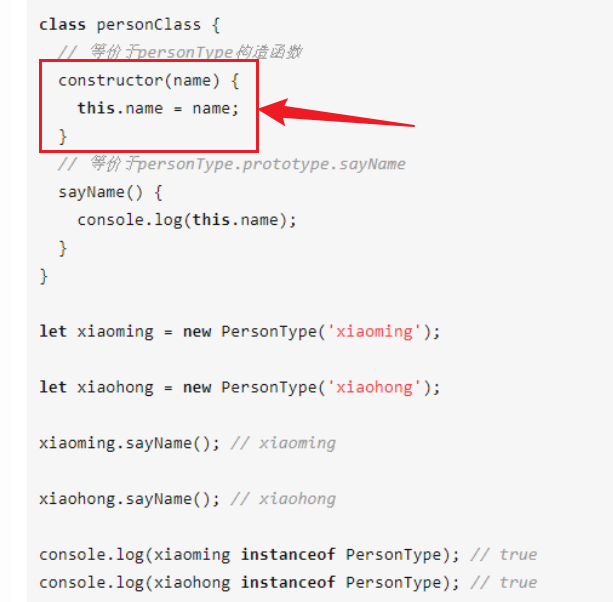
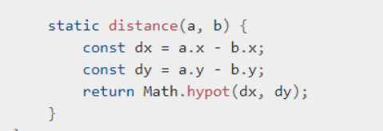

# ES6

## ES6

### var，let，const


setTimeout（），跳出当前块后才会执行，使用var的时候，由于是全局变量，在跳出块之后i已经变为了5，而使用let，每一个i都是每一次for循环中的局部变量

### 解构赋值


批量赋值的感觉

### 拓展运算符



这啥？数组分割？


类似于java中的可变参数

### 模板字面量

- 反单引号标识，可使用反斜杠转义
- 反单引号中所有内容都会转为字符串，包括换行与缩进
- 在模板字面量中使用${},其内可写js，返回值将会插入该位置

```
let count = 10,
price = 0.25,
message = passthru`${count} items cost $${(count * price).toFixed(2)}.`;
```

　　如果有一个名为passthru()的函数，那么作为一个模板字面量标签，它会接受3个参数首先是一个literals数组，包含以下元素

　　1、第一个占位符前的空字符串("")

　　2、第一、二个占位符之间的字符串(" items cost $")

　　3、第二个占位符后的字符串(".")

　　下一个参数是变量count的解释值，传参为10，它也成为了substitutions数组里的第一个元素

　　最后一个参数是(count*price).toFixed(2)的解释值，传参为2.50，它是substitutions数组里的第二个元素

　　[注意]literals里的第一个元素是一个空字符串，这确保了literals[0]总是字符串的始端，就像literals[literals.length-1]总是字符串的结尾一样。substitutions的数量总比literals少一个，这也意味着表达式substitutions. Iength === literals. Iength-1的结果总为true

### class

es6中类的写法与java类似

- 构造方法

  

- 静态方法

  

- 装饰器，类似于注解

  

### 模块化

- export
- import

# React

## jsx  

长得像html的js语言，可以直观的编写html标签，且可在其中使用{}包裹引入js代码。

## 组件名

React 会将以小写字母开头的组件视为原生 DOM 标签。故自定义的组件务必要以大写字母开头

## props/state 

props，传入的参数，所有 React 组件都必须像纯函数一样保护它们的 props 不被更改。

State 与 props 类似，但是 state 是私有的，并且完全受控于当前组件。组件可以选择把它的 state 作为 props 向下传递到它的子组件中

直接修改state的值，react不会重新渲染组件，需要使用setState（）。构造函数是唯一可以给state直接赋值的地方。

setState会合并传入的参数：若state中本身不止传入的参数，则会保留其余属性，只修改与传入参数同名属性的值。

setState 异步，先存放修改，固定频率去更新。

通信原理便是传递事件（方法），refrunse

## 单向数据流解决方案


## 生命周期

componentDidMount() 在组建被渲染到DOM中后运行

迭代很快

## promise

解决异步嵌套

js 单线程，某一个页面下所有js都是单线程，单线程中想要异步操作，用浏览器提供底层api，无法自己开启子线程，通过浏览器向os申请宏任务队列，通过promise放到另一个线程中，对于执行页面还是单线程。回调函数，ajax请求有时间差，发起请求，等待响应，到子进程，通过回调函数传到ajax。问题，ajax套ajax导致代码嵌套。promise解决方案，一状态两方法，响应成功和失败，

# 猪齿鱼

## dataset

- 首先，dataset不能在定义的时候用new，定义的时候只能算是配置，并且需要定义为一个方法，因为在使用的时候，解析json参数需要为一个方法。

  ```js
  export const listDS = () => ({
    // 指定 DataSet 初始化后自动查询
    autoQuery: true,
    // 请求分页大小
    pageSize: 8,
    // 主键字段名，一般用作级联行表的查询字段
    primaryKey: 'id',
    // 对应后端接口，自动生成约定的 submitUrl, queryUrl...
    name: 'user',
    .......
    .........
    ........
    ........
  ```

- 新建一个dataset对象

  ```js
   const formDs = new DataSet({...listDS(), autoQuery: false, autoCreate: true});
  ```

  其中:

  - autoQuery为自动查找,若新增的时候用的值集将该属性设为true, 则会默认将查出来的第一条数据放入模态框
  - autoCreate为自动创建一条数据,在新增使用值集务必带上

- dataset中的fields对应后端发送过来的json数据

  ```js
  fields: [
      { name: 'currencyCode', type: 'string', label: '币种代码', required: true },
      { name: 'currencyName', type: 'string', label: '币种名称', required: true },
      {
        name: 'country',
        type: 'object',
        label: '国家/地区',
        required: true,
      //   textField: lov框显示的内容
        textField: 'countryName',
        lovCode: 'HPFM.COUNTRY',
      },
      { name: 'financialPrecision', type: 'number', label: '财务精度', required: true },
      { name: 'defaultPrecision', type: 'number', label: '精度', required: true },
      { name: 'currencySymbol', type: 'string', label: '货币符号', required: true },
      { name: 'enableFlag', type: 'boolean', label: '状态', required: true },
    ],
  ```

  其中

  - country字段之所以type为object,因为对应的是一个值集,lovCode即为值集编码,textField为在选择值集后要显示在输入框中的内容。
  - require在dataset中配置才会触发必需检查

- queryfields为查找条件配置

  ```js
  queryFields: [
      {
        name: 'currencyCode',
        type: 'string',
        label: '币种代码',
      },
      {
        name: 'currencyName',
        type: 'number',
        label: '币种名称',
      },
      {
        name: 'countryName',
        type: 'string',
        label: '国家/地区',
      },
    ],
  ```

  在这里配置,对应的table上会显示搜索框

  

- transport,这里配置对值集的一些操作所对应的处理

  ```js
  // 接口自定义配置
    transport: {
      // 查询请求的 axios 配置或 url 字符串
      read: {
        url: '/hpfm/v1/3/currencys',
        method: 'GET',
      },
      submit: ({ data }) => {
        let toData = data[0];
  
        toData.enabledFlag = (toData.enabledFlag ? 1 : 0);
        toData.countryId = toData.country.countryId;
  
        return {
          url: '/hpfm/v1/3/currencys',
          method: 'POST',
          data: toData,
        };
      },
      update: ({ data }) => {
        return {
          url: '/hpfm/v1/3/currencys',
          method: 'PUT',
          data: data[0],
        };
      },
    },
  ```

  其中:

  - 这里需要注意,值集的新增修改操作获取的data是一个数组,若后端只要对象,则可以在这里进行转换.
  - 同时,有些数据比如boolean类型要转为整型,也可以在这里配置

## table

table这里需要绑定一个数据集和一个列

```js
// 数据集的创建
listDs = new DataSet(listDS());

// 创建列

columns = [
  { name: 'currencyCode' },
  { name: 'currencyName', editor: true },
  { name: 'countryName' },
  { name: 'financialPrecision' },
  { name: 'defaultPrecision' },
  { name: 'currencySymbol' },
  { name: 'enableFlag' },
  { header: '状态表示' },
  { header: '操作' },
];

<Table dataSet={this.listDs} columns={this.columns} />
    
```

## 模态框

模态框通过一个方法被调用出来

```js

Modal.open({
        title: '新建币种',
        drawer: true,
        okText: '确定',
        onOk: () => {
            return formDs.submit();
        },
        children: <InsertDrawerChiled formDs={formDs} />,
        autoCenter: true,
      });
```

其中:

- title为模态框标题
- drawer:将模态框以侧边抽屉显示
- okText:确定按钮文本
- onOk: 点击确定之后执行的事件,这里执行了数据集的submit操作
- children: 模态框中的组件

模态框中组件如下

```js
import React from 'react';

import {
  Form,
  Button,
  TextField,
  Switch,
  NumberField,
  Row,
  Col,
  Lov,
} from 'choerodon-ui/pro';

export const InsertDrawerChiled = ({ formDs }) => {
  return (
    <Form dataSet={formDs}>
      <TextField name="currencyCode" />
      <TextField name="currencyName" />
      <Row label="国家/地区" required>
        <Col>
          <Lov dataSet={formDs} name="country" />
        </Col>
      </Row>
      <NumberField name="financialPrecision" />
      <NumberField name="defaultPrecision" />
      <TextField name="currencySymbol" />
      <Switch label="启用" name="enableFlag" />

    </Form>
  );
};

```

其中:

- form绑定值集,其中name需要对应值集中的段
- 国家/地区为值集选择
- switch的值为boolean,若需要传给后端整型,需要在数据集操作方法中处理

