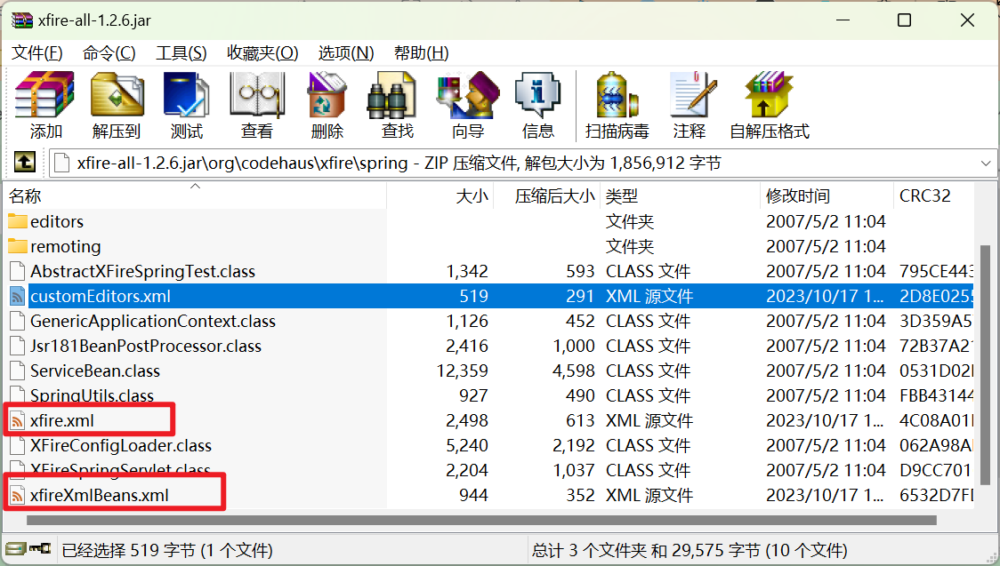

# 参考资料

[SpringBoot2 整合 XFIRE 服务端和客户端_springboot xfire_gblfy的博客-CSDN博客](https://blog.csdn.net/weixin_40816738/article/details/120346965)

[Attribute “singleton” must be declared for element type “bean”._singletonattribute-CSDN博客](https://gblfy.blog.csdn.net/article/details/120346977)

# 原因

某项目有个使用了xfire框架的webservice服务，报错：


sap pi中间件请求会出现此问题，但soapui请求不会，为了在soapui上复现该问题，搭建了一个xfire服务

# 搭建

## pom

注意springboot版本

```xml
<?xml version="1.0" encoding="UTF-8"?>
<project xmlns="http://maven.apache.org/POM/4.0.0"
         xmlns:xsi="http://www.w3.org/2001/XMLSchema-instance"
         xsi:schemaLocation="http://maven.apache.org/POM/4.0.0 http://maven.apache.org/xsd/maven-4.0.0.xsd">
    <modelVersion>4.0.0</modelVersion>
    <parent>
        <groupId>org.springframework.boot</groupId>
        <artifactId>spring-boot-starter-parent</artifactId>
        <version>2.5.4</version>
        <relativePath/>
    </parent>
    <groupId>org.example</groupId>
    <artifactId>xfiretest</artifactId>
    <version>1.0-SNAPSHOT</version>

    <properties>
        <maven.compiler.source>6</maven.compiler.source>
        <maven.compiler.target>6</maven.compiler.target>
    </properties>
    <dependencies>
        <dependency>
            <groupId>org.springframework.boot</groupId>
            <artifactId>spring-boot-starter</artifactId>
        </dependency>
        <dependency>
            <groupId>org.springframework.boot</groupId>
            <artifactId>spring-boot-starter-web</artifactId>
        </dependency>
        <dependency>
            <groupId>org.codehaus.xfire</groupId>
            <artifactId>xfire-all</artifactId>
            <version>1.2.6</version>
            <!--排除冲突的依赖包-->
            <exclusions>
                <exclusion>
                    <groupId>javax.activation</groupId>
                    <artifactId>activation</artifactId>
                </exclusion>
                <exclusion>
                    <groupId>org.springframework</groupId>
                    <artifactId>spring</artifactId>
                </exclusion>
                <exclusion>
                    <artifactId>commons-logging</artifactId>
                    <groupId>commons-logging</groupId>
                </exclusion>
                <exclusion>
                    <artifactId>stax-api</artifactId>
                    <groupId>stax</groupId>
                </exclusion>
            </exclusions>
        </dependency>
    </dependencies>
</project>
```

## /resources/config/boot-xfire.xml

```xml
<?xml version="1.0" encoding="UTF-8" ?>
<beans xmlns="http://www.springframework.org/schema/beans"
       xmlns:xsi="http://www.w3.org/2001/XMLSchema-instance"
       xmlns:context="http://www.springframework.org/schema/context"
       xsi:schemaLocation="http://www.springframework.org/schema/beans
       http://www.springframework.org/schema/beans/spring-beans-2.0.xsd
       http://www.springframework.org/schema/context
       http://www.springframework.org/schema/context/spring-context-3.1.xsd">

    <!--扫描被@webService的包,在springboot启动类范围下不要也行-->
    <context:component-scan base-package="com.xfire"/>

    <!-- XFire start -->
    <import resource="classpath:org/codehaus/xfire/spring/xfire.xml"/>

    <!--<import resource="xfire.xml" />-->
    <bean id="webAnnotations" class="org.codehaus.xfire.annotations.jsr181.Jsr181WebAnnotations"/>
    <bean id="jsr181HandlerMapping" class="org.codehaus.xfire.spring.remoting.Jsr181HandlerMapping">
        <property name="xfire" ref="xfire"/>
        <property name="webAnnotations" ref="webAnnotations"/>
    </bean>
</beans>
```

## XFireTestApplication

```java
@SpringBootApplication
public class XFireTestApplication {
    public static void main(String[] args) {
        SpringApplication.run(XFireTestApplication.class, args);
    }
}
```

## WebApplicationContextLocator

用于获取当前上下文

```java
package com.xfire;

import org.springframework.boot.web.servlet.ServletContextInitializer;
import org.springframework.context.annotation.Configuration;
import org.springframework.web.context.WebApplicationContext;
import org.springframework.web.context.support.WebApplicationContextUtils;

import javax.servlet.ServletContext;
import javax.servlet.ServletException;

/**
 * @author boranget
 * @date 2023/10/17
 */
@Configuration
public class WebApplicationContextLocator  implements ServletContextInitializer {

    private static WebApplicationContext webApplicationContext;

    public static WebApplicationContext getCurrentWebApplicationContext() {
        return webApplicationContext;
    }

    /**
     * 在启动时获取servletContext，后面再读取二次使用。
     * @param servletContext
     * @throws ServletException
     */
    @Override
    public void onStartup(ServletContext servletContext) throws ServletException {
        webApplicationContext = WebApplicationContextUtils.getWebApplicationContext(servletContext);
    }
}

```

## SpringBootBeanAutowiringSupport

```java
package com.xfire;

import org.slf4j.Logger;
import org.slf4j.LoggerFactory;
import org.springframework.beans.factory.annotation.AutowiredAnnotationBeanPostProcessor;
import org.springframework.util.Assert;
import org.springframework.util.ClassUtils;
import org.springframework.web.context.WebApplicationContext;

/**
 * @author boranget
 * @date 2023/10/17
 */
public class SpringBootBeanAutowiringSupport {

    private static final Logger logger = LoggerFactory.getLogger(SpringBootBeanAutowiringSupport.class);


    /**
     * 构造方法，在作为父类时，调用子类的构造方法之前会先执行此方法
     */
    public SpringBootBeanAutowiringSupport() {
        System.out.println("SpringBootBeanAutowiringSupport.SpringBootBeanAutowiringSupport");
        processInjectionBasedOnCurrentContext(this);
    }


    /**
     * 获取当前线程上下文的自动注入工厂
     * 使用该工厂对传入对象进行自动装配
     */
    public static void processInjectionBasedOnCurrentContext(Object target) {
        Assert.notNull(target, "Target object must not be null");
        WebApplicationContext cc = WebApplicationContextLocator.getCurrentWebApplicationContext();
        if (cc != null) {
            AutowiredAnnotationBeanPostProcessor bpp = new AutowiredAnnotationBeanPostProcessor();
            bpp.setBeanFactory(cc.getAutowireCapableBeanFactory());
            bpp.processInjection(target);
        } else {
            if (logger.isDebugEnabled()) {
                logger.debug("Current WebApplicationContext is not available for processing of " +
                        ClassUtils.getShortName(target.getClass()) + ": " +
                        "Make sure this class gets constructed in a Spring web application. Proceeding without injection.");
            }
        }
    }}

```

## XfireConfig

引入配置以及注册xfire servlet

```java
package com.xfire;

import org.codehaus.xfire.spring.XFireSpringServlet;
import org.springframework.boot.web.servlet.ServletRegistrationBean;
import org.springframework.context.annotation.Bean;
import org.springframework.context.annotation.ImportResource;
import org.springframework.stereotype.Component;

/**
 * @author boranget
 * @date 2023/10/17
 */
//引入外部配置
@ImportResource(locations = {"classpath:config/boot-xfire.xml"})
@Component
public class XfireConfig {
    /**
     * 相当于：
     *
     * <?xml version="1.0" encoding="UTF-8"?>
     * <web-app version="2.5" xmlns="http://java.sun.com/xml/ns/javaee" xmlns:xsi="http://www.w3.org/2001/XMLSchema-instance"
     * 	xsi:schemaLocation="http://java.sun.com/xml/ns/javaee
     * 	http://java.sun.com/xml/ns/javaee/web-app_2_5.xsd">
     * 	<servlet>
     * 		<servlet-name>xfireServlet</servlet-name>
     * 		<servlet-class>org.codehaus.xfire.spring.XFireSpringServlet</servlet-class>
     * 	</servlet>
     * 	<servlet-mapping>
     * 		<servlet-name>xfireServlet</servlet-name>
     * 		<url-pattern>/webservice/*</url-pattern>
     * 	</servlet-mapping>
     * </web-app>
     * @return
     */
    @Bean
    public ServletRegistrationBean registrationBean() {
        ServletRegistrationBean servletRegistrationBean = new ServletRegistrationBean();
        // 设置servlet
        servletRegistrationBean.setServlet(new XFireSpringServlet());
        servletRegistrationBean.addUrlMappings("/webservice/*");
        return servletRegistrationBean;
    }
}

```

## IXfireService

定义接口

```java
package com.xfire;

/**
 * @author boranget
 * @date 2023/10/17
 */
public interface IXfireService {
    public String sayHello(String info);
    public String sayHello2(String info,String info2);
}

```


## XfireServiceImpl

实现接口以及定义

```java
/**
 * serviceName: 服务地址
 * targetNamespace:命名空间
 */
@WebService(serviceName = "xfireTestService", targetNamespace = "http://nothing.com")
@BindingType(value = SOAPBinding.SOAP12HTTP_BINDING)
@Service
public class XfireServiceImpl extends SpringBootBeanAutowiringSupport implements IXfireService {
    /**
     * @param info
     * @return
     */
    @Override
    public String sayHello(String info) {
        return "sayHello:" + info;
    }

    @Override
    public String sayHello2(String info, String info2) {
        return info + info2;
    }
}
```

# 启动问题

- **Attribute “singleton” must be declared for element type “bean”**

    解决，找到jar包，坐标 xfire-all-1.2.6.jar\org\codehaus\xfire\spring

    其中两个文件xfire.xml和xfireXmlBeans.xml，删除其中所有的singleton="true"

    

- **cannot convert value of type ‘org.codehaus.xfire.spring.editors.ServiceFactoryEditor’**

    解决：找到同文件夹中的 customEditors.xml，找到如下代码，删除property属性

    ```xml
    <entry key="org.codehaus.xfire.service.ServiceFactory">
              <bean class="org.codehaus.xfire.spring.editors.ServiceFactoryEditor">
                <property name="transportManager" ref="xfire.transportManager" />
              </bean>
            </entry>
    ```

# 运行&解决问题

访问地址 [localhost:8080//webservice/xfireTestService?wsdl](http://localhost:8080//webservice/xfireTestService?wsdl)

使用soapui进行测试，发现在body缺失时会报该错，最后发现是pi中间件原本有个功能是使用soap的格式包装数据，但通道配置给取消了，恢复该配置即可


