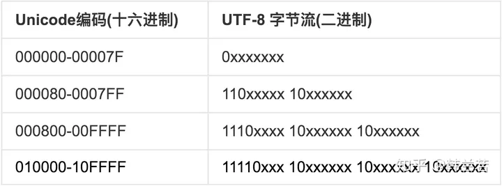
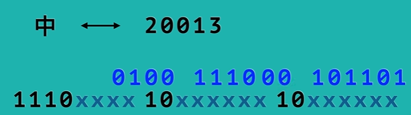
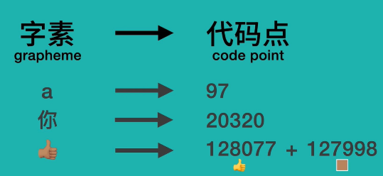
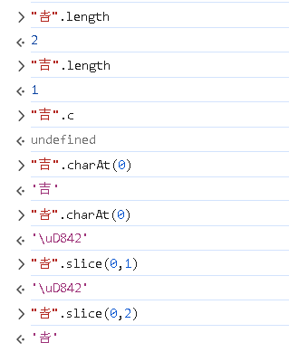

# 参考资料

[ASCII码一览表，ASCII码对照表 (biancheng.net)](http://c.biancheng.net/c/ascii/)

[UTF-8 到底是什么意思？unicode编码简介 - 知乎 (zhihu.com)](https://zhuanlan.zhihu.com/p/137875615)

# 相关概念

## 字节序

字节序是指计算机存储数据时采用的字节排列顺序，在计算机科学中有两种字节序：大端字节序和小端字节序，大端字节序（Big-Endian）是指最高有效位在最低地址的字节序。小端字节序（Little-Endian）是指最低有效位在最低地址的字节序

## BOM

BOM是一个特殊的标记符，用于表示文本文件的字节序。

# 编码

## ASCII

占用一个字节：8位，有效信息存储位7位，首位为0，一共128个字符

| 二进制   | 十进制 | 十六进制 | 字符/缩写                                    | 解释                               |
| -------- | ------ | -------- | -------------------------------------------- | ---------------------------------- |
| 00000000 | 0      | 00       | NUL (NULL)                                   | 空字符                             |
| 00000001 | 1      | 01       | SOH (Start Of Headling)                      | 标题开始                           |
| 00000010 | 2      | 02       | STX (Start Of Text)                          | 正文开始                           |
| 00000011 | 3      | 03       | ETX (End Of Text)                            | 正文结束                           |
| 00000100 | 4      | 04       | EOT (End Of Transmission)                    | 传输结束                           |
| 00000101 | 5      | 05       | ENQ (Enquiry)                                | 请求                               |
| 00000110 | 6      | 06       | ACK (Acknowledge)                            | 回应/响应/收到通知                 |
| 00000111 | 7      | 07       | BEL (Bell)                                   | 响铃                               |
| 00001000 | 8      | 08       | BS (Backspace)                               | 退格                               |
| 00001001 | 9      | 09       | HT (Horizontal Tab)                          | 水平制表符                         |
| 00001010 | 10     | 0A       | LF/NL(Line Feed/New Line)                    | 换行键                             |
| 00001011 | 11     | 0B       | VT (Vertical Tab)                            | 垂直制表符                         |
| 00001100 | 12     | 0C       | FF/NP (Form Feed/New Page)                   | 换页键                             |
| 00001101 | 13     | 0D       | CR (Carriage Return)                         | 回车键                             |
| 00001110 | 14     | 0E       | SO (Shift Out)                               | 不用切换                           |
| 00001111 | 15     | 0F       | SI (Shift In)                                | 启用切换                           |
| 00010000 | 16     | 10       | DLE (Data Link Escape)                       | 数据链路转义                       |
| 00010001 | 17     | 11       | DC1/XON (Device Control 1/Transmission On)   | 设备控制1/传输开始                 |
| 00010010 | 18     | 12       | DC2 (Device Control 2)                       | 设备控制2                          |
| 00010011 | 19     | 13       | DC3/XOFF (Device Control 3/Transmission Off) | 设备控制3/传输中断                 |
| 00010100 | 20     | 14       | DC4 (Device Control 4)                       | 设备控制4                          |
| 00010101 | 21     | 15       | NAK (Negative Acknowledge)                   | 无响应/非正常响应/拒绝接收         |
| 00010110 | 22     | 16       | SYN (Synchronous Idle)                       | 同步空闲                           |
| 00010111 | 23     | 17       | ETB (End of Transmission Block)              | 传输块结束/块传输终止              |
| 00011000 | 24     | 18       | CAN (Cancel)                                 | 取消                               |
| 00011001 | 25     | 19       | EM (End of Medium)                           | 已到介质末端/介质存储已满/介质中断 |
| 00011010 | 26     | 1A       | SUB (Substitute)                             | 替补/替换                          |
| 00011011 | 27     | 1B       | ESC (Escape)                                 | 逃离/取消                          |
| 00011100 | 28     | 1C       | FS (File Separator)                          | 文件分割符                         |
| 00011101 | 29     | 1D       | GS (Group Separator)                         | 组分隔符/分组符                    |
| 00011110 | 30     | 1E       | RS (Record Separator)                        | 记录分离符                         |
| 00011111 | 31     | 1F       | US (Unit Separator)                          | 单元分隔符                         |
| 00100000 | 32     | 20       | (Space)                                      | 空格                               |
| 00100001 | 33     | 21       | !                                            |                                    |
| 00100010 | 34     | 22       | "                                            |                                    |
| 00100011 | 35     | 23       | #                                            |                                    |
| 00100100 | 36     | 24       | $                                            |                                    |
| 00100101 | 37     | 25       | %                                            |                                    |
| 00100110 | 38     | 26       | &                                            |                                    |
| 00100111 | 39     | 27       | '                                            |                                    |
| 00101000 | 40     | 28       | (                                            |                                    |
| 00101001 | 41     | 29       | )                                            |                                    |
| 00101010 | 42     | 2A       | *                                            |                                    |
| 00101011 | 43     | 2B       | +                                            |                                    |
| 00101100 | 44     | 2C       | ,                                            |                                    |
| 00101101 | 45     | 2D       | -                                            |                                    |
| 00101110 | 46     | 2E       | .                                            |                                    |
| 00101111 | 47     | 2F       | /                                            |                                    |
| 00110000 | 48     | 30       | 0                                            |                                    |
| 00110001 | 49     | 31       | 1                                            |                                    |
| 00110010 | 50     | 32       | 2                                            |                                    |
| 00110011 | 51     | 33       | 3                                            |                                    |
| 00110100 | 52     | 34       | 4                                            |                                    |
| 00110101 | 53     | 35       | 5                                            |                                    |
| 00110110 | 54     | 36       | 6                                            |                                    |
| 00110111 | 55     | 37       | 7                                            |                                    |
| 00111000 | 56     | 38       | 8                                            |                                    |
| 00111001 | 57     | 39       | 9                                            |                                    |
| 00111010 | 58     | 3A       | :                                            |                                    |
| 00111011 | 59     | 3B       | ;                                            |                                    |
| 00111100 | 60     | 3C       | <                                            |                                    |
| 00111101 | 61     | 3D       | =                                            |                                    |
| 00111110 | 62     | 3E       | >                                            |                                    |
| 00111111 | 63     | 3F       | ?                                            |                                    |
| 01000000 | 64     | 40       | @                                            |                                    |
| 01000001 | 65     | 41       | A                                            |                                    |
| 01000010 | 66     | 42       | B                                            |                                    |
| 01000011 | 67     | 43       | C                                            |                                    |
| 01000100 | 68     | 44       | D                                            |                                    |
| 01000101 | 69     | 45       | E                                            |                                    |
| 01000110 | 70     | 46       | F                                            |                                    |
| 01000111 | 71     | 47       | G                                            |                                    |
| 01001000 | 72     | 48       | H                                            |                                    |
| 01001001 | 73     | 49       | I                                            |                                    |
| 01001010 | 74     | 4A       | J                                            |                                    |
| 01001011 | 75     | 4B       | K                                            |                                    |
| 01001100 | 76     | 4C       | L                                            |                                    |
| 01001101 | 77     | 4D       | M                                            |                                    |
| 01001110 | 78     | 4E       | N                                            |                                    |
| 01001111 | 79     | 4F       | O                                            |                                    |
| 01010000 | 80     | 50       | P                                            |                                    |
| 01010001 | 81     | 51       | Q                                            |                                    |
| 01010010 | 82     | 52       | R                                            |                                    |
| 01010011 | 83     | 53       | S                                            |                                    |
| 01010100 | 84     | 54       | T                                            |                                    |
| 01010101 | 85     | 55       | U                                            |                                    |
| 01010110 | 86     | 56       | V                                            |                                    |
| 01010111 | 87     | 57       | W                                            |                                    |
| 01011000 | 88     | 58       | X                                            |                                    |
| 01011001 | 89     | 59       | Y                                            |                                    |
| 01011010 | 90     | 5A       | Z                                            |                                    |
| 01011011 | 91     | 5B       | [                                            |                                    |
| 01011100 | 92     | 5C       | \                                            |                                    |
| 01011101 | 93     | 5D       | ]                                            |                                    |
| 01011110 | 94     | 5E       | ^                                            |                                    |
| 01011111 | 95     | 5F       | _                                            |                                    |
| 01100000 | 96     | 60       | `                                            |                                    |
| 01100001 | 97     | 61       | a                                            |                                    |
| 01100010 | 98     | 62       | b                                            |                                    |
| 01100011 | 99     | 63       | c                                            |                                    |
| 01100100 | 100    | 64       | d                                            |                                    |
| 01100101 | 101    | 65       | e                                            |                                    |
| 01100110 | 102    | 66       | f                                            |                                    |
| 01100111 | 103    | 67       | g                                            |                                    |
| 01101000 | 104    | 68       | h                                            |                                    |
| 01101001 | 105    | 69       | i                                            |                                    |
| 01101010 | 106    | 6A       | j                                            |                                    |
| 01101011 | 107    | 6B       | k                                            |                                    |
| 01101100 | 108    | 6C       | l                                            |                                    |
| 01101101 | 109    | 6D       | m                                            |                                    |
| 01101110 | 110    | 6E       | n                                            |                                    |
| 01101111 | 111    | 6F       | o                                            |                                    |
| 01110000 | 112    | 70       | p                                            |                                    |
| 01110001 | 113    | 71       | q                                            |                                    |
| 01110010 | 114    | 72       | r                                            |                                    |
| 01110011 | 115    | 73       | s                                            |                                    |
| 01110100 | 116    | 74       | t                                            |                                    |
| 01110101 | 117    | 75       | u                                            |                                    |
| 01110110 | 118    | 76       | v                                            |                                    |
| 01110111 | 119    | 77       | w                                            |                                    |
| 01111000 | 120    | 78       | x                                            |                                    |
| 01111001 | 121    | 79       | y                                            |                                    |
| 01111010 | 122    | 7A       | z                                            |                                    |
| 01111011 | 123    | 7B       | {                                            |                                    |
| 01111100 | 124    | 7C       | \|                                           |                                    |
| 01111101 | 125    | 7D       | }                                            |                                    |
| 01111110 | 126    | 7E       | ~                                            |                                    |
| 01111111 | 127    | 7F       | DEL (Delete)                                 | 删除                               |

### 换行

LF的本意是将光标移到下一行，称作换行（\n），CR则是将光标移到最左边，称作回车(\r)。

现如今Dos 和 Windows系统采用回车+换行表示下一行

而C语言、UNIX和Linux等系统会将LF表示下一行

苹果系统采用回车表示下一行

## GBK和GB2312

GB2312标准共收录6763个汉字，其中一级汉字3755个，二级汉字3008个；GBK共收入21886个汉字和图形符号。

## BIG5

ASCII是单字节编码，存储数据较少，比如汉字本身字符较多无法使用ASICC去存储，故出现了多字节编码

BIG5是双字节编码，包含大大多数的中文繁体字

## UTF-8

统一编码Unicode，像BIG5这种字符集，每个国家都会有一套，这样就很乱，于是出现了统一编码。

特点，变长字符集，变长的好处是不会浪费过多的空间，在表示位数较少的字符时，只需少量的字节。

utf后面跟着的8是表示编码的最小单位为8位，也就是一个字节，同样的，utf-16表示最小单位为2个字节

UTF-8编码与字节序无关，直接按照大端字节序编码，故在文件开头不需要BOM来表明字节序，大多数的系统包括Windows和Mac OS，都默认采用大端字节序。故utf-8被广泛使用。

在 Unicode 字符集里，为了能对世界上各种语言的字符、符号等进行统一编码，它使用了一个庞大的编码空间。整个 Unicode 编码空间被划分为 17 个平面（Plane），每个平面包含 216（即 65,536）个代码点。其中，基本多语言平面和辅助平面的情况如下：

基本多语言平面（Basic Multilingual Plane，BMP）

- 范围：基本多语言平面是 Unicode 编码空间中的第 0 个平面，其代码点范围是 U+0000 到 U+FFFF。
- 特点：这是最常用的平面，几乎涵盖了所有现代语言中最常用的字符，包括拉丁字母、汉字、假名、谚文等，以及大量的标点符号、数学符号等。在 UTF - 16 编码中，BMP 内的字符可以用一个 16 位的代码单元来表示。
- 举例
  - 英文字母：大写字母 `A` 的 Unicode 编码是 U+0041，小写字母 `a` 是 U+0061，它们都位于 BMP 中。
  - 汉字：“中” 字的 Unicode 编码是 U+4E2D，“文” 字是 U+6587，也在 BMP 范围内。
  - 常见符号：句号 `。` 的 Unicode 编码是 U+3002，逗号 `，` 是 U+FF0C，同样属于 BMP。

辅助平面（Supplementary Planes）

- 范围：除了第 0 个平面（BMP）之外的其余 16 个平面（从第 1 平面到第 16 平面）都属于辅助平面，代码点范围是 U+10000 到 U+10FFFF。
- 特点：辅助平面主要用于容纳一些非常生僻的字符、古代文字、专业领域的特殊符号、表情符号等。在 UTF - 16 编码中，辅助平面的字符需要用两个 16 位的代码单元（即代理项对）来表示。
- 举例
  - 表情符号：许多表情符号位于辅助平面，例如 👍（U+1F44D），它是一个常用的点赞表情。在 UTF - 16 编码中，它由**高代理项** U+D83D 和**低代理项** U+DC4D 组成。
  - 古代文字：一些古代的象形文字或已经不再使用的文字系统中的字符可能会被编码在辅助平面。例如，玛雅数字系统中的某些符号。
  - 专业符号：在一些专业领域，如化学、天文学等，可能会使用一些特殊的符号，部分也会被编码在辅助平面。

