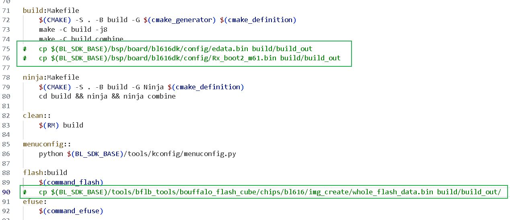

# 参考资料

[零基础搭建小安派Windows 开发环境 - 小安派S1教程合集 - 物联网开发者社区-安信可论坛 - Powered by Discuz! (ai-thinker.com)](http://bbs.ai-thinker.com/forum.php?mod=viewthread&tid=282&extra=page%3D2&_dsign=7fea3002)

[（一）记录小安派之开发环境搭建(Windows) - 小安派S1教程合集 - 物联网开发者社区-安信可论坛 - Powered by Discuz! (ai-thinker.com)](http://bbs.ai-thinker.com/forum.php?mod=viewthread&tid=520&extra=&page=1&_dsign=c402de45)

# 前置环境

由于我的电脑上vsc（vs code）和git都安装过了，不再重新安装一次了。不熟悉的朋友可在本博客查找对应文章：[Boranget.博客](https://boranget.github.io/)（进入博客右上角有搜索图标）

- 安装vsc
- 安装并配置git

# 拉取源码

在你常用的项目目录新建一个项目文件夹，进入，地址栏输入cmd打开控制台（或者通过别的方式在cmd中进入这个文件夹）

执行(需要配置好git)

```bash
git clone https://gitee.com/Ai-Thinker-Open/AiPi-Open-Kits.git
```

# 修改子模块源

考虑到有些小伙伴的网络原因，拉取github网络不稳定，这里将github仓库换为gitee仓。

进入拉取下来的项目文件夹`AiPi-Open-Kits`，找到`.gitmodules`文件，右键选择打开方式使用刚刚安装好的vsc打开（或者记事本或者别的什么文本编辑器（你甚至可以用刚刚安装的git里的vim））

将github改为gitee，或者直接复制下方内容覆盖

```
[submodule "aithinker_Ai-M6X_SDK"]
	path = aithinker_Ai-M6X_SDK
	url = https://gitee.com/Ai-Thinker-Open/aithinker_Ai-M6X_SDK.git
	branch = release/AiPi_Eyes_SDK
```

# 拉取子模块

cmd进入`AiPi-Open-Kits`目录，执行

```bash
git submodule init
git submodule update
```

cmd进入`aithinker_Ai-M6X_SDK`目录，执行

```bash
git submodule init
git submodule update
```

这一过程可能比较长，等待一会

# 克隆windows编译工具链

`aithinker_Ai-M6X_SDK`目录拉取

```bash
git clone https://gitee.com/bouffalolab/toolchain_gcc_t-head_windows.git
```

# 环境变量配置

找到这三个目录的绝对路径，添加到Path

> aithinker_Ai-M6X_SDK\toolchain_gcc_t-head_windows\bin 
>
> aithinker_Ai-M6X_SDK\tools\make 
>
> aithinker_Ai-M6X_SDK\tools\ninja

重启cmd或者新开一个cmd，执行如下对应的命令，输出对应信息说明环境变量配置完成

- make -v

  ```
  GNU Make 4.2.1
  Built for x86_64-w64-mingw32
  Copyright (C) 1988-2016 Free Software Foundation, Inc.
  License GPLv3+: GNU GPL version 3 or later <http://gnu.org/licenses/gpl.html>
  This is free software: you are free to change and redistribute it.
  There is NO WARRANTY, to the extent permitted by law.
  ```

- riscv64-unknown-elf-gcc -v

  ```
  Using built-in specs.
  ...内容太长中间省略
  Supported LTO compression algorithms: zlib zstd
  gcc version 10.2.0 (Xuantie-900 elf newlib gcc Toolchain V2.6.1 B-20220906)
  ```

# 注释biuld中的cp命令防止报错

打开`/aithinker_Ai-M6X_SDK/project.build`文件，如下图修改，在行头添加#号注释掉当前行



# 编译天气站程序

如果你已经make过了并且报错了，在执行了make命令的目录执行make clean删除缓存后做如上修改后重新make。

在`AiPi-Open-Kits`目录找到`AiPi-Eyes_weather`目录，右键该目录选择在终端打开（或者进入目录在地址栏输入cmd），终端执行：

```bash
make
```

最后输出如下则成功

```
最后一行是这个：
Built target combine
```


