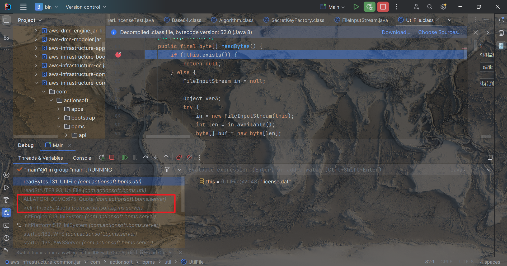
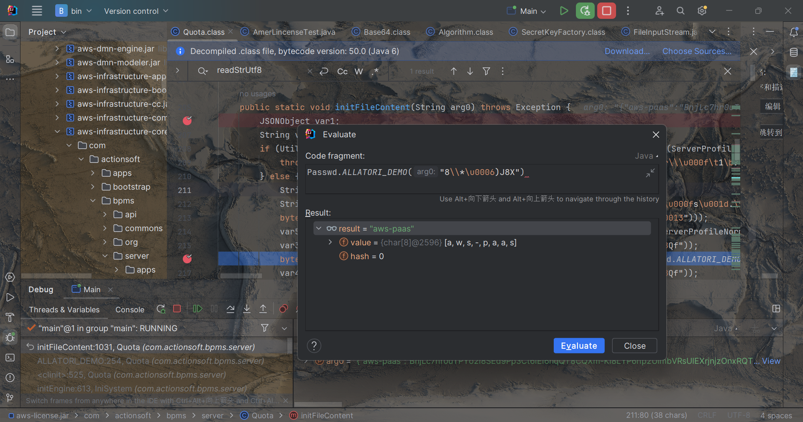

# 捕获license文件读取位置

- 移除license文件判断报错位置

    - 报错位置被隐藏

- 修改license文件读取权限为禁止读取

    

    - 成功获得报错位置

        ```
        java.io.FileNotFoundException: license.dat (拒绝访问。)
        	at java.io.FileInputStream.open0(Native Method)
        	at java.io.FileInputStream.open(FileInputStream.java:195)
        	at java.io.FileInputStream.<init>(FileInputStream.java:138)
        	at com.actionsoft.bpms.util.UtilFile.readBytes(UtilFile.java:135)
        	at com.actionsoft.bpms.util.UtilFile.readStrUTF8(UtilFile.java:93)
        	at com.actionsoft.bpms.server.Quota.ALLATORI_DEMO(d:675)
        	at com.actionsoft.bpms.server.Quota.<clinit>(d:525)
        	at com.actionsoft.bpms.server.IniSystem.initEngine(n:613)
        	at com.actionsoft.bpms.server.IniSystem.initPlatform(n:517)
        	at com.actionsoft.bpms.server.WFS.startup(pf:182)
        	at com.actionsoft.bpms.server.AWSServer.startup(vn:135)
        	at StartUp.main(StartUp.java:36)
        	at sun.reflect.NativeMethodAccessorImpl.invoke0(Native Method)
        	at sun.reflect.NativeMethodAccessorImpl.invoke(NativeMethodAccessorImpl.java:62)
        	at sun.reflect.DelegatingMethodAccessorImpl.invoke(DelegatingMethodAccessorImpl.java:43)
        	at java.lang.reflect.Method.invoke(Method.java:498)
        	at com.actionsoft.bootstrap.Main.invokeMain(Main.java:130)
        	at com.actionsoft.bootstrap.Main.start(Main.java:81)
        	at com.actionsoft.bootstrap.Main.main(Main.java:24)
        ```

        

# 搭建调试环境

- 新建idea项目

- 将主类反编译为java文件
- 将原项目以依赖的形式引入idea
- run方式运行主类：成功
- debug方式运行主类：成功

# 进行调试

- 在license文件权限报错位置打断点进行debug

- 顺着方法调用栈可以定位到疑似license文件解析逻辑位置

    

- 原项目使用Allatori 对项目进行了混淆

    - 使用idea的在线计算器进行参数计算

        

# 代码分析

使用idea计算器逐个分析参数与解密逻辑

```java
// 签名：body原文+“{}”加密而成
String sign = "d1ed8bb12f2d1....fe53f0d6ed";
// 原文加密
String encryptBody = "BnjLc7hr2Xkts3mLLzTpT1N.............KWT69Wbs";
// 括号签名
String kuohaoSign = "3c_xeQ0bFvJyCp4zcf.....v60e3CKWT69Wbs";
String defaultKey = "upeLQoVzTi.....20150228";
String signPlusMd5 = (new MD5()).toDigest(sign + ".Singular Point 2016!");

// base64解密，需要加密后的报文
byte[] encryptBodyBase64Decrypt = Base64.decode(encryptBody.getBytes(UTF8));
// AES解密，需要base64解密报文
byte[] BodyAESdecrypt = AES.decrypt(encryptBodyBase64Decrypt, signPlusMd5);
// Algorithm解密，需要AES解密报文
byte[] bodyAlgorithmDecrypt = Algorithm.decrypt(BodyAESdecrypt, defaultKey);
String newBodyString = new String(bodyAlgorithmDecrypt, UTF8);

// base64
byte[] kuohaoBase64Dec = Base64.decode(kuohaoSign.getBytes(UTF8));
// aes
byte[] kuohaoAesDec = AES.decrypt(kuohaoBase64Dec, signPlusMd5);
// alg
byte[] kuohaoAlgorithmDecrypt = Algorithm.decrypt(kuohaoAesDec, defaultKey);
// {}
String kuohaoString = new String(kuohaoAlgorithmDecrypt, UTF8);

boolean isLinuxOS = false;
boolean isAArch64 = false;
if (!sign.equals((new MD5()).toDigest(newBodyString + kuohaoString)) && isLinuxOS && !isAArch64) {
    throw new Exception("AWS Quota Error(0102)");
}
```

# 代码逆向

尝试使用原项目自带工具类进行逆向

## 缺失加密工厂

报错：

```
java.security.NoSuchAlgorithmException: PBEWithSHAAndTwofish-CBC SecretKeyFactory not available
```

应该是在启动过程中存入了一个静态的工厂，跟踪代码，获取到该工厂注册代码

```java
Security.addProvider(new BouncyCastleProvider());
```

将改代码添加到程序执行开始位置

## 最终代码

```java
Security.addProvider(new BouncyCastleProvider());
String needBodyString = "{\"no\":\"L202403................00}";
String needKuohaoString = "{}";
String defaultKey = "upeLQoVzT.....xY_20150228";
// == 生成签名
String needSign = (new MD5()).toDigest(needBodyString + needKuohaoString);
System.out.println(needSign);
String signPlusMd5 = (new MD5()).toDigest(needSign + ".Singular Point 2016!");
// == 生成加密后的报文
// 1 Algorithm加密
byte[] bodyAlgorithmEncrypt = Algorithm.encrypt(needBodyString.getBytes(), defaultKey);
// 1 aes加密
byte[] bodyAesEncrypt = AES.encrypt(bodyAlgorithmEncrypt, signPlusMd5);
// 3 base64加密
byte[] bodyBase64Encode = Base64.encodeURL(bodyAesEncrypt);
String encBody = new String(bodyBase64Encode);
System.out.println(encBody);
// == 生成括号sign
// 1 Algorithm加密
byte[] kuohaoAlgorithmEncrypt = Algorithm.encrypt(needKuohaoString.getBytes(), defaultKey);
// 1 aes加密
byte[] kuohaoAesEncrypt = AES.encrypt(kuohaoAlgorithmEncrypt, signPlusMd5);
// 3 base64加密
byte[] kuogaoBase64Encode = Base64.encodeURL(kuohaoAesEncrypt);
String encKuohao = new String(kuogaoBase64Encode);
System.out.println(encKuohao);
```

# 测试

修改当前IP地址，运行应用，报错

```
警告: [2024-04-01 14:43:19]许可证中的机器码对于本计算机无效，请将有效机器码发送给供应商，申请有效的许可
```

使用当前IP重新生成license文件，成功运行