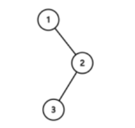
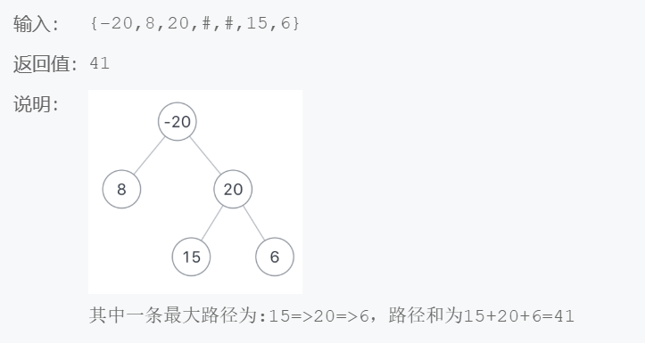
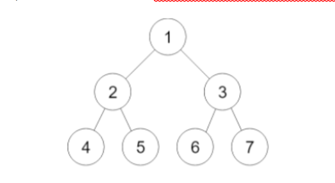
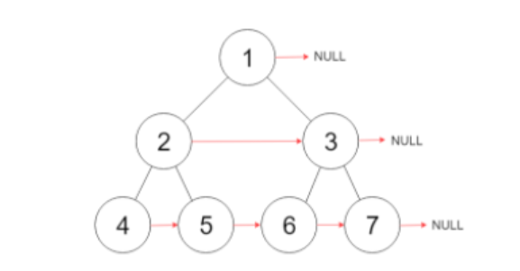

零零散散花了三年多时间，将小三百来道牛客题库刷完了，做第一题的时候还在上大学，现在都工作三年了，三年间想着反正都开始做了，就一直坚持的把这些题做完了，现在将这些题目做个整理。

# CC1 二叉树的最小深度

求给定二叉树的最小深度。最小深度是指树的根结点到最近叶子结点的最短路径上结点的数量。

```
输入：
{1,2,3,4,5}
返回值：
2
```

采用了递归的解决方案

```java
import java.util.*;

/*
 * public class TreeNode {
 *   int val = 0;
 *   TreeNode left = null;
 *   TreeNode right = null;
 * }
 */

public class Solution {
    /**
     * 
     * @param root TreeNode类 
     * @return int整型
     */
    public int run (TreeNode root) {
        int result = 0;
        // write code here
        if(root != null){
            if(root.left == null){
                return run(root.right)+1;
            }
            if(root.right == null){
                return run(root.left)+1;
            }
            // 获取左子树的深度
            int leftDeep = run(root.left);
            // 获取右子树的深度
            int rightDeep = run(root.right);
            // 比较
            result = leftDeep>rightDeep?rightDeep+1:leftDeep+1;
        }
        // 返回加本层的值
        return result;
    }
}
```

# CC2 后缀表达式求值

计算逆波兰式（后缀表达式）的值

运算符仅包含"+","-","*"和"/"，被操作数是整数

保证表达式合法，除法时向下取整。

```
输入：
["20","10","+","30","*"]
返回值：
900
```

碰到数入栈，碰到符号则出栈两个数，计算后将结果入栈

```java
import java.util.*;


public class Solution {
    /**
     * 
     * @param tokens string字符串一维数组 
     * @return int整型
     */
    public int evalRPN (String[] tokens) {
        // write code here
        Stack<Integer> stack = new Stack<>();
        for(String s:tokens){
            if(s.equals("+")){
                int x1 = stack.pop();
                int x2 = stack.pop();
                stack.push(x2+x1);
            }else if(s.equals("-")){
                int x1 = stack.pop();
                int x2 = stack.pop();
                stack.push(x2-x1);
            }else if(s.equals("*")){
                int x1 = stack.pop();
                int x2 = stack.pop();
                stack.push(x2*x1);
            }else if(s.equals("/")){
                int x1 = stack.pop();
                int x2 = stack.pop();
                stack.push(x2/x1);
            }else{
                stack.push(Integer.valueOf(s));
            }
        }
        return stack.pop();
    }
}
```

# CC3 多少个点位于同一直线

对于给定的n个位于同一二维平面上的点，求最多能有多少个点位于同一直线上

```
输入：
[(0,0),(0,1)
返回值：
2
```

每两点计算斜率，同一斜率可在同一条线上

```java
import java.util.*;

/*
 * public class Point {
 *   int x;
 *   int y;
 * }
 */

public class Solution {
    /**
     * 
     * @param points Point类一维数组 
     * @return int整型
     */
    Map<Point,Map<String,Integer>> pointMap = new HashMap<>();
    
    public int maxPoints (Point[] points) {
        if(points.length == 0){
            return 0;
        }
        initMap(points);
        // write code here 
        for(int i = 0; i < points.length - 1; i++){
            Map<String,Integer> slopeMapI = pointMap.get(points[i]);
            for(int j = i+1; j < points.length; j++){
                Map<String,Integer> slopeMapJ = pointMap.get(points[j]);
                String slope = "";
                // 计算斜率
                if((points[j].x-points[i].x) == 0){
                    slope = "error";
                }else{
                    Double slopeValue = (
                        (Double.valueOf(points[j].y-points[i].y))
                        /
                        (Double.valueOf(points[j].x-points[i].x))
                    );
                    slope = String.valueOf(slopeValue);
                }
                
                // 如果 这个pointmap中已经有该斜率的值，则取出加一
                // 否则存入1
                if(slopeMapI.containsKey(slope)){
                   slopeMapI.put(slope, slopeMapI.get(slope)+1);
                }else{
                    slopeMapI.put(slope, 1);
                }
                if(slopeMapJ.containsKey(slope)){
                   slopeMapJ.put(slope, slopeMapJ.get(slope)+1);
                }else{
                    slopeMapJ.put(slope, 1);
                }
            }
        }
        return findMax();
     }
    

    
    public void initMap(Point[] points){
        for(Point p: points){
            Map<String,Integer> slopeMap = new HashMap<>();
            pointMap.put(p,slopeMap);
        }
    }
    
    
    
    public int findMax(){
        int max = 0;
        for( Map.Entry<Point,Map<String,Integer>> pointMapEntry :pointMap.entrySet()){
            Map<String,Integer> slopeMap = pointMapEntry.getValue();
            for( Map.Entry<String,Integer> slopeMapEntry :slopeMap.entrySet()){
            Integer count = slopeMapEntry.getValue();
            if(count > max){
                max = count;
            }
        }
        }
        
        return max + 1;
    }
}
```

# CC4 链表排序

在O(n log n)的时间内使用常数级空间复杂度对链表进行排序。

```
输入：
{30,20,40}
返回值：
{20,30,40}
```

使用归并排序

```java
import java.util.*;

/*
 * public class ListNode {
 *   int val;
 *   ListNode next = null;
 * }
 */

public class Solution {
    /**javascript:void(0);
     * 
     * @param head ListNode类 
     * @return ListNode类
     */
    public ListNode sortList (ListNode head) {
        // write code here
        // 单节点链表无需拆
        if(head == null || head.next == null){
            return head;
        }
        ListNode another = findAnotherListHead(head);
        // 合并两个链表
        ListNode meargeLeft = sortList(head);
        ListNode meargeRight = sortList(another);
        return mergeList(meargeLeft,meargeRight);
        
    }
    public ListNode mergeList(ListNode l1, ListNode l2){
        ListNode left = l1;
        ListNode right = l2;
        ListNode voidNode = new ListNode(0);
        ListNode currentNode = voidNode;
        while(true){
            if(left.val > right.val){
                currentNode.next = right;
                currentNode = currentNode.next;
                if(right.next != null){
                    right = right.next;
                }else{
                    while(left != null){
                        currentNode.next = left;
                        left = left.next;
                        currentNode = currentNode.next;
                    }
                    break;
                }

            }else{
                currentNode.next = left;
                currentNode = currentNode.next;
                if(left.next != null){
                    left = left.next;
                }else{
                    while(right != null){
                        currentNode.next = right;
                        right = right.next;
                        currentNode = currentNode.next;
                    }
                    break;
                }
            }
        }
        
        return voidNode.next;
    }
    
    public ListNode findAnotherListHead(ListNode list){
        ListNode slow = list;
        ListNode fast = list;
        while(slow.next != null){
            if(fast.next == null || fast.next.next == null){
                break;
            }
            slow = slow.next;
            fast = fast.next.next;
        }
        ListNode result = slow.next;
        slow.next=null;
        return result;
    }
}
```

# CC5 链表的插入排序

使用插入排序对链表进行排序。

```
输入：
{30,20,40}
返回值：
{20,30,40}
```

就简单的插入排序：构建一个已排序列表，输入作为待排序列表

```java
import java.util.*;

/*
 * public class ListNode {
 *   int val;
 *   ListNode next = null;
 * }
 */

public class Solution {
    /**
     * 
     * @param head ListNode类 
     * @return ListNode类
     */
    public ListNode insertionSortList (ListNode head) {
        if(head == null || head.next == null){
            return head;
        }
        // write code here
        // 构建一个已排序链表
        ListNode orderList = new ListNode(0);
        // 遍历初始链表
        // 当前遍历到的节点
        ListNode currentNode = head;
        while(currentNode != null){
            // 由于当前节点插入到已排序列表中后，next会改变，无法向下遍历，所以提前保存next
            ListNode currentNextNode = currentNode.next;
            // 寻找插入位置
            ListNode currentOrderNode = orderList;
            while(currentOrderNode.next != null && currentOrderNode.next.val < currentNode.val){
                currentOrderNode = currentOrderNode.next;
            }
            currentNode.next = currentOrderNode.next;
            currentOrderNode.next = currentNode;
            currentNode = currentNextNode;
        }
        return orderList.next;
    }
}
```

# CC6 二叉树的后序遍历

用递归的方法对给定的二叉树进行后序遍历。

{1,#,2,3}



```java
import java.util.*;

/*
 * public class TreeNode {
 *   int val = 0;
 *   TreeNode left = null;
 *   TreeNode right = null;
 * }
 */

public class Solution {
    /**
     * 
     * @param root TreeNode类 
     * @return int整型ArrayList
     */
    public ArrayList<Integer> postorderTraversal (TreeNode root) {
        // write code here
        ArrayList<Integer> arrayList = new ArrayList<>();
        if(root == null){
            return arrayList;
        }
        if(root.left != null){
            arrayList.addAll(postorderTraversal(root.left));
        }
        if(root.right != null){
            arrayList.addAll(postorderTraversal(root.right));
        }
        arrayList.add(root.val);
        return arrayList;
    }
}
```

# CC9 链表中环的入口结点

给一个长度为n链表，若其中包含环，请找出该链表的环的入口结点，否则返回null

采用双指针的方法

设：

链表头到环入口长度为--a

环入口到相遇点长度为--b

相遇点到环入口长度为--c

快指针每次走两步，慢指针走一步

快指针路程=a+b+c+b

慢指针路程=a+c

快指针路程为两倍的慢指针

所以 2a+2c=a+c+2b

所以a=c

```java
import java.util.*;
/*
 public class ListNode {
    int val;
    ListNode next = null;

    ListNode(int val) {
        this.val = val;
    }
}
*/
public class Solution {

    public ListNode EntryNodeOfLoop(ListNode pHead) {
        if(pHead.next == pHead){
            return pHead;
        }
        ListNode slow = pHead;
        ListNode fast = pHead;
        // 快指针比慢指针每次多走两步，当他们相遇时，两个指针都进环了
        do{
            slow = slow.next;
            if(fast.next != null && fast.next.next != null){  
                fast = fast.next.next;
            }else{
                return null;
            }
        }while(slow != fast);
        // 快指针回到原点
        fast = pHead;
        while(slow != fast){
            slow = slow.next;
            fast = fast.next;
        }
        return slow;
        
    }
}
```

# CC10 判断链表中是否有环

判断给定的链表中是否有环。如果有环则返回true，否则返回false。

要求：空间复杂度 O(1)，时间复杂度 O(n)

参考上题思路，若快慢指针能相遇则说明有环

```java
/**
 * Definition for singly-linked list.
 * class ListNode {
 *     int val;
 *     ListNode next;
 *     ListNode(int x) {
 *         val = x;
 *         next = null;
 *     }
 * }
 */
public class Solution {
    public boolean hasCycle(ListNode head) {

        if(head == null || head.next == null){
            return false;
        }
        ListNode fast = head,slow = head;
        do{
            slow = slow.next;
            if(fast.next == null || fast.next.next == null){
                return false;
            }
            fast = fast.next.next;
        } while(fast != slow);
        return true;
    }
}
```

# CC12 拆分词句

给定一个字符串s和一组单词dict，判断s是否可以用空格分割成一个单词序列，使得单词序列中所有的单词都是dict中的单词（序列可以包含一个或多个单词）。

例如:
给定s=“nowcode”；
dict=["now", "code"].
返回true，因为"nowcode"可以被分割成"now code".

采用动态规划的思想，当前结果取决于上一步的结果

```java
import java.util.*;
public class Solution {
    public boolean wordBreak(String s, Set<String> dict) {
        int len = s.length();
        boolean[] flag = new boolean[len + 1];
        flag[0] = true;
        for (int i = 1; i <= len; i++) {
            for (int j = 0; j < i; j ++) {
 
                String str = s.substring(j, i);
                // System.out.println(s);
                // 这个判断需要判断上一个节点是否在字典里存在
                if (flag[j] && dict.contains(str)) {
                    flag[i] = true;
                    break;
                }
            }
        }
        return flag[len];
    }}
```

# CC14 出现一次的数字ii

现在有一个整数类型的数组，数组中只有一个元素只出现一次，其余元素都出现三次。你需要找出只出现一次的元素
进阶：空间复杂度 O(1) ， 时间复杂度O(n)

数据有范围限制，可以考虑构造最大值max的hash，扫描的时候以数据作为下标修改hash中的值

```java
import java.util.*;


public class Solution {
    /**
     * 
     * @param A int整型一维数组 
     * @return int整型
     */
    public int singleNumber (int[] A) {
        // write code here
        Map<Integer,Integer> map = new HashMap<>();
        for(int i = 0; i < A.length; i++){
            if(map.containsKey(A[i])){
                map.put(A[i],map.get(A[i])+1);
            }else{
                map.put(A[i],1);
            }
        }
        for(Map.Entry<Integer,Integer> entry:map.entrySet()){
            if(Integer.valueOf(entry.getValue()) == 1){
                return Integer.valueOf(entry.getKey());
            }
        }
        return 0;
    }
}
```

或者使用按位计算，构造模三加法，使得出现三次的数加在一起变成0，则只会保留出现一次的数

```java
import java.util.*;


public class Solution {
    /**
     * 
     * @param A int整型一维数组 
     * @return int整型
     */
    public int singleNumber (int[] A) {
       int a = 0, b = 0;
       for(int c:A){
           int ca = ~a&b&c|a&~b&~c;
           int cb = ~a&~b&c|~a&b&~c;
           a = ca;
           b = cb;
       }
       return b;
    }
}
```

一个使用模三的方法，将每位单独加起来，最后模三

```java
//由于只有一个出现一次的数字，其余都是出现三次，那么有如下思路
// 针对于序列中出现三次的所有数字的每一位来说，相加的结果只有两种
//1+1+1==3 或者0+0+0=0
//那么再加上只出现一次的数字的对应位数字的话，也有两种0或者4
//所以我们可以对上述的每一位求和之后对3取余，结果将会是1或者0
//也就是代表了出现一次的的这个数字对应位置上是1或者0
public class Solution {
    public int singleNumber(int[] A) {
        if(A == null||A.length == 0){
            return -1;
        }
        //得到出现一次的数字的值】
        int result = 0;
        //int为4个字节，那么一共有4*8=32位
        for(int i = 0;i < 32;i++){
            //保存每一位求和值
        	int sum = 0;
            for(int j = 0;j < A.length;j++){
                //累加所有数字上第i位上的数字
                sum+=(A[j]>>i)&1;
            }
            //取余得到第i位上的数字，之后更新result
            result |= (sum % 3) << i;
        }
        return result;
    }
}
```

# CC15 出现一次的数字

现在有一个整数类型的数组，数组中素只有一个元素只出现一次，其余的元素都出现两次。
进阶： 空间复杂度O(1) ，时间复杂度O(n)

直接异或即可

```java
import java.util.*;


public class Solution {
    /**
     *
     * @param A int整型一维数组
     * @return int整型
     */
    public int singleNumber (int[] A) {
        // write code here
        int result = 0;
        for(int i : A){
            result^=i;
        }
       
        return result;
    }

}
```

# CC16 分糖果

有N个小朋友站在一排，每个小朋友都有一个评分
你现在要按以下的规则给孩子们分糖果：
每个小朋友至少要分得一颗糖果
分数高的小朋友要他比旁边得分低的小朋友分得的糖果多
你最少要分发多少颗糖果？

输入为评分

```java
import java.util.*;


public class Solution {
    /**
     *
     * @param ratings int整型一维数组
     * @return int整型
     */
    // 使用一个Map存储每个孩子要分得的糖果数量
    // Map<Integer, Integer> candysMap = new HashMap<>();

    // 全局存储分数数组


    public int candy (int[] ratings) {

        if (ratings.length == 1) {
            return 1;
        }
        int sum = 0;
        int candys[] = new int[ratings.length];
        // 初始化,每个孩子至少分一个
        for(int i = 0; i < candys.length; i++){
            candys[i] = 1;
        }
        // 正着走一轮
        for(int i = 1; i < ratings.length; i++){
            if(ratings[i] > ratings[i - 1]){
                candys[i] = candys[i - 1] + 1;
            }
        }
        // 反着走一轮
        for(int i = ratings.length - 2; i >= 0; i --){
            if(ratings[i] > ratings[i + 1] && candys[i] <= candys[i + 1]){
                candys[i] = candys[i + 1] + 1;
            }
        }
        for(int i: candys){
            sum += i;
        }


        return sum;
    }
}
```


# CC17 加油站

环形路上有n个加油站，第i个加油站的汽油量是gas[i].
你有一辆车，车的油箱可以无限装汽油。从加油站i走到下一个加油站（i+1）花费的油量是cost[i]，你从一个加油站出发，刚开始的时候油箱里面没有汽油。
求从哪个加油站出发可以在环形路上走一圈。返回加油站的下标，如果没有答案的话返回-1。

```java
import java.util.*;


public class Solution {
    /**
     * 
     * @param gas int整型一维数组 
     * @param cost int整型一维数组 
     * @return int整型
     */
    public int canCompleteCircuit (int[] gas, int[] cost) {
        // write code here
        // if(gas.length == cost.length && gas.length == 1){
        //     return 0;
        // }
        int result = -1;
        int length = cost.length;
         // 整一个余量数组，或者到每个点计算一次也可以
        int[] surplus = new int[length];
        for(int i = 0; i < surplus.length; i++){
            surplus[i] = gas[i] - cost[i];
        }
        // 遍历余量数组，当余量数组中值非负时可以启动
        for(int i = 0; i < surplus.length; i++){
            if(surplus[i]>=0){
                // 以当前节点启动，绕一圈
                int sum = 0;
                int step = 0;
                int index = 0;
                for(step = 1, index = i; step <= length; step++,index = (index+1)%length){
                    sum+=surplus[index];
                    if(sum < 0){
                        break;
                    }
                }
                if(step == length + 1){
                    result = index;
                }
            }
        }

        return result;
    }
}
```

# CC18 复制无向图

本题要求复制一个无向图，图中每个节点都包含一个标签和它的邻居列表

采用map避免重复复制，使用递归实现

```java
/**
 * Definition for undirected graph.
 * class UndirectedGraphNode {
 *     int label;
 *     ArrayList<UndirectedGraphNode> neighbors;
 *     UndirectedGraphNode(int x) { label = x; neighbors = new ArrayList<UndirectedGraphNode>(); }
 * };
 */
import java.util.*;
public class Solution {
    Map<UndirectedGraphNode,UndirectedGraphNode> map = new HashMap<>();
    
    public UndirectedGraphNode cloneGraph(UndirectedGraphNode node) {
        if(node == null){
            return null;
        }
        if(map.containsKey(node)){
            return map.get(node);
        }
        UndirectedGraphNode u = new UndirectedGraphNode(node.label);
        map.put(node,u);
        if(node.neighbors.size() != 0){
            for(UndirectedGraphNode forNode:node.neighbors){
                u.neighbors.add(cloneGraph(forNode));
            }
            
        }
        return u;
    }
}
```

# CC19 分割回文串-ii

给出一个字符串s，分割s使得分割出的每一个子串都是回文串
计算将字符串s分割成回文分割结果的最小切割数
例如:给定字符串s="aab",
返回1，因为回文分割结果["aa","b"]是切割一次生成的。

```java
public class Solution {
    /**
     * 判断指定区间是否为回文字符串
    */
    public boolean ifPalindrome(String s, int i, int j) {
        char[] schar = s.toCharArray();
        while (i <= j) {
            if (schar[i] != schar[j]) {
                return false;
            }
            i++;
            j--;
        }
        return true;
    }

    public int minCut (String s) {
        int length = s.length();
        if (length == 0 || length == 1) {
            return 0;
        }
		
        // 判断所有回文字符串，生成初始表
        boolean[ ][ ] palindrome = new boolean[length][length];
        for (int i = 0; i < length; i++) {
            for (int j = i; j < length; j++) {
                palindrome[i][j] = ifPalindrome(s, i, j);
            }
        }

        // 结果数组，存储到当前下标的最大切割次数
        int[] IndexMinCount = new int[length];
        // 初始化
        for (int i = 0; i < length; i ++) {
            IndexMinCount[i] = i;
        }
		
        // 遍历表
        for (int i = 0; i < length; i ++) {
            // 第一位的最小肯定是0
            if (i == 0) {
                IndexMinCount[i] = 0;
                continue;
            }
            
            if (palindrome[0][i]) {
                IndexMinCount[i] = 0;
                continue;
            }
            // 从1开始到当前位置，判断回文
            for (int j = 1; j <= i; j++) {
                if (palindrome[j][i]) {
                    // IndexMinCount[i] 到i的最小切割次数
                    // IndexMinCount[j - 1] + 1 到j的最小切割次数+ji这个字符串
                    IndexMinCount[i] =
                        IndexMinCount[i] < IndexMinCount[j - 1] + 1 ? IndexMinCount[i] : IndexMinCount[j- 1] + 1 ;
                }
            }
        }

        return IndexMinCount[length - 1];

    }

}
```

# CC20 分割回文串

给定一个字符串s，分割s使得s的每一个子串都是回文串

返回所有的回文分割结果。

```
输入：
"dde"
返回值：
[["d","d","e"],["dd","e"]]
```

```java
import java.util.*;


public class Solution {
    /**
     *
     * @param s string字符串
     * @return string字符串ArrayList<ArrayList<>>
     */
    int length = 0;
    String str = null;
    boolean[ ][ ] palindrome;
    ArrayList<ArrayList<String>> results = new ArrayList<>();
    /**
    * 判断回文字符串
    */
    public boolean ifPalindrome(String s, int i, int j) {
        char[] schar = s.toCharArray();
        while (i <= j) {
            if (schar[i] != schar[j]) {
                return false;
            }
            i++;
            j--;
        }
        return true;
    }
    
    public ArrayList<ArrayList<String>> partition (String s) {
        // write code here
        length = s.length();
        str = s;
        palindrome = new boolean[length][length];

        for (int i = 0; i < length; i++) {
            for (int j = i; j < length; j++) {
                palindrome[i][j] = ifPalindrome(s, i, j);
            }
        }
        getList(0,new ArrayList<String>());
        

        return results;
    }

    public void getList(int index,ArrayList<String> needString) {
        // 如果已经判断到结尾
        if(index == length){
            results.add(needString);
        }
        for (int i = index; i < length; i++) {
            if (palindrome[index][i]){
                // 获取返回的字符串
                ArrayList<String> list2 = new ArrayList<>();
                list2.addAll(needString);
                list2.add(str.substring(index,i+1));
                getList(i+1,list2);
            }
        }
    }
}
```

# CC21 包围区域

现在有一个仅包含‘X’和‘O’的二维板，请捕获所有的被‘X’包围的区域,将被包围区域中的所有‘O’变成‘X’

```
X X X X
X O O X
X X O X
O X X X
执行完你给出的函数以后，这个二维板应该变成：
X X X X
X X X X
X X X X
O X X X
```

这里用漏水法从四个边开始淹，淹不到的就是被包围的

```java
public class Solution {
    // 思路，漏水法/渗入法
    public void solve(char[][] board) {
        if(board.length == 0||board.length == 1|| board.length == 2){
            return;
        }
        findTheBoundingO(board);
        theEnd(board);
    }
    // 找到边界的O,进行渗入
    public void findTheBoundingO(char[][] b){
        // 上
        for(int j = 0; j < b[0].length; j ++){
            if(b[0][j] == 'O'){
                leak(b,0,j);
            }
        }
        // 下
        for(int j = 0; j < b[0].length; j ++){
            if(b[b.length - 1][j] == 'O'){
                leak(b,b.length - 1,j);
            }
        }
        // 左
        for(int i = 0; i < b.length; i ++){
            if(b[i][0] == 'O'){
                leak(b,i,0);
            }
        }
        // 右
        for(int i = 0; i < b.length; i ++){
            if(b[i][b[0].length - 1] == 'O'){
                leak(b,i,b[0].length - 1);
            }
        }
    }
    // 渗入过程
    public void leak(char[][] b, int i, int j){
        if(b[i][j] != 'O'){
            return;
        }
        b[i][j] = '*';
        boolean isUp = false,
        isDown = false,
        isLeft = false,
        isRight = false;
        // 边界处理，防止越界
        isUp = i == 0;
        isDown = i == b.length - 1;
        isLeft = j == 0;
        isRight = j == b[0].length - 1;
        // 如果不是最上面
        if(!isUp){
            leak(b,i-1,j);
        }
        if(!isDown){
            leak(b,i+1,j);
        }
        if(!isLeft){
            leak(b,i,j-1);
        }
        if(!isRight){
            leak(b,i,j+1);
        }
        // 如果不是各个角
        // 边角不算
        // if(!(isUp||isLeft)){
        //     leak(b,i-1,j-1);
        // }
        // if(!(isUp||isRight)){
        //     leak(b,i-1,j+1);
        // }
        // if(!(isDown||isLeft)){
        //     leak(b,i+1,j-1);
        // }
        // if(!(isDown||isRight)){
        //     leak(b,i+1,j+1);
        // }
    }
    public void theEnd(char[][] b){
        for(int i = 0; i < b.length; i ++){
            for(int j = 0; j < b[0].length; j ++){
                // 将所有没被润湿的O替换为X
                if(b[i][j] == 'O'){
                    b[i][j] = 'X';
                }
                // 将所有被润湿的O还原为O
                if(b[i][j] == '*'){
                    b[i][j] = 'O';
                }
            }
        }
        
    }
}
```

# CC23 最长的连续元素序列长度

给定一个无序的整数类型数组，求最长的连续元素序列的长度。
例如：
给出的数组为[1000, 4, 2000, 1, 3, 2],
最长的连续元素序列为[1, 2, 3, 4]. 返回这个序列的长度：4
你需要给出时间复杂度在O（n）之内的算法（不能使用完整排序算法）

将所有数据填入map，再从Integer最小扫到最大，判断map中是否包含

```java
import java.util.*;


public class Solution {
    /**
     * 
     * @param num int整型一维数组 
     * @return int整型
     */
    int max = Integer.MIN_VALUE;
    int min = Integer.MAX_VALUE;
    HashMap<Integer,Integer> map;
    public int longestConsecutive (int[] num) {
        if(num.length == 1){
            return 1;
        }
        // write code here
        findMaxAndMin(num);
        map = new HashMap<>();
        fullMap(num);
        int maxLength = 0,length = 0;
        for(int i = min; i <= max; i ++){
            if(map.containsKey(i)){
                length +=map.get(i);
                maxLength = maxLength > length?maxLength:length;
            }else{
                length = 0;
            }
        }
        return maxLength;
    }
    /**
     * 寻找最大值
     */
     public void findMaxAndMin(int[] num){
         for(int i:num){
             max = i>max?i:max;
             min = i<min?i:min;
         }
     }
     /**
      * 填充map
      */
      public void fullMap(int[] num){
          for(int i:num){
            //   if(map.containsKey(i)){
            //     map.put(i,map.get(i)+1);
            //   }else{
                map.put(i,1);
            //   }
          }
      }
}
```

其实**更好的实现**是可以在将数据放在set，遍历set，然后判断前后是否有连续，无需从Integer min2max，且万一输入是Long会有遗漏；这里不做实现。

# CC25 词语序列

给定两个单词（初始单词和目标单词）和一个单词字典，请找出所有的从初始单词到目标单词的最短转换序列的长度：
每一次转换只能改变一个单词
每一个中间词都必须存在单词字典当中
例如：
给定的初始单词start="red"，
目标单词end ="tax"。
单词字典dict =["ted","tex","red","tax","tad","den","rex","pee"]
一个最短的转换序列为"red" -> "ted" -> "tad" -> "tax",
返回长度4

```java
import java.util.*;
public class Solution {
    
//使用bfs(广度优先搜素)，其中res用于记录结果，size用于记录每一层的元素个数，遍历完一层res++
//注意遍历过的要从字典中删除
    public int ladderLength(String start, String end, HashSet<String> dict) {
        // 记录结果：所走的路程
        int res = 1;
        // 初始化队列
        LinkedList<String> queue = new LinkedList<>();
        // 将start添加入队列
        queue.offer(start);
        // 如果队列不空
        while (!queue.isEmpty()) {

            // 获取当前队列的大小
            int size = queue.size();
            // 如果队列不为空
            while (size > 0) {
                // 拿出队列头部的元素
                String s = queue.poll();
                // 队列大小减一
                size--;
                // 如果当前字符串就是结果
                if (isDiffOne(s, end)){
                    // 返回当前结果加一
                    return res + 1;
                }
                // 如果不是，遍历字典,获取所有与当前字符差一位的串
                for (Iterator<String> it = dict.iterator(); it.hasNext();) {
                    // 获取字典中的下一个元素
                    String str = it.next();
                    // 如果符合替换要求
                    if (isDiffOne(str, s)) {
                        // 将符合的这个字符串放入队列
                        queue.offer(str);
                        // 将其从字典中移除，避免回头
                        it.remove();
                    }

                }
            }
            res++;
        }
        return 0;
    }

    public boolean isDiffOne(String w1, String w2) {
        int count = 0;
        for (int i = 0; i < w1.length(); i++) {
            if (w1.charAt(i) != w2.charAt(i)) {
                count++;
                if(count > 1){
                    return false;
                }
            }
        }
        return  true;
    }
}
```

# CC26 判断回文串

仅考虑字符串中的字母字符和数字字符，并且忽略大小写

使用正则来跳过非字母数字字符

```java
import java.util.*;
import java.util.regex.*;


public class Solution {
    /**
     * 
     * @param s string字符串 
     * @return bool布尔型
     */
    public boolean isPalindrome (String s) {
        if(s==null||s.trim().equals("")){
            return true;
        }
        // write code here
        char[] ss = s.toCharArray();
        List<String> l = new ArrayList<>();
        String pattern = "\\w";
        
        for(char c:ss){
            String toS = (c+"").toLowerCase();
            if(Pattern.matches(pattern, toS)){
                l.add(toS);
            }
        }
        Object[] s2 = l.toArray();
        int length = s2.length;
        int head = 0,tail = length - 1;
        while(head <= tail){
            if(((String)s2[head]).equals((String)s2[tail])){
                head++;
                tail--;
            }else{
                return false;
            }
        }

        return true;

    }
}
```

# CC27 二叉树中的最大路径和

给定一个二叉树的根节点root，请你计算它的最大路径和



```java
import java.util.*;

/*
 * public class TreeNode {
 *   int val = 0;
 *   TreeNode left = null;
 *   TreeNode right = null;
 * }
 */

public class Solution {
    /**
     * 
     * @param root TreeNode类 
     * @return int整型
     */
     int globalMax = Integer.MIN_VALUE;
    public int maxPathSum (TreeNode root) {
        maxValue(root);
        return globalMax;
    }
    public int maxValue (TreeNode root) {
        if(root == null){
            return 0;
        }
        // write code here
        int leftMaxValue = maxValue(root.left);
        int rightMaxValue = maxValue(root.right);
        int currentMaxValue = root.val;
        int pathMaxValue = root.val;
        // 计算当前节点下最好的路径
        currentMaxValue += max(leftMaxValue,rightMaxValue);
        // 计算当前节点的路径值
        if(leftMaxValue > 0){
            pathMaxValue+=leftMaxValue;
        }
        if(rightMaxValue > 0){
            pathMaxValue+=rightMaxValue;
        }
        globalMax = globalMax >pathMaxValue?globalMax:pathMaxValue;
        
        return currentMaxValue;
    }

    public int max(int a,int b){
        if(a<0&&b<0){
            return 0;
        }
        return a>b?a:b;
    }
}
```

# CC28 买卖股票的最好时机 iii

```
输入：
[2,4,1]
返回值：
2
```

```java
import java.util.*;


public class Solution {
    /**
     *
     * @param prices int整型一维数组
     * @return int整型
     */
    /**
    *  延续之前的转移方程，假设第i天持有为1，空仓为0
    *  不一样的是因为限定交易次数，还要加一个参数k
    *  第i天第k次交易的持有收益是f(i,k,1), 空仓收益是f(i,k,0)
    *  有：
    *      f(i,k,0) = max(f(i-1,k,0), f(i-1,k,1)+prices[i])
    *      f(i,k,1) = max(f(i-1,k,1), f(i-1,k-1,0)-prices[i])
    *  这样顺带下一题也搞定了
    */
    public int maxProfit(int[] prices) {
        if (prices.length < 2) return 0;
        // 初始化 
        /**
            k1j0: 从0购买若今日空仓收益,
            k1j1: 从0购买若今日继续持有收益,
            k2j0: 第二次购买若今日空仓收益,
            k2j1: 第二次购买到今日继续持有收益
         */
        
        int k1j0 = 0, k1j1 = -prices[0], k2j0 = 0, k2j1 = -prices[0];
        for (int i = 1; i < prices.length; i++) {
            // 第二次购买今日空仓收益 为 max(昨日的空仓收益，昨日的持有收益加今天的股票价格)
            k2j0 = Math.max(k2j0, k2j1 + prices[i]);
            // 第二次购买今日继续持有收益 为 max(昨日的持有收益, 昨天的空仓收益减去今天的股票价格)
            k2j1 = Math.max(k2j1, k1j0 - prices[i]);
            // k1j0: 从0购买若今日空仓收益 为 max(昨日的空仓收益,昨日持有收益加今天的股票价格)
            k1j0 = Math.max(k1j0, k1j1 + prices[i]);
            // k1j1: 从0购买若今日继续持有收益 为 max(昨日的持有收益,今天的股票价格):就是看昨天和今天哪个价格高
            k1j1 = Math.max(k1j1, 0 - prices[i]);
        }
        return k2j0;
    }
}
```

>   来自AI：
>
>   我们换一种更直观的方式来理解这个问题的核心思想，不用纠结于代码细节，先搞懂 “最多两次交易” 到底在解决什么问题。
>
>   ### **核心问题：最多两次交易，怎么赚最多？**
>
>   假设你有一个股票价格序列（比如 `[3,5,6,7]`），你可以：
>
>   
>
>   -   不交易 → 利润 0
>   -   交易 1 次 → 低买高卖（比如 3 买 7 卖，赚 4）
>   -   交易 2 次 → 分两次低买高卖（比如 3 买 5 卖，再 6 买 7 卖，赚 2+1=3）
>
>   
>
>   最终要选这三种情况里利润最大的（这里显然是交易 1 次赚 4）。
>
>   ### **为什么用 “状态” 来描述？**
>
>   因为每天的操作决策（买 / 卖 / 不动）会影响后续的利润，我们需要跟踪 “当前所处的局面”。
>   核心局面（状态）有 4 种，用大白话解释：
>
>   
>
>   1.  **第一次持有股票**
>       意思是：我现在手里有股票，而且这是第一次买（还没卖过）。
>       利润怎么算？= 买入时花的钱的负数（比如 3 元买，利润就是 - 3）。
>   2.  **第一次卖出股票**
>       意思是：我第一次买的股票已经卖了，现在手里没股票。
>       利润怎么算？= 卖出价 - 买入价（比如 3 买 5 卖，利润 2）。
>   3.  **第二次持有股票**
>       意思是：我第一次卖完后，又买了第二次股票，现在手里有股票。
>       利润怎么算？= 第一次的利润 - 第二次买入价（比如第一次赚 2，第二次 6 元买，利润 2-6=-4）。
>   4.  **第二次卖出股票**
>       意思是：两次交易都完成了，手里没股票。
>       利润怎么算？= 第二次卖出价 - 第二次买入价 + 第一次利润（比如第一次赚 2，第二次 6 买 7 卖，总利润 2+1=3）。
>
>   ### **每天如何更新这些状态？**
>
>   每天股价变化后，我们要重新计算这 4 种状态的 “最大利润”，规则很简单：
>   **“今天的最佳状态 = 要么保持昨天的状态，要么今天做个新操作”**
>
>   
>
>   举个例子（用 `[3,5,6,7]` 中的第 1 天，股价 5）：
>
>   
>
>   -   **第一次持有**：
>       要么昨天就持有（-3），要么今天才第一次买（-5）。选更优的（-3 比 - 5 好，所以保持 - 3）。
>   -   **第一次卖出**：
>       要么昨天就卖了（0），要么今天把第一次持有的卖了（-3+5=2）。选 2。
>   -   **第二次持有**：
>       要么昨天就第二次持有（-3），要么今天第一次卖完后买入（第一次卖出利润 2 - 5 = -3）。两者一样，保持 - 3。
>   -   **第二次卖出**：
>       要么昨天就第二次卖完了（0），要么今天把第二次持有的卖了（-3+5=2）。选 2。
>
>   ### **为什么最后返回 “第二次卖出” 的利润？**
>
>   因为：
>
>   
>
>   -   如果只交易 1 次，“第二次卖出” 的利润会等于 “第一次卖出” 的利润（相当于第二次交易没做）。
>   -   如果交易 2 次，“第二次卖出” 就是总利润。
>   -   这两种情况的最大值，就是 “最多两次交易” 的最优解。
>
>   ### **一句话总结思想**
>
>   用 4 个状态跟踪 “两次交易过程中可能的局面”，每天根据股价更新这些局面的最大利润，最后取 “完成两次交易” 的利润（因为它已经包含了 “只做一次交易” 的最优情况）。

# CC29 买卖股票的最好时机 ii

假设你有一个数组，其中第i 个元素表示某只股票在第i 天的价格。
设计一个算法来寻找最大的利润。你可以完成任意数量的交易(例如，多次购买和出售股票的一股)。但是，你不能同时进行多个交易(即，你必须在再次购买之前卖出之前买的股票)。

因为连续递增可以合起来看为一次买入卖出操作，所以统计所有递增量即可

```java
import java.util.*;


public class Solution {
    /**
     * 
     * @param prices int整型一维数组 
     * @return int整型
     */
    public int maxProfit (int[] prices) {
        // write code here \
        int max=0;
        for(int i=1;i<prices.length;i++){
            if(prices[i]>prices[i-1])
                max += prices[i]-prices[i-1];
        }
        return max;
    }
}
```

# CC31 三角形

给出一个三角形，计算从三角形顶部到底部的最小路径和，每一步都可以移动到下面一行相邻的数字，
例如，给出的三角形如下：
[[20],[30,40],[60,50,70],[40,10,80,30]]
最小的从顶部到底部的路径和是20 + 30 + 50 + 10 = 110。
注意：
只用O（N）的额外的空间来完成


设三角形的行数为 `n`（从 0 开始计数），第 `i` 行有 `i+1` 个元素（索引从 0 到 i）。
我们定义状态：
`dp[i][j]` = 从三角形顶部（第 0 行第 0 列）走到第 `i` 行第 `j` 列的**最小路径和**。

要到达第 `i` 行第 `j` 列，只能从它的**上方**或**左上方**两个位置过来：

-   上方：第 `i-1` 行第 `j` 列（仅当 `j < i` 时存在，即不是每行的第一个元素）
-   左上方：第 `i-1` 行第 `j-1` 列（仅当 `j > 0` 时存在，即不是每行的最后一个元素）

因此，状态转移方程为：

```plaintext
dp[i][j] = 三角形当前元素值 + min(能到达当前位置的上一行元素的最小路径和)
```

分具体情况：

-   **当 `j = 0` 时**（每行的第一个元素）：只能从上方（`i-1` 行 `j=0`）过来
    `dp[i][0] = triangle[i][0] + dp[i-1][0]`
-   **当 `j = i` 时**（每行的最后一个元素）：只能从左上方（`i-1` 行 `j-1`）过来
    `dp[i][i] = triangle[i][i] + dp[i-1][i-1]`
-   **其他情况**（中间元素）：可以从上方或左上方过来，取两者最小值
    `dp[i][j] = triangle[i][j] + min(dp[i-1][j-1], dp[i-1][j])`

顶部元素的路径和就是它自己：
`dp[0][0] = triangle[0][0]`

最后一行（第 `n-1` 行）的所有元素的最小路径和中的最小值，即：
`min(dp[n-1][0], dp[n-1][1], ..., dp[n-1][n-1])`

观察发现，计算第 `i` 行时只需要第 `i-1` 行的数据，因此可以用**一维数组**优化空间：

-   用 `dp[j]` 表示当前行第 `j` 列的最小路径和
-   从后往前更新（避免覆盖上一行未使用的数据）

优化后的状态转移（以 `i` 行为例）：

```plaintext
// 临时保存上一行的j-1位置值（避免被覆盖）
prev = dp[0]
// 处理第一个元素
dp[0] += triangle[i][0]

// 处理中间元素
for j from 1 to i-1:
    temp = dp[j]  // 保存当前j位置的旧值（上一行的j位置）
    dp[j] = triangle[i][j] + min(prev, dp[j])
    prev = temp  // 更新prev为下一次的j-1旧值

// 处理最后一个元素
dp[i] = triangle[i][i] + prev
```

# CC32 杨辉三角-ii

给出一个索引k，返回杨辉三角的第k行
例如，k=3，
返回[1,3,3,1].
只使用O(k)的额外空间

可参考上一题的思路，使用动态规划做，

`dp[i][j] = dp[i-1][j-1]+dp[i-1][j]`

使用一个额外数组暂存上一行，当前行算出来后则覆盖上一行的数组

```java
import java.util.*;


public class Solution {
    /**
     * 
     * @param rowIndex int整型 
     * @return int整型ArrayList
     */
    public ArrayList<Integer> getRow (int rowIndex) {
        int size = rowIndex + 1;
        int[] a  = new int[size];
        int[] b = new int[size];
        a[0] = 1;
        for(int i = 0; i < size; i ++){
            // 获取当前的数组情况
            for(int j = 0; j <= i; j++){
                if(j-1<0){
                    b[j] = 0+a[j];
                    continue;
                }
                b[j] = a[j - 1]+a[j];
            }
            // 把b复制到a中
            for(int j = 0; j <= i; j++){
                a[j] = b[j];
            }
            
        }
        ArrayList<Integer> arrayList = new ArrayList<>();
        for(int i = 0; i < size; i ++){
            arrayList.add(a[i]);
        }
        return arrayList;
        // write code here
    }
}
```

# CC33 杨辉三角

给出一个值numRows，生成杨辉三角的前numRows行

```java
import java.util.*;


public class Solution {
    /**
     *
     * @param numRows int整型
     * @return int整型ArrayList<ArrayList<>>
     */
    public ArrayList<ArrayList<Integer>> generate (int numRows) {
        ArrayList<ArrayList<Integer>> result = new ArrayList<>();
        int size = numRows + 1;
        int[] a = new int[size];
        int[] b = new int[size];
        a[0] = 1;
        for (int i = 0; i < numRows; i ++) {
            for(int j = 0; j <=i; j++){
                if(j-1<0){
                    b[j] = 1;
                    continue;
                }
                b[j] = a[j - 1] + a[j]; 
            }
            for(int j = 0; j <=i; j++){
                a[j] = b[j];
            }
            ArrayList<Integer> current = new ArrayList<>();
            for(int j = 0; j <=i; j++){
                current.add(a[j]);
            }
            result.add(current);
        }
        return result;
        // write code here
    }
}
```

# CC34 填充每个节点指向最右节点的next指针 ii

题意如下，但要求常量的额外内存空间

```java
/**
 * Definition for binary tree with next pointer.
 * public class TreeLinkNode {
 *     int val;
 *     TreeLinkNode left, right, next;
 *     TreeLinkNode(int x) { val = x; }
 * }
 */
public class Solution {
    public void connect(TreeLinkNode root) {
       while(root!= null){
           TreeLinkNode t0 = new TreeLinkNode(0);
           TreeLinkNode t1 = t0;
           while(root!=null){
               if(root.left != null){
                   t1.next = root.left;
                   t1 = t1.next;
               }
               if(root.right != null){
                   t1.next = root.right;
                   t1 = t1.next;
               }
               root = root.next;
           }
           // root跳到下一层的开始
           root = t0.next;
       }
    }
}
```


# CC35 填充每个节点指向最右节点的next指针

给定一个二叉树

```
    struct TreeLinkNode {
        TreeLinkNode *left;
        TreeLinkNode *right;
        TreeLinkNode *next;
    }
```

填充所有节点的next指针，指向最接近它的同一层右边节点。如果没有同一层没有右边的节点，则应该将next指针设置为NULL。

初始时，所有的next指针都为NULL

注意：

-   你只能使用常量级的额外内存空间
-   可以假设给出的二叉树是一个完美的二叉树(即，所有叶子节点都位于同一层，而且每个父节点都有两个孩子节点)。

例如：给出如下的完美二叉树




调用完你给出的函数以后，这颗二叉树应该 变成：



```java
public class Solution {
    public void connect(TreeLinkNode root) {
        if(root == null){return;}
        TreeLinkNode parentRightBrother = new TreeLinkNode(0);
        connectRight(root,parentRightBrother);
    }
    public void connectRight(TreeLinkNode currentNode,TreeLinkNode parentRightBrother) {
        if(currentNode.left == null){
            return;
        }
        TreeLinkNode parentRightBrotherLeftChild = null;
        if(parentRightBrother != null){
            parentRightBrotherLeftChild = parentRightBrother.left;
        }
        currentNode.left.next = currentNode.right;
        currentNode.right.next = parentRightBrotherLeftChild;
      	// 连接左子节点和右子节点
        connectRight(currentNode.left,currentNode.right);
        // 连接右子节点和父节点的右子节点（兄弟节点）的左子节点
        connectRight(currentNode.right,parentRightBrotherLeftChild);
    }
}
```

# CC36 不同的子序列

给定两个字符串S和T，返回S的所有子序列中，等于T的有多少个？
字符串的子序列是由原来的字符串删除一些字符（也可以不删除）在不改变相对位置的情况下的剩余字符（例如，"ACE"is a subsequence of"ABCDE"但是"AEC"不是）
例如：
S="nowcccoder", T = "nowccoder"
返回3，因为有三个位置的c可供删除

**情况 1：`S[i-1] == T[j-1]`（当前字符匹配）**

此时，有两种方式可以形成 T 的前`j`个字符：

-   **用 S 的第`i`个字符匹配 T 的第`j`个字符**：
    这种情况下，需要 S 的前`i-1`个字符能形成 T 的前`j-1`个字符（子问题`dp[i-1][j-1]`），再加上当前字符的匹配，构成完整的前`j`个字符。
-   **不用 S 的第`i`个字符匹配**：
    这种情况下，S 的前`i-1`个字符已经能形成 T 的前`j`个字符（子问题`dp[i-1][j]`），当前字符被删除，不影响结果。

因此，总个数为两种情况的和：
`dp[i][j] = dp[i-1][j-1] + dp[i-1][j]`

**情况 2：`S[i-1] != T[j-1]`（当前字符不匹配）**

此时，S 的第`i`个字符无法用于匹配 T 的第`j`个字符，只能选择删除它。因此，当前状态的解等于 “不用这个字符” 的子问题的解：
`dp[i][j] = dp[i-1][j]`

```java
import java.util.*;


public class Solution {
    /**
     * 
     * @param S string字符串 
     * @param T string字符串 
     * @return int整型
     */
    public int numDistinct (String S, String T) {
        // write code here
        int sLength = S.length();
        int tLength = T.length();
        int[][] result = new int[sLength+1][tLength+1];
        for(int i = 0; i <= sLength; i ++){
            result[i][0] = 1;
        }
        for(int j = 1; j <= tLength; j ++){
            result[0][j] = 0;
        }
        char[] sChars = S.toCharArray();
        char[] tChars = T.toCharArray();
        for(int i = 1 ; i <= sLength; i ++){
            for(int j = 1; j <= tLength; j ++){
                if(sChars[i-1] == tChars[j-1]){
                   result[i][j] = result[i-1][j-1]+result[i-1][j];
                }else{
                    result[i][j] = result[i-1][j];
                }
            }
        }
        return result[sLength][tLength];
    }
}
```

# CC39 判断二叉树是否为平衡二叉树

平衡二叉树的性质为: 要么是一棵空树，要么任何一个节点的左右子树高度差的绝对值不超过 1。

一颗树的高度指的是树的根节点到所有节点的距离中的最大值。

```java
import java.util.*;

/*
 * public class TreeNode {
 *   int val = 0;
 *   TreeNode left = null;
 *   TreeNode right = null;
 * }
 */

public class Solution {
    /**
     * 判断给定的二叉树是否为平衡二叉树
     * 平衡二叉树定义：要么是空树，要么任意节点的左右子树高度差绝对值不超过1
     * 
     * @param root 二叉树的根节点
     * @return 若为平衡二叉树返回true，否则返回false
     */
    // 用于记录最终结果，初始为true（假设是平衡树）
    Boolean results = true;
    
    public boolean isBalanced (TreeNode root) {
        // 计算树的深度，过程中会同步检查平衡性
        int depth = deep(root);
        // 返回记录的结果
        return results;
    }
    
    /**
     * 递归计算二叉树的深度，并在计算过程中检查平衡性
     * 若发现不平衡，会将results设为false并返回-1标记
     * 
     * @param node 当前处理的节点
     * @return 当前节点为根的子树的深度（若不平衡则返回-1）
     */
    public int deep(TreeNode node){
        // 递归终止条件：空节点的深度为0
        if(node == null){
            return 0;
        }
        
        // 计算左子树的深度
        int leftDepth = 0;
        if(node.left != null){
            leftDepth = deep(node.left);
            // 若左子树已判定为不平衡，直接返回-1向上传递标记
            if(leftDepth == -1){
                return -1;
            }
        } 
        
        // 计算右子树的深度
        int rightDepth = 0;
        if(node.right != null){
            rightDepth = deep(node.right);
            // 若右子树已判定为不平衡，直接返回-1向上传递标记
            if(rightDepth == -1){
                return -1;
            }
        } 
        
        // 检查当前节点的左右子树高度差是否超过1
        if(Math.abs(leftDepth - rightDepth) > 1){
            // 标记为不平衡
            results = false;
            // 返回-1表示当前子树不平衡
            return -1;
        }
        
        // 若平衡，返回当前子树的深度（左右子树最大深度+1）
        return Math.max(leftDepth, rightDepth) + 1;
    }
}
    
```

# CC40 有序链表变成二叉搜索树

给定一个单链表，其中的元素按升序排序，请将它转化成平衡二叉搜索树 B-tree

由于是已经排好序的，可以从中间拆开，然后递归

```java
import java.util.*;

/*
 * public class TreeNode {
 *   int val = 0;
 *   TreeNode left = null;
 *   TreeNode right = null;
 * }
 */
/*
 * public class ListNode {
 *   int val;
 *   ListNode next = null;
 * }
 */

public class Solution {
    /**
     *
     * @param head ListNode类
     * @return TreeNode类
     */
    public TreeNode sortedListToBST (ListNode head) {
        if (head == null) {
            return null;
        }
        // write code here
        // 无意义的左首节点
        ListNode leftListEmptyHead = new ListNode(0);
        // 接收根节点值
        TreeNode root = new TreeNode(0);
        // 无意义的右首节点
        ListNode rightListEmptyHead = new ListNode(0);
        getParameter(head, leftListEmptyHead, root, rightListEmptyHead);
        // 左链表
        ListNode leftList = leftListEmptyHead.next;
        // 右链表
        ListNode rightList = rightListEmptyHead.next;
        assemble(leftList, root, rightList);
        return root;
    }
    // 将一个链条拆成左链条，中节点，右链条三部分
    public void getParameter(ListNode originList, ListNode leftListEmptyHead,
                             TreeNode root,
                             ListNode rightListEmptyHead) {
        ListNode slowPoint = originList;
        ListNode fastPoint = originList;
        ListNode slowPointLeft = null;
        while (true) {
            if (slowPoint.next != null) {
                // 保存慢指针左边
                slowPointLeft = slowPoint;
                slowPoint = slowPoint.next;
            } else {
                // 当前链条只有一个节点
                root.val = slowPoint.val;
                leftListEmptyHead.next = null;
                rightListEmptyHead.next = null;
                break;
            }
            if (fastPoint.next != null && fastPoint.next.next != null) {
                fastPoint = fastPoint.next.next;
                if (fastPoint.next == null) {
                    // 慢指针所在位置即为中心点
                    root.val = slowPoint.val;
                    // 慢指针左边需要断开
                    slowPointLeft.next = null;
                    // 左链表首指针即为传入首指针
                    leftListEmptyHead.next = originList;
                    // 右链表首指针为慢指针下一个
                    rightListEmptyHead.next = slowPoint.next;
                    break;
                }
            } else {
                // 慢指针所在位置即为中心点
                root.val = slowPoint.val;
                // 慢指针左边需要断开
                slowPointLeft.next = null;
                // 左链表首指针即为传入首指针
                leftListEmptyHead.next = originList;
                // 右链表首指针为慢指针下一个
                rightListEmptyHead.next = slowPoint.next;
                break;
            }
        }
    }
    public void assemble(ListNode leftList, TreeNode root, ListNode rightList) {
        if (leftList == null && rightList == null) {
            return;
        }
        // 无意义的左首节点
        ListNode leftListEmptyHead = new ListNode(0);
        // 无意义的右首节点
        ListNode rightListEmptyHead = new ListNode(0);
        if (leftList != null) {
            if (leftList.next == null) {
                // 如果左边只有单节点
                TreeNode t = new TreeNode(leftList.val);
                root.left = t;
            } else {
                // ===============解析左边链表================
                // 接收根节点值
                TreeNode leftRoot = new TreeNode(0);
                getParameter(leftList, leftListEmptyHead, leftRoot, rightListEmptyHead);
                // 左链表
                ListNode leftListChild0 = leftListEmptyHead.next;
                // 右链表
                ListNode rightListChild0 = rightListEmptyHead.next;
                root.left = leftRoot;
                assemble(leftListChild0, leftRoot, rightListChild0);
            }
        }

        // 如果右边不为空
        if (rightList != null) {
            if (rightList.next == null) {
                // 如果右边只有单节点
                TreeNode t = new TreeNode(rightList.val);
                root.right = t;
            } else {
                // ===============解析右边链表================
                // 接收根节点值
                TreeNode rightRoot = new TreeNode(0);
                getParameter(rightList, leftListEmptyHead, rightRoot, rightListEmptyHead);
                // 左链表
                ListNode leftListChild1 = leftListEmptyHead.next;
                // 右链表
                ListNode rightListChild1 = rightListEmptyHead.next;
                root.right = rightRoot;
                assemble(leftListChild1, rightRoot, rightListChild1);
            }
        }

    }

}
```

AI优化后的代码

```java
import java.util.*;

/*
 * public class TreeNode {
 *   int val = 0;
 *   TreeNode left = null;
 *   TreeNode right = null;
 * }
 */

/*
 * public class ListNode {
 *   int val;
 *   ListNode next = null;
 * }
 */

public class Solution {
    /**
     * 将排序链表转换为平衡二叉搜索树
     * 优化点：简化逻辑、减少对象创建、合并重复代码
     */
    public TreeNode sortedListToBST(ListNode head) {
        // 边界条件：空链表返回空树
        if (head == null) {
            return null;
        }
        // 计算链表长度（用于后续优化查找中点的逻辑）
        int length = 0;
        ListNode curr = head;
        while (curr != null) {
            length++;
            curr = curr.next;
        }
        // 用数组存储链表节点值（可选优化：避免频繁遍历链表）
        int[] values = new int[length];
        curr = head;
        for (int i = 0; i < length; i++) {
            values[i] = curr.val;
            curr = curr.next;
        }
        // 基于数组和索引范围递归构建BST（避免链表拆分操作）
        return buildBST(values, 0, length - 1);
    }
    
    /**
     * 基于数组和索引范围构建平衡BST（核心优化）
     * @param values 链表节点值数组（升序）
     * @param left 左边界索引
     * @param right 右边界索引
     * @return 构建的BST根节点
     */
    private TreeNode buildBST(int[] values, int left, int right) {
        // 递归终止条件：索引越界
        if (left > right) {
            return null;
        }
        // 找到中间索引作为根节点（保证平衡）
        int mid = left + (right - left) / 2; // 避免溢出
        TreeNode root = new TreeNode(values[mid]);
        // 递归构建左子树（左半部分数组）
        root.left = buildBST(values, left, mid - 1);
        // 递归构建右子树（右半部分数组）
        root.right = buildBST(values, mid + 1, right);
        return root;
    }
}
```


# CC224 最大字母矩阵

给定一个string数组**dic**，代表单词列表，同时给定列表的长度**n**，请返回最大子矩阵的面积，其中子矩阵中的行和列相同，且有相同字母组成。保证单词的大小小于等于50，且某一长度的串的数量小于等于12。

测试样例：

```
["aaa","aaa","aaa","bb","bb"]
返回：9
```

刚开始以为是一个字符一个元素，然后找相同字符的最大矩阵，且行要等于列，采用动态规划的思路，代码如下：

```java
import java.util.*;
// class AlphaMatrix {
public class AlphaMatrix {
    public int findAlphaMatrix(String[] dic, int n) {
        // write code here
        int maxsize = 0;
        int [][] cache = new int[dic.length][50];
        // 构造字符数组并初始化（其实不用也行，不过也就常数倍的复杂度）
        char [][] cachec = new char[dic.length][50];
        for (int i = 0; i < dic.length; i ++) {
            for (int j = 0; j < dic[i].length(); j++) {
                cachec[i][j] = dic[i].charAt(j);
            }
        }
        // 开始计算
        for (int i = 0; i < cachec.length; i++) {
            next:
            for (int j = 0; j < dic[i].length(); j++) {
                // 获取i-1 j-1的大小m
                if (i - 1 >= 0 && j - 1 >= 0) {
                    if(cachec[i][j]!=cachec[i-1][j-1]){
                        cache[i][j] = 1;
                        continue;
                    }
                    char cc =  cachec[i][j];
                    int m = 0;
                    m = cache[i - 1][j - 1];
                    // 计算m^1/2
                    int l = (int)Math.sqrt(m);
                    // 上下游走检查两个边的字符是否满足
                    for (int k = 1; k <= l; k++) {
                        if(cachec[i-k][j]!=cc||cachec[i][j-k]!=cc){
                            cache[i][j] = 1;
                            continue next;
                        }
                    }
                    // 满足则m加上m^1/2*2-1的面积记录当前位置，同时更新maxsize
                     cache[i][j] = m+l*2+1;
                     maxsize = cache[i][j]>maxsize?cache[i][j]:maxsize;
                } else {
                    cache[i][j] = 1;
                }
            }
        }
        return maxsize;
    }
}
```

但提交后最后一个用例不通过，发现最后一个用例的答案是18：行列相等的话肯定不能有18这种面积，查看其他人的提交记录后发现自己想复杂了，只需要比较连续的相同长度的字符串即可

```java
import java.util.*;
// class AlphaMatrix {
public class AlphaMatrix {
    public int findAlphaMatrix(String[] dic, int n) {
        // write code here
        int maxsize = 0;
        int currentSize = 0;
        for(int i = 0; i < dic.length; i ++){
            if(i==0){
                maxsize=currentSize=dic[0].length();
                continue;
            }
            currentSize=dic[i].equals(dic[i-1])?currentSize+dic[i].length():dic[i].length();
            maxsize=maxsize>currentSize?maxsize:currentSize;
        }
        return maxsize;
    }
}
```

# CC225 空格替换

给定一个string **iniString** 及其长度 int **len**, 已知该字符串中有空格，现要求编写程序将字符串中空格替换为“%20”。返回更改后的string。假设该字符串有足够的空间存放新增的字符，并且知道原字符的长度(小于等于1000)，同时保证字符串由大小写的英文字母组成。

```
"Mr John Smith",13
"Mr%20John%20Smith"
```

直接正则表达式解决

```java
import java.util.*;

public class Replacement {
    public String replaceSpace(String iniString, int length) {
        return iniString.replaceAll("\\s","%20");
    }
}
```

或者使用数组逻辑：

```java
import java.util.*;

public class Replacement {
    public String replaceSpace(String iniString, int length) {
        String res = null;
        // 就算全是空格也只需要三倍长度
        char[] need = new char[iniString.toCharArray().length*3];
        int j = -1;
        for(int i = 0; i < iniString.length(); i++){
            if(iniString.charAt(i)==' '){
                need[++j]='%';
                need[++j]='2';
                need[++j]='0';
                continue;
            }
            need[++j]=iniString.charAt(i);
        }
        res = new String(need,0,j+1);
        return res;
    }
}
```

也可使用SB等

# CC226 访问单个节点的删除

给定一个单向链表中的某个节点，请删除这个节点，但要求只能访问该节点。若该节点为尾节点，返回false，否则返回true

单项链表，删除节点，只能访问删除的节点，个人认为这个题目是有问题的，看了其他用户提交的题解：

```java
public boolean removeNode(ListNode pNode) {
    if (pNode == null || pNode.next == null) {
        return false;
    } else {
        // 复制下一个节点到当前节点
        pNode.val = pNode.next.val;
        pNode.next = pNode.next.next;
    }
    return true;
}
```

相当于交换了值，但其实本质上删除的是下一个节点，如果没重写过hash，那两个节点的hash值肯定是不一样的，如果其他地方用到了equals比较节点对象，则肯定会有问题；

# CC227 双栈排序

给定一个int[] **numbers**(C++中为vector&ltint>)，其中第一个元素为栈顶，请编写程序将栈进行升序排列（即最大元素位于栈顶），返回排序后的栈。要求最多使用一个额外的栈存放临时数据，但不得将元素复制到别的数据结构中。并注意这是一个栈，意味着排序过程中只能访问到最后一个元素。

测试样例：

```
[1,2,3,4,5]
返回：[5,4,3,2,1]
```

```java
import java.util.*;

// class TwoStacks {
public class TwoStacks {
    public ArrayList<Integer> twoStacksSort(int[] numbers) {
        // write code here
        ArrayList<Integer> res = new ArrayList<>();
        Stack<Integer> numbers1 = new Stack<>();
        for(int i=0;i<numbers.length; i++){
            numbers1.add(numbers[i]);
        }
        Stack<Integer> numbers2 = new Stack<>();
        while(!numbers1.isEmpty()){
            if(numbers2.isEmpty()){
                numbers2.push(numbers1.pop());
                continue;
            }
            int ct = numbers1.pop();
            while(!numbers2.isEmpty()&&numbers2.peek()>ct){
                numbers1.push(numbers2.pop());
            }
            numbers2.push(ct);
        }
        res.addAll(numbers2);
        Collections.reverse(res);
        return res;
    }
}

```

# CC228 合法括号序列判断

给定一个字符串**A**和其长度**n**，请返回一个bool值代表它是否为一个合法的括号串（只能由括号组成）。

```java
import java.util.*;

public class Parenthesis {
    public boolean chkParenthesis(String A, int n) {
        // write code here
        int flag = 0;
        for(int i = 0; i < A.length();i++){
            int add = 0;
            if(A.charAt(i)=='('){
               flag+= 1;
            }else if(A.charAt(i)==')'){
               flag+= -1;
            }else{
                return false;
            }
            // 先出现右括号的情况
            if(flag<0){
                return false;
            }
        
        }
        return flag == 0;
    }
}
```

