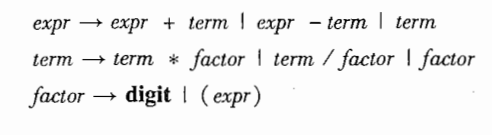

# 概述

## 何为编译

将高级语言翻译为汇编语言或者直接翻译为机器语言的过程叫做编译，将汇编语言翻译为机器语言的过程叫做汇编。

源程序先经过预处理器处理，预处理器会将存储在不同文件中的源程序聚合再一起，同时把被称为宏的缩写语句转换为原始语句，接着通过编译器，转换为汇编语言程序。汇编语言程序经过汇编器转为可重定位的机器代码（可重定位是指在内存中的起始位置不固定）

## 编译系统的结构

- 分析部分，生成中间代码，称为前端
  - 词法分析
  - 语法分析
  - 语义分析
- 中间表示
- 综合部份，生成目标语言，称为后端
  - 目标代码生成
  - 目标代码优化

## 词法分析概述

从左向右逐行扫描源程序的字符，识别出各个单词，确定单词的类型，将识别出的单词转换成统一的机内表示——词法单元（token）

token由种别码和属性值构成

| 单词类型 | 种别             | 种别码             |
| -------- | ---------------- | ------------------ |
| 关键字   | if、else、then…… | 一词一码           |
| 标识符   | 变量名、方法名…… | 多词一码           |
| 常量     | 整型、字符型……   | 一型一码           |
| 运算符   | 算数、关系、逻辑 | 一词一码或一型一码 |
| 界限符   | ;(){}……          | 一词一码           |

一词一码的token有时不需要属性值也可，种别码通常是整数，当然实现的时候可以使用常量

## 语法分析概述

语法分析器从词法分析器输出的token序列中识别出各类短语，并构造语法分析树

## 语义分析概述

- 收集标识符的属性信息并生成符号表
  - 种属
  - 类型
  - 存储位置、长度
  - 值
  - 作用域
  - 参数和返回值信息
- 语义检查
  - 变量或过程未经声明就使用
  - 变量或过程名重复声明
  - 运算分量类型不匹配
  - 操作符与操作数之间的类型不匹配
    - 数组下标不是整数
    - 对非数组变量使用数组访问操作符
    - 对非过程名使用过程调用操作符

## 中间表示形式

- 三地址码

  三地址码由类似于汇编语言的指令序列构成，每个指令最多有三个操作数

  三地址指令有以下几种表示方式：四元式、三元式、间接三元式

  四元式表示方式：

  | 三地址指令          | 四元式          |
  | ------------------- | --------------- |
  | x = y op z          | (op,y,z,x)      |
  | x = op y            | (op,y,_,z)      |
  | x = y               | (=,y,_,z)       |
  | if x relop y goto n | (relop,x,y,n)   |
  | goto n              | (goto,\_,\_,n)  |
  | param x             | (param,\_,\_,x) |
  | call p.n            | (call,p,n,_)    |
  | return x            | (return,\_,_,x) |
  | x=y[i]              | (=[],y,i,x)     |
  | x[i]=y              | ([]=,y,x,i)     |
  | x=&y                | (&,y,_,x)       |
  | x=*y                | (=*,y,_,x)      |
  | *x=y                | (*=,y,_,x)      |

- 语法结构树/语法树

## 目标代码生成

目标代码生成以中间表示形式作为输入，映射到目标语言

目标代码生成的一个重要任务是为程序中的变量合理的分配寄存器

## 代码优化

为改进代码所进行的等价程序变换，使其运行的更块、占用空间更少或者二者兼顾

# 语言及其文法

## 基本概念

### 字母表

字母表∑是一个有穷符号集合，比如ASCII字符集。字母表作为集合，可以进行运算。

- 字母表的乘积，会组成一个新的字母表，其中每个元素第一个字符来自第一个字母表，第二个字符来自第二个字母表
- 字母表的幂运算：字母表的0次幂为一个包含一个空串（ε）的集合，除此之外，相当于n个该字母表相乘。
- 字母表的正闭包+：字母表的所有整数次幂的并集
- 字母表的克林闭包*：字母表的正闭包再并上0次幂（集合中添加一个空串）

### 串

设∑是一个字母表，则对于任何属于字母表的克林闭包的一个元素，称为一个串，

串是字母表中符号的一个有穷序列

串的长度记作|s|，指串中符号的个数

串的运算：

- 连接：x和y两个串的连接记作xy，空船是连接运算的单位元
- 幂运算：n个s连接，0次幂为空串 


## 文法

全称为：上下文无关文法，描述了语言的层次化语法结构

一个上下文无关文法由以下四个元素组成：

- 一个终结符号集合，也叫词法单元，终结符号是该文发所定义的语言的基本符号的集合。
- 一个非终结符号集合，也称语法变量，每个非终结符号表示一个终结符号的集合
- 一个产生式集合，每个产生式包括一个产生式头、一个箭头、一个产生式体
- 指定一个非终结符号为开始符号

一般非终结符以斜体表示，终结符以黑体表示

一个文法的例子

```
list -> list + digit
list -> list - digit
list -> digit
digit -> 0|1|2|3|4|5|6|7|8|9
当然list也可直接表示为
list -> list + digit|list - digit|digit
```

从开始符号出发，不断将某个非终结符号替换为该非终结符号的某个产生式，可以从开始符号推导得到所有终结符号串的集合，该集合称为该文法定义的语言

特殊的，如果需要空串，可以用`ϵ`表示

### 语法分析树

给定一棵语法分析树，其根节点为开始符号，中间节点为非终结符号，叶子节点为终结符号（包括空串）

为一给定的终结符号串构造一棵语法分析树的过程称作语法分析

对于比如加减乘除的优先级来说，可以将乘除与加减分开定义产生式



### 后缀表达式

例：`(9-5)+2`后缀表达式为`95-2+`，`9-(5+2)`后缀表达式为`952+-`

### 自顶向下分析

按照给定的产生式来分析给定语句，并生成符合产生式的语法分析树，该过程是不断尝试并犯错的过程，首先选择一个产生式，不合适的话再回溯

### 预测分析法

递归下降分析法的一种简单形式

每个非终结符号都代表一个以该非终结符为过程名的过程调用

对于终结符为ε，可以用不做任何处理来表示


### 左递归

可以通过改写产生式来消除左递归，使其变为右递归


## 词法分析

### 剔除空白和注释

空白和注释可跳过不做词法分析

### 预读

比如java中碰到大于号或者小于号时必须向后读一个字符查看是否为等于号，或者比如t和true的区别，可将已读取的字符放入一个缓冲区变量中，不断的往后追加