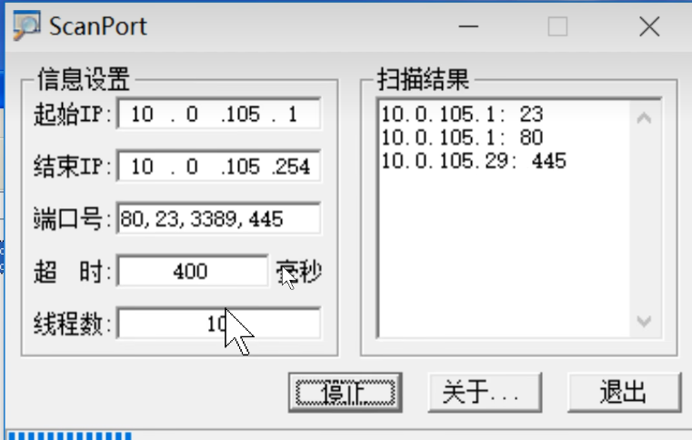

# 虚拟化

- 寄居架构（vm作为软件运行在主系统上）
    - VMware Workstation
    - MS Hyoer-V
- 原生架构（vm装在硬件上，虚拟机本身就是操作系统）
    - VMware vSphere

# IP

## 设备

方框中的双向箭头：交换机

圆框中叉：路由器

## IP地址

32位二进制，点分十进制记忆

0-255

## 子网掩码

划分子网使用，子网掩码相同的可以通信

子网掩码使得ip地址可以由网络位和主机位组成

主机位全为0为网段地址，故主机的主机位不能为0

主机位全为1为该网段广播地址，故主机的主机位不能为255

### 早期五类地址

A: 1-126 默认子网掩码255.0.0.0；对应内网范围：10.0.0.0--10.255.255.255

B:128-191默认子网掩码255.255.0.0；对应内网范围：172.16.0.0--172.31.255.255 

c:192-223默认子网掩码255.255.255.0；对应内网范围：192.168.0.0--192.168.255.255

d: 224-239

e: 240-254

目前可以使用acb三类地址，子网掩码可更改

## 回环地址

127.0.0.1

## 网关

网关一般使用局域网中第一个或者最后一个主机ip

单纯的局域网不需要网关，需要访问别的局域网才需要网关

## IP地址设置

一块网卡可以设置添加多个ip地址

## DNS

域名解析服务

nslookup 命令 可以查看使用了哪个dns

## ping

有可能开着防火墙不让ping，所以ping不通不代表对方不在线

# DOS命令

- echo 打印

    echo. 打印空行

- type 查看文件内容

- dir 查看目录下文件
  
- /a 查看所有文件
  
- more 分页查看

- rd 删除目录 /s 递归 /q 强制

- del 删除文件 可带通配符 /s 递归 /q 强制

- copy 复制文件

    copy con filename 将控制台里接下来输入的内容复制到文件中，使用ctrl + Z 结束输入

- move 移动文件

- ren 重命名

- md 创建目录

- attrib 修改文件/文件夹属性 
    - attrib +h filename  隐藏文件
    - +s 系统级别文件
    - +a 只读

- fsutil file createnew c:\sys.ini 4096000 直接创建一个文件并指定其大小

- assoc  .txt=exefile 将txt文件关联到exe

- shutdown -s -t 60 60秒后关机
    - shutdown -a 取消all定时
    - -f 强制
    - -c 提示信息
    - -r 重启 -l注销

- cls 清屏

- @echo off 关闭回显，屏蔽执行过程

- pause 暂停程序 （按任意键继续）

- title 修改窗口标题

- nul 用于丢弃输出：`ping -n 10 127.0.0.1 >nul 2>nul`，其中2表示执行异常的输出

- 冒号:指定代码块，配合goto进行跳转

- start 启动cmd 后面跟参数可以打开具体的程序

- %% 取值，中间为变量名

    - %userprofile%当前用户目录

- 当命令参数中有空格时，前后加双引号

- 定义变量

    ```
    set i=100
    echo %i%
    ```

    

- 获取用户输入值，此时等号后面为placeholder，而非值

    ```
    set /p i=请输入
    echo %i%
    ```

- 判断 

    ```
    if "%i%"=="1" goto a
    ```

- `ntsd -c q -pn winlogon.exe` 针对2003的命令，会尝试杀死登录进程最终导致蓝屏

- `taskkill /im 进程名 /f` 强制杀死指定进程

# 用户管理

每个账户有自己唯一的SID安全标识符

win中SID由系统SID与用户UID组成，uid 500 固定给admin用

账户和密码存储的位置：`C:\windows\system32\config\SAM`

windows服务器密码默认有效期42天

winserver默认的五个账户

- administrator 管理员账户
- guest 访客
- system 系统账户
- local services 本地服务账户，权限相当于普通账户
- network serviecs网络服务账户，权限相当于普通账户

可通过计算机管理中的用户和组管理进行用户的添加

命令管理用户

```
net user # 查询系统中所有用户
net user pc # 查询用户pc的相关信息
net user pc 1 # 将用户pc的密码修改为1
net user abc 123 /add # 新建用户abc并给密码123
net user abc /del # 删除用户abc
net user abc /active:yes|no # 启用或禁用用户
```

命令管理用户组

```
net localgroup # 查询系统中所有组
net localgroup administrators # 查询该组信息
net localgroup administrators pc /add # 将pc移入该组
net localgroup administrators pc /del # 移除
net localgroup ceo /add # 添加组
```

查看自己

```
whoami
whoami /user # 查看sid
```


# 远程访问

## 远程桌面

服务端计算机属性中将被远程打开，创建用户并将其添加到remote desktop users组，客户端使用mstsc连接

远程桌面端口 3389

## telnet

在服务管理器中将telnet服务启动，并将允许telnet登录的用户添加到telnetClients用户组，客户端在命令行

telnet端口 23

`telnet 目标ip`

# 端口

```
netstat -an # 查看当前主机开放的所有端口
```


# win7（早期win10）破解密码

在开机，展示win徽标启动动画时强制断电，再次启动时选择修复（而非正常启动），修复失败时会弹出对话框，选择查看问题详细信息，其中有超链接，点击会打开记事本，在记事本的“打开”选项中可以操作系统内文件，将粘滞键的程序sethc改为cmd程序，再次启动系统后按五次shift即可启动cmd，在其中重新修改用户密码（或者新建用户并提权）即可。

## 相关知识

cmd工具路径`C:/Windows/system32/cmd

# 文件系统

常见文件系统：
windows：

- FAT
- NTFS

linux：

- EXT

## NTFS

### 特点

1. 可提高磁盘读写性能
2. 可靠
    1. 加密文件系统
    2. 访问控制列表
3. 磁盘利用率
    1. 压缩
    2. 磁盘配额
4. 支持单个文件大于4G

### 权限控制

- 默认子项会继承父项的权限，取消继承父项传递的权限：在文件权限中点击高级，取消继承（取消勾选“允许父项的....”）
- 可进行强制继承（刷新子文件夹的权限）
- 父项传递下来的权限无法修改
- 在父目录开启强制继承的情况下，文件复制到该目录后，权限会被修改，而同分区移动文件，该文件权限会保留

- 文件权限
    - 读取：允许查看文件内容
    - 写入：允许修改文件内容
    - 读取和运行：读取和运行
    - 修改：允许重命名文件或者删除文件，包含读取和写入
    - 完全控制：所有权限外加修改文件权限或者更改所有者
- 目录权限
    - 读取：允许查看目录内文件和子目录名称
    - 写入：允许创建新文件，新建子目录
    - 列出文件夹目录：允许查看子文件列表
    - 读取和运行：读取和运行
    - 修改：允许删除目录本身或者重命名目录
    - 完全控制：所有权限外加修改权限或者更改所有者

权限累加：一个用户在不同组中对一个文件的权限可以累加

拒绝：拒绝权限高于允许权限优先级

### 共享

本地用户在网络访问共享目录时，收到该目录共享权限与本地权限的共同控制，取交集，如果只是本地访问，则不受共享权限控制

隐藏共享：在共享文件名后加$符号，会变成隐藏共享，可通过地址访问但不能在ip的视图下看到

```
net share # 查看当前主机共享出去的内容
net share sharenm /del # 删除指定共享内容
```

文件共享服务 Secondary Logon 445端口号

# 注册表编辑器

运行 regedit

# PE更改（破解）windows密码

进入PE后修改C:\windows\system32\config\SAM文件中的hash值，只能修改无法查看

# DHCP

DHCP攻击：

- 攻击DHCP服务器
    - 生成虚假mac地址申请ip进行非法占用，直到资源耗尽
        - 防御：在交换机端口上做动态MAC地址绑定
- 伪装为DHCP服务器进行不可用IP的分发
    - 防御：在交换机上设置，除DHCP服务器外禁止发送offer包 

## DHCP服务安装

win2003插入光盘镜像，安装可选的windows组件，找到DHCP服务进行安装，安装完成后，本地会占用67和68两个端口号。打开DHCP设置，右键新建作用域，设置起始ip与结束ip，以及子网掩码，可选的配置地址排除；以及租约时间；设置作用域选项：指定网关、DNS服务器。

- VMware（网卡 Vnet1或8）需要设置下将默认的DHCP服务器停用

## 服务端操作

- 可创建多个资源池
- 可对当前配置进行备份
- 设置地址保留，对某个mac分配固定的ip
- 若有多个作用域，可设置服务器选项，作用域选项优先级大于服务器选项

## 客户端操作

```
ipconfig /release # 释放已获取的IP地址
ipconfig /renew # 重新获取IP地址（或者续约）
```

# DNS

FQDN：完全限定域名，格式为`主机名.域名`

- 递归查询：发送dns查询请求后，返回内容为结果，查询细节请求方不予理会
- 迭代查询：发送dns查询请求后，返回内容非结果，而是相关的树节点服务器，查询方再根据结果去进行下一步查询
- 正向解析：域名到ip
- 反向解析：ip到域名

客户机域名解析过程

​	本地缓存-》本地hosts-》本地dns服务器

服务器处理域名过程

​	dns高速缓存-》本地区域解析文件-》转发器-》根

## 服务安装

安装流程与DHCP安装流程类似

端口：TCP和UDP的53端口

主要区域：作为权威解析，设置域名（不包含主机名）

辅助区域：主服务器允许区域复制，辅助服务器新建“辅助区域”

正/ 反向解析配置

dns分类：

- A 正向解析
- CNAME 别名
- PTR 反向解析
- MX 邮件交换
- NS 域名服务器

dns服务器分类

- 主要名称服务器
- 辅助名称服务器
- 根名称服务器
- 高速缓存名称服务器（缓存名称服务器）

## 转发器

配置转发器以将dns请求转发到外网或者其他dns服务器

## 客户端操作

```
nslookup name # 查找域名对应ip
ipconfig /flushdns # 清空本地缓存
ipconfig /displaydns # 查看本地缓存
```

# WEB服务器

HTTP 80

HTTPS 443

服务器软件：

- IIS 微软（web和ftp）
- Apache/LAMP/Tomcat/nginx

可配置相同端口号相同ip，不同域名指向不同项目

## IIS配置

1. 配置静态IP地址
2. 安装IIS-WEB插件
3. 停用默认站点
4. 新建网站-地址端口绑定-指定站点路径-设置权限
5. 设置首页

# FTP服务器

port 20 21

21 控制端口，接收命令 

20 主动模式下的数据端口 

## IIS

iis中的用户使用windows自带的用户管理，权限为取交集

## Serv-U 

非win账号管理

# 域

## 内网环境

- 工作组：默认模式，人人平等，不适合企业管理
- 域：有层级关系，适合企业集中管理

## 域的组成

- 域控制器 DC
  - 活动目录 AD
  - 组策略 GPO
- 成员机
- 域树（子域）-域林

## 域的创建

域会自带DNS，新进成员机会被自动分配主机名

## 域的功能

- 域账号登录

  可使用域中创建的账号登录成员机电脑，认证时，成员机会向DC询问登陆账号是否合法。

## winserver安装域

- 配置静态ip并去掉dns指向

- 开始-运行-`dcpromo`安装活动目录

  安装过程会引导将当前计算机作为DNS服务器

  新林新域

- 安装后重启，本地管理员升级为域管理员
- 会自动在DNS中创建dc域

## 域管理

新计算机加入域：

- 客户机将dns改到dc

- 客户机更改计算机名（工作组）将工作组改为域，确定后输入域管理员的用户名和密码，重启。

- dc新建user
  - 所属用户组 domain users
- 成员机使用新建的user登录dc（非本机）

可以将域用户添加到成员机的本地管理员组中

**组织单位OU**

用于下发组策略，将User和Computer移动到其中。

针对User做的限制，不管该User在哪台电脑上登陆都生效，对Computer做的限制，不管哪个用户登录都生效

OU中也可添加用户组

**组策略GPO**

对当前OU做限制

策略应用顺序：LSDOU： local>林>域>OU

后应用会覆盖前应用的，未配置的不算

- OU中上级可对下级做强制策略，此时下层级无法再覆盖 

- 下级可对上级进行阻止继承，则上级配置均不生效，但无法阻止强制

常用策略：

- 开机/登录/关机/注销自动运行脚本
- 去除开机ctrl alt del 操作
- 密码格式限制

# PKI 公钥基础设施

通过加密计数和数字签名技术保证信息的安全；公钥加密技术、数字证书、CA、RA

## 信息安全三要素

1. 机密性：无法被他人获取信息
2. 完整性：无法被他人修改信息
3. 身份验证/操作不可否认性：身份可确认

## 用到PKI的地方

- SSL
- IPsecVPN
- 部分远程访问VPN

## 公钥加密技术

1. 对称加密
   DES、3DES、AES
2. 非对称加密算法
   RSA、DSA、DH
3. HASH，不可逆
   MD5、SHA-长度

私钥签名（hash摘要（公钥加密（原文））)

证书：

证书格式遵循X.509标准

包含

- 使用者公钥
- 使用者标识
- 有效期
- 颁发者标识
- 颁发者的数字签名

# 渗透简单测试流程

1. 被渗透方授权
2. 信息收集
   1. nslookup
   2. whois

3. 扫描漏洞
   1. namp ip范围、端口
   2. 高级扫描 IIS漏洞、网站漏洞
4. 漏洞利用
5. 提权（shell）
6. 删除日志
7. 留后门
8. 渗透测试报告

## 445攻击

windows scanport 获取服务器端口开放状态



445漏洞利用`IPC$`

```
# net use 挂载远程路径到f盘
net use f: \\ip\share 密码 /user:账号
# 删除f
net use f: /del
```

暴力破解系统密码by445：

使用软件NTscan，配合dic文件

使用密码字典生成工具生成dic文件尝试出密码

使用netuse连接IPC$

```
net use \\ip\ipc$ 密码 /user:账号
```

制作木马

将木马上传到目标服务器

使用计划任务启用该木马

```
# 获取目标服务器时间
net time \\ip
# 设置定时任务
at \\ip 时间 "文件地址"
```

