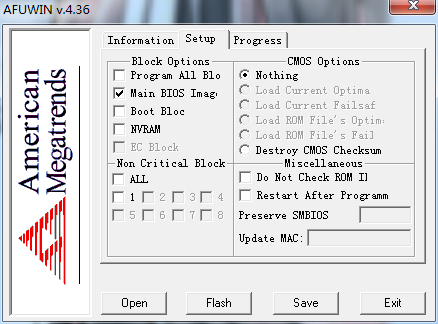

# 参考资料

https://tieba.baidu.com/p/3100524729?pn=2

[https://pan.baidu.com/s/1q5KGb-8gPkSbf1UhL8YCaA](http://jump2.bdimg.com/safecheck/index?url=rN3wPs8te/pjz8pBqGzzzz3wi8AXlR5g1NgdDpM6gxJq50m02qAjUbASUiDtA220mpuXTQteGizEJ4nEH68GJgYBAO6pV0q3HjAB/8XWnvy5vwqjfyWIwN/0vUkQ33JgvkVLCT8nCNljLRERacZbIlZmEBVHjGgoMDxm7iZ2BjQ=) 密码: 4stf

# 刷机过程

1. 下载bios升级文件

2. 解压文件，打开afuwin64文件夹，双击运行AFUWINx64.exe

3. 点击save，输入文件名备份bios，等Progress里格子全灰色（Read）

4. SetUp中勾选Main BIOS Image，点击open，选中下载的bios文件D4KT19A.rom，然后直接点击flash。显示stagedone即可重启系统。
    
    
