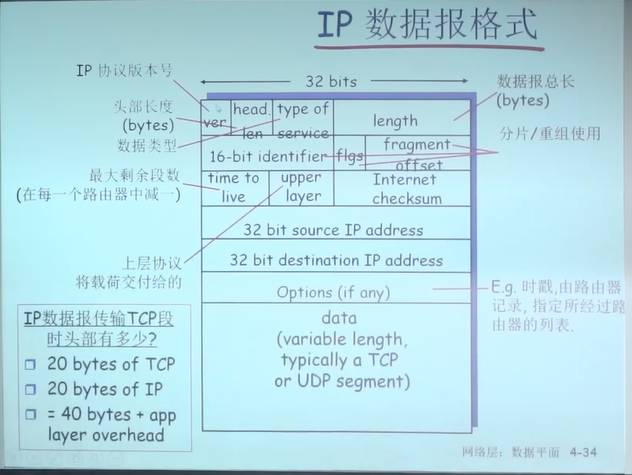

# 概论

构成：节点与边，节点包括主机节点与数据交换节点，边包括接入链路和骨干链路，还有协议

互联网是网络的网络，是分布式的应用以及为分布式应用提供服务的基础设施组成

基础设置提供两种服务，一种是面向连接的，一种是不面向连接的

## 网络边缘

主机与应用，构成了边缘系统，通过access接入核心。

网络边缘、接入网以及网络核心为互联网的三个子系统。

- tcp面向连接
    - 需要建立连接
    - 可靠，不丢失，不乱序，流量控制与拥塞控制
    - http、ftp、telnet、smtp
- udp无连接
    - 无需建立连接
    - 不可靠，无流量控制，无拥塞控制
    - 流媒体、远程会议、dns、网络电话

## 网络核心

全球范围内的数据交换

- 电路交换

    - 不共享，分配后若无数据交换会被浪费
    - 性能有保障
    - 被传统电话网络使用
    - 分片大小固定
    - 频分、时分

- 分组交换

    - 存储转发

    - 线路可以共享，不会占用整个链路

    - 使用存储排队换取共享性

    - 如果路由器缓存用完了会被丢弃

    - 分片大小按需分配

    - 转发方式：数据报（无连接）、虚电路（有连接）

        这里的有连接与tcp的面向连接不同，tcp的连接仅体现在tcp层，中间的设施不维护他们的连接状态

## 接入网

接入方式

- 调制解调器：电信运营商的电话线，可通过频分进行上下行带宽的区分
- 调制解调器：有线电视公司的同轴电缆
- 调制解调器：电力公司的电线

物理媒体

- 导引型媒体

    看得见摸得着的

    - 双绞线
    - 同轴电缆
    - 光缆，全反射

- 非导引型

    - 地面微波
    - wifi
    - 蜂窝
    - 卫星

## ISP

端系统通过接入isp接入到互联网

isp之间相互合作，达到可以互相访问的目的，同时避免耗时对接对方的端系统 

中心：第一层ISP，直接与其他ISP项链，与大量的第二层ISP相连，连接点相对少，但是带宽极高

第二层：区域性ISP

第三层：本地ISP

## 分组延时与丢失

### 延时

- 处理延时

    存储转发延时

- 排队延时

    路由器会有队列，排队会有延迟，超出队列容量会被丢失

    取决于流量强度，流量强度为1时延时无穷大 

- 传输延时

    将分组发送到链路上的时间

- 传播延时

    在媒介上传播的时间

### traceroute/tracert

原理：使用ICMP控制报文头中的ttl字段（生存时间）

ttl字段过一个路由器的时候减一，ttl为0时会被丢弃，然后返回控制报文

### 吞吐量

单位时间内，单位时间从源主机向目标主机放出的有效数据量

## 协议层次与服务模型

分层，每层实现更简单，可以拆分为功能明确的层次

每一层次通过接口向上层提供服务

服务访问点：下层服务如何判断是哪个上层用户的报文

上层使用下层提供的服务的形式：原语 

面向连接：请求前先握手，为接下来的请求做好准备

无连接：不握手，不准备，直接请求

服务是垂直的，在一个系统内部相邻两层之间的关系

协议是在不同系统直接，同一层中的关系

### 数据单元

上层来的sdu加上本层的头变成本层的pdu

或者将多个sdu合道一个pdu中

或者将一个pdu拆到多个pdu中

### internet协议栈

五层：

- 应用层
- 传输层
    进程到进程，tcp服务中将不可靠的转为可靠的
- 网络层
    传输以分组为单位的数据，端到端
- 链路层
    将比特分成一个个帧，相邻两点之间传输以帧为单位的数据，比如端到交换机
- 物理层
    将上层交下来的比特转为物理信号并传输，或者反过来交给链路层

OSI七层

应用下多了表示层与会话层，这两层在五层中是在应用层里的

- 表示层
    加密压缩
- 会话层
    会话管理

各层的数据单元：

- 应用层：报文message
- 传输层：报文段segment-TCP段orUDP数据报
- 网络层：分组packet or 无连接数据报datagram
- 数据链路层：帧 frame
- 物理层：位 bit  

# 应用层

## 应用架构

- CS模式
- P2P模式
- 混合模式

## 进程标识与寻址

进程：端口号

主机：ip

## socket

发送方、接收方、信息体

为了避免每次都传输全部信息，减少信息传输量，增加了socket机制

socket：socket其实就是一个整数，这个整数对应着传输信息（tcp：【发送方ip、端口号、接收方ip、端口号】udp：【发送方ip、端口号】），之后直接通过socket来发送信息。socket是应用层与传输层之间的约定，与其他层无关。

tcp中的socket是一种会话关系，而不是标识。在同一个端口上可以建立多个socket，也就是多个会话。

在udp中是无连接的，故在udp中，socket不代表会话，只代表本地ip和本地端口，所以在udp中，应用层每次要向传输层传三样东西：传输内容、socket、对方地址（ip和端口号）

## Web与HTTP

URL 通用资源定位符

`协议://用户:口令@主机名/路径:端口`

http 超文本传输协议，基于TCP，http无状态，服务器不维护客户的信息

服务器启动时会创建一个守护socket，每当来一个请求都会新建一个socket，守护socket继续守护在端口上

HTTP 1.0 非持久HTTP 一次请求与响应之后关闭连接

HTTP 2.0 持久HTTP 一次请求与响应后先不关闭连接 

```
GET  /a/a.html HTTP/1.1
Host: ...
User-agent: Mozilla/4.0
body
(一个额外的回车代表报文结束)


HTTP/1.1 200 OK\r\n
Connection close\r\n
头\r\n
\r\n
\r\n
data

```

cookie：保存状态的一种策略

cache：访问代理服务器中的缓存，没有则访问原始服务器

检查缓存是否更新：增加一个头部`if-modified-since`，询问服务器是否更新，服务器响应304则为没有修改

## FTP

服务端守护在21端口，上传下载文件，CS模式，基于TCP协议，有状态协议

客户端向服务端发起tcp连接建立，叫做控制连接，用于发送命令，命令以ASCII编码

- USER username
- PASS password
- LIST 要求服务器返回文件列表
- RETR filename 下载
- STOR filename 上传

返回状态码：

331 Username OK,password required

125 data connection already open transfer staring

425 can't opendata connection

452 error writing file

服务端向客户端发起tcp连接接案例，叫做数据连接，用于传输文件，指定客户端端口号为20

## EMAIL

角色

- 用户代理
    撰写邮件的软件，比如outlook，网易邮箱大师，用户代理配置好邮件服务器的ip与端口号，将邮件发送到邮件服务器的队列中。客户代理从邮件服务器中将邮箱中的邮件拉取回来。

- 邮件服务器
    守护在25号端口，收到用户代理发过来的邮件后，将其使用smtp发送到对应的邮件服务器，邮件服务器收到其他邮件服务器发来的邮件后，将其保存到对应用户的邮件列表中，也就是收件箱

smtp，基于tcp

- 阶段：握手、传报文（多个邮件会一起发，而不会等连接关闭后重新连接）、关闭
- 命令和响应报文都是ascii形式，报文必须是7位ascii形式
- 使用持久连接，报文使用CRLF

```
首部：
To:
From:
Subject:
主体：
报文：只能是ASCII字符
```

mime multimedia mail extension 多媒体邮件扩展

在报文首部额外声明MIME内容类型

```
首部：
To:
From:
Subject:
MIME_Version:1.0
Content_Transfer_Encoding: base64
Content-Type: image/jpeg
主体：
报文：只能是ASCII字符,base64编码后的图片
```

邮件接收协议

- pop/pop3 邮局访问协议 post office protocol
    用户身份确认并下载，只能区分收发件箱，无状态
    - 命令：
        - user
        - pass
        - list 报文号列表
        - retr 根据报文号检索报文
        - dele 删除
        - quit
    - 响应
        - +OK
        - -ERR
    - 模式
        - 下载并删除：邮件服务器不会保留已被拉取的邮件，省空间
        - 下载并保留：会保留，其他客户端也可以看到
- imap internet 邮件访问协议
    更多特性，运行邮件目录的创建与维护，邮件的移动等，会维护用户状态
- http 

## DNS

域名到ip的转换

域名是应用层使用的，传输层需要ip地址，所以dns只是获取ip，而不是代理发送请求

分层命名，分布式数据库，运行在udp 53端口

设备名翻译、负载均衡

**根名字服务器**

互联网有13个根服务器，中国大陆没有

根服务器并不是对应的一个顶级域名，而是维护各种顶级域名的域名解析服务器的地址

顶级域（TLD）服务器，负责顶级域名

从树根开始找顶级域，顶级域中找二级域……

域的域名，主机的域名，域域名下面可以继续分配给主机

区域（zone）：将名称空间分为一个个区域，区域之前相互不交织，每个区域中有一个命名服务器

区域域名服务器维护资源记录

- 维护域名和ip或者其他信息的映射关系
- 存储在name server的分布式数据库中

- RR格式：域名，ttl（生存时间，缓存的记录存活时间少，权威域名存活时间长），class（对与Internet，值为IN，说明还有非网络的服务），value，type
    - type：
        - A name为主机，value为IP地址
        - CNAME name为规范名字的别名，value为规范名字
        - NS name为域名，value为该域名的权威服务器的域名
        - MX value为name对应的邮件服务器的名字

本地名字服务器 local name server 

 dns查询与响应报文（相同）结构：

- id，用于标识响应与哪个记录对应
-  flags
    - 查询/应答
    - 希望递归
    - 递归可用
    - 应答为权威
- ……

当一个name server 学到了一条记录会将其缓存，默认2天

## P2P

 不会随着节点的增加而导致网络拥塞

- 非结构化p2p
    网络中节点的关系是任意建立起来的，没有特定结构

    - 集中化目录
        拥有一台集中化目录服务器，用于资源注册和查询
    - 完全分布式
        向所有邻居发送查询，邻居收到后再泛红，剪枝方式可以如设置生存时间或者记录查询，但泛洪的前提是网络已经建立好，每个节点已经得知自己有哪些邻居，但泛洪网络如何建立呢？在安装软件时，会有一个配置文件，其中包含了大概率会在线的几个节点，以此些节点作为初始节点开始建立网络。
    - 混合体
        分为多个组，组中有组长与组员，组长相当于组中的集中化目录，组长与组长之间是完全分布式的关系

    BT下载

    ​	p加入一个洪流中，洪流指一个节点列表与互助的协议，每个p节点在自身维护一个bitmap，记录自身有某个资源的哪些部分，洪流中所有节点定期互相交换bitmap，从而得知其他节点拥有资源的情况。当一个节点新加入时，其资源拥有情况为0，该节点随机选择其他节点，拥有四块资源后，请求当前洪流中最稀缺的块，在这个洪流中稀缺资源就不再稀缺，这是集体利益优先。接着对服务最好的节点提供服务。同时稀缺资源也会被别人所请求。整体上 为他人提供的服务越大，被别人提供的服务也越好。若某个节点拥有一个文件的全部部分，他就是**种子**，贡献度会更高，后续下载文件时也会更快。

    ​	在向他人提供服务时，前两轮向贡献度大的节点提供服务，第三轮随机挑选，三轮一个周期

    ​	那如何加入洪流？答案是通过第三方途径，用户在制作完种子后上传到种子分享网站，种子中包含元数据，用户根据文件描述找到种子，通过种子加入洪流从而下载目标文件

- dht结构化p2p
    网络中节点构成了环或者树的结构
    以环状为例，将一个设备组的设备按照ip进行hash，按照hash值从小到大的关系将设备组构成一个环，接着将设备组中的所有资源也进行hash，按照hash后的范围存到对应的设备上，设备ip与资源列表相当于key和value的关系，这样在寻找某一文件的时候就可以通过其hash值得知其存储在哪个设备上

## CDN

以视频cdn为例：视频流化服务DASH，并非将视频下载完才播放。一边下载一边播放。

将一个视频文件预生成不同的清晰度版本，每个版本中的视频都切割成块，上传到流媒体服务器。接着提供一个“告示文件”，其中提供了某种清晰度的某个块的信息包括文件大小等内容以及其下载地址

客户端按照用户清晰度需求下载 块，播放已下载的块以及下载接下来的块存入缓冲区

请求频率高，占用宽带大

在全球网络中部署很多缓存节点，将内容预先部署到缓存中，客户端找离自己最近的节点获取资源，从而加速资源访问速度

- 在localisp中部署节点，部署节点多，跳数少
- 在关键isp旁边，部署节点少，跳数多

在告示文件中包含了cdn的信息，客户端判断哪个资源服务器最近去请求。或者通过域名解析的重定向。

## Socket编程

- tcp：可靠的，字节流的服务

    1. 服务器执行welcomeScoket，给定值为tcpsocket，系统会返回一个socket
    2. 拿到该socket后调用bind函数绑定本地的ip和端口号
    3. 建立connectSocket=accept（welcomeSocket），accept阻塞等待客户端的连接
    4. 创建clientSocket
    5. 客户端socket不用手动绑定端口，os会自动绑一个
    6. connect，指定服务器的ip与端口号，阻塞
    7. 此时服务端收到请求，接触accept阻塞，返回一个新的值，为connectSocket的值，该socket维护了cs会话
    8. 客户端的connect获得一个有效值，连接建立
    9. 客户端借助socket发送请求send
    10. 服务端read进行处理，使用write发送给客户端
    11. 客户端进行read读取信息
    12. close socket

- udp：不可靠的，数据报服务
    udp服务器部分没有welcomesocket和connectionSocket
    1. server建立serversocket，参数中指明udpsocket，系统返回一个socket
    2. 调用bind与本地ip和端口号绑定
    3. readFrom soket，等待用户请求 
    4. 客户端在参数中创建clientSocket
    5. 隐式绑定本地ip端口
    6. sendTo 指定目标服务器ip端口号
    7. 服务端read&wirte
    8. 客户端read
    9. close

# 传输层

socket用于区分会话，port用于区分进程（一个进程可以使用多个端口号），ip用于区分主机

## 无连接UDP

用户数据报，在ip层增加了复用和解复用

不可靠，可能乱序

传输单元叫做数据包，因为每一次数据都是独立的（ip也叫数据报）

校验位发现不了的错误叫做残存错误，比如数据变化后checksum值仍然相同，一般丢弃

## 可靠数据传输（rdt）

 rdt通过使用udt服务来向上层提供可靠传输，在udt的基础上进行加强

**rdt1.0：**

认为下层信道是完全可靠的，没有比特出错也没有分组丢失

**rdt2.0：**

发送方发完留副本，接收方收到报文检验，检验通过则告知发送方ACK，若检验不通过，则告知发送方NAK让其重传，发送方会等待收到对方ACK才会传下面的

**rdt2.1：**

rdt2.0的问题：若ACK或者NAK出错，故引入新机制（序号）

若无法识别是ACK还是NAK，则将报文重传，接收方若本来发送的是ack，发现序号与之前的重复，则丢弃，同时再次发送一次ack，若本来接收方发送的就是nak，则保留，同时发送ack

如果一次只发送一个报文，等待ack才发送下一个报文，则序号只需要一位即可

**rdt2.2：**

nak free：对ack做编号，使用前一个分组的ack来表示当前分组的nak

这样不用对每个分组都进行确认，只需要对当前收到的最后一个分组进行确认即可（一次发送多个分组的情况）

**rdt3.0：**

若发送方发出包，此时发送方在等确认，但这个包在到达接收方之前丢失了，接收方无法给发送方确认，此时会若发送方持续等待，会死锁，故引入超时重传。发送方发出包后启动定时器，若超过正常传输时间后还没有手法哦确认，则将报文重传。

**流水线协议/管道协议：**

一次能发送多组未经确认的协议

**滑动窗口协议：SW**

根据发送方和接收方窗口大小不一样分为以下类型

- 停止等待协议：发送方窗口=1，接收方窗口=1，类似rdt3.0

- gobackN协议：发送方窗口>=1，接收方窗口=1，接收方响应最后一个分组的确认

- sr选择性重发协议：发送方和接收方窗口都>1，接收方响应每一个分组的确认

发送方窗口大于1的协议称为流水线协议

**缓冲区**

- 发送方缓冲区：发送方将发送完毕的数据放入缓冲区，便于重发。发送方在单次向接收方发送多个未经确认的报文时，其单次能发送的大小就是缓冲区的大小，停止等待协议的缓冲区大小为1
- 发送窗口：发送缓冲区的子集，已发送但还未确认的分组，其余部分为缓冲区空闲部分
- 接收窗口：低序号到达窗口可以向前滑动，同时响应低序号ack，高序号到达，低序号没到不可向前滑动，此时响应高序号的ack并将高序号缓存，等到前面所有序号到达一次性向前滑动多个分组。
- 发送窗口与接收窗口的互动：
    - 有新的分组落入发送缓冲区范围，发送->发送窗口前沿滑动
    - 发送方收到了老的低序号分组的确认->后延向前滑动->缓冲区有空闲，新分组可落入
    - 接收窗口收到分组，落入接收窗口待接收序号范围内，接收且响应该序号ack
    - 若为窗口内最低序号，窗口后延向前滑动

- GBN异常情况下
    - 新分组落入发送缓冲区，发送窗口前沿向前
    - 超时重发机制让发送端将发送窗口中所有分组发送出去
    - 发送方收到了老分组的重复确认->后沿不向前滑动，新分组无法落入发送缓冲区的范围
    - 接收窗口收到乱序分组，没有落入接收窗口范围的抛弃
    - 重复发送老分组的确认，累计确认

- SR异常情况
    - 新分组落入发送缓冲区范围，将其发送，同时发送窗口前沿向前
    - 超时重发机制让发送端将超市的分组重新发送
    - 发送方收到乱序分组的确认，后沿不懂，新分组落入不了缓冲区（缓冲区已满情况下）
    - 接收方窗口收到乱序分组，落入接收窗口范围内的接收，同时发送该分组的单独确认

- GBN由于接收窗口等于一，所以只能顺序接收，SR由于接收窗口大于一，所以可以进行缓存，带宽大的情况下，GBN出错代价太高，SR比较合适，GBN适合出错比较少的链路

- 在缓冲区序号位为n位的情况下，GBN窗口最大为2^n-1，而SR窗口最大为2^(n-1)，这样做是为了让接收方能够判断新收到的数据是发送方重发的数据还是新的数据（如果一次性将整个缓冲区大小的数据发到接收方，接收方不知道是新的缓冲区数据还是旧的缓冲区数据）GBN是因为最多只会向前一格，而SR的缓冲区预保留区域可能会向前前进一倍

## TCP协议

TCP保证将上层提交的报文完整的交给对方，但不保证上方交下来的比如两个报文发过去还是两个，可能会整合可能会拆分，判断报文的界限需要上层应用自己进行。

tcp会将上层交下来的报文切分到MSS大小，加上TCP的头，再往下逐个加各层的头，最后的大小不超过MTU最大载荷

在tcp中，报文的序号是报文载荷部分第一个字节在未切割原文中的偏移量，确认号也是以字节为单位，例如当确认号为555，意思是554以及之前所有的字节收到了（最后一个报文序号+报文载荷大小），需要发送555序号之后的报文


对于乱序到达的报文段，tcp没有规定如何处理，

tcp超时时间的设置是动态确定的：每次测量的rtt称为sampleRTT，每次计算RTT根据之前的sampleRTT加权计算当前超时时间，越是之前测得的RTT参考性越低所以权值越小

 tcp发送的确认是累计确认，类似于GBN，且为累计确认+1

 接收方在接收到一个段时先不发确认，等待500ms，若来了下一个段，继续接受，接着等，直到500ms内没有新来的段，此时将最后一个段的期待发给发送方，从而减少对发送方的干扰

若使用缓存乱序的机制，则将中间缺失部分的期望ack发给发送方

若收到了1+3个同一段的ack（1个正常ack，三个后面段到之后的ack，称作三个冗余ack），则在超时之前将该段重传，叫做快速重传

piggybacking：在响应报文中捎带对上一次报文的确认

三次握手：避免超时重发的连接请求导致服务端建立的空连接

使用随机序号：避免上一次连接的请求影响这一次连接

## 拥塞控制

1. 网络提供给端系统反馈，比如atm网络
2. tcp自己在端系统判断，如果超时或者有异常则判断网络拥塞

### ATM网络

abr：弹性服务，如果发送端路径载荷不大，则可以使用所有可用的带宽，若检测到发送方路径拥塞，则发送速率需要被限制在一个最小值

atm的传输单位叫做信元，拥塞控制方式为在数据信元间隔中插入资源管理信元，资源管理信元有两个标志位，一个NI一个NI，当网络发现网络拥塞，则将对应的标志位置1，还有一个EI字段，表示交换设备可以为当前交流的一对交换机提供的带宽大小

### TCP拥塞

tcp系统在端系统进行拥塞判断，使得网络核心可以简单一些，若端系统判断网络拥塞，则减少发送量，若端系统判断网络空闲，则增加发送量

如何判断拥塞？

1. 超时重发
2. 当发送端收到了某个段的1+3个ack，则可以判断网络即将拥塞

发送方维持一个变量congwin，代表发送方在对方未确认情况下单位时间能发送多少字节，发送方速率限制等于congwin/rtt

超时时，拥塞窗口变为一个MSS，接着进入慢启动阶段（SS），一个RTT之后翻一倍，如果收到三个1+3ack，则拥塞窗口降一半，进入拥塞避免阶段（CA），每个RTT+1

拥塞窗口值和接收方的接收窗口尺寸同时决定在未确认下发送方可发送的数据大小，tcp往网络中注入的数据量最大取 MIN（对方缓冲区大小与拥塞控制）

**公平性**


在忽略慢启动只考虑拥塞避免策略的情况下，每次折半后的增加都会趋向于各执1/2R

# 网络层

转发：局部功能、数据平面，决定从路由器输入端口的分组如何转发到输出端口

路由：全局功能、控制平面，决定数据报如何在路由器之间路由，决定数据报从源到目标主机之间的端到端路径

网络层分为数据平面和控制平面，这里主要是有一种分工的思想在里面，控制平面负责计算并产出路由表，数据平面则会根据路由表进行数据的转发

## 路由器

### 功能

- 路由，控制平面：运行路由选择算法生成路由表
- 转发，数据平面：根据路由表进行分组转发

### 输入端口

根据数据报头部的信息如目的弟子，在输入端口内存的转发表中查找合适的输出端口

- 基于目标的转发：仅仅依赖于ip数据报的目标ip地址（传统）
- 通用转发：基于头部字段的任意集合进行转发

输入端口会设计缓冲队列，避免有分组阻塞，正常情况下分组分发的速度是大于输入速度的  

头端阻塞：排在队头的数据报阻止了队列中其他数据报向前移动

### 交换结构

将分组从输入缓冲区传输到合适的输出端口

- 交换速率：分组可以按照该速率从输入传输到输出
    - 运行速度通常是输入/输出链路速率的若干倍
    - N个输入端口，交换机构的交换速度是输入线路的N倍比较理想

三种典型的交换机构：

- 内存型

    在通用计算机上使用软件的方式实现，分组被拷贝到系统内存，cpu从分组的头部提取出目标地址，查找转发表，找到对应的输出端口，拷贝到输出端口，转发速率被内存的带宽限制，数据报需要通过bus两次，一次只能转发一个分组。

- bus型

    数据报通过共享总线，从输入端口转发到输出端口，交换速度受总线带宽的限制，一次处理一个分组，域内存型区别在于所有的输出端口都会收到分组，由输出端口自己判断是否要处理，这种形式对于企业级应用是足够的

- crossbar型

    输入端口与输出端口是类似于内存结构的网格型连接，当输入端口的某个报文要发往某个输出端口，则将通路短接

### 输出端口

输出端口设计输出队列用于缓冲。不一定先到先发，由调度规则具体选择。

调度机制：

- 先来先服务 
    - 抛弃最后一个
    - 抛弃优先级最低的
    - 随机丢
- 优先级调度
- 分类轮询/带权轮询 

## ip协议

### 报文格式

icmp协议：信令协议，主要功能为报告反馈，比如ping 

ip数据报格式：



数据类型基本已经弃用，其原本目的为根据数据类型判断优先级进行调度，但应用都愿意将自己的数据类型标为高优先级，故现已无意义 

16位id、flgs、偏移量用于报文分片，id用于标识多个报文为同一个原始报文分片，flgs记录当前分片是否为最后一片，偏移量用于给分片排序

分片到达目标主机才会重组，否则中间路由器会有很多重复操作，若有分片丢失（定时器到时），则全部丢弃

time to live 生存时间，为0时当前路由器会给源主机发一个icmp控制报文进行通知

checksum：头部校验，只校验头部

一般没有option

### ip编址

ip为接口的标识，路由器拥有多个ip地址

子网中ip前缀一样，分组收发不需要借助路由器，只需要交换机

另外有一种子网，内部设备互相收发需要路由器，高位前缀相同，下面继续分为各个小子网

ip地址分类：

- A：地址最高位为0，第一个字节的其他位代表网络号，全零和全1不用，其他字节代表主机号
- B：10开头，第一个字节剩下的和第二个字节代表网络号，剩下的为主机号
- C：110开头，前三个字节代表网络号，剩下的为主机号
- D：1110，多播地址
- E：11110，预留地址

子网部分全零代表本网络，主机部分全零代表本主机，主机部分全1代表在当前网络广播

在路由信息中是以一个网络为一个表项，而不是以主机ip，不然路由器负担很重

内网专用地址：

- A：10.0.0.0-10.255.255.255 MASK 255.0.0.0
- B：172.16.0.0-172.31.255.255 MASK 255.255.0.0
- C：192.168.0.0-192.168.255.255 MASK 255.255.255.0

路由器不会对内网专用地址进行转发

### 无类域间路由

去除ABC类的网络划分，在任意一个地方分割作为网络号，使用这种机制对分配剩下的B类地址进行划分，使用子网掩码进行划分

路由器的表项中存储信息：网络号、子网掩码、下一跳ip、端口

路由器收到一个报文后，将报文中的ip取出，依次与每一条记录中的子网掩码进行与操作，若与后的结果与子网号相同，则从该端口发出。若不相同，则匹配下一条记录，若所有记录都不匹配，则会有一条默认记录，从该默认记录的端口发出，通常是默认网关。

### 获取ip地址的方法

ip、掩码、localNameserver、gateway

- 手动配置

- dhcp，从服务器动态获取ip

    dhcp协议建立在udp服务之上，主机新加入一个网络后以广播的方式在子网中寻找dhcp服务器同时要求申请ip，dhcp服务器收到请求后尝试分配ip给该主机并向该主机（mac地址）响应询问是否确认该分配，该主机收到ip后向dhcp服务器发送确认信息。

### 在机构中

机构中使用掩码继续切分子网

### ICANN

权威机构，分配ip地址和域名的机构

### 子网通告

子网路由器将自己的子网地址和子网掩码发给上级路由器，称作子网通告

通告时，若当前路由器下有多块不连续的子网，可以将每个子网分别通告给上级路由器，也可以将最小与最大的子网号中间的所有网络合起来通告给上级路由器，称作子网聚合，目的是减少通告代价且减少路由表项数量。但子网聚合后的表项中会包含空洞子网，同时上级路由在分配一个包的时候，会发现有多个记录与该包地址的子网匹配，此时会从表项中找到最长前缀（子网掩码）进行转发，因为最长子网掩码以为这条表项更精确。

### NAT

网络地址转换

内网中所有设备使用内网地址，而在内网中的设备通过路由器访问互联网时，会共用一个地址，在路由器收到互联网回来的时候分配给子网时，再转换成内网地址。

外出的数据包：替换源地址和端口号，使用nat ip与新端口号，目标ip与端口号不变，远端C或者S会使用NAT IP地址和新端口号作为目标地址

建立一张NAT转换表，记录ip与端口号之间的映射关系

进入内网的数据包：替换目标IP地址与端口号，采用NAT转换表中的mapping表项，转换为真实的IP与端口

对于端口号来说，维护一个内网中的设备应该是足够的，但端口号是传输层的机制，NAT身为网络层的功能，修改了传输层的信息，违反了端到端的的原则，同时增加了信息处理复杂程度

外网某台设备主动发起请求向内网设备需要nat穿越，

- 需要提前再路由器中配置映射
- 使用upnp（igd）协议，该协议允许内网设备查询修改删除路由器中的nat表项
- 使用中继，比如各种内网穿透服务，内网主机首先访问外网中继服务，通过中继服务进行外网的访问

### IPV6

ipv4诟病：地址太少，头部校验和每一跳路由器因为头部会变都需要重新计算，报文分片导致路由器计算量变大……

（ipv5是实验室协议，被废弃）

ipv6位数为128位，且传输过程不允许分片，大分组会直接丢掉，接着告诉源主机要求发送小片报文 


tlv结构：type-长度-值，是一种自解释的结构

- checksum被移除
- options：允许，但是在头部之外，被hextheader字段表示
- icmpv6：icmp的新版本

**如何过度？**

ipv6孤岛的出口处有一个4-6双栈协议，孤岛之间建立ipv4隧道，将ipv6报文完整封装入ipv4的载荷中，到了对方出口处之后再解封装。慢慢的v6孤岛变多，以至于ipv4变为了孤岛，此时再反过来

## 通用转发和SDN

传统的路由器需要自己计算路由表，自己负责控制平面和数据平面的功能。

SDN：使用集中化的网络控制器实现控制平面，计算完通过南向接口分发到各设备

传统路由器在进行路由转发时只能通过目标ip地址决定下一跳，而sdn方式可以通过例如报文字段等其他特征来决定转发路径

每个路由器包含一个流表，匹配到表项后执行该记录中的action字段。

通过流表match与action的配合，可在该设备上实现多种功能：

- 路由器
    - match：最长前缀匹配
    - action：通过一条链路转发
- 交换机
    - match：目标MAC地址
    - action：转发或者泛洪
- 防火墙
    - match：ip地址和端口号
    - action：允许或者禁止
- NAT
    - match：ip和端口号
    - action：重写地址和端口号

# 网络层控制平面

输入网络拓扑和边上的代价以及源，产出路由表

最后的计算结果肯定是无环树，保证只有一条最优路径

## 路由原则

- 选择算法的原则
  - 正确性
  - 简单性
    不需要太优
  - 健壮性
    能够适应网络变化
  - 稳定性
  - 公平性
  - 最优性

- 路由算法分类
  - 全局或局部
    全局是所有的路由器拥有完整的拓扑和边的代价信息
    分布式是路由器只知道与他有物理连接关系的零件路由器和到相应邻居路由器的代价值，迭代的与邻居交换路由信息计算路由信息
  - 静态或动态
    静态是路由随事件变化缓慢；动态是路由变化很快，路由会周期性的更新，随着链路代价的变化而变化

## 路由选择算法

### 链路状态算法

- 工作过程

  1. 发现相邻节点，获知对方的网络地址

  2. 测量到相邻节点的代价

  3. 组装一个LS分组，描述他到相邻节点的代价情况

  4. 将分组通过扩散的方法发到所有其他路由器，自此让每个路由器都获得了拓扑和边代价

  5. 通过Dijkastra算法找出最短路径

     首先定义源点，同时计算网络中其他点到源点的代价，此时除了邻居外代价全都是无限大。找到源点的邻居中距离源点代价最小的点（下面称为该节点），加入永久节点集合，其他节点在临时节点集合，顺着该节点找到其所有邻居，计算这些邻居节点的代价，并与已记录的代价进行比较，取最小值，每次将当前临时节点集合中已知最小代价的节点加入永久节点并以该节点为基础往下计算，等到所有节点加入永久节点即构造完成。

### 距离矢量算法

每个路由器保存自己到所有目标的代价，形成代价表。每个路由器会获取到自己所有邻居的这个表，接着在本地计算自己通过哪个邻居到该目标划算，产生自己的代价表，节点之间定期交换，以此类推。

这种方法并不能一次获得最优值，但是不停迭代会收敛到最优。

每个节点在自己的代价变化后进行通告。

特点是好消息传得快，坏消息传得慢：代价变小会传出去，但是代价变大不敏感（在有更好的替代下），

水平分裂（避免环状传递信息）：某节点C通过B节点到达A节点，则该节点C发给B关于A节点的代价时说是不可达的，避免B在计算到A节点的代价时算经过C的（虽然代价正常情况下经过C的比B自己存的大，但如果B到A不可达，但是C没更新，就会导致反而错觉上经过C代价反而更小）但是该节点给B以外的节点关于A节点的代价是真实的。

### LS和DV比较

- LS需要向所有节点发送信息，而DV只需要给邻居发送
- LS收敛时间更短，只需要算一次，DV需要慢慢收敛
- 健壮性上，如果某个节点异常，认为自己到所有目标的代价都是0，则不会影响到LS的整体，但在DV中影响比较大

## 协议

###  自治区

- 隐藏内部网络架构
- 减小网络信息交换范围

故将整个网络分成一个个的自治区，自治区内自己采用路由协议，自治区本身又相当于一个点

自治区之间使用bgp协议，边界网关协议，分为ebgp和ibgp，外部和内部的，基于并改进距离矢量算法，内部bgp负责收集并通告内部网关的可达信息，ebgp负责与外部网关交流

### 自治区内

RIP协议，基于距离矢量算法；每隔30秒交换信息，或者对方请求时发送通告，每一个通告至多25个目标。若180秒没有收到通告信息，则认为该节点失效。进程实现，发送UDP报文

OSPF协议，标准公开可获得，使用LS算法，在IP数据报上直接发送OSPF报文，泛洪范围可限，可划分为本地区和骨干区

### 协议区别

内部更关注性能，外部协议更关注策略（代价之外的考虑比如政治或者经济考量）