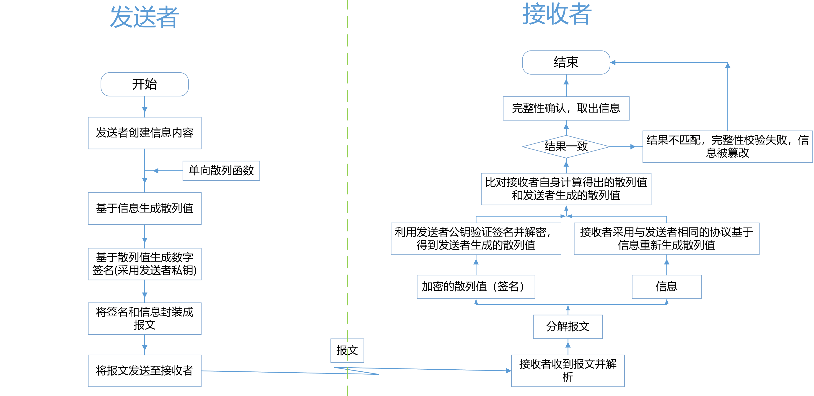
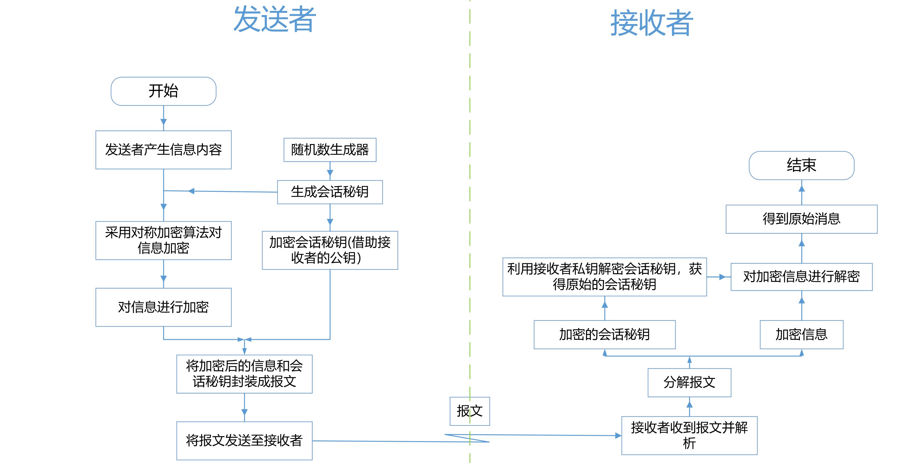

# 记录

最近做了一些对接银行的接口，用到了各种加密技术，这里记录一下

# PGP

[PGP工作原理简述 | Mr.Muzi (marcuseddie.github.io)](https://marcuseddie.github.io/2019/PGP-Introduction.html)

[gpg 密钥生成、导入、导出、自动输入密码_centos如何导入gpg-CSDN博客](https://blog.csdn.net/nyist_zxp/article/details/107597626)

[OpenPGP 工作方式 | SAP Help Portal](https://help.sap.com/docs/cloud-integration/sap-cloud-integration/how-openpgp-works)

汇丰银行要求使用PGP的方式来进行加解密，PGP最初是一款软件，其提供了一种混合加密的方式，将需要传输的信息使用对称加密如AES算法加密，接着将对称加密的密钥使用非对称算法进行加密，同时会使用散列算法将报文进行摘要，并使用私钥对其进行签名。所有的信息都会被封装进一个数据结构，发送给对方。

后来PGP将其协议公开，形成了OpenPGP，而GPG是实现了该协议的一种工具，可用于加解密内容或者生成PGP密钥。

## PGP签名

1. 发送方使用摘要算法计算消息内容中的摘要（或哈希值）。

    PGP 签名支持以下哈希算法：

    - 对于 DSA 密钥：SHA-1、SHA224、SHA256、SHA384、SHA512
    - 对于 RSA 密钥：MD5、SHA-1、RIPE-MD/160、SH256、SHA384、SHA512、SHA224

2. 发送方在发送方的 PGP 密钥环中查找私钥，使用私钥（类型 RSA 或 DSA）对摘要进行加密。

3. 加密的哈希值以及使用的哈希算法一起写入签名元素，该签名元素将与有效负载一起（作为 PGP 签名格式）发送到接收方。私钥签名人的密钥标识（key id）也写入 PGP 签名元素。

4. 接收方获取 PGP 签名格式。

5. 接收方从签名中找到密钥标识（key id），并使用该密钥标识在接收方的 PGP 公钥环中查找正确的公钥。这是与用于签名有效负载的私钥相对应的公钥。

    另外，接收方检查用户标识（与密钥标识相关联）是否对应于允许的用户。

6. 接收方使用公钥解密哈希值（并验证有效负载）。

    

## PGP加解密

在加密步骤之前，可以选择压缩数据。支持以下压缩算法：ZIP [RFC1951]、ZLIB [RFC1950]、BZip2

加密报文是使用对称密钥而不是非对称密钥，这是因为使用非对称算法加密内容，这需要耗费更多时间，故使用对称密钥加密报文后再使用非对称密钥加密前面使用的对称密钥，这样会节省更多资源。

1. 发送方生成一个对称密钥。

2. 发送方使用该对称密钥加密有效负载。

    支持以下用于内容加密的对称密钥算法（对称密钥算法）：

    TripleDES（168 位密钥，派生自 192 位）、CAST5（128 位密钥，如同 [RFC2144]）、Blowfish（128 位密钥，16 轮）、AES（128、192 和 256 位密钥）、Twofis（256 位密钥）

    不支持 DES。

3. 发送方在 PGP 公钥环中查找 PGP 公钥。

4. 发送方使用 PGP 公钥（来自 PGP 公钥环）加密对称密钥。

    您可以使用以下密钥类型加密对称密钥：RSA 和 Elgamal（不支持 DAS）。

5. 发送方将加密后的对称密钥和密钥标识写入消息的加密信息元素。

    密钥标识用于标识用于加密的公钥（因为 PGP 公钥环可以包含多个公钥）。

    加密信息元素与加密的有效负载一起发送到接收方。

6. 接收方获取消息，并根据在加密信息元素中的密钥标识在 PGP 密钥环中查找正确的私钥（与用于加密有效负载的公钥相关联）。

    访问私钥需要密码。

7. 接收方使用来自 PGP 密钥环的私钥解密对称密钥。

8. 接收方使用对称密钥解密有效负载。

    

## GPG生成PGP密钥对

1. 使用详细模式生成PGP密钥对

    ```
    gpg --full-gen-key
    ```

2. 查看生成的公私钥

    ```
    gpg -K 或 --list-secret-keys : 查看私钥
    gpg -k 或 --list-public-keys : 查看公钥
    ```

3. 导出公钥为ASCII文件

    ```
    gpg -a -o public-file.key --export keyId : 导出公钥keyId 到 文件 public-file.key中；
    
    其中：
    
    -a 为 --armor 的简写，表示密钥以ASCII的形式输出，默认以二进制的形式输出；
    
    -o 为 --output 的简写，指定写入的文件；
    ```

4. 导出私钥为ASCII文件

    导出私钥时需要输入私钥密码

    ```
    gpg -a -o private-file.key --export-secret-keys keyId
    ```

## 使用GPG工具加解密

加密

`gpg --recipient [用户ID] --output test.en.txt --encrypt test.txt `

解密

` gpg --output test.de.txt --decrypt test.en.txt`

## 使用java进行PGP内容的加解密和签验签

用到的依赖：

```xml
    <dependencies>
        <dependency>
            <groupId>commons-io</groupId>
            <artifactId>commons-io</artifactId>
            <version>2.15.1</version>
        </dependency>

        <dependency>
            <groupId>org.bouncycastle</groupId>
            <artifactId>bcpg-jdk15on</artifactId>
            <version>1.68</version>
        </dependency>
    </dependencies>
```

PGPHelper

```java
package com.lshcpi;

import org.apache.commons.io.IOUtils;
import org.bouncycastle.bcpg.*;
import org.bouncycastle.jce.provider.BouncyCastleProvider;
import org.bouncycastle.openpgp.*;
import org.bouncycastle.openpgp.operator.PBESecretKeyDecryptor;
import org.bouncycastle.openpgp.operator.PublicKeyDataDecryptorFactory;
import org.bouncycastle.openpgp.operator.jcajce.*;
import org.bouncycastle.util.io.Streams;

import java.io.ByteArrayOutputStream;
import java.io.IOException;
import java.io.InputStream;
import java.io.OutputStream;
import java.security.*;
import java.util.ArrayList;
import java.util.Date;
import java.util.Iterator;
import java.util.List;


/**
 * <p>
 * This class is used to encrypt and decrypt data using PGP keys.
 * Encrypted data can be used to call the HSBC Treasury APIs.
 * The response from the HSBC Treasury APIs can be decrypted using the same keys.
 * Keys and the headers used to call the HSBC Treasury APIs are provided by HSBC on the Developer Portal for each project.
 * </p>
 * Created by 44024985 on 04/09/2018.
 * Updated by 45274934 on 28/03/2024.
 */
public class PgpHelper {
    private JcaKeyFingerprintCalculator keyFingerPrintCalculator;

    private Provider bcp;

    public PgpHelper() {
        this.keyFingerPrintCalculator = new JcaKeyFingerprintCalculator();
        this.bcp = new BouncyCastleProvider();
    }

    /**
     * <p>
     * This method reads a public key from an input stream and returns a list of PGP Public Keys.
     * The list of PGP Public Key objects are used as an input for {@link #encryptAndSign(OutputStream, InputStream, PGPPublicKey, PGPPrivateKey)} and {@link #decryptStream(InputStream, OutputStream, List, List)}.
     * </p>
     *
     * @param publicKeyInputStream bank/public key input stream.
     * @return List of PGP Public Keys
     */
    public List<PGPPublicKey> readPublicKey(InputStream publicKeyInputStream) throws IOException, PGPException {

        // public key file is decoded and used to generate a key ring object that stores a list of key rings. These contain the public keys.
        // The fingerPrintCalculator is used to calculate the fingerprint of each key which is needed to verify key authenticity.
        PGPPublicKeyRingCollection pgpPub = new PGPPublicKeyRingCollection(PGPUtil.getDecoderStream(publicKeyInputStream),
                this.keyFingerPrintCalculator);

        List<PGPPublicKey> keys = new ArrayList<>();

        pgpPub.getKeyRings().forEachRemaining(keyRing -> keyRing.getPublicKeys().forEachRemaining(keys::add));

        if (keys.isEmpty()) {
            throw new IllegalArgumentException("Can't find encryption key in key ring.");
        }

        return keys;
    }


    /**
     * <p>
     * This method finds a PGP Private key from a PGP secret key ring using a passphrase.
     * </p>
     *
     * @param pgpSecKey Secret Key.
     * @param pass      passphrase to decrypt secret key with.
     * @return PGPPrivate key.
     */
    public PGPPrivateKey findSecretKey(PGPSecretKey pgpSecKey, char[] pass)
            throws PGPException {

        // Extract a private key from a PGPSecretKey object.
        PBESecretKeyDecryptor decryptor = new JcePBESecretKeyDecryptorBuilder(
                new JcaPGPDigestCalculatorProviderBuilder().setProvider(this.bcp).build()).setProvider(this.bcp).build(pass);

        return pgpSecKey.extractPrivateKey(decryptor);
    }

    /**
     * <p>
     * This method reads a secret key from an input stream and returns a list of PGP Secret Keys.
     * These then need to be extracted to get the private key using the passphrase. This step is carried out by {@link #findSecretKey(PGPSecretKey, char[]) findSecretKey}.
     * </p>
     *
     * @param input private key input stream.
     * @return List of PGP Secret Keys
     */
    public List<PGPSecretKey> readSecretKey(InputStream input) throws IOException, PGPException {

        // Secret key ring collection is generated from the private key file input stream.
        PGPSecretKeyRingCollection pgpSec = new PGPSecretKeyRingCollection(
                PGPUtil.getDecoderStream(input), this.keyFingerPrintCalculator);

        // Loop through key rings, then through keys and add keys found to list.
        List<PGPSecretKey> keys = new ArrayList<>();
        pgpSec.getKeyRings().forEachRemaining(keyRing -> keyRing.getSecretKeys().forEachRemaining(keys::add));
        if (keys.isEmpty()) {
            throw new IllegalArgumentException("Can't find signing key in key ring.");
        } else {
            return keys;
        }
    }


    /**
     * <p>
     * This method encrypts and signs a stream of data using a public key and a private key.
     * The output is a PGP message which as been base64-encoded and contains the signed, encrypted data.
     * </p>
     *
     * @param outf        the output stream
     * @param inputStream the input stream
     * @param encKey      the PGP Public key
     * @param privateKey  the private key
     */
    public void encryptAndSign(OutputStream outf, InputStream inputStream, PGPPublicKey encKey,
                               PGPPrivateKey privateKey) throws IOException {
        OutputStream out = new ArmoredOutputStream(outf);
        OutputStream lOut = null;
        try {
            // Encrypted Data Generator
            PGPEncryptedDataGenerator encGen = new PGPEncryptedDataGenerator(
                    new JcePGPDataEncryptorBuilder(SymmetricKeyAlgorithmTags.AES_256).setWithIntegrityPacket(true)
                            .setSecureRandom(new SecureRandom()).setProvider(this.bcp));
            encGen.addMethod(new JcePublicKeyKeyEncryptionMethodGenerator(encKey).setProvider(this.bcp));
            OutputStream encryptedOut = encGen.open(out, new byte[inputStream.available()]);

            // Compressed Data Generator
            PGPCompressedDataGenerator comData = new PGPCompressedDataGenerator(CompressionAlgorithmTags.ZIP);
            OutputStream compressedData = comData.open(encryptedOut);

            // Signature Generator
            PGPSignatureGenerator sGen = new PGPSignatureGenerator(
                    new JcaPGPContentSignerBuilder(privateKey.getPublicKeyPacket().getAlgorithm(), HashAlgorithmTags.SHA512)
                            .setProvider(this.bcp));
            sGen.init(PGPSignature.BINARY_DOCUMENT, privateKey);

            // Get the user ID from the encryption key, and use this to generate a signed subpacket.
            Iterator it = encKey.getUserIDs();
            if (it.hasNext()) {
                PGPSignatureSubpacketGenerator spGen = new PGPSignatureSubpacketGenerator();
                spGen.setSignerUserID(false, (String) it.next());
                sGen.setHashedSubpackets(spGen.generate());
            }

            // Write the encoded packet to compressed data stream.
            sGen.generateOnePassVersion(false).encode(compressedData); // bOut

            // Create a literal data output stream
            PGPLiteralDataGenerator lGen = new PGPLiteralDataGenerator();
            lOut = lGen.open(compressedData, PGPLiteralData.BINARY, "Sample-Data", new Date(),
                    new byte[inputStream.available()]);

            // Write and sign data.
            byte[] data = IOUtils.toByteArray(inputStream);
            lOut.write(data);
            sGen.update(data);

            lGen.close();

            // Generate signature for compressed data.
            sGen.generate().encode(compressedData);

            comData.close();
            compressedData.close();

            encryptedOut.close();
            encGen.close();

            out.close();
        } catch (PGPException e) {
            if (e.getUnderlyingException() != null) {
                e.getUnderlyingException().printStackTrace();
            }
        } catch (Exception e) {
            System.err.println(e);
        } finally {
            if (lOut != null) lOut.close();
        }
    }

    /**
     * <p>
     * This method decrypts a stream of data (PGP message) using a list of private keys and a list of public keys.
     * The signature is verified using the public keys.
     * </p>
     *
     * @param in         the input stream
     * @param out        the output stream
     * @param keysIn     the list of private keys
     * @param publicKeys the list of public keys
     */
    public void decryptStream(InputStream in, OutputStream out, List<PGPPrivateKey> keysIn,
                              List<PGPPublicKey> publicKeys) throws Exception {
        PGPObjectFactory pgpF = new PGPObjectFactory(PGPUtil.getDecoderStream(in), this.keyFingerPrintCalculator);
        PGPEncryptedDataList enc;
        Object o = pgpF.nextObject();


        // Parse first object, which might be a PGP marker packet.
        if (o instanceof PGPEncryptedDataList) {
            enc = (PGPEncryptedDataList) o;
        } else {
            enc = (PGPEncryptedDataList) pgpF.nextObject();
        }

        // Find the secret key
        Iterator<PGPEncryptedData> it = enc.getEncryptedDataObjects();
        PGPPublicKeyEncryptedData pbe = null;

        while (it.hasNext()) {
            PGPEncryptedData encryptedData = it.next();
            if (encryptedData instanceof PGPPublicKeyEncryptedData) {
                pbe = (PGPPublicKeyEncryptedData) encryptedData;
            }
        }

        PublicKeyDataDecryptorFactory b;
        InputStream clear = null;
        for (PGPPrivateKey keyIn : keysIn) {
            if (keyIn.getKeyID() == pbe.getKeyID()) {
                b = new JcePublicKeyDataDecryptorFactoryBuilder().setProvider(this.bcp).setContentProvider(this.bcp).build(keyIn);
                clear = pbe.getDataStream(b);
                break;
            }
        }
        if (null == clear) {
            throw new PGPKeyValidationException("Invalid public key used for encryption");
        }

        PGPObjectFactory plainFact = new PGPObjectFactory(clear, this.keyFingerPrintCalculator);

        Object message = plainFact.nextObject();

        PGPOnePassSignatureList onePassSignatureList = null;
        PGPSignatureList signatureList = null;
        PGPCompressedData compressedData;
        ByteArrayOutputStream actualOutput = new ByteArrayOutputStream();
        while (message != null) {
            if (message instanceof PGPCompressedData) {
                compressedData = (PGPCompressedData) message;
                plainFact = new PGPObjectFactory(compressedData.getDataStream(), this.keyFingerPrintCalculator);
                message = plainFact.nextObject();
            }

            if (message instanceof PGPLiteralData) {
                // have to read it and keep it somewhere.
                Streams.pipeAll(((PGPLiteralData) message).getInputStream(), actualOutput);
            } else if (message instanceof PGPOnePassSignatureList) {
                onePassSignatureList = (PGPOnePassSignatureList) message;
            } else if (message instanceof PGPSignatureList) {
                signatureList = (PGPSignatureList) message;
            } else {
                throw new PGPException("message unknown message type.");
            }
            message = plainFact.nextObject();
        }
        actualOutput.close();
        byte[] output = actualOutput.toByteArray();
        if (onePassSignatureList == null || signatureList == null) {
            throw new PGPException("Poor PGP. Signatures not found.");
        } else {
            boolean signatureVerified = false;
            for (int i = 0; i < onePassSignatureList.size(); i++) {
                PGPOnePassSignature ops = onePassSignatureList.get(0);
                if (publicKeys != null) {
                    for (PGPPublicKey publicKey : publicKeys) {
                        ops.init(new JcaPGPContentVerifierBuilderProvider().setProvider(this.bcp), publicKey);
                        ops.update(output);
                        PGPSignature signature = signatureList.get(i);
                        if (ops.verify(signature)) {
                            signatureVerified = true;
                        }
                    }
                }
            }
            if (!signatureVerified) {
                throw new SignatureException("Signature verification failed");
            }

        }

        if (pbe.isIntegrityProtected() && !pbe.verify()) {
            throw new PGPDataValidationException("Data is integrity protected but integrity is lost.");
        } else if (publicKeys == null || publicKeys.isEmpty()) {
            throw new SignatureException("Signature not found");
        } else {
            out.write(output);
            out.flush();
            out.close();
        }
    }

}
```

PGPUtils

```java
package com.lshcpi;

import org.bouncycastle.openpgp.PGPException;
import org.bouncycastle.openpgp.PGPPrivateKey;
import org.bouncycastle.openpgp.PGPPublicKey;
import org.bouncycastle.openpgp.PGPSecretKey;
import org.bouncycastle.util.encoders.Base64;

import java.io.*;
import java.nio.charset.StandardCharsets;
import java.util.ArrayList;
import java.util.List;

public class PGPUtils {
    public static String enc(String ori, String clientPrivateKeyBass64, String bankPublicKeyBass64, String privateKeyPassword) throws IOException, PGPException {


        // Declare PGP helper instance.
        PgpHelper pgpHelper = new PgpHelper();

        // Declare output string.
        String encodedRes = "";

        // 加密结果输出流
        ByteArrayOutputStream outputStream = new ByteArrayOutputStream();
        // 原文输入流
        BufferedInputStream inputStream = new BufferedInputStream( new ByteArrayInputStream(ori.getBytes(StandardCharsets.UTF_8)));
        // 客户端私钥输入流
        BufferedInputStream clientPrivateKey = new BufferedInputStream(new ByteArrayInputStream(Base64.decode(clientPrivateKeyBass64)));
        // 银行公钥输入流
        BufferedInputStream bankPublicKey = new BufferedInputStream(new ByteArrayInputStream(Base64.decode(bankPublicKeyBass64)));

        try {
            // Create PGPSecretKey object.
            List<PGPSecretKey> key = pgpHelper.readSecretKey(clientPrivateKey);
            // Get PrivateKey Objects from SecretKey using passphrase.
            List<PGPPrivateKey> clientPrivateKeys = new ArrayList<>();

            // passphrase
            for (PGPSecretKey pgpSecretKey : key) {
                clientPrivateKeys.add(pgpHelper.findSecretKey(pgpSecretKey, privateKeyPassword.toCharArray()));
            }
            // Get PGPPublicKey.
            List<PGPPublicKey> pgpPublicKeys = pgpHelper.readPublicKey(bankPublicKey);

            // BEGIN ENCRYPTION //

            // Taking the outputStream, inputStream data and keys to encrypt the data.
            pgpHelper.encryptAndSign(outputStream, inputStream, pgpPublicKeys.get(0), clientPrivateKeys.get(0));

            // Encode in Base64 for sending to the treasury API.
            encodedRes = Base64.toBase64String(outputStream.toByteArray());
            return encodedRes;
            // END ENCRYPTION //
        } catch (Exception ex) {
            System.out.println("**** Exception ****");
            System.out.println(ex.getMessage());
            throw ex;
        } finally {
            if (outputStream != null) outputStream.close();
            if (inputStream != null) inputStream.close();
            if (clientPrivateKey != null) clientPrivateKey.close();
            if (bankPublicKey != null) bankPublicKey.close();
        }
    }

    public static String dec(String encStr, String clientPrivateKeyBass64, String bankPublicKeyBass64, String privateKeyPassword) throws Exception {
        String res = "";
        // 客户端私钥输入流
        BufferedInputStream clientPrivateKey = new BufferedInputStream(new ByteArrayInputStream(Base64.decode(clientPrivateKeyBass64)));
        // 银行公钥输入流
        BufferedInputStream bankPublicKey = new BufferedInputStream(new ByteArrayInputStream(Base64.decode(bankPublicKeyBass64)));

        // Declare PGP helper instance.
        PgpHelper pgpHelper = new PgpHelper();
        // Declare input stream.
        BufferedInputStream dataStream = null;
        ByteArrayOutputStream decryptedResult = new ByteArrayOutputStream();

        // Read in public key, private key and input data (to be encrypted) file.
        try{
            // Create PGPSecretKey object.
            List<PGPSecretKey> key = pgpHelper.readSecretKey(clientPrivateKey);
            // Get PrivateKey Objects from SecretKey using passphrase.
            List<PGPPrivateKey> clientPrivateKeys = new ArrayList<>();
            // passphrase
            for (PGPSecretKey pgpSecretKey : key) {
                clientPrivateKeys.add(pgpHelper.findSecretKey(pgpSecretKey, privateKeyPassword.toCharArray()));
            }
            // Get PGPPublicKey.
            List<PGPPublicKey> pgpPublicKeys = pgpHelper.readPublicKey(bankPublicKey);
            // BEGIN DECRYPTION //
            // Decode the encrypted Payload
            byte[] decodedPayload = Base64.decode(encStr.getBytes(StandardCharsets.UTF_8));
            // Convert decoded data to InputStream.
            dataStream = new BufferedInputStream(new ByteArrayInputStream(decodedPayload));
            // Decrypt the data.
            pgpHelper.decryptStream(dataStream, decryptedResult, clientPrivateKeys, pgpPublicKeys);
            // Convert decrypted data to String.
            res = decryptedResult.toString("UTF-8");
            // END DECRYPTION //
            return res;
        } catch (Exception ex) {
            System.out.println("**** Exception ****");
            System.out.println(ex.getMessage());
            throw ex;
        } finally {
            if (dataStream != null) dataStream.close();
        }
    }

    public static void main(String[] args) throws Exception {
        String ori = "{\n" +
                "  \"transactionDate\": \"2024-06-18\",\n" +
                "  \"accountNumber\": \"622001234015\",\n" +
                "  \"accountCountry\": \"CN\",\n" +
                "  \"accountType\": \"CA\"\n" +
                "}";
        // 私钥文件编码结果
        String clientPrivateKeyBass64 = "LS0ZONmpSY3ZIdkFtCktaWEtzc3FKamg2czhxblpvWEsxUitUVklLSXYyRTB6Q2JiNVFENVpveVlPeEg2Ykg1QXpnU0tVQTdsT29sQ1UKWTYwblpuWlB4ZmdWckRBY3RBNHpJdmxYY21vOHhDdFdQVzdPSWJLSWZOb3JEZmphNTh0NnZzTWh1WUFGWFQvUwpNTWZtbW90dmxnPT0KPXhzVmEKLS0tLS1FTkQgUEdQIFBSSVZBVEUgS0VZIEJMT0NLLS0tLS0K";
        // 银行公钥文件编码结果
        String bankPublicKeyBass64 = "LS0tL29XSzAwbmNOWk1VNmwrSDF1Y09jV3JXWEVWQ2xnajl6d2NsNQpVRHNMQS9ocjBXRHZTVHZQM0w3QWQ2RUltalBob290bnB1bGUwd000YlpyRVBkTnpUVmxKWWRwRlhVcz0KPS9hdDYKLS0tLS1FTkQgUEdQIFBVQkxJQyBLRVkgQkxPQ0stLS0tLQo=";
        String encodedRes = enc(ori,clientPrivateKeyBass64,bankPublicKeyBass64,"123-123eq0");
        System.out.println("Base64-encoded PGP message containing encrypted payload:\n" + encodedRes);
        // 加密内容编码结果
        String encStr = "LS0tTkhHK3BQVEYwcE1pUXJwRVdSRnZZdGpzUlhSZTR3YUhvc2dReXVrUnZnaUE9PQo9UWN0MwotLS0tLUVORCBQR1AgTUVTU0FHRS0tLS0tCg==";
        String res = dec(encStr, clientPrivateKeyBass64, bankPublicKeyBass64, "123-123eq0");
        System.out.println("Decrypted message:\n" + res);

    }
}

```

# 相关名词

- X.509 一种通用的证书格式，包含证书持有人的公钥，加密算法等信息，X.509文件一般以crt结尾，其内容有pem和der两种
- pkcs1~pkcs12 公钥加密(非对称中)的一种标准，*.p12是包含证书和密钥的封装格式
- *.der 证书的二进制存储格式，java和win偏向于使用
- *.pem 证书或密钥的Base64文本存储格式，可以单独存放证书和密钥，也可以同时存放证书或者密钥
- *.key 单独存放pem格式的密钥
- *.cer, *.crt 证书，certificate，linux下叫crt，win下叫cer，存储格式可以为der或者pem两种
- *.key 私钥
- *.csr 证书签名请求，一般其中存放公钥，将其提交给证书颁发机构生成证书
- *.jks java的证书格式，里面存放key和信任的CA，可以存放多个
- pfx 微软IIS的实现
- openssl 相当于ssl的一个实现

# keytool生成rsa密钥对并存储到jks中

```
keytool -genkeypair -keysize 2048 -keyalg RSA -alias apisigkey -keystore scbapibanking.jks
```

这条命令是使用Java的`keytool`工具来生成一个新的密钥对（key pair），并将其存储在名为`scbapibanking.jks`的密钥库中（keystore）。下面是对命令中各个部分的解释：

- `keytool`：这是Java开发工具包（JDK）自带的一个密钥和证书管理工具，用于管理密钥库（keystore）中的密钥和证书。
- `-genkeypair`：这个选项告诉`keytool`要生成一个新的密钥对。密钥对包括一个公钥和一个私钥，公钥可以公开分享，而私钥应该保密。
- `-keysize 2048`：这个选项指定生成的RSA密钥对的密钥长度为2048位。密钥长度越长，安全性越高，但计算成本也越高。2048位是一个常用的安全长度，既保证了安全性，又保持了较好的性能。
- `-keyalg RSA`：这个选项指定使用的密钥算法是RSA。RSA是一种广泛使用的非对称加密算法，它使用一对密钥（公钥和私钥）进行加密和解密操作。
- `-alias apisigkey`：这个选项为生成的密钥对指定了一个别名（alias），这里的别名是`apisigkey`。别名用于在密钥库中唯一标识密钥对或证书。
- `-keystore scbapibanking.jks`：这个选项指定了密钥库的名称和位置，这里的密钥库名为`scbapibanking.jks`。如果密钥库文件不存在，`keytool`会创建它。密钥库是存储密钥对和证书的安全容器，可以通过密码保护来防止未授权访问。

需要注意的是，运行这条命令时，`keytool`会提示你输入密钥库的密码（如果密钥库不存在）和密钥对的密码（可以选择与密钥库密码相同或不同）。这些密码用于保护密钥库和密钥对的安全。

总结来说，这条命令生成了一个使用RSA算法、密钥长度为2048位的密钥对，并将其存储在名为`scbapibanking.jks`的密钥库中，通过`apisigkey`这个别名来引用这个密钥对。

## 显示jks中存储的密钥

```
keytool -list -keystore scbapibanking.jks -storepass 123456
```

## 从jks中导出证书

```
keytool -exportcert -keystore scbapibanking.jks -alias apisigkey -rfc -file certificate.pem
```

## 从证书中导出公钥

```
openssl x509 -pubkey -noout -in certificate.pem > clientpubkey.pem
```

`openssl x509 -pubkey -noout -in certificate.pem > clientpubkey.pem` 这条命令使用了 OpenSSL 工具来从给定的证书文件（`certificate.pem`）中提取公钥，并将这个公钥输出到另一个文件（`clientpubkey.pem`）中。下面是对这条命令各个部分的详细解释：

- `openssl`: 这是 OpenSSL 工具的命令行调用，OpenSSL 是一个强大的安全套接字层（SSL）和传输层安全（TLS）协议，以及一个全面的加密库，它提供了丰富的加密功能。
- `x509`: 这是 OpenSSL 中的一个多功能命令，用于处理 X.509 证书。X.509 是一种定义公钥证书结构的标准，广泛用于 SSL/TLS 加密中。
- `-pubkey`: 这个选项告诉 `x509` 命令只输出证书中的公钥部分。默认情况下，`x509` 命令会输出证书的完整内容，包括公钥、颁发者信息、持有者信息等。
- `-noout`: 这个选项告诉 `x509` 命令不要输出证书本身的编码信息，只输出请求的信息（在这个例子中，是公钥）。
- `-in certificate.pem`: 这个选项指定了输入文件的名称和路径，即要从中提取公钥的证书文件。在这个例子中，证书文件名为 `certificate.pem`。
- `> clientpubkey.pem`: 这部分不是 OpenSSL 命令的一部分，而是 shell（如 bash、zsh 等）的重定向功能。它告诉 shell 将 `x509` 命令的输出（即公钥）重定向到 `clientpubkey.pem` 文件中，而不是显示在终端上。

综上所述，这条命令的作用是：从 `certificate.pem` 文件中提取公钥，并将这个公钥保存到 `clientpubkey.pem` 文件中。这对于需要单独使用公钥的场景非常有用，比如验证签名、加密数据等。

# SSL双向认证

在ssl双向认证中，除了客户端要验证服务端的证书外，服务端也需要验证客户端的证书，也就是客户端会拥有一套证书和密钥，

一般情况下，服务端会将消息使用客户端证书中的公钥进行加密，发给客户端，客户端再使用与证书配套的私钥将报文进行解密，而在客户端向服务端发送信息时，则会先使用服务端公钥进行加密，服务端收到后，再使用服务端的私钥进行解密。

记一个双向认证的代码

```java
package com.zhada.helper2;


import com.fasterxml.jackson.databind.ObjectMapper;
import com.google.gson.Gson;

import com.google.gson.JsonElement;

import org.apache.http.HttpEntity;
import org.apache.http.HttpResponse;
import org.apache.http.client.methods.HttpPost;
import org.apache.http.config.Registry;
import org.apache.http.config.RegistryBuilder;
import org.apache.http.conn.socket.ConnectionSocketFactory;
import org.apache.http.conn.socket.PlainConnectionSocketFactory;
import org.apache.http.conn.ssl.NoopHostnameVerifier;
import org.apache.http.conn.ssl.SSLConnectionSocketFactory;

import org.apache.http.impl.client.HttpClients;
import org.apache.http.ssl.*;
import org.apache.http.entity.StringEntity;
import org.apache.http.impl.client.CloseableHttpClient;
import org.apache.http.impl.client.HttpClientBuilder;
import org.apache.http.impl.conn.PoolingHttpClientConnectionManager;

import javax.net.ssl.HostnameVerifier;
import javax.net.ssl.SSLContext;
import java.io.ByteArrayOutputStream;
import java.io.File;
import java.io.FileInputStream;
import java.io.InputStream;
import java.net.Socket;

import java.nio.file.Files;
import java.nio.file.Paths;
import java.security.KeyManagementException;
import java.security.PrivateKey;
import java.security.KeyStore;

import java.security.cert.X509Certificate;
import java.security.interfaces.RSAPrivateKey;

import java.util.Map;
import java.util.UUID;

import com.google.gson.JsonObject;

import net.minidev.json.JSONObject;

import net.oauth.jsontoken.JsonToken;

import net.oauth.jsontoken.crypto.RsaSHA256Signer;

import org.joda.time.Instant;

import static java.lang.System.currentTimeMillis;

public class ActiveHelper {
    private static final String JTI_KEY = "jti";
    private static final String AUDIENCE = "SCB-APIBanking";
    private static final long TOKEN_TIMEOUT_DURATION = 1000L * 30L;
    private static final String PAYLOAD = "payload";
    /**
     * jks文件路径
     */
    private static final String jksFilePath = "zhada/active/renewal-test-zhada.jks";
    /**
     * 密码
     */
    public static final String password = "123-123eq0";
    /**
     * 签名使用的密钥对别名
     */
    public static final String jksAlise = "apisigkey";
    /**
     * 银行返回的两个参数
     */
    private static final String bankProvideKey = "OqwtftHhp6W7BKRb48R0S9WZuUqT/Q==";
    private static final String bankProvidedContent = "SVZTVUZGSVivDbdQh0la";
    /**
     * cpi暴露出的webhook地址
     */
    public static final String webhookUrl = "htt:....ebHook";
    /**
     * 请求渣打的功能地址
     */
    public static final String target = "https://apite...t2/activate";

    public static void main(String[] args) throws Exception {

        // 获取jks
        InputStream keyStoreData = new FileInputStream(jksFilePath); // Provide path for java keystore
        // pass
        String pass = password; // Provide Keystore password
        // 加解密密钥对的别名
        String signatureKeyAlias = jksAlise; // Provide alias name of your private key

        /**Steps for creation of JWT Token and signing with your RSA private key**/

        char[] keystorePassword = pass.toCharArray();
        KeyStore keystore = KeyStore.getInstance("JKS");
        keystore.load(keyStoreData, pass.toCharArray());
        // 获取私钥
        PrivateKey key = (PrivateKey) keystore.getKey(signatureKeyAlias, keystorePassword);
        // 签名器
        RsaSHA256Signer signer;
        signer = new RsaSHA256Signer("SCB", null, (RSAPrivateKey) key);
        // 使用签名器构造jwt对象
        JsonToken token = new JsonToken(signer);
        long issueTime = currentTimeMillis();
        token.setParam(JTI_KEY, UUID.randomUUID().toString());
        token.setAudience(AUDIENCE);
        token.setIssuedAt(new Instant(issueTime));
        token.setExpiration(new Instant(issueTime + TOKEN_TIMEOUT_DURATION));
        JSONObject json = new JSONObject();
        json.put("enableWebHook", "true");
        json.put("webHookUrl", webhookUrl);
        JSONObject item = new JSONObject();

        // Value of content and key can be found in activationKey.json

        item.put("content",
                bankProvidedContent);
        item.put("key",
                bankProvideKey);
        json.put("activationKey", item);
        // 获取jwt对象存储报文的对象，并将数据存入
        JsonObject payloadO = token.getPayloadAsJsonObject();
        Gson gson = new Gson();
        JsonElement element = gson.fromJson(json.toString(), JsonElement.class);
        payloadO.add(PAYLOAD, element);
        // 输出签名前的报文
        System.out.println(payloadO);
        String x = token.serializeAndSign();
        // 输出签名后的报文
        System.out.println(x);           //

        /**Steps for creation of JWT Token and signing with your RSA private key**/

        // 获取使用证书和私钥初始化好的httpclient
        CloseableHttpClient client = getHttpClientAuth();       // Creating  secure connection between your side and bank by presenting signed certificate

        // 指定请求端点
        HttpPost httpPost = new HttpPost(target);    // Provide API here
        // 放入签名后的jwt（base64的）
        httpPost.setEntity(new StringEntity(x));                          // passing JWT for https post call
        // 指定请求头
        httpPost.addHeader("ResponseEncryptionType", "AES256Signed");

        // 发送请求并获取响应
        HttpResponse response = client.execute(httpPost);                 // Executing post request
        // 输出响应对象
        System.out.println(response);
        HttpEntity entity = response.getEntity();
        InputStream content = entity.getContent();
        int len = -1;
        byte[] buf = new byte[1024];
        ByteArrayOutputStream baos = new ByteArrayOutputStream();
        while ((len = content.read(buf)) != -1) {
            baos.write(buf, 0, len);
        }
        String responseString = new String(baos.toByteArray());
        // 输出响应体内容
        System.out.println(responseString);
    }

    /**
     * 获取https双向认证客户端
     *
     * @return
     * @throws Exception
     */
    public static CloseableHttpClient getHttpClientAuth() throws Exception {
        // 双向认证需要的证书以及私钥也在同一个jks中
        File file = new File(jksFilePath);   // Path for jks
        SSLContext sslContext = SSLContextBuilder.create().loadTrustMaterial(file, password.toCharArray()).build(); // Provide your keystore password here
        PoolingHttpClientConnectionManager connManager = new PoolingHttpClientConnectionManager();
        connManager.setDefaultMaxPerRoute(10);
        connManager.setMaxTotal(10);


        HostnameVerifier allowAllHosts = new NoopHostnameVerifier();

        char[] keyStorePassword = password.toCharArray();    // Provide your keystore password here

        try (InputStream keyStoreData = new FileInputStream(jksFilePath)) {           // Path for jks
            KeyStore keyStore = KeyStore.getInstance("JKS");
            keyStore.load(keyStoreData, keyStorePassword);

            return safeHttpsBuilder(keyStore, password, HttpClients.custom()).build();
        }

    }

    public static HttpClientBuilder safeHttpsBuilder(KeyStore keyStore, String clientCertPassword,
                                                     HttpClientBuilder httpClientBuilder) throws Exception {

        SSLContext sslContext = null;
        try {
            // 获取jks中存储的证书
            X509Certificate cert = (X509Certificate) keyStore.getCertificate("1");    // Provide alis name of signed certificate. By default its value is 1
            if (cert == null) {
                throw new KeyManagementException(
                        "No key alias '" + "CLIENT_CERT_ALIAS" + "' found in key store, cannot authenticate to server");
            }
            sslContext = SSLContexts.custom()
            // 获取证书对应的私钥
                    .loadKeyMaterial(keyStore, clientCertPassword.toCharArray(), new PrivateKeyStrategy() {
                        @Override
                        public String chooseAlias(Map<String, PrivateKeyDetails> aliases, Socket socket) {
                            return "1";
                        }
                    })


                    .build();
        } catch (Exception e) {
            e.printStackTrace();
            System.out.println(e.toString());
        }

        SSLConnectionSocketFactory sslConnectionSocketFactory = new SSLConnectionSocketFactory(sslContext,
                new String[]{"TLSv1.2", "TLSv1.1"}, null, SSLConnectionSocketFactory.STRICT_HOSTNAME_VERIFIER);

        Registry<ConnectionSocketFactory> registry = RegistryBuilder.<ConnectionSocketFactory>create()
                .register("https", sslConnectionSocketFactory).register("http", new PlainConnectionSocketFactory())
                .build();

        PoolingHttpClientConnectionManager connectionManager = new PoolingHttpClientConnectionManager(registry);

        connectionManager.setMaxTotal(40);
        connectionManager.setDefaultMaxPerRoute(5);

        HttpClientBuilder x = httpClientBuilder.setConnectionManager(connectionManager);

        return x;

        // return x.setProxy(new HttpHost("10.239.9.190", 443)); // Give proxy if required


    }

}

```

